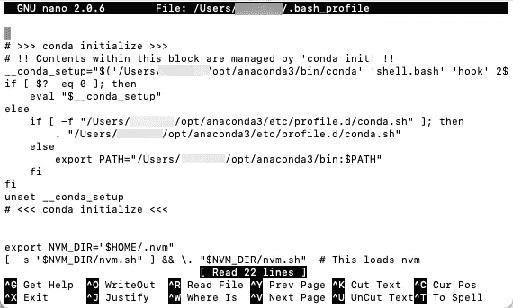
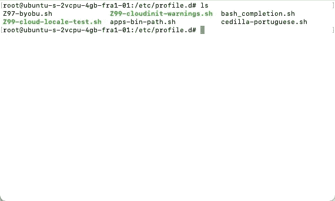
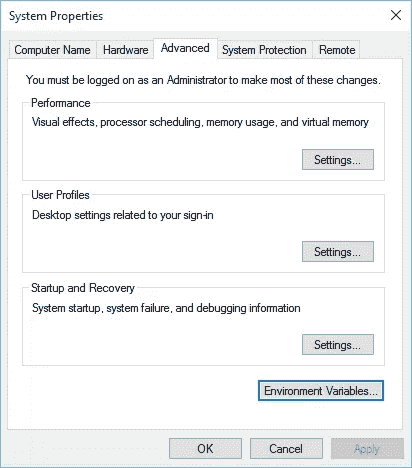
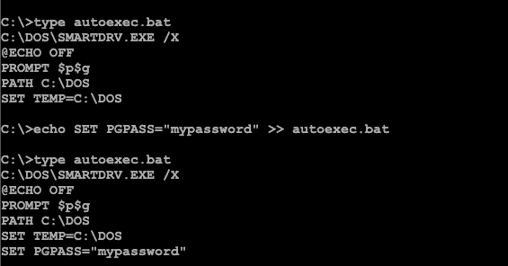

# 如何以正确的方式在 Django 中存储密码

> 原文：<https://levelup.gitconnected.com/how-to-store-passwords-in-django-the-right-way-c572cb4f2eb1>

## 不要硬编码你的密码！


你知道把你的密码写成代码是不好的。你推它。Python 代码甚至没有编译，所以每个人都可以看到它。当您的机器和服务器上有不同的数据库连接时，这是不方便的。

解决方案:使用环境变量

在本文中，我将向您展示如何在不同的操作系统中保存这些变量，以及如何在 Python 中读取它们。

当你把你的大作发布到云端，你设置了一个 PostgreSQL 服务器，然后地狱就开始了。也就是说，您需要将连接设置和密码保存到 settings.py 文件中。

然后在机器上对这个文件进行修改，并再次推送。你为什么要这么做？当然，你忘了让 DEBUG=False。你现在必须在服务器上合并文件。或者 git 隐藏更改，然后 git 拉，然后恢复数据库设置。不太好。

## 环境变量

环境变量就像普通变量一样，但是它们存在于操作系统中。环境变量的一个例子是 PATH。你设置一次，操作系统就用它来搜索你的可执行文件。

问题是这些变量可以被应用程序访问。当然，如果你知道它的名字。

## **苹果操作系统**

如果你有一台 MAC，去控制台输入

```
nano ~/.bash_profile
```

每次您登录系统时，该文件都会运行。

您应该会看到这样一个窗口:



如果不是，那就是出问题了。至少应该有些什么。如果您看到一个空屏幕，请检查文件名。

现在，转到文件的末尾，键入某个变量的密码，例如:

```
export pgpassword="mysecretpasswordhere"
```

这将是一个 PostgreSQL 密码。你可以随意命名。但是不要只输入“密码”:)

现在，你需要重新启动。开玩笑的。只需运行该文件:

```
source ~/.bash_profile
```

## 人的本质

在 Ubuntu 中，您通常会部署您的应用程序，因此请确保不是为用户而是为系统(即所有用户)设置该变量。

为此，请转到此文件夹:

```
cd /etc/profile.d
```

在那里你会看到几个 sh 文件。在这里为你自己创建一个新文件，你最好不要使用任何现有的文件，因为它们可能会被管理并被一些更新所取代。



我的数字海洋水滴中的/etc/profile.d 文件

每当任何用户启动系统时，都会加载这些文件。甚至当你 ssh 到你的服务器。

## 窗子

如果您使用 Windows 并需要设置环境变量，请访问此处:



或者按 Windows 键，并在那里键入“环境”。它会让你快捷地进入控制面板中的“编辑环境变量”。

## 微软磁盘操作系统

在 MS-DOS 中，每次你运行你的机器时，都会启动一个名为“autoexec.bat”的文件。设置变量的最简单方法是添加这样一行代码:

```
SET PGPASS="mypassword"
```

这可以通过以下方式完成:



在 MS-DOS 中向 autoexec.bat 添加一行

但是请不要在 Windows 3.11 中运行 Python。这将是极其缓慢的。而对于 Django，则需要运行 QEMM386，否则会出现内存不足的情况。

## 计算机编程语言

现在，一旦变量被设置，你需要读取它们。

就像这样简单:

```
**import** os
print(os.environ[**"pgpassword"**])
```

在 Django 中，您可以像这样设置 PostgreSQL 连接:

```
DATABASES = {
    **'default'**: {
        **'ENGINE'**: **'django.db.backends.postgresql_psycopg2'**,
        **'NAME'**: **'yourapp'**,
        **'USER'**: **'yourappuser'**,
        **'PASSWORD'**: os.environ[**"pgpassword"**],
        **'HOST'**: **'localhost'**,
        **'PORT'**: **'5432'**,
    }
}
```

## python manage.py 测试

当您尝试测试您的 Django 应用程序时，您会得到以下错误:

```
Creating test database for alias 'default'...Got an error creating the test database: permission denied to create database
```

这里最简单的解决方法是 ***保留 SQLite 用于测试，PostgreSQL 用于正常运行*** 。

你应该这样做:

```
DATABASES = {
    **'default'**: {
        **'ENGINE'**: **'django.db.backends.sqlite3'**,
        **'NAME'**: BASE_DIR / **'db.sqlite3'**,
    }
}
**try**:
    **if** sys.argv[1:2] != [**'test'**]:
        DATABASES = {
            **'default'**: {
                **'ENGINE'**: **'django.db.backends.postgresql_psycopg2'**,
                **'NAME'**: **'yourapp'**,
                **'USER'**: **'yourappuser'**,
                **'PASSWORD'**: os.environ[**"pgpassword"**],
                **'HOST'**: **'localhost'**,
                **'PORT'**: **'5432'**,
            }
        }
**except**:
    **pass**
```

这样，即使您的朋友在另一台计算机上运行您的应用程序，系统变量也不存在，将使用 SQLite。

如果你的 Django 应用太慢，使用缓存:

[](/a-simple-and-quick-way-to-cache-in-django-9bf217812a3b) [## Django 中的缓存使您的应用程序在 99%的情况下都很快

### 如何在 Django 中使用 cache_page

levelup.gitconnected.com](/a-simple-and-quick-way-to-cache-in-django-9bf217812a3b) 

或者在数据库中添加一些索引:

[](/just-one-index-in-django-makes-your-app-15x-faster-742e2f13108e) [## Django 中的一个索引就能让您的应用速度提高 15 倍！

### 你的应用有了索引会快多少？

levelup.gitconnected.com](/just-one-index-in-django-makes-your-app-15x-faster-742e2f13108e) 

感谢阅读！