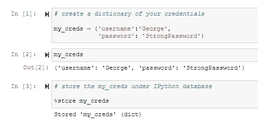
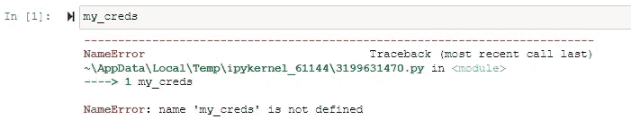
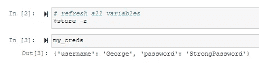
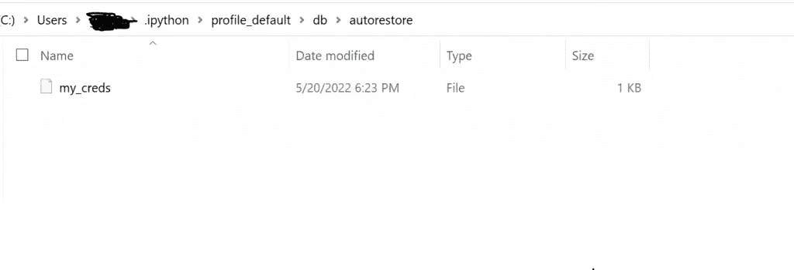

# 如何在 Jupyter 笔记本中存储变量

> 原文：<https://levelup.gitconnected.com/how-to-store-variables-in-jupyter-notebook-fea8aa60a9b>

## 一个如何在 Jupyter 笔记本数据库中存储变量的实际例子


照片由 [Onur Buz](https://unsplash.com/@onurbuz?utm_source=medium&utm_medium=referral) 在 [Unsplash](https://unsplash.com?utm_source=medium&utm_medium=referral) 上拍摄

[](https://jorgepit-14189.medium.com/membership) [## 用我的推荐链接加入媒体-乔治皮皮斯

### 阅读乔治·皮皮斯(以及媒体上成千上万的其他作家)的每一个故事。您的会员费直接支持…

jorgepit-14189.medium.com](https://jorgepit-14189.medium.com/membership) 

使用`storemagic`命令`%store`,我们可以在 IPython 的数据库中存储变量。更具体地说，变量存储在`~/.ipython/profile_default/db/autorestore/<variable_name>`下。

让我们继续一些例子。

```
# create a dictionary of your credentialsmy_creds **=** {'username':'George',
            'password': 'StrongPassword'}my_creds
```

我们得到:

```
{'username': 'George', 'password': 'StrongPassword'}
```

然后将 my_creds 存储在 IPython 数据库下，

```
# store the my_creds under IPython database**%**store my_creds
```

湿 get:

```
Stored 'my_creds' (dict)
```



现在让我们打开一个新的 Jupyter 笔记本。如果我们试图运行`my_creds`变量，我们会得到一个 NameError，因为我们还没有加载它。



为了加载变量，我们需要运行下面的 magic cell 命令。

```
**%**store **-**r
```



正如我们所看到的，文件已经在预期的路径下创建。



如果我们想从存储器中删除所有变量，我们键入:

```
%store -z
```

如果我们想从存储器中删除指定变量，我们键入:

```
# Remove the variable "my_creds" and its value from storage**%**store **-**d my_creds
```

如果我们想在您启动新的 Jupyter 笔记本时自动恢复存储的变量，我们需要在`ipython_config.py`文件中添加下面一行:

```
c.StoreMagics.autorestore = True
```

商店魔术细胞的另一个用法:

*   `%store`–显示所有变量及其当前值的列表
*   `%store spam bar`–将变量 spam 和 bar 的当前值存储到磁盘
*   `%store -d spam`–从存储器中删除变量及其值
*   `%store -z`–从存储器中移除所有变量
*   `%store -r`–刷新存储的所有变量、别名和目录历史(覆盖当前值)
*   `%store -r spam bar`–刷新存储中的指定变量和别名(删除当前变量)
*   `%store foo >a.txt`–将 foo 的值存储到新文件 a.txt 中
*   `%store foo >>a.txt`–将 foo 的值追加到文件 a.txt 中

# 参考

[1] [IPython 文档](https://ipython.readthedocs.io/en/stable/config/extensions/storemagic.html)

最初由[预测黑客](https://predictivehacks.com/?all-tips=how-to-store-variables-in-jupyter-notebook)发布