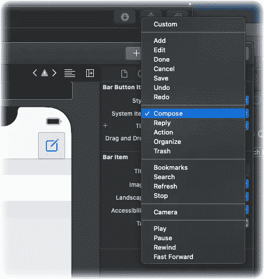
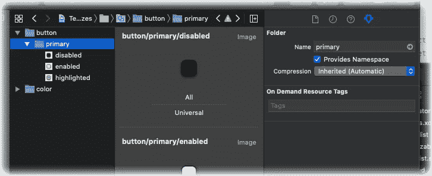

# 如何设计你的 iOS 应用:更少的样板，更多的惯例

> 原文：<https://levelup.gitconnected.com/how-to-style-your-ios-app-less-boilerplate-more-convention-4c7574b73de2>

## *建立你的风格，防止重复，使重构更容易。*

有很多种方法来设计你的应用程序，每种方法都有自己的优点和注意事项。对于本文中的例子，我将关注于`UIButton`，但是所有这些几乎都适用于所有 UIKit 组件。

## 常用的样式方法和限制

首先，让我们看看一些常用的选项。

*   使用故事板通常意味着重复你自己很多，并且更新样式意味着很多工作。
*   UIAppearance API 可以帮助您将样式集中在一个地方，但通常感觉这不是定义样式的自然方式。谁说在我的层次结构中同一级别的两个按钮不应该有不同的样式？
*   通过子类化，您可以获得一个非常好的工具集来设计您的组件。然而，这也意味着组件的每一个实例都必须使用你的子类，这限制了灵活性，从长远来看可能会伤害你。

这些方法当然可以根据你的喜好进行组合，但是让我们用另一种方式来解决这个问题。

# 命名很重要

首先，当谈到风格和设计时，命名应该传达目的，而不是定义它如何做到这一点。苹果其实也是这么做的，比如看一下`UIBarButtonItem`。默认按钮类型的名称为“添加”和“编写”，而不是“加号”和“PencilOnPaper”:



其中一个原因很简单:如果你决定改变图标看起来像别的东西呢？比如把“书签”图标从🏷更接近⭐️，这是否意味着您应该在代码中重命名图标？如果你明智地选择你的名字，它不应该。

另一个原因是，不同的国家或文化可能需要不同的参照物来传达你的意图，让我们在这个例子中使用颜色:

> 在西方文化中，红色象征着兴奋、活力、激情、行动、爱和危险。它还与俄罗斯等国家的共产主义和革命联系在一起。在亚洲文化中，红色是一种非常重要的颜色——它象征着好运、快乐、繁荣、庆祝、幸福和长寿。——[Shutterstock](https://www.shutterstock.com/blog/color-symbolism-and-meanings-around-the-world)

顺便问一下，你知道日本的交通灯传统上用蓝色而不是绿色吗？这实际上也是为什么 [Jenkins 默认在成功的构建上有一个蓝色的球](https://www.mentalfloss.com/article/606627/handshake-origins)，而不是绿色的。

因此，正确的命名很重要。让我们继续，并尝试将它放入一个可重用和灵活的结构中。

# 另一种编码方法

你可能以前听说过术语“[组成超过继承](https://www.swiftbysundell.com/articles/composing-types-in-swift/)”。简而言之:不要用子类化来填充你的类的功能，而是制作可重用的代码片段，这些代码片段可以放在一起，有点像拼图。

这种方法并不新鲜。事实上，熟悉 web 设计的读者可能会想到 CSS(和 LESS/SASS)样式通常是如何分组和分类的，以便更容易重用和允许更好的重构。

> 在这个例子中，我们使用背景图片来设计背景。这可以包括阴影、边框、拐角半径等。而不需要手动配置所有这些。更重要的是，背景图像可以自动适应变化的组件状态和界面特征。— [阅读更多关于这个的信息](https://medium.com/better-programming/ios-make-styling-your-buttons-easier-36106931689c)

让我们从定义我们想要的按钮外观开始。在前景有按钮字体和颜色。在背景中，有按钮背景样式。根据背景的不同，您还需要调整内容插入。

我们可以用一些结构来总结。以下所有样式代码都可以收集在项目中的一个文件中:

这给了我们所需要的灵活性。按钮上还有其他可以设计的属性，如果需要的话，可以相应地添加这些属性。

为了便于将样式应用于按钮，您可以扩展`UIButton`来呈现属性:

接下来，我们将为我们的应用程序定义一些基础知识。在这种情况下，我们只需要定义一种颜色和一种字体，当我们的应用程序增长时，这个列表也会增长。我更喜欢使这些结构私有，更好的是，应用程序的其余部分应该使用组件来收集它的风格，而不是直接使用它的一部分。

颜色名称和图像名称与我们的资产目录中的名称相对应。然后我们简单地使用这些部分来构造我们的`ButtonStyle`。

这就是我们需要的所有设置。剩下的就是将样式应用到我们的按钮:

```
button.apply(style: ComponentStyle.Button.primary)
```

就是这样！定义额外的按钮样式很容易，现在可以从一个地方更新某个样式。您可以对其他类型的组件重复相同的概念。

感谢阅读！

# 额外小费

如果您在资产目录组上勾选“提供名称空间”,则该组名称将成为映像名称的一部分。各组之间用斜线分隔。



当您使用 [SwiftGen](https://github.com/SwiftGen/SwiftGen) 生成资产目录引用时，这尤其有用。使用默认的“Swift4”模板，获取图像引用将变成类似如下的事情:

```
Asset.Button.primary.pressed.image
```

## 参考

*   用 Swift 设计你的按钮
*   [世界各地颜色的象征意义和颜色含义](https://www.shutterstock.com/blog/color-symbolism-and-meanings-around-the-world)，Shutterstock
*   [为什么日本的交通灯是蓝色而不是绿色？](https://www.mentalfloss.com/article/515205/why-does-japan-have-blue-traffic-lights-instead-green)、肖纳西·费罗
*   [为什么詹金斯会有蓝球？泰勒·克罗伊](https://jenkins.io/blog/2012/03/13/why-does-jenkins-have-blue-balls/)