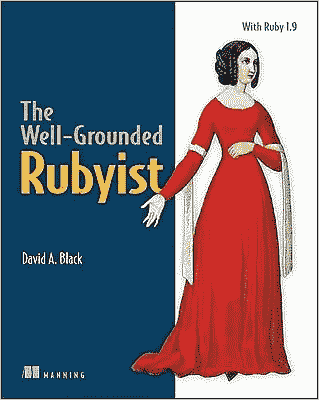

# 如何成为一名自学成才的开发者？

> 原文：<https://levelup.gitconnected.com/how-to-succeed-as-a-self-taught-developer-5c33e5ce656c>

感到压力和不知所措？那很正常！

> 开始的**也许比其他事情**更难**，但是保持信心，一切都会好的。**

开始一个新的项目是有压力的，更不用说一个全新的行业，恐惧和无助感压倒一切，你开始认为你是一个失败的事业。这些是每个初学开发人员的常见症状，尤其是如果你是一个自学成才的开发人员，想要转行的话。

当我在探索这个新事物的时候，我有同样的想法、恐惧和依赖我的家庭。怎么找工作？作为一个初级开发人员如何进步？如何在职场上受到尊重？让我们试着一起寻找答案。

# 这个职业适合你吗？

这是需要回答的最重要的问题。问问你自己为什么要踏上这段旅程，你的动机对吗？感觉怎么样，是辛苦还是好玩？

如果你正在读这篇文章，很有可能你是这份工作的合适人选，你不会因为这很酷而强迫自己。

# 选择你的毒药

软件行业是一个快速发展的行业，几乎每天都有新的工具、硬件和语言发布，每一种都比其他的更重要。我已经看到很多开发人员落入这个陷阱，过早地转换语言、框架和整个领域。

关于当前最佳框架或编程语言的争论经常发生在 web 开发中，并且总是有更容易和更快的新框架可以学习。但是这并不意味着你正在使用的语言和框架将会消失，它们会一直存在！

决定你想做什么，前端还是后端，并努力专注于它，选择一种语言，在我看来，避免每个人都在做的最流行的语言，你有一个更好的工作前景是最新的热门语言！

# 努力工作吧！

Udemy、Youtube、Bootcamps 都提供了你感兴趣的任何东西的惊人且易于获取的知识，使用它但不要滥用它。完成一门初级课程对于理解一门学科的核心原理来说已经足够了，不要忘记你不会总是有一只指导手来解决问题，开始自己解决问题吧。

当你获得了一些初步的知识，开始从头开始编写你自己的应用程序，这是迄今为止练习和获得新技能的最好方法。当你开始工作的第一年，一切都将是一次学习的经历，了解学习新事物的最快方法，这可能成就或毁掉你的职业生涯。

看书。他们经常为你提供重点突出、经过深思熟虑的内容。它们增加了你的词汇量和理解力，教你一些你在谷歌搜索时不会想到的概念，还有一个额外的好处是，一旦你在面试中开始放弃这些知识，你就会听起来很聪明，在面试中有好几次我被问及是否读过书，虽然不读书并不是一种巨大的冒犯，但对任何人来说都是一个巨大的加分，这显示了你对这个主题和整个行业的兴趣。

做编码挑战来锻炼解决问题的能力，学习基础知识和数据结构，不要只关注框架，基础知识也很重要。

有一件重要的事情，对我帮助很大，那就是每天编码。我喜欢选择大型应用程序来构建，我对我要构建的产品有一些很棒的想法，事实是，代码是垃圾，他们从未见过生产，但所有的问题和我用来解决它们的创造性方法都帮了我很多！

这里要通过的最大障碍是保持动力，在这个阶段你将花费大约 6-7 个月(甚至更长)，建立、阅读和重复。我认为重要的是不要急着走这一步，在你还没有准备好的时候就开始申请工作。为了让我保持动力，我喜欢听播客，它们也是很好的教育来源！

# 建立在线形象

一旦你觉得准备好了，或者你已经花了 6 个月或更长时间来提高你的技能，并且你有一些要求更高的应用程序来展示它，是时候开始寻找第一份工作了。

第一步是建立你的**作品集网站**，这是你的试验场，这是你向雇主展示你的技能的地方，给你的网站留下良好的第一印象是非常重要的！*互联网上有很多关于如何把正确的内容放在那里的教程和指南，读一读吧。*

**做一份简历**，这是一份很吓人的简历，你应该在写有经验的地方写什么？好吧，你建立的那些项目算作经验，它们是用来展示你的技能的！互联网上有很多关于如何把正确的内容放在那里的教程和指南，请阅读它们。

引起注意的一个重要部分是**写文章**，虽然你可能觉得自己没有足够的经验来做这件事，但是不要担心，写出来就好了。写技术文章能说明很多关于你的事情，它们展示了你的兴趣和动机，而且对文章主题的研究将帮助你更好地理解这个主题。所以不要怀疑自己，开始写吧！

开始**在开发网站、dev.to、LinkedIn、Upwork 和其他网站上制作个人资料**。所有这些都显示在谷歌上，使你的信息可以被访问。互联网上有很多关于如何把正确的内容放在那里的教程和指南，请阅读它们。

不要忽视**软技能，**查找一些你可能在面试中遇到的问题，要友好，要准时！

# **总结**

虽然这可能让人觉得要做的事情太多，一年似乎太长了，但不要忘记这是一项投资。为你的第一次工作经历做好准备很重要！

获得第一份好工作是困难和令人沮丧的，当你遇到麻烦或被拒绝时不要气馁，这是过程的一部分。坚持不懈，多学一点，多写一点，最终，一切都会有回报的！

在你的第一份工作中，寻找知识而不是薪水，赚钱的时间将会到来。如果你找到一家为你提供指导和挑战性任务的公司，要知道你已经找到了金矿。