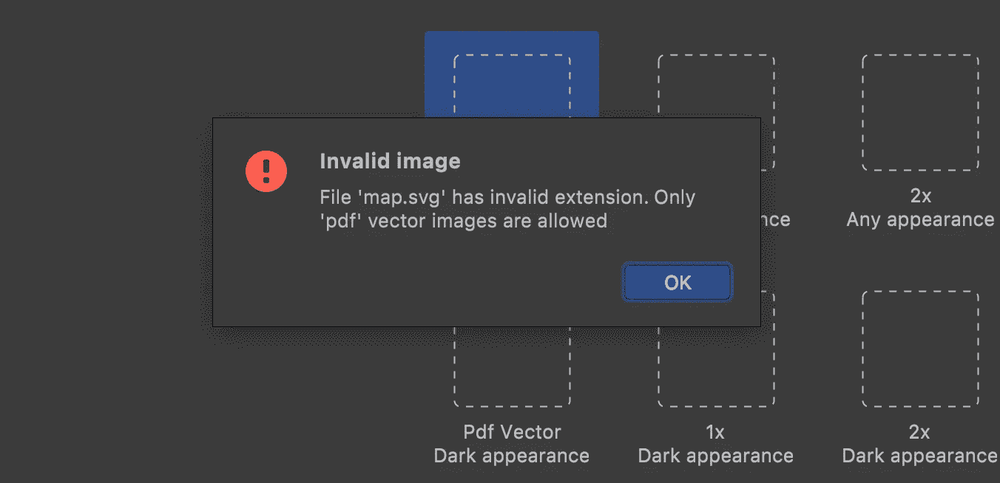

# 如何:在 Xamarin 中将 SVG 作为 iOS 图像资源！

> 原文：<https://levelup.gitconnected.com/how-to-svg-as-an-ios-image-asset-in-xamarin-8bcb9d7f901a>

在本文中，我将分享在 Xamarin 移动应用程序中使用 SVG 图像作为 iOS 图像资产的方法。

# 介绍

每个具有复杂用户界面的移动应用程序都包含嵌入的图像和图标。每个移动应用程序都必须在不同屏幕尺寸和像素密度的多种移动设备上看起来很棒。使用像 JPG 或 PNG 这样的光栅图像，在添加到资源库之前，应该针对每个可能的像素密度单独克隆和调整每个图像资源。当然，有多个免费和优质的图像资产生成器，但这仍然是一个相当烦人的过程。此外，这样的光栅图像库可能很重。这就是矢量图形出现的地方。

# 问题出在哪里？

SVG 是一种矢量图像格式，对于图标和简单的类似徽标的图像，SVG 可能是最方便的格式。SVG 图像比 PDF 矢量图像小，并且是基于 XML 的。这意味着像路径颜色或边距这样的参数可能很容易修改，而不需要任何特定的软件或设计技能。此外，SVG 是如此流行的矢量资产格式，以至于互联网上有大量免费或付费的 SVG 现成资产。而且几乎每个平面设计师都很熟悉。最后，从 iOS 13 开始，SVG 被正式支持为 iOS 图像资产。

不幸的是，对于 Xamarin 开发者来说，原生 SVG 支持并不意味着放弃使用第三方 SVG 插件。为什么？虽然对于使用 Xcode 的本地开发人员来说，添加 SVG 资产和添加 PDF 资产没有区别，但 Xamarin 开发人员仍然无法将 SVG 资产添加到 Xamarin.iOS 项目中。它不适用于 Visual Studio 和 Rider IDEs。

Mac 版 Visual Studio

骑手

嗯……我不能说我很震惊，但是发现一些事情不像它应该的那样工作是令人不愉快的。因此，我决定花一些额外的时间尝试找到一个变通办法，今天我想与 Xamarin 社区分享我的发现。

# 步骤 1:将占位符 PDF 矢量图像添加到资产目录

只有在强制 IDE 创建所有文件夹、文件和必要的*时，才需要此步骤。csproj 文件条目。您还可以添加所需的文件和*。手动 csproj 文件条目。你要达到的结果在下面的截图上:

占位符 PDF 已应用于图像资产

所有需要的文件和文件夹都已创建

# 第二步:替换*。带有适当*的 pdf 文件。svg 图像

进入*【你的 Xamarin iOS 项目】- > Assets.xcassets - >【资产名称】。imageset* 文件夹，替换你的占位符 **。带有 **的 pdf* 文件。svg* 文件。

图像文件被替换

打开*[您的 Xamarin iOS 项目]/assets . xc assets/[资产名称]。imageset/Contents.json* 并用您的 SVG 文件名替换 PDF 文件名。在我的例子中，它被命名为“map.svg”。

文件名值已更改

打开*【您的 Xamarin iOS 项目】/【项目名称】。csproj* 并编辑资产的路径。在我的例子中，我不得不把 Assets.xcassets/map.imageset/placeholder.pdf 的 T2 替换成 Assets.xcassets/map.imageset/map.svg 的 T4。

编辑*。csproj

# 第三步:使用资产

无论您是否有 Xamarin，都照常使用 SVG 资产图像。窗体应用程序或 Xamarin 本机应用程序。我将使用 Xamarin.Forms。

作品！

享受结果🙂

# 摘要

是的，有可能。是的，它需要一些额外的行动。但它是有效的，如果你想在 Xamarin 中使用嵌入式 SVG 图像作为 iOS 图像资产，而不依赖于第三方插件，现在你可以了。

谢谢你，祝你愉快🙂

## 参考

来自 www.flaticon.com[的](https://www.flaticon.com/) [Freepik](https://www.freepik.com/) 制作的图标