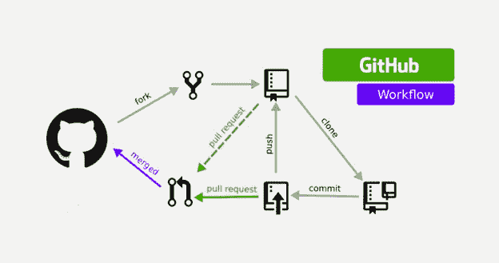
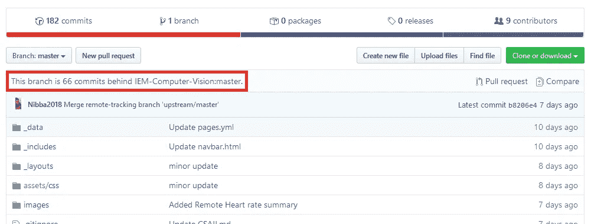
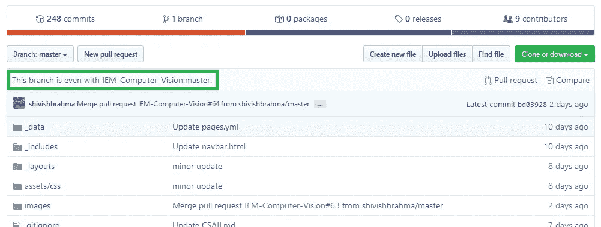

# 如何使用 Git 或 Github 同步分叉库

> 原文：<https://levelup.gitconnected.com/how-to-sync-forked-repositories-using-git-or-github-2933e497fa16>



通用 Git/Github 工作流程

T 有时候，当我们正要发起*拉请求*时，我们意识到我们正在开发的 fork 已经**过时了**，因为原始代码库已经被其他人**修改了**，添加了新功能或者合并了他们的拉请求。因此，合并您的拉请求可能会导致各种时间线问题，并使维护人员很难审查您的更改。

为了克服这个问题，我们必须**在贡献 fork** 之前或者在发起 *pull 请求*之前更新我们的 fork。在本文中，我们将讨论如何使用 **Git** 的*命令行界面*和 **Github** 的浏览器界面来实现。

> 对于本文，我们将使用我们的 [ICCV19-Paper-Review](https://github.com/IEM-Computer-Vision/ICCV19-Paper-Review) 存储库作为原始回购和 [my fork](https://github.com/Nibba2018/ICCV19-Paper-Review) 的示例来演示这个过程。在这份报告中，我们发表了在 2019 年[国际计算机视觉会议](http://iccv2019.thecvf.com/)上发表的计算机视觉研究论文的评论。如果有兴趣，请访问我们的网站。



**我的分叉库**

> 正如您在上面的图片中看到的，我的 fork repo 目前比原始/上游存储库落后 66 次提交。现在，让我们来看一下同步我的 fork 的步骤。

# 使用 Git 的命令行界面更新分叉:

在这一节中，我将重点关注 Git 的命令行界面来同步我的 fork。这样做的步骤如下:

1.  打开您的终端并导航到您的本地存储库的工作目录。我的在`D:\Github\ICCV19-Paper-Review>`
2.  导航到包含您需要与 fork 存储库合并的所有变更的分支。一般叫主支。要导航到主分支，请执行以下命令。

```
git checkout master
```

3.在我们将 fork 存储库与原始/上游存储库同步之前，我们需要确保 Git 知道原始/上游存储库。为此，执行以下命令来获取所有被跟踪的存储库的列表。

```
git remote -v
```

输出:

```
D:\Github\ICCV19-Paper-Review>git remote -v
origin  [https://github.com/Nibba2018/ICCV19-Paper-Review.git](https://github.com/Nibba2018/ICCV19-Paper-Review.git) (fetch)
origin  [https://github.com/Nibba2018/ICCV19-Paper-Review.git](https://github.com/Nibba2018/ICCV19-Paper-Review.git) (push)
```

如您所见，只列出了我的分叉存储库，因此我们需要添加我们的原始 repo 作为远程存储库。

4.要添加原始回购，请执行以下命令:

```
git remote add upstream *[https://github.com/ORIGINAL_OWNER/ORIGINAL_REPOSITORY.git]*
```

此处，将您原始回购的链接替换为不带“[]”的链接。现在执行`git remote -v`我们得到:

```
D:\Github\ICCV19-Paper-Review>git remote -v
origin  [https://github.com/Nibba2018/ICCV19-Paper-Review.git](https://github.com/Nibba2018/ICCV19-Paper-Review.git) (fetch)
origin  [https://github.com/Nibba2018/ICCV19-Paper-Review.git](https://github.com/Nibba2018/ICCV19-Paper-Review.git) (push)
upstream        [https://github.com/IEM-Computer-Vision/ICCV19-Paper-Review.git](https://github.com/IEM-Computer-Vision/ICCV19-Paper-Review.git) (fetch)
upstream        [https://github.com/IEM-Computer-Vision/ICCV19-Paper-Review.git](https://github.com/IEM-Computer-Vision/ICCV19-Paper-Review.git) (push)
```

5.一旦您添加了上游回购，我们需要获取对它所做的更改。为此，我们执行以下命令:

```
git fetch upstream
```

这样做可以显示自分叉以来发生的所有新变化。

```
D:\Github\ICCV19-Paper-Review>git fetch upstream
remote: Enumerating objects: 102, done.
remote: Counting objects: 100% (102/102), done.
remote: Compressing objects: 100% (47/47), done.
remote: Total 182 (delta 73), reused 70 (delta 55), pack-reused 80
Receiving objects: 100% (182/182), 3.13 MiB | 763.00 KiB/s, done.
Resolving deltas: 100% (90/90), completed with 5 local objects.
From [https://github.com/IEM-Computer-Vision/ICCV19-Paper-Review](https://github.com/IEM-Computer-Vision/ICCV19-Paper-Review)
 * [new branch]      master           -> upstream/master
 * [new branch]      revert-27-master -> upstream/revert-27-master
```

6.一旦获取了更改，就该将它们合并到我们的本地存储库中了。执行此命令将会:

```
git merge upstream/master
```

此命令将合并对“主”分支所做的所有更改。

```
D:\Github\ICCV19-Paper-Review>git merge upstream/master
Updating b8206e4..bd03928
Fast-forward
 Adversarial Robustness Model Compression.md        |   0
 ...rial Robustness vs Model Compression or both.md |  50 +++++++++++++
 Black-Box Adversarial Examples.md                  |   1 -
 ...g_With_Stacked_3D_and_2D_Regression_Networks.md |  40 +++++++++++
 ...Training_for_Weakly_Supervised_Cloud_Matting.md |  80 +++++++++++++++++++++
 ...tection_via_Hierarchical_Structured_Ensemble.md |  42 +++++++++++
(contd.)
```

7.合并变更后，是时候将变更上传到你的远程 fork 库了，也就是你的 GitHub 配置文件。

```
git push
```

输出:

```
D:\Github\ICCV19-Paper-Review>git push
Total 0 (delta 0), reused 0 (delta 0)
To [https://github.com/Nibba2018/ICCV19-Paper-Review.git](https://github.com/Nibba2018/ICCV19-Paper-Review.git)
   b8206e4..bd03928  master -> master
```



**同步后我的叉子**

> 正如我们在上面的图片中看到的，我们的*分支存储库*现在与原始/上游存储库**同步**。

# 使用 Github 的浏览器界面更新 Forks:

[Sayantan Das](https://medium.com/u/1d1ff41338ca?source=post_page-----2933e497fa16--------------------------------) ，原知识库的维护者就此制作了一个 youtube 教程:

> 在本文中，我们讨论了如何使用 Git 的命令行界面和 Github 的浏览器界面将原始/上游存储库变更与我们的 fork 存储库合并。我希望你喜欢读这篇文章。编码快乐！！