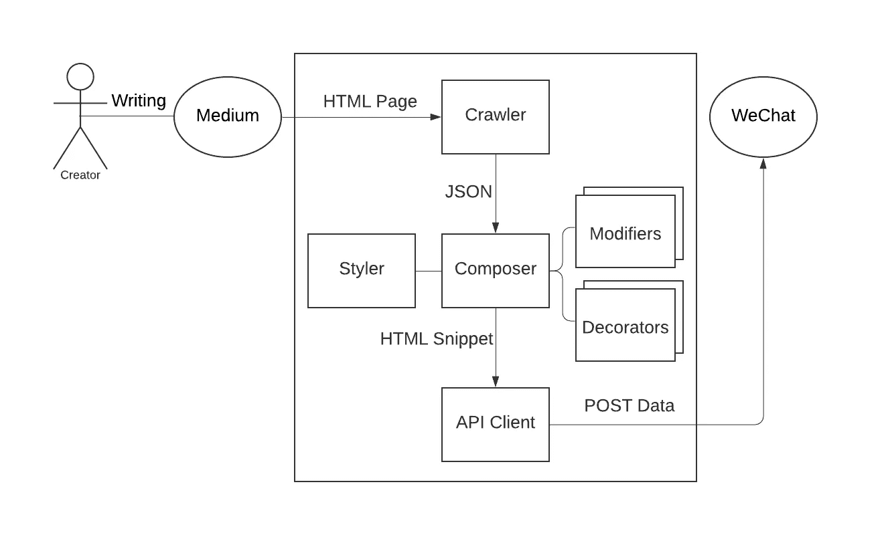
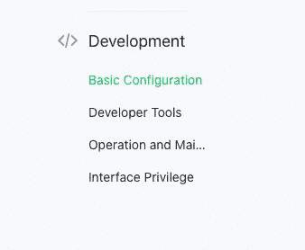
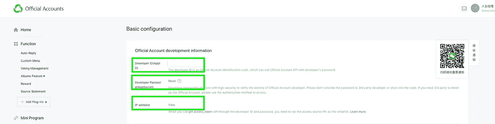
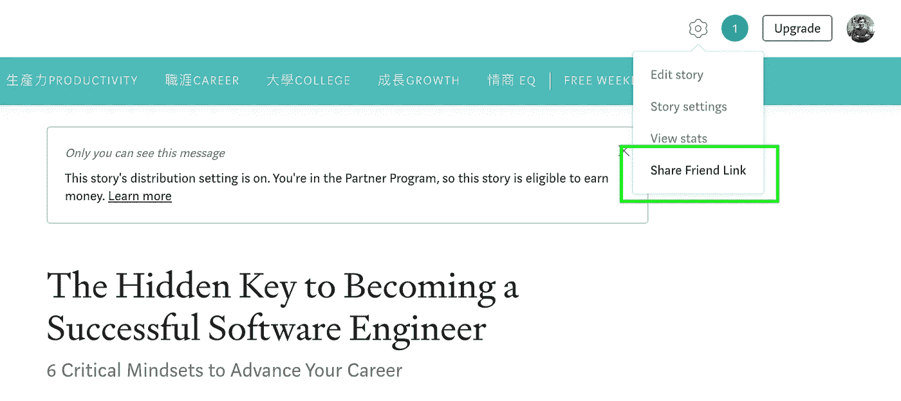
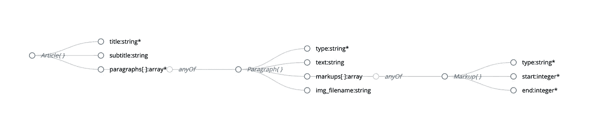

# 如何与微信同步媒体

> 原文：<https://levelup.gitconnected.com/how-to-sync-medium-with-wechat-315f43391515>

## 一次编写，随处发布

在过去的两个月里，Charlene 每天都在 Medium 上写作。因为她用普通话写作，她的主要读者是美国和台湾说普通话的人。我们知道高质量的内容将使**100 多倍的 Mainland China 人**受益，所以我们开始研究中国的媒体市场。

## 用户亮点

1.  **媒体被防火长城拦截**。
2.  **微信占>中国用户花费**时间的 80%。
3.  由于学校教授简体字，大多数大陆用户无法轻松阅读繁体字。

有了这些用户洞察，我们决定将夏琳的中帖翻译成微信中的**简体汉字**和**帖子。**

这个项目给了我一个完美的机会来展示我的编程能力。

## 在本帖中，我将带您浏览以下主题:

1.  用 **Python** [**请求**](https://requests.readthedocs.io/en/master/) 抓取介质
2.  解析**媒体的 JSON 数据**
3.  用[**beautiful soup**](https://www.crummy.com/software/BeautifulSoup/bs4/doc/)处理 HTML
4.  用 [**zhconv**](https://pypi.org/project/zhconv/) 将繁体转换成简体
5.  用 [**微信 API**](https://developers.weixin.qq.com/doc/offiaccount/en/Asset_Management/Adding_Permanent_Assets.html) 上传图片和帖子
6.  [我的 Github最终代码](https://github.com/ChrisXLiu/medium-to-wechat)

## 中等 API 支持

*挑战*

*   介质 API 是只写的。没有**API**获取帖子。
*   Medium 的 RSS feed 不提供**文章级内容**。
*   Medium 的**付费墙**阻止爬行。

*解决方案*

我们最好的办法是**抓取带有中等好友链接的帖子**。我检查了一个示例媒体帖子的源代码。令我惊讶的是，媒体 1)页面是由客户端**呈现的 2)内容是以 JSON 格式**高度结构化的。

## 微信 API 支持

微信 API 同时支持写和取。

我使用它的编辑工具创建了一个测试帖子，发现 API 以 HTML 片段的形式返回文章内容。这种混乱的 HTML 结构似乎很难解析。

## 系统图



## 微信设置

**第一步:**在[http://mp.weixin.qq.com/](http://mp.weixin.qq.com/)注册一个**订阅账户**。

**步骤 2:** 转到开发/基本配置页面:



**第三步:**用 AppSecret 检索开发者 ID 和开发者密码。将你的 IP 加入白名单:[在这里找到你的公共 IP](https://www.google.com/search?q=what%27s+my+ip)。



## 中等帖子搜索

从媒体获取朋友链接:



```
import requests
from bs4 import BeautifulSoup
import redef crawl_medium(url):
    page = requests.get(url)
    soup = BeautifulSoup(page.text, 'html.parser') # Format assumed:
    # <script>window.__APOLLO_STATE__ = {...JSON...}</script>
    script_tag = soup.find('script',\
        string=re.compile('__APOLLO_STATE__'))

    json_data = script_tag.string.split('__APOLLO_STATE__ = ')\
        [1].split('</script>')[0]    return parse(json.loads(json_data))
```

## 中型 JSON 数据解析

我从 Medium 创建了一个简化的 JSON 模式:



```
IMG_BASE_URL = 'https://miro.medium.com/max/1200/' def parse(data):
    *"""
        Parses the raw JSON data from Medium post pages to our own format.* *Parameters:
        data (dict): JSON data for a Medium post* *Returns:
        dict
    """* paragraph_list = []
    markup_dict = {}
    for k, p in data.items():
        if p.get('__typename', '') == 'Paragraph':
            paragraph_list.append(p)
        if p.get('__typename', '') == 'Markup':
            markup_dict[k] = p paragraphs = []
    for p in paragraph_list:
        paragraph_type = p['type']
        if paragraph_type == 'IMG':
            img_filename = p['metadata']['id'].split(\
                'ImageMetadata:')[1]
            # Medium returns 403 for the default user-agent
            opener = urllib.request.build_opener()
            opener.addheaders = [('User-agent', 'Mozilla/5.0\
                (Macintosh; Intel Mac OS X 10_15_4)\
                AppleWebKit/537.36 (KHTML, like Gecko)\
                Chrome/81.0.4044.129 Safari/537.36')]
            urllib.request.install_opener(opener)
            urllib.request.urlretrieve(
                IMG_BASE_URL + img_filename, img_filename)
            paragraphs.append({
                'type': paragraph_type,
                'img_filename': img_filename
            })
        else:
            text = p['text']
            markups = []
            for markup_reference in p['markups']:
                markup = markup_dict[markup_reference['id']]
                start = markup['start']
                end = markup['end']
                markup_type = markup['type']
                markups.append({
                    'type': markup_type,
                    'start': start,
                    'end': end
                })
            paragraphs.append({
                'type': paragraph_type,
                'text': text,
                'markups': markups
            }) # Medium treats title as its first paragraph, of type 'H3'.
    # It treats the optional subtitle as an optional second 
    # paragraph, of type 'H4'.
    title = paragraphs.pop(0)['text']
    subtitle = None
    if paragraphs[0]['type'] == 'H4':
        subtitle = paragraphs.pop(0)['text'] return {
        'title': title,
        'subtitle': subtitle,
        'paragraphs': paragraphs
    }
```

## 构成表示

```
def compose(article, upload_image_func, styler, footer_decorator,
            content_modifiers):
    soup = BeautifulSoup('<div></div>')
    root = soup.div title = article['title']
    subtitle = article['subtitle']
    for modifier in content_modifiers:
        title = modifier.modify(title)
        if subtitle is not None:
            subtitle = modifier.modify(subtitle)
    paragraphs = article['paragraphs'] # Keep track of the current context:
    # 1) None
    # 2) in <ul>
    # 3) in <ol>
    # Embedded contexts are not allowed.
    context = None
    for p in paragraphs:
        if p['type'] == 'IMG':
            img_filename = p['img_filename']
            uploaded_url = upload_image_func(img_filename)
            img_tag = soup.new_tag('img')
            img_tag['src'] = uploaded_url
            styler.style(img_tag)
            root.append(img_tag)
        else:
            new_context = None
            if p['type'] == 'OLI':
                tag_type = 'li'
                new_context = 'ol'
            elif p['type'] == 'ULI':
                tag_type = 'li'
                new_context = 'ul'
            elif p['type'] == 'H3':
                tag_type = 'h3'
            elif p['type'] == 'H4':
                tag_type = 'h4'
            else:tag_type = 'p' if new_context != context:
                # Backtrack from either <ul> or <ol>
                if context is not None:
                    root = root.parent
                # Enter either <ul> or <ol>
                if new_context is not None:
                    new_root = soup.new_tag(new_context)
                    root.append(new_root)
                    styler.style(new_root)
                    root = new_root
                context = new_context text_content = p['text']
            for modifier in content_modifiers:
                text_content = modifier.modify(text_content)
            markups = p['markups']
            new_tag = **process_content**(text_content, markups, soup,
                styler, tag_type)
            styler.style(new_tag)
            root.append(new_tag) if footer_decorator is not None:
        footer_decorator.add_footer(soup, root) # soup: <html><body><div>real content</div></body></html>
    return {'title': title, 'subtitle': subtitle,
        'content': str(soup.div)}
```

我为你创建了一些抽象来定制行为

*   *upload_image_func* :针对平台特定要求或您选择的 CDN
*   *styler* :用于定制样式(如 CSS)，以讲述您的品牌故事，让您的内容脱颖而出
*   *footer_decorator* :用于自动填充你在每篇文章结尾的签名
*   *content_modifiers* :用于内容处理。在我的例子中，我用 zhconv 库将繁体字转换成简体字。你也可以使用谷歌翻译 API 把英文文章翻译成中文。

## 处理标记

```
def process_content(text_content, markups, soup, styler, tag_type):
    *"""
        Creates an element from text_content and markups into
        the content_tag.
        E.g.
        text_content = "this is cool"
        markups = [{"start": 8, "end": 12, "type": "STRONG"}]
        tag_type = "p"
        Returns "<p>this is <strong>cool</strong></p>"
    """* content_tag = soup.new_tag(tag_type)
    last_end = 0
    for markup in markups:
        start = markup['start']
        end = markup['end']
        inner_tag = None
        if markup['type'] == 'STRONG':
            inner_tag = 'strong'
        if markup['type'] == 'EM':
            inner_tag = 'i'
        if inner_tag is not None:
            content_tag.append(text_content[last_end:start])
            markup_tag = soup.new_tag(inner_tag)
            markup_tag.string = text_content[start:end]
            styler.style(markup_tag)
            content_tag.append(markup_tag)
            text_content = text_content[end:]
            last_end = end
    if len(text_content) > 0:
        content_tag.append(text_content)
    return content_tag
```

## 调用微信 API

```
from settings import SETTINGS def get_access_token():
    response = requests.get(
        'https://api.weixin.qq.com/cgi-bin/token?\
        grant_type=client_credential&appid=%s&secret=%s' % (
            SETTINGS['account_id'], SETTINGS['secret_key']))
    return json.loads(response.text)['access_token'] def upload_image(img_filename):
    files = {'media': open(img_filename, 'rb')}
    response = requests.post(
        'https://api.weixin.qq.com/cgi-bin/material/add_material?\
        access_token=' + get_access_token(),
        files=files)
    return json.loads(response.text)['url'] def upload_article(article):
    title = article['title']
    content = article['content']
    author = '人生经理 Charlene'
    thumb_media_id = 'Tbt5DXSqC3bfid5UxqErjLRd9i4NQfbQSaTu73gTVYs'
    post_url = 'https://api.weixin.qq.com/cgi-bin/material/\
        add_news?access_token=' + get_access_token()
    post_body = {
        "articles": [{
            "title": title,
            "thumb_media_id": thumb_media_id,
            "author": author,
            "show_cover_pic": 0,
            "content": content,
            "content_source_url": '',
        },
        ],
    }
    headers = {
        "Content-type": "application/json", "charset": "UTF-8"}
    response = requests.post(
        post_url,
        **data=bytes(json.dumps(post_body, ensure_ascii=False),
            encoding='utf-8'), headers=headers)**
```

注意最后一步**将字典转换成 utf-8 编码的字节**。正确处理中文是关键。

## 拼凑在一起

```
from crawler import crawl_medium
from composer import compose
from wechat_client import upload_image, upload_article
import styler
import footer_decorator
import zh_converterurl = 'https://bit.ly/eating-eng-mindset'
article_data = crawl_medium(url)
article = compose(article_data, upload_image, styler,
    footer_decorator, [zh_converter])
upload_article(article)
```

> 就是这样！在我的 Github 上查看[最终代码](https://github.com/ChrisXLiu/medium-to-wechat)

现在我已经有了正确的**抽象**，我只需要定制组件(例如 Composer 和 API Client)并与其他 API 集成。

另外，作为这个练习的一部分，我发现了 JSON 的两个优点:

*   JSON 模式生成器:[https://jsonschema.net/home](https://jsonschema.net/home)
*   JSON 模式查看器:[https://navneethg.github.io/jsonschemaviewer/](https://navneethg.github.io/jsonschemaviewer/)

希望这有所帮助！