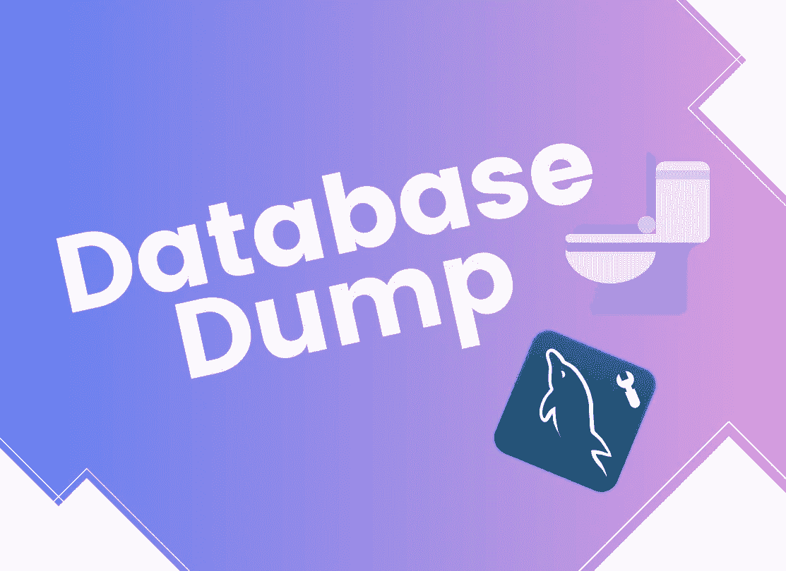
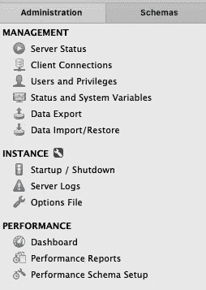
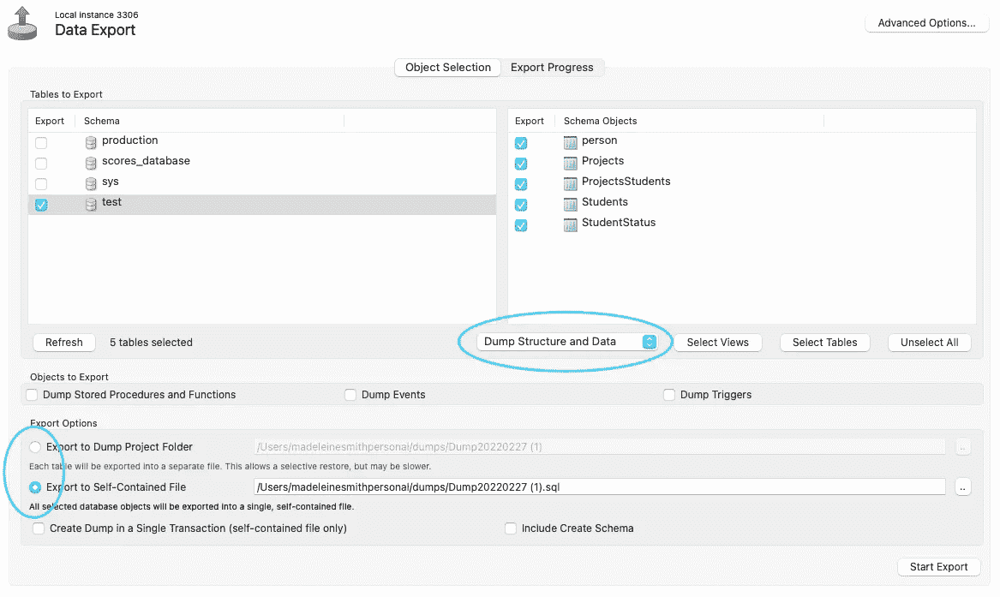
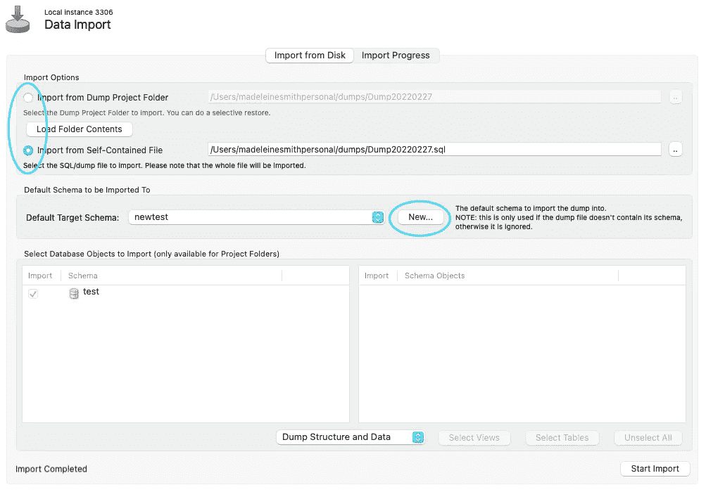

# 如何在 MySQL Workbench 中进行数据库转储

> 原文：<https://levelup.gitconnected.com/how-to-take-a-database-dump-in-mysql-workbench-c522471a31c8>

## 并用它来复制数据库

数据库转储本质上是数据库的备份—无论是数据库的结构还是其中保存的数据。它由一组 SQL 命令组成，使您能够从头开始重新创建数据库。

生成数据库转储有多种用途——例如在数据丢失的情况下，或者如果您想要重命名数据库(在 MySQL (╯ □ )╯︵ ┻━┻).)中似乎没有好的方法来做到这一点对我来说，我希望能够复制我们在开发环境中运行的数据库，这样我就可以拥有自己的版本并在本地运行一切💯。

使用命令行实用程序(如`Mysqldump`)创建数据库转储是可能的，尽管我目前使用的是 MySQL Workbench，所以我将向您介绍如何使用上述 GUI 来完成此操作。

# 导出数据

在 MySQL Workbench 的 administration 选项卡中，有两个我们将要使用的标题——“数据导出”和“数据导入/恢复”。首先，让我们点击“数据导出”标题，导出数据库的数据/结构。

这里显示了我们可以从中导出的数据库列表。如果此列表不准确，请尝试“刷新”按钮。一旦选择了所需的数据库，就可以使用复选框来控制要导出的表。

此页面还允许您准确选择要转储的内容—可以是结构，也可以是数据，或者两者都是。因为我希望将名为“test”的数据库复制到一个新的数据库，所以我将该选项保留为“Dump Structure and Data”。

此外，在该屏幕上，您可以选择是导出到单个“转储”文件还是多个文件(在一个“转储”文件夹中)，每个文件对应一个您选择的表。我倾向于选择创建一个单独的文件。一旦满意，点击“开始导出”，你会看到导出的日志。完成后，您可以导航到上一屏幕中指定的路径，以查看您的转储文件/文件夹。

# 导入数据

当您想要导入数据/结构时，请转到“数据导入/恢复”标题。在此页面上，您可以选择要导入的转储文件/文件夹。

如果您希望创建一个新的数据库来存放您的导出，您可以在此页面上点击“新建”按钮。仅供参考:这个数据库是在您点击“OK”时创建的，而不是在导入实际进行时创建的。

> *注意:我发现当我从转储文件夹导入时(而不是使用单个转储文件时)，我必须更改在每个文件顶部附近的注释中找到的数据库名称，以反映新数据库的名称，例如*
> 
> `*-- Host: localhost Database: newtest*`
> 
> *这种查找和替换可以使用 Atom 等工具在多个文件上轻松完成——只需打开项目文件夹，点击* `*Cmd+Shift+F*` *即可进行全局查找和替换。*

一旦满意，点击“开始导入”,将再次输出一个日志。这可能需要一些时间，具体取决于要导入的数据量。

完成后，点击你的新数据库，惊奇地发现这些表已经被神奇地复制过来了😍

*原发布于*[*https://www . madeleinesmith . uk*](https://www.madeleinesmith.uk/blog/database-dump-mysql-workbench/)*。*