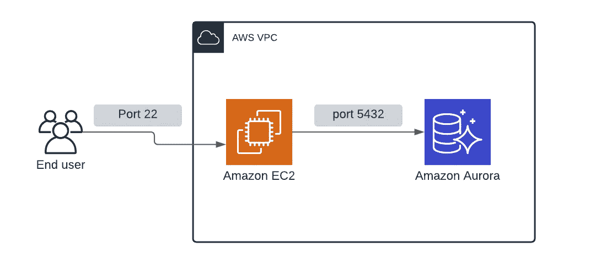
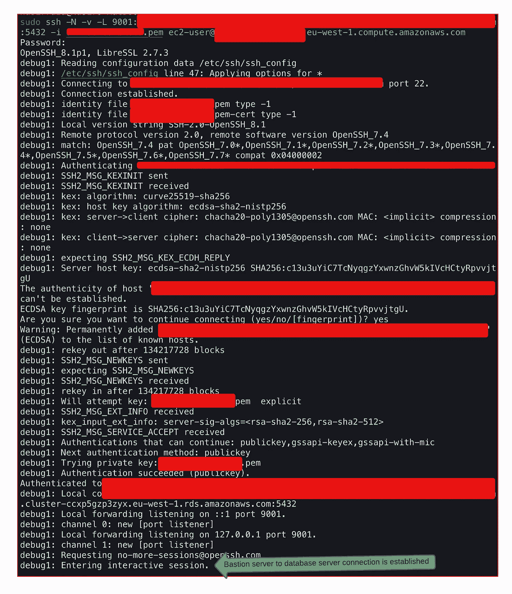
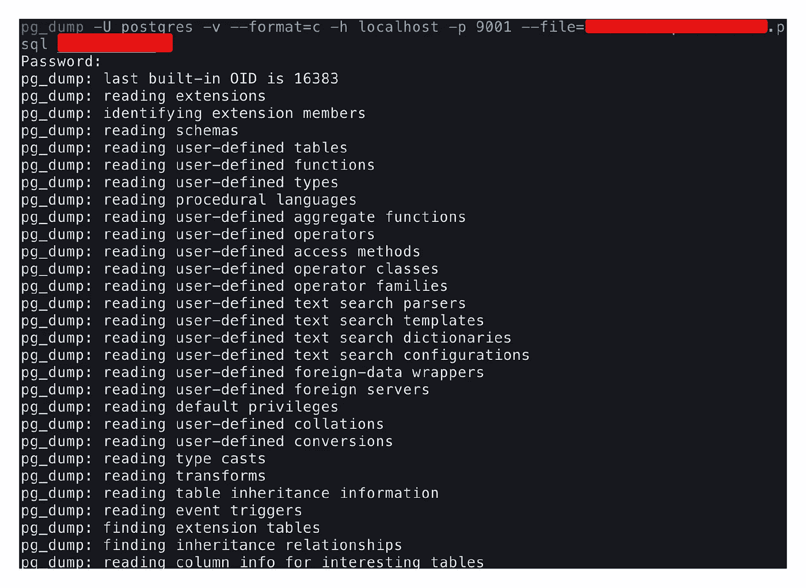

# 如何通过 SSH 隧道备份数据库

> 原文：<https://levelup.gitconnected.com/how-to-take-backup-of-a-database-through-ssh-tunneling-451a6cccecda>

如何通过 ssh 隧道进行数据库备份的分步指南

有些情况下，我们必须备份只能通过 ssh 访问的数据库，如果您不知道步骤，这可能是一个挑战。一个这样的例子是只能通过跳转框访问的数据库(想想只能通过 ec2 实例访问的 VPC 中的 AWS RDS，其中这个 ec2 实例的端口 22 对世界开放)

> 对于本教程，我的示例设置是这样的-

1.  数据库是 AWS 的 RDS(关系数据库系统)Aurora，位于 VPC(虚拟私有云)内

VPC 内的典型 AWS RDS 设置

> 步骤 1:打开一个终端，通过 ec2 实例(或者您拥有的任何其他服务器)连接到您的数据库实例

通过服务器连接到数据库

在上面的命令中，我们使用密钥文件和用户名通过端口 22(默认)连接到服务器，一旦完成，我们就连接到数据库服务器。在上面的例子中，我通过本地机器的端口 9001 连接到端口 5432 上的 Postgres 数据库。您可以使它适应您的数据库的端口(对于 MySQL 等是 3306……)和本地机器上任何其他可用的端口。

建立了从堡垒服务器到数据库服务器的连接

> 步骤 2:在同一终端上打开一个新的选项卡，并通过端口 9001 运行 db backup 命令

现在，您在连接的数据库服务器上运行命令(不仅仅是备份，您可以对数据库用户做任何允许的事情)。

对连接的数据库运行备份命令

完成后，您将在本地计算机上拥有一个备份文件🙌 🎆 🎉

感谢您的阅读，如果您想支持我，请关注我，成为会员，支持更广泛的社区。

 [## 通过我的推荐链接加入媒体 Meta Collective

### 作为一个媒体会员，你的会员费的一部分会给你阅读的作家，你可以完全接触到每一个故事…

medium.com](https://medium.com/@metacollective/membership)