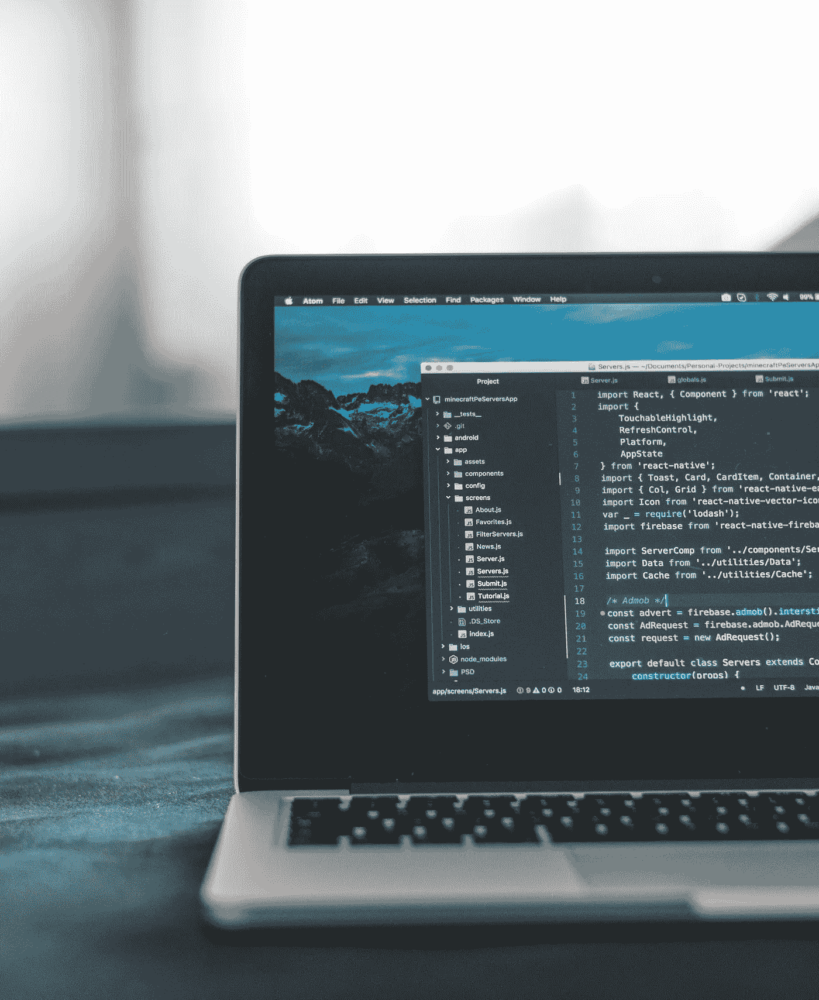

# 如何在 Chrome 扩展中截图

> 原文：<https://levelup.gitconnected.com/how-to-take-screenshots-in-chrome-extension-534f0f07a354>



*本文原载于* [*我的个人博客*](https://blog.shahednasser.com/how-to-take-screenshots-in-chrome-extension/) *。*

在本教程中，我们将介绍如何在 Chrome 扩展中截图并保存在用户的机器上。本教程需要一些 Javascript 初学者技能。

我们将创建一个扩展，允许用户只需点击工具栏的图标就可以截图。用户可以选择截取整个屏幕、一个窗口或当前标签的屏幕截图。

请注意，这个扩展将使用清单 V3。在整个教程中，我会提供一些关于 V3 和 V2 之间差异的提示，但是如果你想知道更多关于这两个版本之间的差异，你可以查看本教程。

你可以在 GitHub 库上找到本教程的代码。

## 创建扩展

我们不会详细讨论如何创建一个 Chrome 扩展，因为这不是我们的目的。如果你需要了解更多的细节，你可以看看这个教程。

在您的扩展目录的根目录下创建`manifest.json`,内容如下:

```
{
    "name": "Screenshots",
    "version": "0.0.1",
    "description": "Take screenshots",
    "manifest_version": 3,
    "action": {
        "default_title": "Take a Screenshot"
    },
    "icons": {
        "16": "/assets/icon-16.png",
        "32": "/assets/icon-32.png",
        "48": "/assets/icon-48.png",
        "128": "/assets/icon-128.png"
    }
}
```

我们在这个扩展中使用的图标是由 [Iconscout](https://iconscout.com/) 上的 BZZRICON 工作室制作的。

对于清单 V2，确保`manifest_version`设置为 2:

```
"manifest_version": 2
```

并确保将`action`替换为`browser_action`:

```
"browser_action": {
	"default_title": "Take a Screenshot"
}
```

然后，创建一个 zip 文件，进入 chrome://extensions，如果没有启用开发者模式，从右上方启用它，从左侧的按钮中点击“Load Unpacked ”,选择扩展的目录。我们的扩展将被成功添加。

## 添加服务人员(或后台脚本)

为了检测用户何时点击扩展的图标，我们需要给`chrome.action.onClicked`附加一个事件监听器。为此，我们需要添加一个服务人员(或 V2 的后台脚本)。

要添加服务人员，在`manifest.json`中添加以下内容:

```
"background": {
	"service_worker": "background.js"
},
```

或者下面的 V2:

```
"background": {
	"scripts": ["background.js"],
	"persistent": false
},
```

接下来，在扩展的根中创建`background.js`,内容如下:

```
chrome.action.onClicked.addListener(function (tab) {

})
```

对 V2 来说，应该是这样的:

```
chrome.browserAction.onClicked.addListener(function (tab) {

})
```

注意，如果您在`manifest.json`中没有`action`键，您将无法向`onClicked`添加监听器。

接下来，我们将开始“截图”过程。为此，我们将使用[桌面捕获 API](https://developer.chrome.com/docs/extensions/reference/desktopCapture/) 。具体来说，我们将使用带 3 个参数的方法`chrome.desktopCapture.chooseDesktopMedia`:第一个是捕获源的字符串数组，可以是“屏幕”、“窗口”、“标签”和“音频”。第二个参数是可选的目标标签，但是，在某些情况下，如果目标标签没有被传递，Chrome 就会崩溃。第三个参数是一个回调函数，它返回流 id，我们稍后将使用它来获取屏幕截图。

在侦听器中添加以下内容:

```
chrome.desktopCapture.chooseDesktopMedia([
        "screen",
        "window",
        "tab"
    ], tab, (streamId) => {
        //check whether the user canceled the request or not
        if (streamId && streamId.length) {

        }
    })
```

请注意，我们传入了第一个参数“screen”、“window”和“tab”作为允许的源类型。第二个参数是传递给监听器的`tab`参数，第三个是回调函数。我们正在检查`streamId`是否不为空，因为如果用户取消请求，它将为`empty`。

在我们使用它之前，我们需要在`manifest.json`中添加一些权限。权限允许用户理解扩展正在做什么，并在将它安装到他们的浏览器之前同意它。

将以下内容添加到`manifest.json`:

```
"permissions":["desktopCapture","tabs"],
```

我们还需要`tabs`权限的原因是，如果我们没有该权限，传递给`onClicked`事件监听器的`tab`对象将没有`url`参数，而在将该选项卡作为参数传递时`chooseDesktopMedia`需要该参数。

因此，如果你现在重新加载扩展并按下图标，你会看到它会问你你想录制什么屏幕，就是这样。接下来，我们需要使用`streamId`来获取截图。

## 添加内容脚本

为了从`streamId`获取流，我们需要使用 [getUserMedia](https://developer.mozilla.org/en-US/docs/Web/API/MediaDevices/getUserMedia) 。然而，这在服务人员中是不可用的。因此，我们需要创建一个内容脚本，它接收来自服务工作者的带有流 id 的消息，然后从流中获取屏幕截图。

要添加内容脚本，请将以下内容添加到`manifest.json`:

```
"content_scripts": [
    {
    	"matches": ["<all_urls>"],
    	"js": ["content_script.js"]
    }
]
```

然后，在扩展的根中创建`content_script.js`,内容如下:

```
chrome.runtime.onMessage.addListener((message, sender, senderResponse) => {
    if (message.name === 'stream' && message.streamId) {

    }
});
```

这段代码监听“onMessage”事件，并检查收到的`message`是否有一个等于`stream`的`name`属性和一个`streamId`属性，然后我们将获取流并对其进行截图。

在 if 中，我们将使用`getUserMedia`，它返回一个解析为 [MediaStream](/p/f406e09d-a9cc-48a6-94b2-5ab3b4495ccd/MediaStream) 的承诺:

```
let track, canvas
navigator.mediaDevices.getUserMedia({
    video: {
        mandatory: {
            chromeMediaSource: 'desktop',
            chromeMediaSourceId: message.streamId
        },
    }
}).then((stream) => {

})
```

注意，我们传递给`getUserMedia`的参数接受了一个选项对象。我们正在传递等于`desktop`的`chromeMediaSource`和等于我们收到的流 Id 的`chromeMediaSourceId`。

接下来，在已解析承诺的回调函数中，我们将获取 [MediaStreamTrack](https://developer.mozilla.org/en-US/docs/Web/API/MediaStreamTrack) ，然后使用 [ImageCapture](https://developer.mozilla.org/en-US/docs/Web/API/ImageCapture) API 从其中捕获一个屏幕截图:

```
track = stream.getVideoTracks()[0]
const imageCapture = new ImageCapture(track)
return imageCapture.grabFrame()
```

最后，我们将返回`imageCapture.grabFrame`的值，该值返回一个解析为 ImageBitmap 的承诺。注意，我们没有使用`ImageCapture` API 的`takePhoto`方法。背后的原因是，已知有使用它抛出 DOMException 的情况，这是它的一个[变通方法](https://github.com/GoogleChromeLabs/imagecapture-polyfill/issues/15)。

接下来，我们将附加另一个`then`方法来处理从`imageCapture.grabFrame`返回的承诺。回调函数将停止流，创建一个画布并在其中绘制 ImageBitmap，然后获取画布的数据 Url:

```
.then((bitmap) => {
    track.stop();
    canvas = document.createElement('canvas');
    canvas.width = bitmap.width;
    canvas.height = bitmap.height;
    let context = canvas.getContext('2d');
    context.drawImage(bitmap, 0, 0, bitmap.width, bitmap.height);
    return canvas.toDataURL();
})
```

注意，将画布的宽度和高度设置为等于`bitmap`的宽度和高度是很重要的。如果我们不这样做，画布的高度和宽度将默认为`200px`，如果位图的宽度或高度大于这个值，屏幕截图将被裁剪。

最终，我们将返回`canvas.toDataUrl`。我们将附加最后一个`then`方法，该方法将返回的 URL 作为参数。此 URL 将用于在用户设备上下载图像:

```
.then((url) => {
    //TODO download the image from the URL
}).catch((err) => {
    alert("Could not take screenshot")
    senderResponse({success: false, message: err})
})
```

注意，我们还添加了`catch`来捕捉任何错误。正如你在`catch`回调中看到的，我们正在调用函数`senderResponse`。这个函数是我们将在发送消息时从服务工作者或后台脚本传递给内容脚本的函数。

在`if`模块的末尾，我们将添加以下内容:

```
return true;
```

在`onMessage`事件监听器中，如果监听器返回 true，这意味着我们稍后将使用发送消息时传递的回调函数向发送方返回响应。

## 下载截图

为了下载截图，我们将使用[下载](https://developer.chrome.com/docs/extensions/reference/downloads) API。它提供了很多方法来管理下载，比如搜索、打开、删除等等。

在使用任何方法之前，我们需要将`downloads`权限添加到`manifest.json`中的`permissions`数组:

```
"permissions": [
    "desktopCapture",
    "tabs",
    "downloads"
],
```

现在，我们可以使用下载 API 的方法。我们将使用方法`chrome.downloads.download`，它将一个选项数组作为第一个参数，将一个回调函数作为第二个参数。

但是，不能从内容脚本中调用此方法。我们需要从服务人员/后台脚本中调用它。因此，当我们前面到达代码中的`TODO`部分时，我们需要向服务人员发送一条消息，其中包含我们想要下载的 URL。

为了在扩展中发送消息，我们使用了`chrome.runtime.sendMessage`，它把要发送的消息(可以是任何类型)作为第一个参数，把可选的回调函数作为第二个参数，这个函数是消息的接收者应该调用来传递响应的函数。

添加以下代码代替`TODO`注释:

```
.then((url) => {
    chrome.runtime.sendMessage({name: 'download', url}, (response) => {
        if (response.success) {
            alert("Screenshot saved");
        } else {
            alert("Could not save screenshot")
        }
        canvas.remove()
        senderResponse({success: true})
    })
})
```

请注意，我们正在向接收者发送消息`{name: 'download', url}`。由于消息被发送给扩展中的每个侦听器，所以在发送的消息中包含一个消息属性以便能够处理不同的消息是很好的。我们还发送了下载图片的网址。

现在让我们回到我们的服务人员。首先，让我们从前面做的`chooseDesktopMedia`回调函数向内容脚本发送一条消息:

```
//check whether the user canceled the request or not
if (streamId && streamId.length) {
    setTimeout(() => {
        chrome.tabs.sendMessage(tab.id, {name: "stream", streamId}, (response) => console.log(response))
    }, 200)
}
```

注意，为了向内容脚本发送消息，我们使用了`chrome.tabs.sendMessage`。这个与`chrome.runtime.sendMessage`的区别在于，前者将消息发送给特定选项卡中的内容脚本，而第一个将消息发送给扩展中监听`onMessage`处理程序的所有脚本。

接下来，我们将向`onMessage`事件添加一个监听器来接收`download`消息，并将文件下载到用户的机器上:

```
chrome.runtime.onMessage.addListener((message, sender, senderResponse) => {
    if (message.name === 'download' && message.url) {
        chrome.downloads.download({
            filename: 'screenshot.png',
            url: message.url
        }, (downloadId) => {
            senderResponse({success: true})
        })

        return true;
    }
})
```

首先，我们检查消息的`name`属性是否等于`download`，以确保收到的消息是正确的。然后，我们使用`chrome.downloads.download`下载文件，传递给它 options 对象，这里有两个选项:`filename`是要下载的文件的名称，`url`是要下载的 URL。在`downloads`方法的回调中，我们调用发送者传递的回调函数。

我们的扩展现在准备好了。再次进入 chrome://extensions，重新加载扩展。然后，转到任何页面，单击扩展的图标。系统会提示您选择整个屏幕、一个窗口或一个选项卡。一旦你选择，屏幕截图将被拍摄并保存在你的机器上。

## 结论

在本教程中，我们学习了如何截图和一些 chrome 扩展的概念。如果你想了解更多关于 Chrome 扩展的知识，一定要看看我关于浏览器扩展的教程。

*如果您想联系并讨论更多关于本文或编程的内容，您可以在我的 Twitter 帐户上找到我*[*@ shahednasserr*](https://twitter.com/shahednasserr)