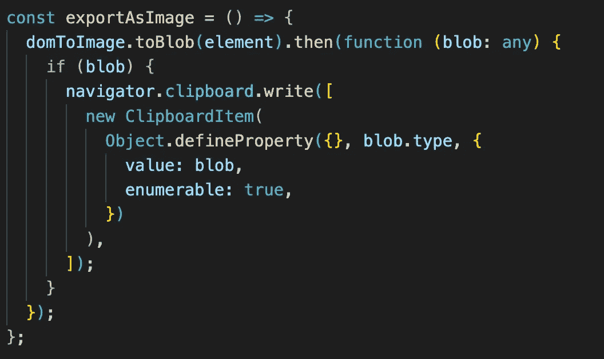

# 如何截图 JavaScript 中的元素

> 原文：<https://levelup.gitconnected.com/how-to-take-screenshots-of-elements-in-javascript-ae0c5a94c128>

老实说，我已经尝试了至少 5 次捕获 DOM 元素库。像每个图书馆一样，他们都有问题。例如，`html2canvas`不支持多行文本区域。如果你截屏，文本区域的所有内容都是内嵌的。在旧硬件上，`linear-gradient`有渲染问题。

今天我将编写一个简单的函数来捕获一个 DOM 元素，尽可能减少渲染问题

让我们从设置开始:

```
yarn add dom-to-image
```

0r

```
npm install dom-to-image
```

然后导入它

```
import domToImage from "dom-to-image";
```

这是函数



在这个例子中，我将截取一个元素的屏幕截图，并将其写入剪贴板，这样我就可以将它粘贴到任何地方。

首先，我将一个 DOM 元素传递给`toBlob`方法，然后我传递一个回调函数将 blob 写入剪贴板，这不是很简单吗？之后，图像将被放入剪贴板，准备粘贴。

如果您想下载图像？或者想把它转换成 svg、png 或 jpg，别担心，`dom-to-image`已经提供了所有必要的方法，让我们看看[文档](https://github.com/tsayen/dom-to-image)

# 遗言

虽然我的内容对每个人都是免费的，但是如果你觉得这篇文章有帮助，[你可以在这里给我买杯咖啡](https://www.buymeacoffee.com/kylele19)