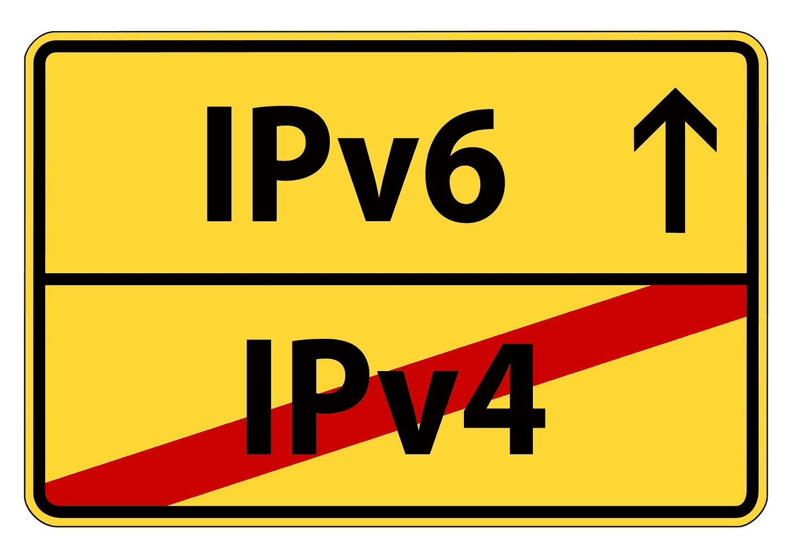

# 如何判断您使用的是 IPv4 还是 IPv6

> 原文：<https://levelup.gitconnected.com/how-to-tell-if-you-are-on-ipv4-or-ipv6-1f33d8a1bf06>

随着 web 向前(非常缓慢地)发展到下一代互联网寻址，对于个人、企业、技术管理员和服务器管理团队来说，有一种简单方便的方法来检查他们的互联网连接设备是使用 IPv4 还是 IPv6 将变得越来越重要。



这实际上可能会因设备而异，您可能在互联网连接上启用了 IPv6，但是，如果您的局域网(LAN)没有配置为将 IPv6 分配给某些设备，那么它们可能仍然会退回到较旧的、逐渐减少的 IPv4 协议。

# TLDR；

你可以在你的网页浏览器、命令提示符、终端或应用程序中看到你是在 IPv4 还是 IPv6 上:[https://i-p.show/](https://i-p.show/)

# 什么是 IP 地址？

IP 地址是分配给每台连接到互联网的计算机的唯一数字标识符。它也称为 IP 号码或互联网地址。IP 地址规定了寻址和数据包方案的技术格式。大多数网络将传输控制协议(TCP)与 IP 结合使用。TCP 允许在目的地和源之间建立虚拟连接。

这听起来很复杂，但总结一下，互联网上的每台电脑都有自己的识别号。每个数字都必须是唯一的(*，除非我们变得更专业并深入研究 NAT——一旦 IPv4 完全停止使用，我们就不用担心这个问题了*,看起来就像这样:

【1.2.3.4 

**123.214.212.144**

**64.82.220.151**

正常的日常使用互联网意味着你不会看到这些。它们通常被域名所掩盖——比如 www.google.com 或 www.twitter.com，尽管这些域名本身会被转换成 IP 地址，但记住这些域名对我们人类来说要容易得多。

在撰写本报告时:

谷歌网站:172.217.16.238

推特网:104.244.42.1

# 什么是 IPv4？

IPv4 是互联网协议(IP)的第四个版本，是互联网上使用的主要通信协议。IPv4 开发于 20 世纪 80 年代初，是当今使用最广泛的 IP 版本。你在上面看到的所有 IP 地址都是 IP v4——它们的 1-3 个数字被分成 4 个部分，用一个小数位分开。这些被称为 32 位地址。

# 什么是 IPv6？

IPv6 是下一代互联网协议，旨在最终取代 IPv4。IPv6 具有比 IPv4 大得多的地址空间，以及其他改进。

IPv6 是最新版本的互联网协议(IP ),该通信协议为网络上的计算机提供识别和定位系统，并在互联网上路由流量。IPv6 是在 20 世纪 90 年代末和 21 世纪初开发的，因为需要比 IPv4 所能提供的更多的 IP 地址。

IPv6 与 IPv4 不向后兼容，这意味着使用 IPv6 的设备和基础架构无法与使用 IPv4 的设备和基础架构通信。

IPv6 看起来像下面这样:

2606:4700:10:6816:2968

**2a 00:1450:4009:817:200 e**

**2606:4700:10::ac43:c22**

正如您所看到的，IPv6 比 IPv4 更难看，但是由于它们使用 128 位地址，而不是 IPv4 的 32 位地址，因此可能会有更多独特的地址。

在撰写本报告时:

Google . com:2a 00:1450:4009:822::200 e

**Twitter.com:** *截至 2022 年 5 月没有 IPv6*

# IPv4 和 IPv6 有什么区别？

由于这两种协议不兼容，您必须连接到其中一种协议。它们之间的一些主要区别是:

1.  IPv4 地址是 32 位长，而 IPv6 地址是 128 位长。
2.  IPv4 使用点分十进制表示法来表示地址，而 IPv6 使用冒号分隔的十六进制表示法。
3.  IPv4 地址分为四个八位字节，而 IPv6 地址分为八个六位字节。
4.  IPv4 地址用十进制表示，而 IPv6 地址可以用十进制表示，或者用更压缩的十六进制表示。
5.  IPv4 地址通常使用 DHCP 分配给设备，而 IPv6 地址可以静态分配或使用 DHCPv6 或 SLAAC 分配，这是 DHCP 的 IPv6 等效物，其中设备可以自动配置其 IPv6 地址、默认网关和 DNS 服务器。
6.  IPv4 地址可以广播，而 IPv6 地址不能广播。
7.  IPv4 地址有一个子网掩码的概念，而 IPv6 地址使用一个称为前缀的概念。
8.  IPv4 地址可用于单播和广播通信，而 IPv6 地址只能用于单播通信。
9.  IPv4 地址可用于点对点通信，而 IPv6 地址则不能。
10.  IPv4 地址通常分配给使用 NAT 的设备，而 IPv6 地址则不是。

# 检查 IPv6 的发展

您可以在此查看 IPv6 同比增长:[https://www.google.com/intl/en/ipv6/statistics.html](https://www.google.com/intl/en/ipv6/statistics.html)

# 如何辨别我用的是 IPv4 还是 IPv6？

可以从同一台计算机或设备上同时访问 IPv4 和 IPv6，但不能通过同一请求。您将使用 IPv4 或 IPv6 进行通信。由于不可能同时切换整个互联网，互联网服务提供商(ISP)已经实施了混合解决方案，允许他们通过他们的服务器代理一种协议，以允许混合访问两种协议。

你可以在你的网页浏览器、命令提示符、终端或应用程序中看到你是在 IPv4 还是 IPv6 上:[https://i-p.show/](https://i-p.show/)

# I-P 显示

通过使用 I-P.show，您可以检查您是否:

1.  在支持 IPv4 的设备上: [https://v4.i-p.show](https://v4.i-p.show)
2.  在支持 IPv6 的设备上: [https://v6.i-p.show](https://v6.i-p.show/)

如果您的连接支持两者，您将能够连接到两个网页，并查看您相关的唯一外部 IP 地址。如果其中一个不工作，可能是因为你的设备不支持 v4 或 v6。

# 高级用途

如果你是一个系统管理员，或者管理网络服务器或其他互联网连接的东西，看看检查你的 IP 地址的附加选项。例如:

**通过卷曲:**

```
curl i-p.show
```

**通过 wget:**

```
wget -qO - i-p.show
```

**或通过纯文本:** `https://i-p.show/?plain=true`

以上所有内容都可以通过各自的版本获得；

即分别将**仪表板显示**改为 **v4 .仪表板显示**或 **v6 .仪表板显示**。

# 这对你有帮助吗？

如果这个工具对你有帮助，或者你有任何反馈或建议，请在这里告诉我[。](https://j-d.digital/contact)

谢谢