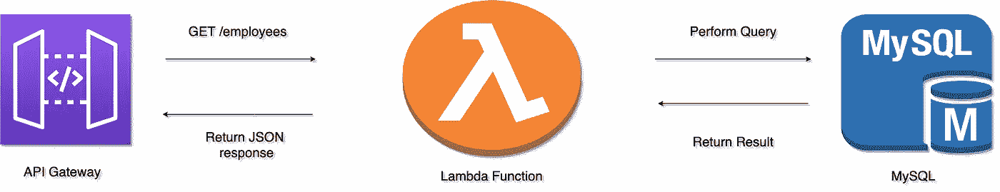

# 如何在本地测试 AWS Lambda

> 原文：<https://levelup.gitconnected.com/how-to-test-aws-lambda-locally-3395ca785276>

AWS Lambda 一直在为我们提供许多好处，让我们构建更小的功能，并让它们无服务器运行。你不必担心它被托管或专门为此调试服务器。这样，任何人都可以很容易地在线运行 bare mettle quick utility 功能，并利用无服务器的力量。

虽然我们希望对各种问题有一个快速的解决方案，但了解如何测试它也很重要。为此，虽然我们有基于假设的测试，但我们肯定需要一种机制来本地测试它，这可以模拟实际的 AWS 堆栈。

本文将尝试展示我们如何执行 AWS Lambda 函数来连接 MySQL，并通过使用 AWS SAM(无服务器应用程序模型)在本地模拟 AWS Apigateway 来测试它。



连接到 MySQL 的示例 AWS Lambda 应用程序

# 如何开始？

本文使用的 **aws-sam-cli** 版本- **0.48.0**

首先，让我们从初始化一个可以从 AWS 网关触发 Lambda 函数的新应用程序开始。

现在，无论您看到什么，都非常简单，AWS SAM quick start 已经提供了所有内容。

让我们做得更高级一点！

# 使用数据库调用添加自定义函数

我想从我的 Lambda 中进行 JDBC 调用，并获取每个 API 调用的结果。在这种情况下，让我使用 MySQL 服务器，其中，我将从数据库中查询雇员数据，这是一个 API 作为 **GET /employees，**这将从数据库中获取所有雇员。

首先，让我们创建一个名为 **employees** 的数据库，然后使用以下代码创建一个表:

将 MySQL 驱动程序添加到 pom.xml，如下所示:

```
<!-- [https://mvnrepository.com/artifact/mysql/mysql-connector-java](https://mvnrepository.com/artifact/mysql/mysql-connector-java) -->
<dependency>
    <groupId>mysql</groupId>
    <artifactId>mysql-connector-java</artifactId>
    <version>8.0.19</version>
</dependency>
```

现在，创建一个新函数，并将其添加到已经存在的 template.yaml 下，如下所示:(注意:我添加了一个新函数- **EmployeeFunction** )

因此，在我用一个全新的样本模块创建了一个新函数之后，这个新函数的名称为 **EmployeeFunction** ，代码如下，用于获取数据:

***注意*** : **创建 Employee** 类来存储和保存结果。这是一个简单的 java POJO 类。同样， **GatewayResponse** 类也是出现在 **HelloWorldFunction** 中的同一个类。

让我们按如下方式构建项目:

```
**sam build**
```

然后，我们可以通过选择特定的函数在本地调用它，如下所示:

```
**sam local invoke “EmployeeFunction”**
```

因为正常的 employees 函数将调用/employees，所以输出将是:

```
[
  {
    "Id": "1",
    "Name": "Nagaraj",
    "Salary": "123450"
  },
  {
    "Id": "2",
    "Name": "Arpitha",
    "Salary": "123456"
  }
]
```

这样，我可以描述从 API 网关到函数的相同 API 调用，以及在 docker 中执行的所有调用，就像无服务器 Lambda 函数一样。

现在，为了也考虑传递一个路径参数，我们可以把它作为一个 API 来启动:

```
sam local start-api
```

然后使用路径参数 1(第一个雇员 id，基于显示的结果)运行:

```
curl http://127.0.0.1:<port_number>/employee/1
```

它将打印:

```
[
  {
    "Id": "1",
    "Name": "Nagaraj",
    "Salary": "123450"
  }
]
```

# 最后的话！

这个本地测试帮助我了解了它实际上是如何工作的。如果这不可用，那么我们将不得不通过反复试验在 AWS 控制台上测试它。

# 更多博客更新…

查看我最新的博客:

[](https://medium.com/miq-tech-and-analytics/ingesting-terabytes-of-data-every-day-using-microservices-architecture-at-miq-7ade41256a7f) [## 每天接收数 TB 的数据——在 MiQ 使用微服务架构

### MiQ 的批量摄取之旅

medium.com](https://medium.com/miq-tech-and-analytics/ingesting-terabytes-of-data-every-day-using-microservices-architecture-at-miq-7ade41256a7f)