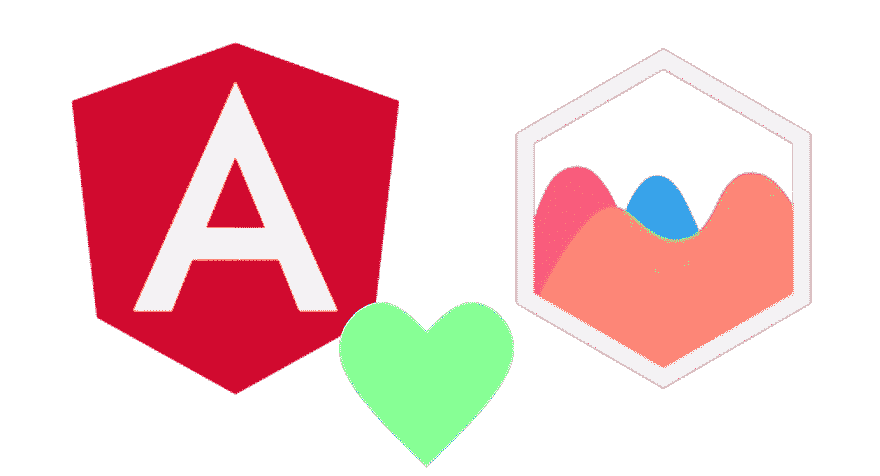

# 如何在角度组件中测试 Chart.js

> 原文：<https://levelup.gitconnected.com/how-to-test-chart-js-in-an-angular-component-d21d41e24c07>

一步一步的指南。



角度+ Chart.js

# 有什么问题？

当使用 [chart.js](https://www.npmjs.com/package/chart.js?activeTab=readme) 时，我们需要实例化一个`Chart`实例，就像这个`this.chart = new Chart(ctx, options)`。我们不能测试它！

为什么？让我们看看组件是什么样子，并回顾一下哪些可以测试，哪些不可以:

# 组件(v1)

我们将使用的组件如下所示:

实例化图表的组件

*   它通过一个`@ViewChild`查询在一个`ElementRef`中捕获一个`Canvas`。
*   它需要并依赖于`Router`的一个实例。
*   它使用`canvas`和线形图的特定配置创建了一个`Chart`。
*   它通过导航到图表点的详细信息页面来处理该点上的`click`事件。

好吧，这行得通，但是我们能写什么样的测试来反对它呢？

我们可以检查`chart`常量是否被实际填充，类型是否为`Chart`。**那就是**漂亮得多的**它**。但是如果我们有一些相关的功能，比如当用户点击图表中的一个点时做一些有趣的事情，实际上我们可以测试的并不多:

*   我们无法验证`ctx`和`options`是否是我们期望的那样。
*   我们无法验证图表事件的回调行为是否如我们所愿。

# 解决办法

我们看到，如果我们依赖代码中的构造函数，就不可能编写测试。我们需要的是一个中间的东西，它将为我们调用`Chart.js`构造函数，并且我们可以为测试交换一个模拟版本。它看起来是这样的:

提供(第 12 行)和输入(第 21 行)并使用(第 25 行)图表生成器的组件

顶部是我们的`chartBuilder`,它将为我们构建图表:

它接受一个`ChartItem`(例如一个`canvas` HTML 元素)和`ChartConfiguration`，并返回一个`Chart`的实例。

然后我们有了我们的注入令牌，我们将把它交给 Angular，让它知道我们想要这个`chartBuilder`。

作为`Component` -s 提供者的一部分，我们“提供”构建者，基本上是说:“嘿，Angular，当我给你这个令牌`ChartBuilderToken`的时候，给我这个函数`chartBuilder`”:

接下来，作为`Component`构造者的一部分，我们要求`ChartBuilderToken`，Angular 愉快地答应并给了我们上面提供的东西:

这里我们使用了`typeof chartBuilder`来避免挖掘`Chart.js`类型并定义它需要什么类型和返回什么类型。基本上，我们已经告诉`TypeScript`——“你知道类型，这里是一样的，所以使用它！”。

最后，在组件生命周期的适当时刻，当`@ViewChild` `this.canvas`将被填充时，我们调用图表构造函数，瞧，我们有了图表的实例:

# 测试:验证图表已构建

当测试组件时，我们可以用一个`chartBuilder spy`代替图表生成器，它的输入和输出可以被控制、检查或模拟。

让我们从简单的例子开始——验证图表是否存在

*完整代码参见* [*图表 js 测试 v1*](https://stackblitz.com/edit/test-chart-js-dependent-component-v1?file=src%2Fapp%2Fchart.component.spec.ts) *。*

这是一个`it`测试用例，是[茉莉](https://jasmine.github.io)、 [Jest](https://jestjs.io) 和[摩卡](https://mochajs.org)测试跑步者的标准。具体部分是:

用`mockRouter`函数模仿 Angular 的`Router`实例:`const r = mockRouter();`

*更多关于这是如何设置在文章的最后。*

通过使用返回模拟函数的`Jasmine` -s `createSpy`函数来模拟图表生成器。我们可以控制它返回什么。在这种情况下，我们只是告诉它返回一个字符串值`'the chart'`，因为对于这个特定的测试用例，我们并不真正需要更多:

*   创造一个间谍
*   告诉它要返回什么
*   用`builderSpy`(和模拟路由器`r`)构建`ChartComponent`

通过以下方式模仿一个 [HTML 画布](https://developer.mozilla.org/en-US/docs/Web/API/Canvas_API)元素:

*   `document.createElement('canvas');`
*   这是由`document`提供的`Canvas`元素的普通实例，就像在 real* app 中一样。
*   **注意，一些框架(如*[*Jest*](https://jestjs.io)*)嘲笑 DOM 和* `*document*` *对象是假的。*

向组件提供一个`ElementRef`来填充`@ViewChild('canvas') canvas: ElementRef;`。当应用程序运行时，Angular 通过查询视图来提供，这是将模板应用于 DOM 的结果。

*   `c.canvas = new ElementRef(document.createElement('canvas'));`
*   有了所有的安排，我们现在可以安全地运行`ngAfterViewInit()`。

为什么是`ngAfterViewInit`而不是`ngOnInit`或者另一个钩子？`@ViewChild`参考在`ngAfterViewInit`之前解析，在`ngOnInit`之后。因此`ngOnInit`会在`this.canvas`中看到`undefined`，而`ngAfterViewInit`会看到`ElementRef`被解决。更多信息见[角度文件](https://angular.io/api/core/ViewChild#description)。

现在，我们可以检查是否使用正确的参数调用了图表构造函数:

这里有很多内容，所以让我们一步一步来看:

*   `expect(ch).toHaveBeenCalledOnceWith(...)` -确保该 spy 被调用一次，并使用特定的参数集。
*   第一个参数是 mock Canvas HTML ( `canvas`)元素，我们只是确保它是逐字传递给`Chart`构造函数的内容。
*   第二个参数是`Chart`期望的[配置对象](https://www.chartjs.org/docs/latest/configuration/)
*   最后，我们验证图表现在已定义:
*   `expect(c.chart).toBeDefined();`

# 测试:验证`onClick`事件处理程序

在构造选项中，我们添加了一个事件侦听器，当用户单击图表中的某个点并将用户带到不同的页面时，它将会触发。

这里面有一些逻辑，我们想测试一下！测试看起来是这样的:

*完整代码参见* [*图表 js 测试 v2*](https://stackblitz.com/edit/test-chart-js-dependent-component-v2?file=src%2Fapp%2Fchart.component.spec.ts) *。*

循序渐进:

我们为`Router`和`ChartBuilder`依赖项创建一些模拟:

我们创建一个点击回调模拟(用一个空函数初始化):

*   `let onClickCallback: Function = () => {};`

我们需要引用组件逻辑的这一部分:

因此，以之前创建的`ch` chart builder spy 为例，我们指示它在被调用时调用一个函数。该功能在`callFake`参数中指定。这将用一个函数替换默认的图表生成器(它返回一个`new Chart(element, options)`)，该函数接受两个参数`element`和`options`，并将`options.onClick`存储在`onClickCallback`中。在看起来像这样的测试中:

在此之后，通过`ngAfterViewInit`，我们将获得存储在`onClickCallback`中的`onClick`回调，我们可以调用它并验证结果:

这证明了当使用非`null`的元素调用`onClick`时，我们将用户导航到相应的页面(根据来自`element`的索引从`data`数组中获取)

# 测试:使用模拟图表方法

假设我们想在导航到某个点的细节之前知道它是否可见。很抱歉这个人为的例子，重点是展示如何模仿`Chart`实例方法。

方法`getDataVisibility`提供了我们所需要的东西(参考[文档](https://www.chartjs.org/docs/latest/api/classes/Chart.html#getdatavisibility)):

仅在点可见时导航。让我们测试一下这个逻辑:

*完整代码见* [*图 js 测试 v3*](https://stackblitz.com/edit/test-chart-js-dependent-component-v4?file=src%2Fapp%2Fchart.component.ts,src%2Fapp%2Fchart.component.spec.ts) 。

细目如下所示:

模仿路由器— `r`。

模拟图表生成器— `ch`。

当模仿图表构建器响应时，我们提供一个包含模仿`getDataVisibility`方法的对象，它只返回`false`:

其余的设置是相同的:

*   实例化组件。
*   给它一个`ElementRef<Canvas>`。
*   调用`ngOnAfterViewInit`让它通过图表生成器构造`Chart`。
*   现在，我们调用`onClickCallback`，期望导航不会发生:

```
expect(r.navigate).not.toHaveBeenCalledWith([2]);
```

至此，我们已经涵盖了该用例。

# 摘要

这是我们讨论过的:

*   我们无法真正测试`new Chart(...)`。
*   我们可以将它包装在一个函数中，这样我们就可以调用`chartBuilder(...)`而不是`new Chart`。
*   这允许我们测试依赖于该实例的逻辑。

# 额外收获:嘲笑路由器

因为我们需要在那个浏览器实例中测试的只是`navigate`，所以我们可以创建一个`mock object`。这是一个 JavaScript 对象，它的`navigate`方法是一个 Jasmine `spy`方法，我们可以查询并找出它被调用了多少次，使用了什么参数——这正是我们所需要的。

`<Router><unknown>`是安慰性的打字稿:“这是一个路由器，我知道得更清楚，所以冷静点，不要把你的错误扔给我”，作者是:

*   首先，告诉它类型是`unknown`，也就是说，不要自作聪明地猜测这是一个`object`。
*   然后，告诉它这是一个`<Router>`。

在那之后，我们把结果传递给任何需要的人。

# 额外收获:it 测试用例之外的设置

这些测试用例包括相当多的设置。这对最终结果很重要，但是细节使得测试用例功能难以阅读。

如果所有的设置逻辑都有一个`setup`功能呢？这会使单独的测试用例可读性更好，并且仍然保留其意图吗？为什么，是的，它会！

好得难以置信？不完全是。让我们看看这个用例中的`setup`可能是什么样子:

循序渐进:

这是一个返回这个`builder`对象的函数，我们可以链接它的设置方法，并在完成后调用`build`:

我们可能需要一个特殊的案例。为此添加一个方法:

我们想接触一些被嘲笑的东西！没问题:

这就是`setup`函数的工作方式

## 谢谢

🙏🙏🙏感谢阅读！🙏🙏🙏

因为你成功了，这是一只微笑的猫


给一些👏🏻👏🏻👏🏻如果你喜欢这篇文章。掌声帮助其他人找到它，并鼓励我写更多的帖子。

在[我的 GitHub 页面](https://gparlakov.github.io)查看我的项目。