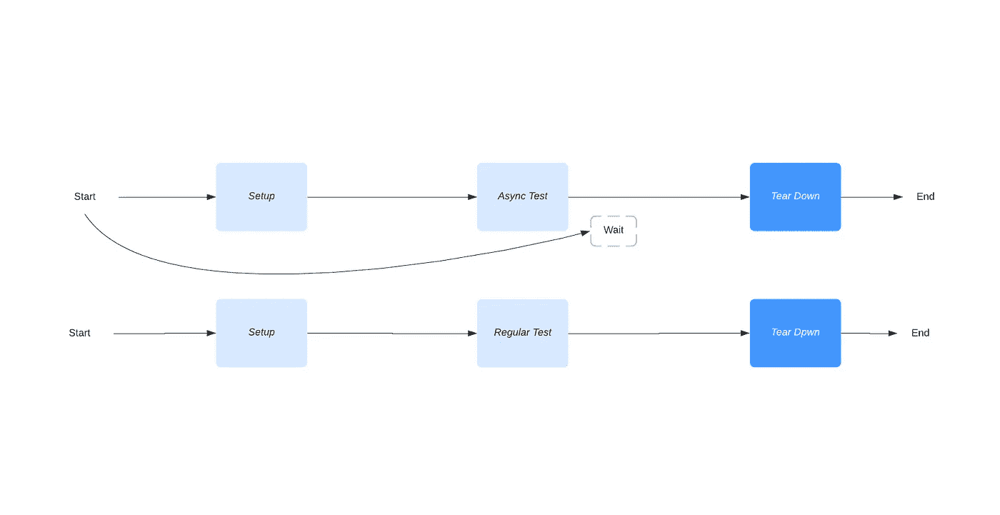

# 如何以纯 Scala 的方式测试有副作用的代码

> 原文：<https://levelup.gitconnected.com/how-to-test-code-with-side-effects-in-a-pure-way-scala-2b98e8e67b9d>



*最初发表于*[*https://edward-huang.com*](https://edward-huang.com/scala/functional-programming/cats/2020/04/19/how-to-test-code-with-side-effect-in-a-pure-way-in-scala/)

单元测试是我们创建应用程序时最基本的测试之一。它是将每个组件或功能作为一个单元来测试——给定一个输入，将输入插入到功能中，并断言输出。然而，在单元测试中，我们会遇到很多与复杂的 IO 或副作用有关的复杂性。

一个好的经验法则是创建一个返回我们想要的值的副作用的模拟。然而，这样做的话，我们需要提取一个单独的组件到一个函数中来模拟这个操作。可能会很麻烦。

在这篇博客中，我想分享一下如何通过对函数做一些小小的调整来测试异步代码——通过类型构造函数来抽象它。

让我们深入一个例子来说明我的意思。

注意:我们在后面的代码中使用类别类型类和`cats`库。如果你不熟悉类别类型类[，这里的](https://en.wikipedia.org/wiki/Type_class)是对它的简要描述。

# 问题

假设我们有一个`DBClient`，我们希望有一个`DBService`使用`DBClient`来做一些与数据库交互的操作。

下面是`DBClient`的实现:

```
trait DBClient {
  def get(url:String):Future[Int]
}
```

下面是`DBService`的实现:

```
class DBService(dbClient:DBClient) {
  def sumAllPrice(urls:List[String]): Future[Int] = Future.traverse(urls)(dbClient.get).map(_.sum)
}
```

现在，如果我们想测试`sumAllPrice`，我们可以创建一个`DBClient`的存根。

```
class TestDBClient extends DBClient {
  override def get(url:String): Future[Int] = Future.successful{1}
}
```

如何在单元测试中测试`sumAllPrice`？

因为它是异步的，我们需要一个可以接收异步结果的测试用例。但是，如果有一种方法可以减轻这个问题，那就是让`DBClient`更通用，并将其抽象成一个类型构造函数。

# 行动

我们可以用几种方法来解决这个问题。第一种是将代码重构为类型构造函数。在第二个例子中，我想把代码改成类型类模式。

# 对类型构造函数进行抽象

我们让`DBClient`接收一个类型构造函数`F[_]`类型。

```
trait DBClient[F[_]] {
  def get(url:String):F[Int]
}
```

注意:您需要在您的应用程序中导入[更高级的类型](https://stackoverflow.com/questions/6246719/what-is-a-higher-kinded-type-in-scala)。

这意味着`get(url:String)`返回任何构造函数类型。可以是`Future[Int]`也可以是`List[Int]`。

我们使用`Cats` [库](https://typelevel.org/cats/typeclasses.html)为生产版本生成异步代码，为测试版本生成同步代码。

`Cats`库有一个单子类型`id`，它允许类型包装到一个类型构造函数中而不改变它们的含义:

```
package cats

type Id[A] = A
```

我们有用于单元测试的`TestDBClient`特征，和用于主代码的`ProdDBClient`特征:

```
import cats.Id
trait TestDBClient extends DBClient[Id]

trait ProdDBClient extends DBClient[Future]
```

然后，我们也抽象了类型构造函数上的`DBService`。

```
import cats.implicits._

class DBService[F[_]:Applicative](dbClient:DBClient[F]) {
  def sumAllPrice(urls:List[String]): F[Int] = urls.traverse(dbClient.get).map(_.sum)
}
```

`F[_]: Applicative`是语法糖，是上下文相关的，因为它的`implicit`值为`ap: Applicative[F]`。

上述功能与`class DBService[F[_]](dbClient:DBClient[F])(implicit ap:Applicative[F])`相同

这里我们让类型构造函数成为一个可应用的，因为`traverse`只对有`Applicative`的值序列起作用。在`Future`的上下文中，它有一个`Applicative`，并产生`List[Future[Int]]`。然而，通过对类型构造函数`List[F[Int]]`进行抽象，我们需要向编译器证明该值在传入函数时有一个`Applicative`。

在这种情况下，我们使`DBClient`中的类型构造函数不绑定到任何特定的上下文，以便它可以很容易地在其他服务中使用。但是，我们限制了`DBService`的上下文，因为它需要有`Applicative`来执行`traverse`操作。

第二种方法是抽象类型构造函数，但使用类型类模式。

# 使用类型类

要定义一个类型类，我们需要做三件事:

1.  类型类别
2.  类型实例
3.  接口语法，接口对象

[WTF 是类型类？](https://edward-huang.com/functional-programming/2020/01/02/wtf-is-a-type-class/)

我们将把`DBClient`定义为一个类型类:

```
trait DBClient[F[_]] {
  def get(url:String): F[Int]
}
```

然后我们将定义实例。实例对象是我们放置`ProdDBClient`和`TestDBClient`的地方。

```
object DBClientInstances {
  implicit val getFutureInstance: DBClient[Future] = new DBClient[Future] {
    override def get(url: String): Future[Int] = ???
  }

  implicit val getIdInstance:DBClient[Id] = new DBClient[Id] {
    override def get(url: String): Id[Int] = ???
  }
}
```

最后，我们创建一个接口对象`DBService`，并在`sumAllPrice`中注入我们的实例:

```
object DBService {
  def sumAllPrice[F[_]:Applicative](urls:List[String])(implicit dbClient:DBClient[F]): F[Int] = urls.traverse(dbClient.get).map(_.sum)
}
```

我们还限制我们的类型构造函数有一个`Applicative`来使用`traverse`。

为什么我们这里不用`Monad`而用`Applicative`来代替呢？这是因为`Monad`更受限制，是`Applicative`的子类型，在类型类层次结构中，并且对于当前函数`Applicative`来说可以完成这项工作。我们不需要将传入元素限制在`Monad`中，因为使用`Applicative`我们可以有更广泛的行为范围，以及更少的法律需要遵守(no `flatMap`)。因此，调用方在实现`DBService`时可以做出更大范围的行为。

# 外卖食品

*   我们可以通过用类型构造函数抽象我们的应用程序来测试异步代码。
*   当使用类型构造函数抽象您的应用程序时，让类型构造函数对当前实现所需的行为有一个最小的限制是一个很好的实践。例如，`DBClient`不限于拥有任何上下文，而`DBService`限于拥有`Applicative`，因为我们希望能够在类型构造函数中使用`traverse`。

本教程中的所有源代码都在[这里](https://github.com/edwardGunawan/Blog-Tutorial/tree/master/ScalaTutorial/asynchronousTesting)。

**感谢阅读！如果你喜欢这篇文章，请随时订阅我的时事通讯，以便在我写新内容时得到通知。**

你也可以在[中](https://medium.com/@edwardgunawan880)关注我更多类似的帖子。