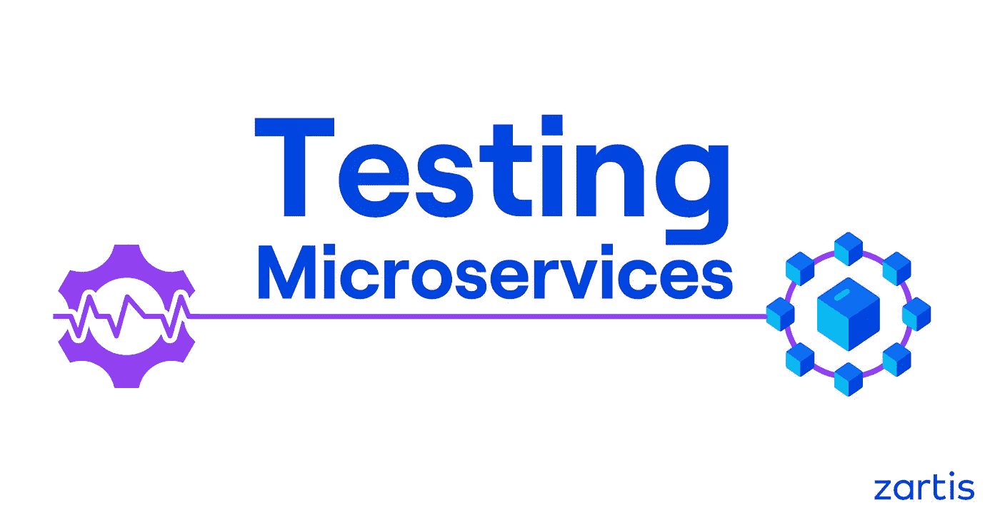
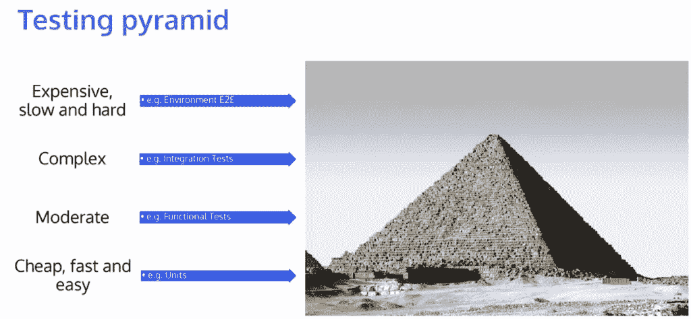
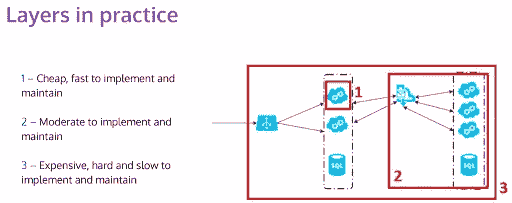
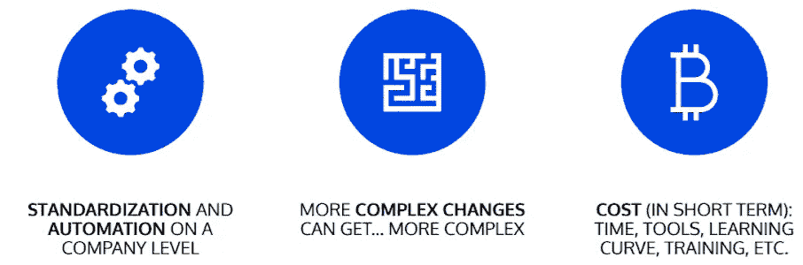
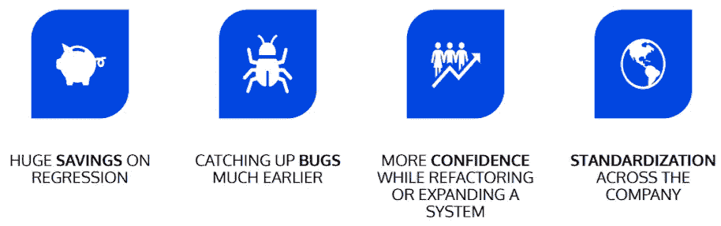

# 如何测试微服务

> 原文：<https://levelup.gitconnected.com/how-to-test-microservices-c7585181b686>

## 微服务测试的最佳实践和测试策略

微服务的优势超过单片系统的优势只是一个瞬间的事情，到目前为止，单片系统几乎没有变化和创新的空间。

单片应用程序将作为一个单元来开发。要进行任何迭代，工程师需要部署服务器端应用程序的更新版本。另一方面，微服务是用面向业务的 API 开发的，用来封装核心业务能力。松散耦合的原则有助于消除或最小化服务及其消费者之间的依赖性。

然而，微服务架构有其自身的挑战，尤其是在跟踪所有同时发布的更新时。确保部署的微服务没有代码损坏的一种方法是准备一个测试微服务的系统，这与测试一个整体系统有本质的不同。

# 我们为什么要测试微服务？

首先，为了内心的平静。在实践中，测试微服务可以通过避免多米诺效应来帮助我们消除许多问题。

分布式环境中最大的问题是在系统和子系统中有许多活动的部分。它在不断变化，许多服务同时相互交互。

假设您有 10 个团队，不断地在您的系统和子系统的各个方面工作，一天部署多次。如果没有适当的测试，您可能会经历一些副作用，因为您没有意识到其他团队成员所做的更改。这变得非常复杂，在出现错误的情况下，回滚通常是相当大的。由于依赖关系树，从系统中取出其中一个微服务可能会很困难，因为这通常意味着您还需要恢复依赖于该微服务的其他部署。

# 测试金字塔

让我们来谈谈有哪些类型的测试，它们如何覆盖你的软件的不同领域，以及它们如何一起工作。今天，测试金字塔是一个常见的概念，是一个很好的起点。

在金字塔的底部，我们有便宜、快速且易于开发的测试——例如，单元测试。我们越往上走，测试就越复杂。除了开发和维护成本更高之外，它们的运行速度也更慢。功能测试通常更容易与更多的类组合在一起，但是它们也有更多的代码行。然后是集成测试，通常会与其他东西进行交互。通过端到端(E2E)测试，您可以测试整个系统或子系统，这意味着大量的配置。

您可以使用各种测试，但底线是您需要计划如何测试各种特性。有时在单元级别上测试它可能就足够了，但有时这是不可能的，因为这个特性太复杂或不够可靠，无法在较低的级别上测试。

这个想法是，您知道测试参数，并且可以计划一个接一个的测试层。通过这种方式，您可以依赖于金字塔底层的内容，并测试那些您知道在底层无法覆盖的内容。

## 下面是设置不同测试层的实际情况:

为了研究上面的图表，让我们假设我们有两个服务，并且在它们前面有一个负载平衡器。当一个请求到达负载均衡器时，它被分配给其中一个服务。然后，该服务将这些请求转换成消息，我们看到那里有一条消息总线，它正在与另一个服务进行通信。该服务有多个实例，它们正在监听由该消息总线报告的更改。

这个想法是，您可以在您的服务本身中进行测试，使用更便宜和更快速的方法来实现测试，如上图中的 1 号所示。第二层测试应该在此基础上增加，例如，使用本地副本，插入本地数据库，添加 Docker 容器等。这样你就可以测试集成。第三层测试是最慢也是最难开发和维护的。当您一起测试所有东西时，您需要一个合适的环境来部署、运行、查看结果并等待结果。更重要的是，如果某个东西失败了，实际上并不容易看到哪里出了问题，可能需要进一步的调查。

# 什么时候实现所有级别的测试至关重要，什么时候考虑成本太高？

这实际上取决于您正在实现的特性。如果它不一定是“业务关键的”，也许你不需要实现所有的层。同时，如果它是你业务的核心部分，用所有的测试层覆盖所有的东西可能是好的。然而，考虑到您正在构建一层又一层，测试实际上并不昂贵，因为您已经有了很多构建模块。你对这些技术越熟悉，就越容易掌握。

让我们更深入地了解所有这些类型的测试，以及如何设置它们！

# 构建时测试:第 1 层和第 2 层测试

首先也是最重要的，我们有经典的**单元测试**，然后还有其他你可以部署的东西，比如测试你的合同。**合同测试**极其重要，如果你不能回头界定你的服务和模块的话。您可以将所有这些都建立在合同的基础上，并孤立地测试这些东西，这样您就可以确保您的合同不会被意外更改。

假设你有 API 响应，比如说 Asp.NET，你用 JSON 回复。您的契约测试将验证您是否仍然具有相同的大写，以及订单属性是否仍然相同。很容易改变数据的表示方式，如果有人使用 JSON 而忘记改回 XML。

然后你可以进行**服务/组件/功能测试**。在这些类型的测试中，您需要使用大量内存中的副本、仿真器、真实服务的精简版本，并且一切都在您的机器上运行。因此，它不一定只是运行在同一个进程上，而是一切都在本地运行。

最后但同样重要的是，我们有**单一服务集成测试。**比方说，你正在 AWS 上开发一个动态数据库实例，并试图对此进行测试。通常，您可以使用一些其他的对应物，但有时会有一些无法用其他方式涵盖的边缘情况。这里值得一提的是，这主要是白盒测试，这意味着你知道你在找什么。所以，如果你想写这种测试，你需要知道这些东西内部是如何工作的。

# 环境测试:第 3 层测试

这里，顾名思义，您需要某种环境，它不需要是一个完整的环境，但是您需要测试不止一个服务或系统组件。为此，您可以使用模拟器来测试同时运行的服务。

有几组测试可以归为环境测试。其中之一是**部署测试**。部署测试在成功部署后立即运行，该测试的目的是验证是否一切配置正确。这意味着您不要太关注逻辑，而是要测试一些东西，比如当您发送消息时可以访问数据库；如果该消息被适当地处理到该列；如果你能获得你的服务所需要的所有资源，等等。

然后我们有**端到端(E2E)测试**。他们通常更关注用例。这里，您将使用一个 API，然后期望您的系统或子系统发回某种通知。

下一组测试是**启动检查**。它们类似于部署的测试，但是它们不太灵活，这意味着这实际上是服务部署过程的一部分。其思想是在启动时为某些验证和检查编写测试程序，并确保当部署服务时，例如，您可以访问数据库，数据库模式是否在正确的位置，您使用的 API 是否在正确的版本等等..这些启动检查将帮助您验证您的服务所依赖的一切是否确实如预期的那样工作，使用正确的版本，等等。

最后但同样重要的是，我们有**探索性测试**。它们是半自动的，主要由 QA 团队成员开发。在某种程度上，您实际上可以运行一系列自动化测试来找出是否有任何方法来分解正在被测试的服务。值得一提的是，这些测试通常是白盒和黑盒测试的混合，因为对于 E2E 或探索性测试，你真的需要知道东西是如何在内部工作的。

**总而言之，构建时测试非常关注你的服务的逻辑，所以你基本上要确保如果你按下开关，它会以正确的方式做出反应。而环境测试基本上是从配置的角度进行测试，比如错误的密码、过期的证书等。环境测试的目的是检测这类问题，就像烟雾测试一样。**

# 系统测试:第 3 层测试

第三层测试还有两个测试组，分别是**性能测试**和**弹性/可用性测试**。使用这些系统测试，您可以测试您的整个系统或者子系统的一部分，这取决于您想要如何分割您的测试。

性能测试与服务的性能相关。设置这些测试是很棘手的，因为你通常不需要一个全尺寸的测试环境，但是你需要放大或缩小它，或者把它裁剪得足够接近。你可以运行两个服务，而不是运行 10 个服务，如果这两个服务可以容纳那么多负载，那么这意味着坦克可以容纳 5 倍多，对不对？这些测试应该模拟真实的流量，并显示在各种情况下性能如何。

弹性/可用性测试更多的是关于你的系统在出现问题时的表现。假设您有 20 个服务，其中一个关闭了。这种冲突是否会导致整个系统崩溃，或者只是导致系统在运行时出现类似“目前，您无权访问系统的 X 部分，但其余部分仍在运行”的警告？

这里，值得一提的是*跟踪*对于性能和弹性测试的重要性。您可能有数百甚至数千个流程、机器、容器，当您需要找出问题所在时，拥有日志和指标可以为您节省大量时间。您可以手动检查日志以查看是否有任何溢出的错误，是否有指示某些问题的指标，或者您也可以设置自动警报以实时获得问题通知。

# 测试微服务的利弊:

## 测试微服务的挑战:

## 1.公司层面的标准化

实现我们上面讨论的技术的挑战通常与标准化有关，因为其中一些技术需要公司级别的过程。在这一级别实现流程自动化可能非常困难，因为您需要让您的技术团队达成一致，并确保每个人都同意设置系统以允许这些测试的特定方式。

## 2.依赖性变得更加复杂和昂贵

需要包括在系统的不同部分工作的团队成员意味着事情将变得更加复杂。建立依赖关系意味着花费更多的时间和金钱来持续协作。如果你不想投资在内部制造工具，可能还会有额外的费用。您的工程师可能也需要培训来缓和学习曲线。

如果你正在向你的团队介绍这些技术，人们需要习惯它们并以这种方式工作。

## 测试微服务的优势:

您可能需要花费一些时间和资源让您的团队参与进来，并调整您的开发和测试方法。然而，在日志运行中，在较低的级别进行测试有很多优点。

## 1.时间和回归方面的巨大节约

举个例子，目前我们正在为一个客户的项目进行回归，我们的目标是将每个环境的测试时间减少到最多几分钟。构建时测试持续四分钟，一旦我们部署到环境中，测试将在三分钟内运行。总之，测试时间不超过 10 分钟。当您考虑自动化环境测试整个子系统需要多少时间时，这是一个巨大的胜利。

## 2.更早地捕捉 bug

越早发现错误，修复的速度越快，成本越低。考虑到服务中断时可能对您的业务造成的损害，未能快速捕获漏洞的成本可能会带来实实在在的财务后果。

## 3.重构或扩展系统的信心

在重构或扩展系统时，您可以放心，如果出现任何问题，您会得到实时通知。有时甚至在它进入生产之前，所以你不会收到客户询问为什么东西坏了的请求。在问题到达客户手中之前解决问题将极大地增强您的客户和团队的产品信心。

## 4.公司层面的标准化

虽然我们一开始就把这列为缺点，但如果做得正确，利大于弊。过渡可能是一个挑战，但一旦你这样做了，从管理的角度来看，一切都会变得容易得多。你可以重组团队，如果人们发现不同的领域更有趣，就激励他们改变团队。因为所有团队都在相同的原则下工作，使用相同的工具，并且他们对合同等有相同的方法。，您的工程师将成为组织内不同团队的宝贵资产。

本文总结了 Zartis 首席工程师 Piotr Litwiński 主持的关于该主题的网络研讨会。你可以在这里找到完整的网上研讨会[。](https://youtu.be/z2hCLOrXJ8M)