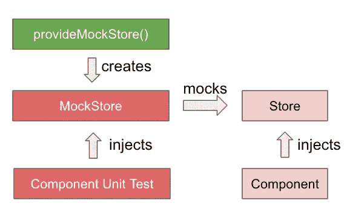

# 如何测试 NgRx

> 原文：<https://levelup.gitconnected.com/how-to-test-ngrx-ccf6861fa708>



NgRx 是 angular 的一个框架，它有助于将后端逻辑从前端分离出来，使代码更容易、更干净。要了解更多关于它的工作原理和使用方法，请查看我以前的文章— [NgRx 解释](/ngrx-explained-3891da35eeea)。用 NgRx 进行测试非常简单，您只需要使用提供的模拟。

首先，由于`store`被注入到构造函数中，并且由于单元测试应该是隔离的，因此我们需要在配置测试模块时将`provideMockStore()`添加到`providers`数组中。然后我们可以创建对我们的`store`的引用，声明为类型`MockStore<AppState>`，并从`TestBed`中注入它的值。

为了存根来自`selectors`的值，我们可以使用`overrideSelector(<Selector>, <Value>)`方法和`fixture.detectChanges()`来刷新数据。

```
store.overrideSelector(Selector.books, sampleBooks);
fixture.detectChanges()
```

如果我们需要重用被覆盖的选择器，我们可以将它赋给一个类似`let showDetailSelector = store.overrideSelector(Selector.showDetail, true);`的变量。我们可以通过使用`setResult(<Value>)`方法来更新这些值。但是之后我们需要调用`store.refreshState()`来刷新商店。

```
showDetailSelector.setResult(false);
store.refreshState();
fixture.detectChanges();
```

关于如何完成所有这些工作的示例，请访问[https://github . com/the coding analyst/book store/blob/master/src/app/app . component . spec . ts](https://github.com/thecodinganalyst/bookstore/blob/master/src/app/app.component.spec.ts)。

# 测试选择器

假设我们有一个这样的选择器

```
const books = createSelector( bookStore, (bookStoreState => bookStoreState.books));
```

为了测试我们的选择器，我们可以使用选择器的`projector(<State>)`方法来获得期望值。

```
it('should get the books', () => {
  const result = Selector.books.projector(initialState.bookStore);
  expect(result.length).toBe(5);
});
```

完整的例子在[https://github . com/the coding analyst/book store/blob/master/src/app/state/books . selectors . spec . ts](https://github.com/thecodinganalyst/bookstore/blob/master/src/app/state/books.selectors.spec.ts)上。

# 测试减速器

因为`reducers`是简单的纯函数，通过一个特定的动作从当前状态获得一个新的状态，我们只需要 stub 我们的状态并创建一个动作对象来传递给我们的 reducer。

假设我们有这样一个行动

```
const booksLoaded = createAction("[BookList] Books Loaded", props<{ books: ReadonlyArray<Book> }>())
```

我们可以直接引用`booksLoaded`动作，传入 books 参数- `const action = BookStoreActions.booksLoaded({books: [sampleBook]});`。然后我们可以通过- `const state = booksReducer(initialState, action);`将它传送到我们的 reducer，并直接在状态对象上做断言。

完整的例子在[https://github . com/the coding analyst/book store/blob/master/src/app/state/books . reducer . spec . ts](https://github.com/thecodinganalyst/bookstore/blob/master/src/app/state/books.reducer.spec.ts)上。

# 测试效果

我们需要添加真实的`effects`，以及模拟的`action`和`store`。

对于一个动作— `loadBooks`，这个动作的副作用是调用服务从数据库中加载书籍。在书籍被加载后，另一个动作- `booksLoaded`被触发，书籍作为有效负载。

为了测试上述效果，

1.  首先，我们在服务上放置一个间谍来返回一个模拟的图书列表，这样服务的工作就不会干扰我们的单元测试。
2.  然后我们触发动作— `actions$ = of(BookStoreActions.loadBooks);`。
3.  然后我们同意这个效果，并把我们的断言

完整示例可在[https://github . com/the coding analyst/book store/blob/master/src/app/state/books . effects . spec . ts](https://github.com/thecodinganalyst/bookstore/blob/master/src/app/state/books.effects.spec.ts)上找到。

*本文原载于*[*https://the coding analyst . github . io/knowledge base/how-to-test-ngrx/*](https://thecodinganalyst.github.io/knowledgebase/how-to-test-ngrx/)