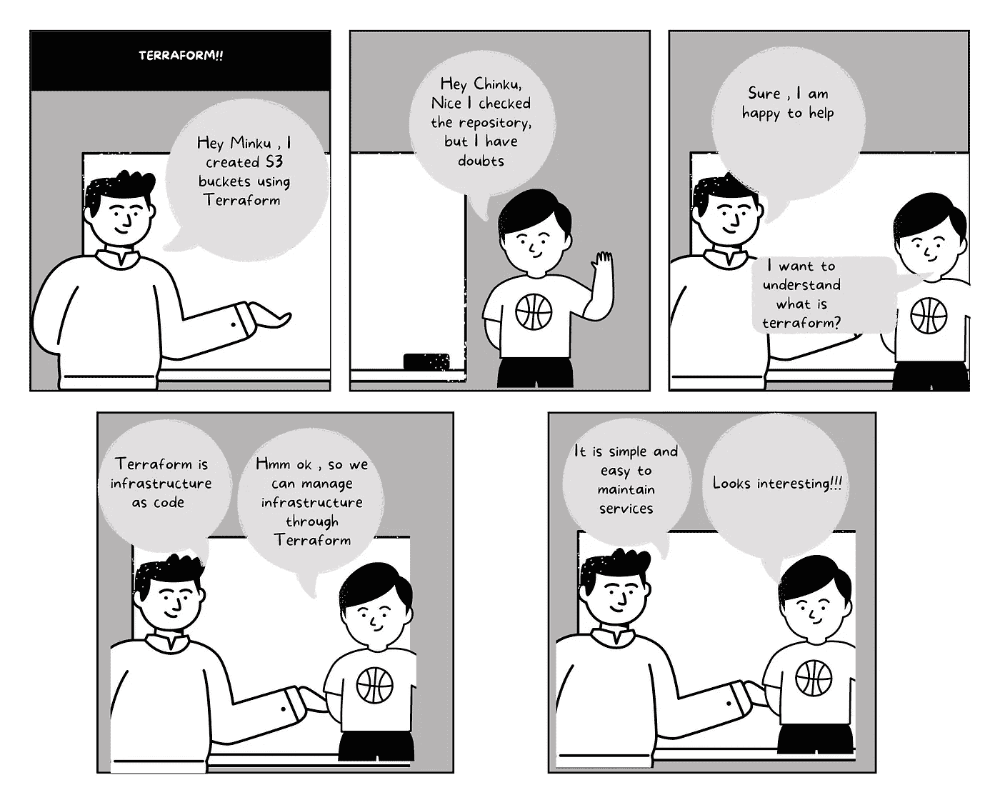
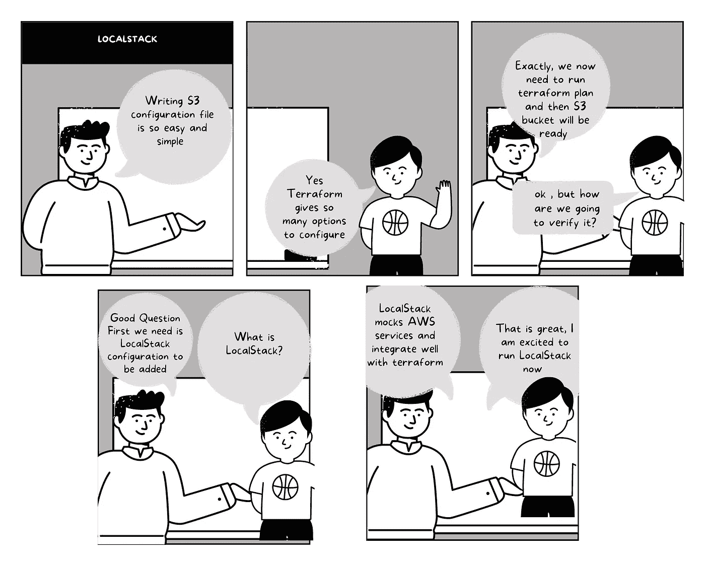

# 如何使用 LocalStack 用 Terraform 测试 S3

> 原文：<https://levelup.gitconnected.com/how-to-test-s3-with-terraform-using-localstack-585d2366fa13>

LocalStack 简化了 AWS 服务的测试



作者图片

新手在学习 AWS 时面临的主要挑战是如何维护基础设施并在本地测试它。下面是发生在两位开发人员之间的类似对话，他们在学习 AWS 服务时试图相互理解和帮助。

# 什么是 Terraform？

Terraform 是一个基础设施，作为一个代码工具，帮助我们在云服务上创建和管理资源。

*   通过维护状态文件来跟踪基础设施，状态文件是您环境的真实来源。
*   自动化的变化，它有助于检测资源的依赖关系，并帮助用户不必担心一步一步的指令来创建资源。

## 地形状态

*   ***Init***
    以下命令帮助初始化当前工作目录以使用 terraform。

```
terraform init 
```

*   ***计划***
    它根据配置文件创建一个执行计划来创建、更新或销毁资源。

```
terraform plan
```

*   ***应用***
    它根据在执行计划中创建的资源依赖关系图，在 terraform 计划中应用更改。

```
terraform apply
```

# 如何创建一个 S3 桶使用地形？

AWS 简单存储服务(也称为 S3)是一种基于云的服务，可随时帮助存储、备份、归档和检索数据。它是 S3，为对象提供 99.999999999%的持久性，是一种对象存储服务。我们只支付在 S3 使用的费用。

# 先决条件

*   安装[地形](https://learn.hashicorp.com/tutorials/terraform/install-cli)
*   安装 [Docker 桌面](https://docs.docker.com/desktop/mac/install/)
*   安装 [AWS CLI](https://docs.aws.amazon.com/cli/latest/userguide/getting-started-install.html)

## 步骤#1 编写配置文件

下面的文件创建了一个名为`my-bucket`的 S3 存储桶，并将 IAM 角色设置为`List Buckets`。IAM 角色有助于定义 S3 时段上允许的操作。这是一个非常简单的配置，我们可以添加许多类似`versioning and ACL.`
S3 `Standard`的功能，因为存储类型将是默认存储。有关使用 terraform 启用功能的更多信息，请参考[链接](https://registry.terraform.io/providers/hashicorp/aws/latest/docs/resources/s3_bucket)。

## 步骤 2 配置本地堆栈



作者图片

Localstack 是一个云服务模拟器，帮助运行 S3、Dynamodb、Kinesis 等 AWS 服务。
Terraform 配置通过`provider`与本地堆栈交互，通过`access_key and secret_key`与端口`4566`的端点交互

***选项#1*** 使用`docker run`执行 Localstack。

```
$ docker run --rm -it -p 4566:4566 -p 4571:4571 localstack/localstack
```

***选项#2*** 使用`docker-compose.yaml`执行 Localstack。

```
docker-compose up -d
```

***输出:***

```
Creating localstack_main ... doneAttaching to localstack_mainlocalstack_main | Waiting for all LocalStack services to be readylocalstack_main | 2022-04-04 21:05:58,042 CRIT Supervisor is running as root.  Privileges were not dropped because no user is specified in the config file.  If you intend to run as root, you can set user=root in the config file to avoid this message.localstack_main | 2022-04-04 21:05:58,047 INFO supervisord started with pid 14localstack_main | 2022-04-04 21:05:59,057 INFO spawned: 'infra' with pid 20localstack_main | 2022-04-04 21:06:00,060 INFO success: infra entered RUNNING state, process has stayed up for > than 1 seconds (startsecs)localstack_main |localstack_main | LocalStack version: 0.14.2localstack_main | LocalStack Docker container id: 960f3dbe8b0dlocalstack_main | LocalStack build date: 2022-04-02localstack_main | LocalStack build git hash: 8f73e14elocalstack_main |localstack_main | Starting edge router (https port 4566)...localstack_main | Ready.localstack_main | [2022-04-04 21:06:00 +0000] [20] [INFO] Running on https://0.0.0.0:4566 (CTRL + C to quit)localstack_main | 2022-04-04T21:06:00.774:INFO:hypercorn.error: Running on https://0.0.0.0:4566 (CTRL + C to quit)
```

## 步骤 3:执行地形计划

我们现在需要我们的三个步骤
***#1 初始化地形***

```
terraform init
```

***#2 执行计划***

正如我们在下面的输出中看到的，两个资源`s3 bucket`和`iam role`。

```
terraform planOutput:Terraform used the selected providers to generate the following execution plan. Resource actions are indicated with the following symbols:+ createTerraform will perform the following actions:**# aws_iam_role.invocation_role** will be created+ resource "aws_iam_role" "invocation_role" {+ arn                   = (known after apply)+ assume_role_policy    = jsonencode({+ Statement = {+ Action   = "s3:ListBucket"+ Effect   = "Allow"+ Resource = "arn:aws:s3:::test-bucket"}+ Version   = "2012-10-17"})+ create_date           = (known after apply)+ force_detach_policies = false+ id                    = (known after apply)+ managed_policy_arns   = (known after apply)+ max_session_duration  = 3600+ name                  = "api_gateway_auth_invocation"+ name_prefix           = (known after apply)+ path                  = "/"+ tags_all              = (known after apply)+ unique_id             = (known after apply)+ inline_policy {+ name   = (known after apply)+ policy = (known after apply)}}**# aws_s3_bucket.test-bucket** will be created+ resource "aws_s3_bucket" "test-bucket" {+ acceleration_status                  = (known after apply)+ acl                                  = (known after apply)+ arn                                  = (known after apply)+ bucket                               = "my-bucket"+ bucket_domain_name                   = (known after apply)+ bucket_regional_domain_name          = (known after apply)+ cors_rule                            = (known after apply)+ force_destroy                        = false+ grant                                = (known after apply)+ hosted_zone_id                       = (known after apply)+ id                                   = (known after apply)+ lifecycle_rule                       = (known after apply)+ logging                              = (known after apply)+ object_lock_enabled                  = (known after apply)+ policy                               = (known after apply)+ region                               = (known after apply)+ replication_configuration            = (known after apply)+ request_payer                        = (known after apply)+ server_side_encryption_configuration = (known after apply)+ tags_all                             = (known after apply)+ versioning                           = (known after apply)+ website                              = (known after apply)+ website_domain                       = (known after apply)+ website_endpoint                     = (known after apply)+ object_lock_configuration {+ object_lock_enabled = (known after apply)+ rule                = (known after apply)}}**Plan:** 2 to add, 0 to change, 0 to destroy.╷│ **Warning: Argument is deprecated**││   with provider["registry.terraform.io/hashicorp/aws"],│   on main.tf line 5, in provider "aws":│    5:   s3_force_path_style         = true││ Use s3_use_path_style instead.││ (and one more similar warning elsewhere)
```

***#3 应用修改***

```
terraform applyOutput:.....
**Do you want to perform these actions?**Terraform will perform the actions described above.Only 'yes' will be accepted to approve.**Enter a value:** yes**aws_iam_role.invocation_role: Creating...****aws_s3_bucket.test-bucket: Creating...****aws_s3_bucket.test-bucket: Creation complete after 0s [id=my-bucket]****aws_iam_role.invocation_role: Creation complete after 1s [id=api_gateway_auth_invocation]**
```

## 步骤 4 S3 铲斗操作

注意:我使用`aws-cli`运行命令，也可以使用`[pip](https://github.com/localstack/localstack)`安装 Localstack。

***#1 列表桶***

```
aws --endpoint-url=http://localhost:4566 s3 ls
Output2022-04-04 23:31:10 my-bucket
```

***#2 创建一个简单的文本文件如下图***

***#3 执行*** `***s3 cp***` ***命令***

```
aws --endpoint-url=http://localhost:4566 s3 cp test.txt s3://my-bucket**Output**
upload: ./test.txt to s3://my-bucket/test.txt
```

***#4 检查铲斗的内容***

```
aws --endpoint-url=http://localhost:4566 s3 ls s3://my-bucket2022-04-05 00:13:34         22 test.txt
```

请参考我的 [Github repo](https://github.com/pgolani28/terraform_localstack_demo) 获取代码，也请参考我的博客来创建你自己的公共库

[](https://faun.pub/how-to-create-your-first-git-hub-repo-mac-f3df63398c94) [## 如何创建你的第一个 Git Hub Repo — Mac

### 通往 Git Hub 仓库的 5 个简单步骤

faun.pub](https://faun.pub/how-to-create-your-first-git-hub-repo-mac-f3df63398c94) 

作者图片

# ***结论***

希望这篇文章对 AWS 服务入门有用。

***走之前***……*如果你喜欢我的故事，想支持我的写作，* [*就在这里*](https://medium.com/@prernagolani21/membership) *成为一个中等会员。一个月 5 美元，你就可以获得无限的故事，我会赚一点佣金，不需要你额外付费。谢谢你看我的故事，支持我对写作的热爱。*

请关注我/ [订阅电子邮件](https://medium.com/subscribe/@prernagolani21)，这样我的下一篇文章一出来，你就会知道。

# 参考

【https://registry . terraform . io/providers/hashi corp/AWS/latest/docs/resources/S3 _ bucket
https://docs.localstack.cloud/integrations/terraform/
[https://github.com/localstack/localstack](https://github.com/localstack/localstack)