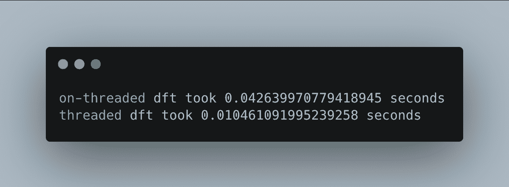

# 如何在 Python 中线程化

> 原文：<https://levelup.gitconnected.com/how-to-thread-in-python-9adf899d52ce>

在 [Unsplash](https://unsplash.com/s/photos/thread?utm_source=unsplash&utm_medium=referral&utm_content=creditCopyText) 上由 [amirali mirhashemian](https://unsplash.com/@amir_v_ali?utm_source=unsplash&utm_medium=referral&utm_content=creditCopyText) 拍摄的照片

## 不仅仅是如何线程化，还有一些关于线程化本身的核心概念

我希望这篇博文能让你好起来。这篇文章将让你快速了解 Python，如何开始编写多线程应用程序，以及一些关于线程本身的核心概念。首先，我将梳理一下 Python 版本(2.7 到 3.x)之间的一些差异，然后是一些核心线程概念，最后是一些如何在 Python 中开始线程化的例子。

# Python 和用例

Python 是一种奇妙的语言。它的用例范围从人工智能编程、数据分析、网站开发、网页抓取、数据操作，一直到简单的斐波那契脚本。用途真的是无止境的，我对 Python 了解得越多，就能找到越多的用例。

Python 2.7 是 finito。嗯，它仍然广泛用于社区和企业，但对 2.7 的支持于 2020 年 1 月 1 日结束，2020 年 4 月 20 日发布最终关键版本 2.7.18。今年是 2.7 的寿终正寝(EOL)年，所以向前看，所有开发人员都应该练习使用 3.x 版本。

Python 3 在其前身的基础上增加了一套令人兴奋的新特性。该清单包括:

*   Print 语句与 print()函数
*   整数除法
*   Unicode 支持
*   xrange()已更改为范围()
*   引发异常和异常处理
*   对于循环变量和全局变量泄漏
*   raw_input()到 input()
*   银行家四舍五入
*   更多！

我见过的概述版本之间关键差异的最好的帖子是 2014 年写的一篇帖子。要了解更多信息，我会[查看](https://sebastianraschka.com/Articles/2014_python_2_3_key_diff.html)，因为我不会在这篇文章中详细介绍所有内容。当然，还有官方文档( [Python2.7](https://docs.python.org/2.7/) ， [Python3.8](https://docs.python.org/3.8/) )这是关于 Python 的信息宝库。我认为在进入 StackOverflow 之前，一定要检查 API 的正确用法。

# 概念

再一次，在我们深入例子之前，有一些关于线程的关键概念需要回顾。这些笔记是我自己读完杰森·格雷戈里的[游戏引擎架构](https://www.gameenginebook.com/)(第四版)第四章后的感想。这本书是一个很棒的资源，不仅涵盖了游戏概念，还把你从计算机的 CPU 带到了高级编程概念。

**内核**

内核处理系统中各种各样的任务。它是设备硬件和软件之间的沟通者。它还负责调度在哪个周期哪个内核上运行哪个进程。内核允许开发者创建一个线程，并访问机器上的内存。编程语言封装了内核调用，因此不会发生危险的事情(比如写入错误的内存空间)。编程语言越高，用于连接高级语言和低级调用的 API 就越多。

**流程**

进程是操作系统(OSs)管理包含在可执行文件中的程序的运行实例的方式。创建的每个进程还会创建一个主线程来启动。一个进程容纳了该进程中所有线程的共享存储，因此可以将该进程视为线程处理其数据的“环境”。

**抢占式多任务处理**

在早期的计算机时代，CPU 只有一个内核，只有一个输入流。这允许一次运行一个进程。随着计算机的发展——更多的内核、超线程——它允许有多个指令流的能力，因此允许多个进程运行。抢占式多任务处理是操作系统在处理器上调度任务的方式。抢占式多任务处理允许调度程序查看进程列表，检查哪个进程处于可以运行的状态(或开始检查其指令列表)，并在下一个内核周期将该进程调度到一个内核上，而不是等待单个任务完成后再进入下一个任务。

**螺纹**

线程封装了单个机器语言指令流的运行实例。一个进程中可以存在多个线程。如果你曾经在点击“计算/渲染”后程序冻结，可能是所有的处理都在同一个线程上进行，因此锁定了用户界面。
*“不要做 UI 线程上的工作。”*

一个线程具有:

*   一个*线程 ID* (TID)对于进程中的每个线程是唯一的，而对于系统中的每个线程不是唯一的
*   *调用堆栈*作为线程将在内核上执行的指令
*   所有专用和通用*寄存器*的值(通常只有用户模式寄存器，除非程序升级运行)
*   一块被称为*线程本地存储* (TSL)的通用内存
*   对进程内所有线程可用的进程内存的访问

**线程库**

大多数线程库都有相同的基本线程函数:

*   *创建*一个线程
*   *终止*一个线程
*   *请求*一个线程*退出*
*   *睡眠*超时
*   *把剩余的时间让给另一个线程*
*   等待螺纹完成，然后*将*与主螺纹连接

通常一个线程会一直运行到它终止，但是有时候一个线程会在继续之前等待一个事件的发生，并且占用 CPU 直到它结束。为了防止一个线程占用内核太长时间，并且不允许其他线程继续，开发人员的工具箱中有三种方法:轮询、阻塞和让步。

**线程轮询**

将线程置于一个仅在条件返回 true 时退出的紧密循环中，因此不会继续指令流(或运行 check_condition()的相同指令)。

**螺纹堵塞**

阻塞使线程休眠，直到满足条件。这种方法将所有进程和线程的本地 CPU 内存(缓存)保存到存储器(RAM 或 HDD/SDD ),内核记住线程的 ID 和状态。当条件最终满足时，它将从内存中回调信息，并在内核调度它时开始处理。

**螺纹屈服**

让步是轮询和阻塞的混合。当线程的条件不满足时，线程将把它在 CPU 上的剩余时间让给(传递给)进程内的另一个线程(如果没有，则让给它自己，直到进程在 CPU 上超时)。

如果你想更详细地介绍这方面的内容，我提到的游戏引擎架构这本书是最好的。此外，在线查看更多这些概念。

# 穿线

现在我们已经有了一些概念，让我们深入了解何时使用线程。正如在线程概念下提到的，“永远不要在 UI 线程上工作”是一个大问题。

示例:

您正在使用的 3D 建模程序是单线程应用程序。图形用户界面，计算，一切都在一个线程上。您刚刚创建了一个具有 1，000，000 个顶点的对象，并希望使用最终材质渲染该对象。你点击 render，你的程序就停止了，看不到结束的迹象(刚刚超过 30 分钟)。这是因为你的计算占用了线程在处理器上的所有时间，它不允许程序继续运行它的 UI 循环。

一个解决方案是，生成第二个线程来进行计算和存储数据，这将允许主线程(您的 GUI 和程序所在的线程)继续运行，您仍然可以使用该程序。

Python 有一个模块恰如其分地叫做 [*线程*](https://docs.python.org/3/library/threading.html) 。这就是我们将在示例中使用的内容。

# 离散傅立叶变换

来自[维基百科](https://en.wikipedia.org/wiki/Discrete_Fourier_transform)的离散傅立叶变换(DFT)定义为:
*在数学上，离散傅立叶变换(DFT)将一个函数的有限个等距样本序列转换为离散时间傅立叶变换(DTFT)的等长样本序列，离散时间傅立叶变换是一个频率的复值函数。*

您不必完全理解这个函数，它只是一个占位符，用来展示线程的好处，也是我所学到的函数之一。

完整代码托管于此:[sre pollock/python _ threading _ example](https://github.com/srepollock/python_threading_example)

我们的进口

首先，我们设置脚本的 [shebang](https://en.wikipedia.org/wiki/Shebang_(Unix)) 和导入。我们需要的只是数学、随机、线程和时间模块。DFT 函数的数学，帮助生成一些数字的 random，线程(duh)，以及显示非线程和线程函数之间速度差异的 time。

理解函数不是必需的，但它对你来说是更多的知识

这里我们有 DFT 函数本身。

DFT，DFT，DFT，DFT

这是 DFT 的线程版本。注意，在这个版本中，有一个开始和结束索引。这是因为每个线程都接触同一个数据源，并且会在竞争中覆盖自己，除非我们明确告诉它将数据写入何处。

输入只需要 DFT 的实数集。图像是尚未计算的虚数

这里我们为 DFT 函数生成一些假数据。数组仍然需要满才能正确索引，所以我们用 128 个 0 填充“outreal”和“outimage”

上半部分运行非线程 DFT，下半部分运行线程 DFT

最后，我们按顺序运行这些函数，以展示每个函数从输入计算输出的能力。在您的计算机上运行时，您的结果可能会有所不同，但总体外观如下所示:

如您所见，线程化 DFT 比非线程化 DFT 花费的时间更少。去穿线！

*运行在 2015 年中期的 MacBook Pro 13 英寸双核 i5 上*

恭喜你，你现在已经做了一个线程化的 Python 脚本！

我希望你能从这篇文章中获得一些启示。也许您对线程的了解比您想象的要多。也许您现在很好奇，渴望获得更多关于线程的信息。最重要的是，我希望你不要停止学习！

感谢你花时间阅读这篇文章，让我对自己有了更多的了解。期待前方的路。

祝你一切顺利——斯潘塞