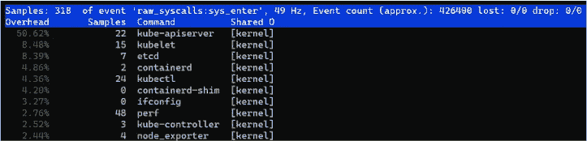
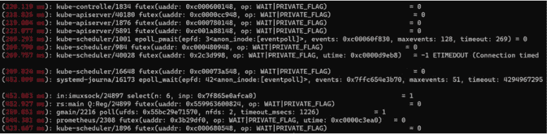
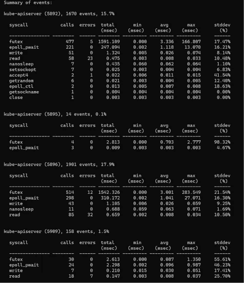
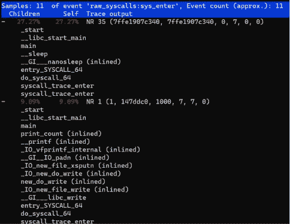
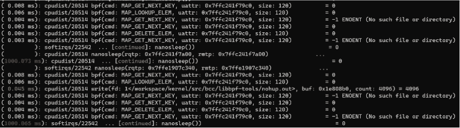
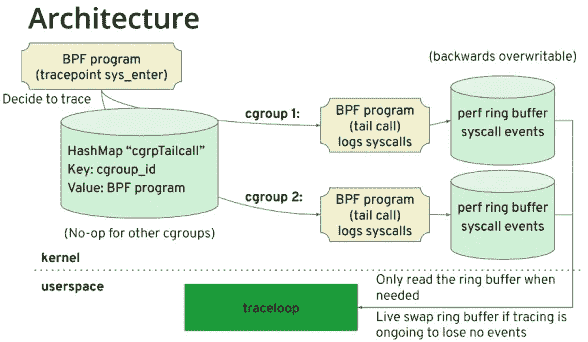
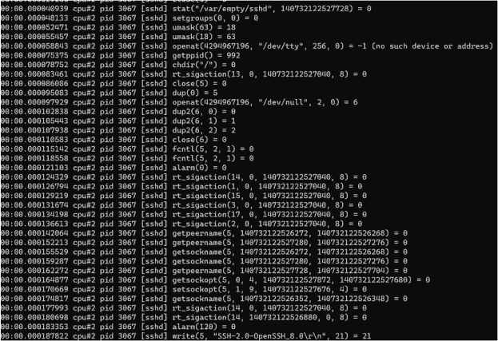
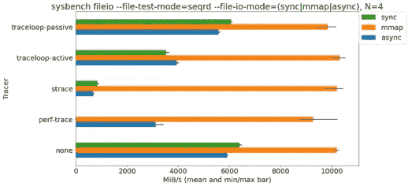

# 如何在对性能影响最小的情况下跟踪生产中的 Linux 系统调用

> 原文：<https://levelup.gitconnected.com/how-to-trace-linux-system-calls-in-production-with-minimal-impact-on-performance-56bcfbe09c4b>

张文波


如果您需要动态跟踪 Linux 进程系统调用，您可能会首先考虑 strace。strace 使用简单，对于诸如“为什么软件不能在这台机器上运行？”这样的问题非常有效然而，如果您在生产环境中运行跟踪，strace 不是一个好的选择。它引入了大量的开销。根据[红帽公司**的高级软件工程师阿纳尔多·卡瓦略·德·梅洛进行的一项性能测试**](http://vger.kernel.org/~acme/perf/linuxdev-br-2018-perf-trace-eBPF/#/4/2)，使用 strace 追踪的流程运行速度慢了 173 倍，这对生产环境来说是灾难性的。

那么，在生产环境中，有什么工具擅长跟踪系统调用吗？答案是肯定的。这篇博文介绍了 perf 和 traceloop，这两个常用的命令行工具，可以帮助您在生产环境中跟踪系统调用。

# perf，一个用于 Linux 的性能分析器

perf 是一个强大的 Linux 分析工具，由 Linux 内核开发人员改进和升级。除了分析性能监控单元(PMU)硬件事件和内核事件等常见功能之外，perf 还具有以下子组件:

*   sched:分析调度程序动作和延迟。
*   时序图:根据工作负载可视化系统行为。
*   c2c:检测虚假共享的可能性。Red Hat 曾经在许多 Linux 应用程序上测试 c2c 原型，并发现了许多错误共享和热点缓存线的情况。
*   trace:跟踪开销可接受的系统调用。对于`dd`命令中指定的工作负载，它的执行速度仅慢 1.36 倍。

让我们看看 perf 的一些常见用法。

*   要查看哪些命令进行了最多的系统调用:

```
perf top -F 49 -e raw_syscalls:sys_enter --sort comm,dso --show-nr-samples
```



系统调用计数

从输出中，您可以看到`kube-apiserver`命令在采样期间有最多的系统调用。

*   查看延迟时间超过特定持续时间的系统调用。在以下示例中，该持续时间为 200 毫秒:

```
perf trace --duration 200
```



系统调用时间超过 200 毫秒

从输出中，您可以看到进程名称、进程 id(PID)、超过 200 毫秒的特定系统调用以及返回值。

*   要查看一段时间内有系统调用的进程及其开销摘要，请执行以下操作:

```
perf trace -p $PID  -s
```



按进程列出的系统调用开销

从输出中，您可以看到每个系统调用的次数、错误的次数、总延迟、平均延迟等等。

*   要分析高延迟呼叫的堆栈信息，请执行以下操作:

```
perf trace record --call-graph dwarf -p $PID -- sleep 10
```



高延迟系统调用的堆栈信息

跟踪一组任务。例如，两个 BPF 工具正在后台运行。要查看它们的系统调用信息，您可以将它们添加到一个`perf_event` cgroup 中，然后执行`per trace`:

```
mkdir /sys/fs/cgroup/perf_event/bpftools/ echo 22542 >> /sys/fs/cgroup/perf_event/bpftools/tasks echo 20514 >> /sys/fs/cgroup/perf_event/bpftools/tasks perf trace -G bpftools -a -- sleep 10
```



跟踪一组任务

这些是 perf 的一些最常见的用法。如果你想了解更多(尤其是关于 perf-trace)，请参见 [Linux 手册页](https://man7.org/linux/man-pages/man1/perf-trace.1.html)。从手册页中，您将了解到 perf-trace 可以基于 PID 或线程 id(tid)过滤任务，但是它不支持容器和 Kubernetes (K8s)环境。别担心。接下来，我们将讨论一个工具，它可以很容易地跟踪容器中和使用 cgroup v2 的 K8s 环境中的系统调用。

# Traceloop，用于 cgroup v2 和 K8s 的性能分析器

Traceloop 为跟踪使用 cgroup v2 的容器或 K8s 环境中的 Linux 系统调用提供了更好的支持。你可能对 traceloop 不熟悉，但对 BPF 编译器集合(BCC)非常了解。(它的前端是用 Python 或者 C++实现的。)在 BCC 的父项目 IO Visor 项目中，还有一个名为 gobpf 的项目，为 BCC 框架提供 Golang 绑定。基于 gobpf，traceloop 是针对容器和 K8s 环境开发的。下图显示了 traceloop 体系结构:



*traceloop 架构*

我们可以将这个例子进一步简化为以下几个关键步骤。请注意，这些步骤是实施细节，而不是要执行的操作:

1.  `bpf helper`获取群组 ID。基于群组 ID 而不是 p ID 和 TID 来过滤任务。
2.  每个 cgroup ID 对应一个 [bpf 尾调用](https://ebpf.io/what-is-ebpf/#tail--function-calls)，它可以调用并执行另一个 eBPF 程序，并替换执行上下文。Syscall 事件通过 bpf 尾调用写入具有相同 cgroup ID 的 perf 环形缓冲区。
3.  用户空间根据这个 cgroup ID 读取 perf 环形缓冲区。

> ***注*** *:*
> 
> *目前只能通过执行* `*bpf helper: bpf_get_current_cgroup_id*` *获得 cgroup ID，该 ID 仅在 cgroup v2 中可用。因此，在使用 traceloop 之前，请确保在您的环境中启用了*[*cgroup v2*](https://www.kernel.org/doc/html/latest/admin-guide/cgroup-v2.html#basic-operations)*。*

在以下演示中(在 CentOS 8 4.18 内核上)，当 traceloop 退出时，系统调用信息被跟踪:

```
sudo -E ./traceloop cgroups --dump-on-exit /sys/fs/cgroup/system.slice/sshd.service
```



*traceloop 跟踪系统调用*

如结果所示，traceloop 输出类似于 strace 或 perf-trace 的输出，除了基于 cgroup 的任务过滤。请注意，CentOS 8 将 cgroup v2 直接挂载在`/sys/fs/cgroup`路径上，而不是像 Ubuntu 那样挂载在`/sys/fs/cgroup/unified`路径上。因此，在使用 traceloop 之前，应该运行`mount -t cgroup2`来确定挂载信息。

traceloop 背后的团队已经将其与 Inspektor Gadget 项目集成，因此您可以使用 kubectl 在 K8s 平台上运行 traceloop。查看 [Inspektor 小工具中的演示——如何使用](https://github.com/kinvolk/inspektor-gadget#how-to-use),如果你喜欢，可以自己尝试一下。

# 跟踪系统调用的基准测试

我们进行了一个 sysbench 测试，其中系统调用要么使用多个跟踪器(traceloop、strace 和 perf-trace)跟踪，要么不跟踪。基准测试结果如下:



*跟踪和未跟踪系统调用的 Sysbench 结果*

如基准测试所示，strace 导致了应用程序性能的最大下降。perf-trace 导致的减少较小，traceloop 导致的减少最小。

# Linux 评测器概述

对于诸如“为什么软件不能在这台机器上运行”这样的问题，strace 仍然是 Linux 中一个强大的系统调用跟踪器。但是要跟踪系统调用的延迟，基于 BPF 的性能跟踪是更好的选择。在使用 cgroup v2 的容器或 K8s 环境中，traceloop 是最容易使用的。

*原载于 2020 年 12 月 24 日*[*www.pingcap.com*](https://pingcap.com/blog/how-to-trace-linux-system-calls-in-production-with-minimal-impact-on-performance#perf-a-performance-profiler-for-linux)