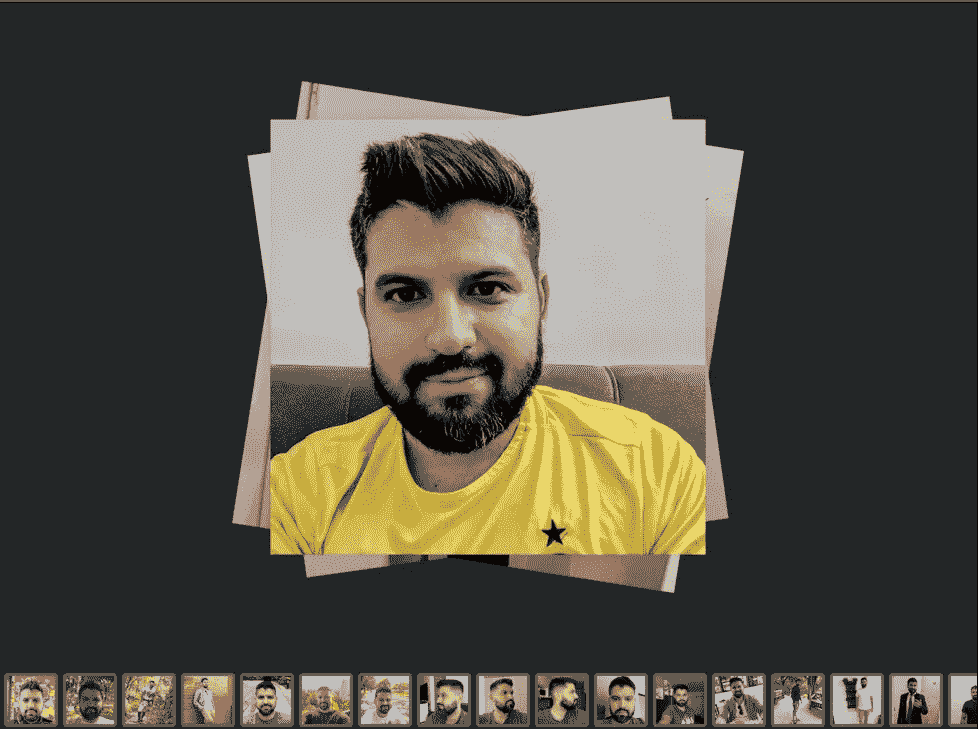

# 如何用你的脸训练 AI 创造新形象

> 原文：<https://levelup.gitconnected.com/how-to-train-ai-with-your-face-3dc586dbd71>

人工智能从 text 2 图像模型 Dreambooth 生成图像

正如你在过去的几个月中可能已经看到的，在人工智能社区中有关于 text2image 模型的炒作。许多人想知道这是否会是视觉艺术家、平面设计师、照片编辑和任何其他有视觉输出的工作的终结。但是，今天我们不会关注任何反乌托邦的未来。今天我想向大家展示一个名为**“dream booth”**的特殊模型，你可以用它来使用文本输入生成你自己的 AI 图像，甚至训练它学习新概念！以下是我用 Dreambooth 为自己制作的一些图片。

用 Dreambooth 文本到图像模型生成的 Erich Hohenstein 的图像

为了更好地理解这个模型是如何工作的…这个模型已经在大型图像数据库上接受了训练，能够**将单词与视觉特征**联系起来。也就是说，理解是什么让草…草或者梵高的绘画风格看起来像什么，或者甚至理解皮克斯电影中人的视觉特征是什么。

然后我们可以通过给它 10 或 15 张图片来使用它，例如你的狗，并重新训练它来学习我们狗的关键视觉特征…看看她的关键视觉特征有多可爱…

一旦我们的个性化模型调整到我们的新概念，我们现在可以要求它被放置在不同的视觉环境中！让我向您展示如何使用这个开源的 text2image 模型！

# 访问令牌

首先，我们需要获得一个访问令牌来运行和训练模型。为此，你需要去 https://huggingface.co/runwayml/stable-diffusion-v1-5[创建一个账户并同意使用条款。](https://huggingface.co/runwayml/stable-diffusion-v1-5)

拥抱面子条款获得 Dreambooth 令牌

拥有帐户后，您需要进入设置→访问令牌→新令牌，然后为您的令牌选择一个名称，选择选项“写入”,您的令牌就准备好了！它看起来会是这样的:HF _ PJRlHvADihqPzYCfwBPpASVInIekJiOvKV

# 培训和微调

现在我们的令牌准备好了，我们将去 **Google Colab** 并使用他们可爱的 GPU 来训练和运行我们的模型。为此，我为你准备了这款基于[shivamshrilao](https://github.com/ShivamShrirao)笔记本的 Google Colab 笔记本。

[https://colab . research . Google . com/drive/1 q3zr 7-KC 2 doh 3r 5 weg 2 z-wgEvBVsPfYp？usp =共享](https://colab.research.google.com/drive/1q3zr7-Kc2DOh3R5weg2z-wgEvBVsPfYp?usp=sharing)

复制一份这个笔记本，让我们开始吧！

## **谷歌 Colab 笔记本**

我们将一个细胞一个细胞地研究，我会试着解释每一步发生了什么。

首先，我们将安装所有的需求

接下来，我们将介绍我们的令牌

介绍 Dreambooth 的拥抱脸令牌

更多安装…

在这个单元格中，我们将为我们的模型选择一个名称。我将把它保留为“我的型号名称”。当我们运行这个单元时，它将请求我们允许访问 Google Drive，因为它将创建一个目录来保存模型。

梦幻小屋[稳定扩散](https://huggingface.co/runwayml/stable-diffusion-v1-5)

这一步很重要，因为一旦我们训练了我们的模型，我们不需要再做一遍，我们可以一遍又一遍地使用它。

运行单元后，如果你去左边的面板，你会看到你的 Google Drive 文件。

如果你向下滚动，你会发现一个名为“稳定扩散权重”的新文件夹，里面会有一个文件夹“我的模型名称”或与你选择的名称。

现在让我们看看下一个单元格，我们将在这里定义我们将教授给模型的“概念”。

Dreambooth 稳定扩散参数

让我们来看看未注释的括号。这段代码有四个重要部分。首先是“instance_prompt”，这是我们如何请求新实例的新图像。第二个是“class_prompt ”,我们可以用它来请求父类的图像，在这个例子中父类是“person”。父类基本上就是我们训练的对象类型。因为我想创建我的图像，所以我将使用“person”类型。第三个是新实例的目录，上面写着“实例数据目录”。这个名字必须是独一无二的，不同于模型之前见过的任何东西。比如:erich_person_concept_008。最后，这里有一个父类目录，名为“class_data_dir”。这个模型已经学会了一个人看起来的关键特征，现在我们要教它一个特定的人看起来是什么样子。如果你看到上面的括号，如果你想训练它学习一只狗的关键特征，这就是你如何设置它。

在运行这个单元之后，您将在左侧的面板上看到一个使用新实例名创建的新文件夹。

在这个文件夹中，我们将上传我们希望我们的模型学习的新概念的图片。如前所述，对于这个例子，我将训练模型来学习我的关键特征。右键单击文件夹并上传您的所有训练图像。

关于训练图像的重要注意事项。

1.  所有图像必须为 512x512 像素。(我使用 Mac 上的“预览”应用程序裁剪正方形，然后将大小调整为 512x512)
2.  提供多种图像。就是不同的背景，不同的角度，不同的闪电。请记住，我们的模型必须了解这些图像之间的共同点，因此，如果我们使用相同的背景，它会认为这是一个关键特征！
3.  对于这个例子，我将被训练使用 person 类来学习我的主要功能。因此，我将使用一套 18 张照片，从不同的角度展示我的脸和身体。记住它是在学习一个人，所以不要只是用你的脸的图片来训练它

为 Dreambooth 文本到图像模型训练 Erich Hohenstein 的图像

在下一个单元格中，我们有不同的训练参数。确保像我们之前使用 instance_prompt 一样设置参数“save_sample_prompt”。对我来说是:

-save _ sample _ prompt = " my _ model _ name 人物照片"

在这里你也可以改变训练步骤，你可以试着用它来得到更好的结果，但是我会让它保持原样。运行此单元开始训练您的自定义模型！(顺便说一下，培训大约需要 30 分钟⏱️)

Dreambooth 稳定扩散参数

下一个单元格是指定我们的模型的权重所在的路径。你可以让它保持黑色，这样它会读取最新的。

Dreambooth 砝码

下面的单元格将把我们的重量转换成 AUTOMATIC1111 的格式。这是一个很好的用户界面，可以与我们的新模型进行交互。关于如何使用，我会单独做一个教程。现在，我们将在这台笔记本上使用我们的模型。

自动化 1111 用户界面转换

接下来的两个单元格将读取我们的新权重，并为可重复性设置一个随机种子。

# 生成图像

最后，我们到了这个项目有趣的部分:用 Dreambooth 生成新的自定义图像。您可以在这里输入文字提示来生成新图像。记得提到你的自定义提示，这样它会为它生成图像。

插入提示文本以生成新图像

这里有一些社区测试过的提示例子，你可以试试！

**穿着西装的模特**优雅的近距离肖像 **my_model_name** 穿着定制西装的人——未来派风格、复杂的巴洛克细节、优雅、发光的灯光、高度细节、数字绘画、艺术站、概念艺术、平滑、清晰的焦点、插图、wlop、mars ravelo 和 greg rutkowski 的艺术作品

**幻想展示**我的模型名称的高度详细的肖像，斯蒂芬·布利斯，虚幻引擎，幻想艺术由格雷戈·鲁特考斯基，卢瓦什，rhads，费迪南·克纳布，新海诚和路易斯·范·巴尔勒，伊利亚·库夫什诺夫，罗斯德鲁，汤姆·巴格肖，阿方斯·木叉，全球照明，辐射光，详细而复杂的环境

**你自己的 funko pop** 一首 funko pop of**my _ model _ name**

**你的皮克斯角色**非常详细的剧照**我的模型名称**作为皮克斯电影 3d 角色，renderman 引擎

这里有一个很酷的网站，有更多的提示需要测试:[https://lexica.art/](https://lexica.art/)

使用 Dreambooth 稳定扩散-v1–5 生成的图像

# 最终意见

我只是惊奇地发现，我们今天拥有这项技术，我想与你们分享它。如果你发现人脸看起来不太好，试着添加更多不同角度和背景的训练图像。

此外，如果你发现任何酷的提示或生成一个酷的图像，请在评论中分享！