# 如何使用 AWS 训练任何机器学习模型！

> 原文：<https://levelup.gitconnected.com/how-to-train-any-machine-learning-model-using-aws-7f57a06a7be6>

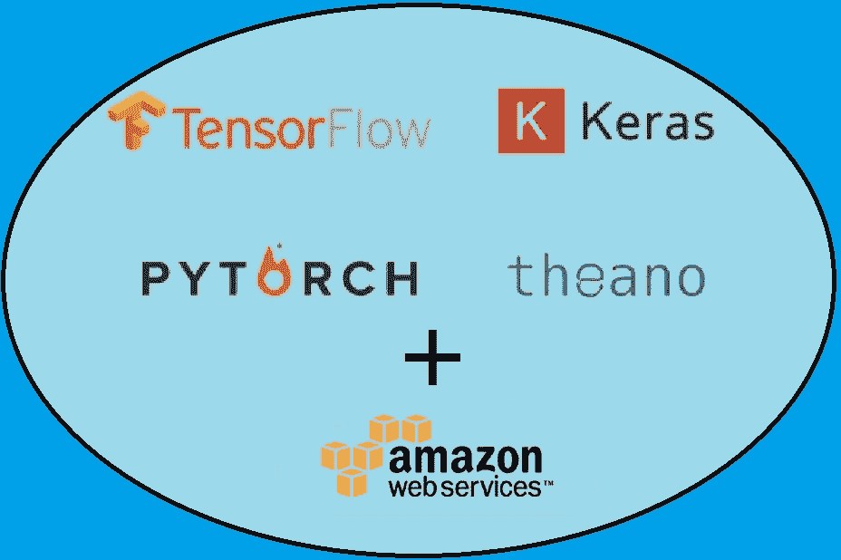

# 介绍

让我创建一个场景:您刚刚使用 Keras 键入了几百行 Python 代码，解决了一些机器学习问题。您已经收集了所有的数据，进行了预处理，设计了模型结构，并评估了模型。但是，有一步你**没有**做:点击运行。完成这最后一步后，你有**三个**选项:

a.)在您古老的、*超级*慢速 2010 戴尔 Inspiron 灵越 15R 上运行该模型

b.)使用从百思买(Best Buy)购买的 700 美元的 NVIDIA GPU 运行你的模型

c.)在云服务的 GPU 实例上运行该模型，花费不到 700 美元

两年前，我会选择选项 a。然而，在了解了 AWS 和微软 Azure 等云服务的奇迹之后，我会说我目前的选择是选项“c”。

来自云服务的 GPU 实例非常有用，因为人们可以根据需要轻松地扩大和缩小规模。这对于书面期限或较大的一次性项目非常有用。您还可以使用目前世界上最好的 GPU。不过我最喜欢的好处是，训练的时候不用用笔记本电脑的 GPU，不用听我*很*吵的笔记本风扇。

在所有的云服务中，我认为最好的是 AWS，因为它可以根据您的需求提供多种选择，并且价格相对合理。在本教程中，我将重点介绍 AWS，并解释以下过程:

*   如何在 AWS 上创建 GPU 实例
*   如何设置你的 GPU 实例
*   如何将代码和数据移动到 GPU 实例中
*   如何使用您的 GPU 实例进行训练
*   如何在您的 GPU 实例上保存和访问训练好的模型

# 先决条件

您将需要以下内容:

1.  你的机器学习问题的完整代码，用 Python 写的。我将用 Tensorflow 后端使用 Keras 编码，但你可以使用任何你想要的机器学习 API。
2.  SSH(安全外壳)
3.  AWS 帐户
4.  积极的态度😊

# 在 AWS 上创建 GPU 实例

运行机器学习模型的第一步是在 AWS 上创建 EC2 实例。转到 AWS 上的 EC2 仪表板，并单击“启动实例”第一步是选择一个亚马逊机器映像。搜索“深度学习 AMI(亚马逊 Linux)。”

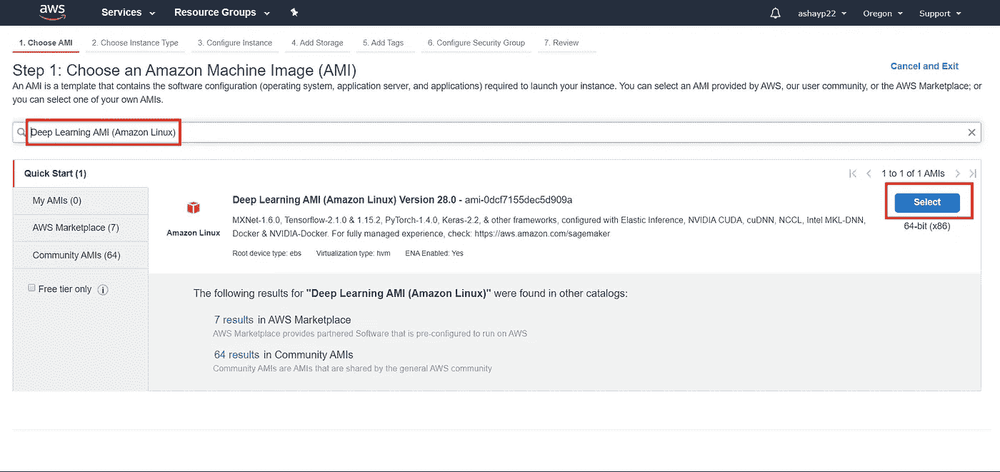

选择出现的第一个选项，并进入步骤 2:选择一个实例类型。AWS 为您提供了各种各样的 vCPUs、内存、实例存储和其他计算功能。如果您正在测试一个不需要繁重工作的基本机器学习模型，请选择自由层(t2.micro)或一些较小的实例。如果您需要计算能力，请选择 g2 和 g3 实例或 p2 和 p3 实例，它们是指定的 GPU 实例。p3 实例更新更快，但它们的价格大约是每小时 3 美元。我建议从更便宜的选项开始，以便习惯 AWS。如果你想了解更多关于价格的细节，请点击以下链接:

 [## 深度学习 AMI(亚马逊 Linux)

### AWS 深度学习 AMI 是专为构建、培训、调试和服务于深度学习模型而构建和优化的…

aws.amazon.com](https://aws.amazon.com/marketplace/pp/Amazon-Web-Services-Deep-Learning-AMI-Amazon-Linux/B077GF11NF#pdp-pricing) 

因为我运行的模型需要超过 1gb 的内存，所以我将选择“p3.2xlarge”实例。选择实例，然后单击“查看并启动”

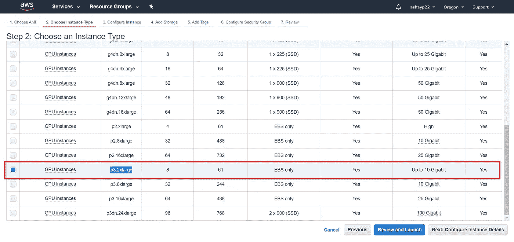

在单击“启动”之前，请查看 AMI 详细信息，以确保该实例可以运行您的机器学习模型。仔细检查后，点击“启动”

在 AWS 允许您创建实例之前，您必须创建一个新的密钥对或者使用一个现有的密钥对。根据 AWS:

*"一个密钥对由 AWS 存储的* ***公钥*** *和自己存储的* ***私钥文件*** *组成。它们一起允许您安全地连接到您的实例。对于 Windows AMIs，需要私钥文件来获取用于登录实例的密码。对于 Linux AMIs，私钥文件允许您安全地 SSH 到您的实例。”*

确保您没有删除或丢失您的密钥对，因为您将无法下载新的密钥对。如果您丢失了密钥对，那么您将无法访问您的实例。我将创建一个新的密钥对，但是如果您愿意，也可以使用现有的密钥对。

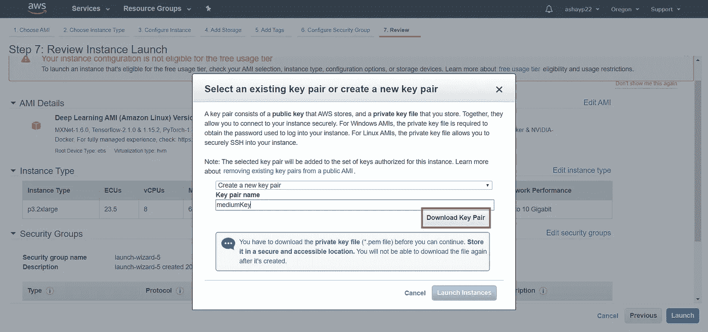

下载密钥对，然后启动实例。实例初始化可能需要 2 秒到 1 小时的时间，但是一旦初始化完成，您就完成了步骤 1😀！

# 连接到您的 GPU 实例

下一步是连接到您的 GPU 实例。但是，在此之前，我们必须限制对您的密钥对文件的访问权限。这个**重要的**步骤对于 Mac 用户来说很简单，但是对于 Windows 用户来说却很复杂。

## 苹果个人计算机

*   打开终端，将目录切换到您下载密钥对的位置
*   键入以下内容。确保将“keras-aws-keypair”更改为您的 keypair 的名称。

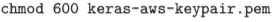

**窗户**

*   在文件资源管理器中找到密钥对(很可能在下载中)。
*   右键单击密钥对并选择“属性”
*   选择安全性，然后选择“高级”

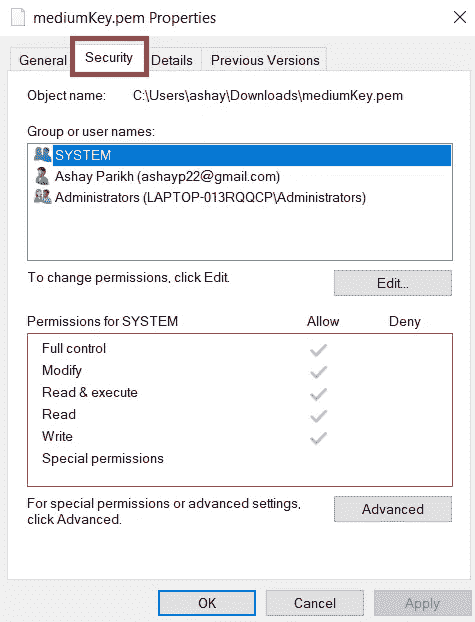

*   让自己成为主人。

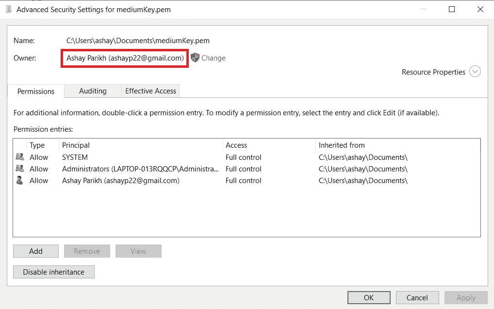

*   这应该足够了，但是如果您得到一个错误消息,“‘私钥’的权限太开放，请执行下面的步骤:
*   禁用继承并删除除您自己的权限之外的所有权限。

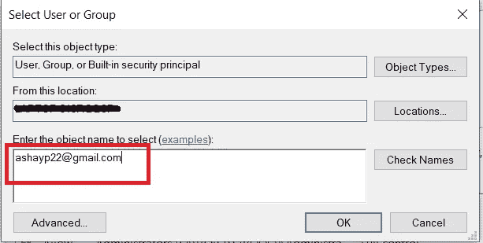

*   授予自己“完全控制权”并保存权限。现在 SSH 不会抱怨文件权限太开放了。

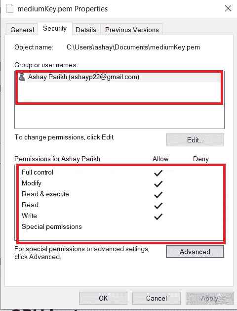

在这之后，您应该准备好连接到您的实例。下一步是**重要的:**把你的密钥对转移到一个保存目录，这个目录也包含你的机器学习代码。在我的例子中，我把我的密钥对和我所有的代码移到了一个目录中。

然后，打开终端或命令提示符，将目录更改为您移动密钥对的位置。返回 AWS 网站，选择页面顶部的“连接”。接下来，复制底部的 ssh 行。

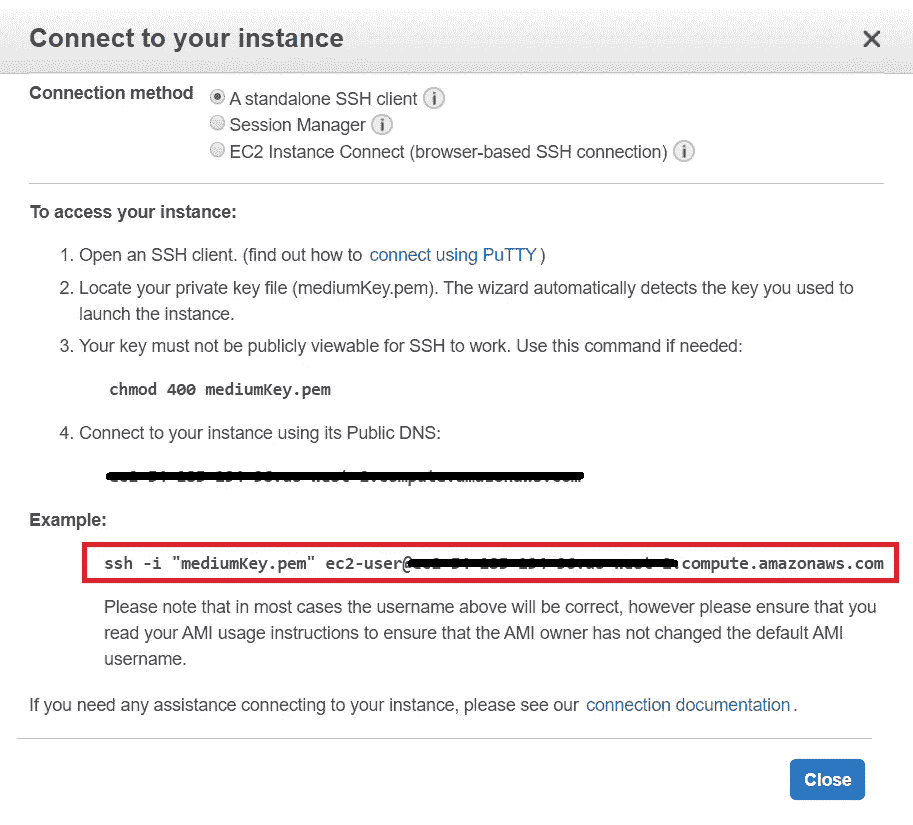

将该行粘贴到您的命令行中(*注意:该命令会不时更改，因此在连接到您的实例*时，请始终参考 AWS 网站。选择“是”后，您的屏幕应该如下所示:

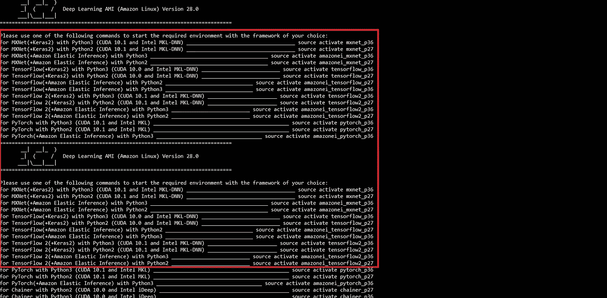

现在，你已经**完成了第二步的**😀！

# 将项目内容移动到 GPU 实例

第 3 步是将项目内容移动到 GPU 实例中。这可能涉及到移动你的代码、数据集以及运行你的程序所需要的任何东西。但是，在这样做之前，您需要指定您将使用哪个环境。有很多选择，从 *MXNet(+Keras2)带 Python3* 到 *TensorFlow(+Keras2)带 Python3 (CUDA 10.0 和英特尔 MKL-DNN)。*我将在 Python3 (CUDA 10.0 和英特尔 MKL-DNN)上使用 TensorFlow(+Keras2)，因此我将在它的右侧键入命令。

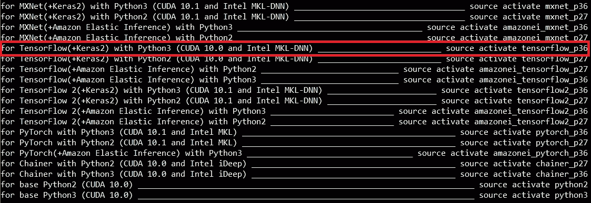

同样，你**不需要**移动任何 python 库。相反，通过命令行使用 pip 命令安装它们。

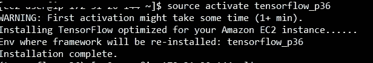

一旦安装完所需的依赖项，就该移动项目了。执行以下命令:

*   键入“mkdir model”创建一个名为“model”的新目录
*   键入“ls model”打开目录
*   键入“mkdir data”为数据集创建一个目录

然后，通过键入“exit”退出 AWS 实例，然后按照下面的示例移动项目内容:

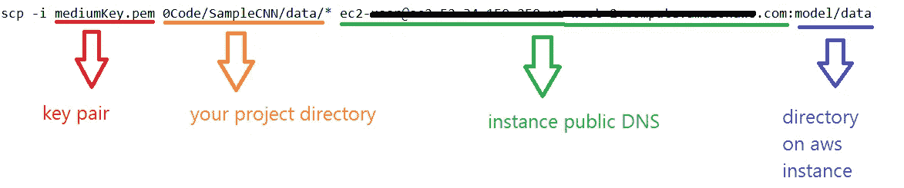

这里有一个例子:

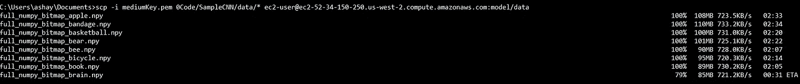

移动我的数据集

完成代码移动后，再次键入 ssh 命令以确保项目内容已经被移动。现在，你已经完成了第三步的所有工作😀！

# 使用您的 GPU 实例进行培训

第 4 步是最简单的部分。你要做的就是连接到 GPU 实例，输入运行你的机器学习模型的命令(别忘了激活环境)。

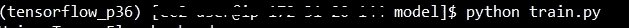

然后，只需观察实例快速运行您的模型*。*

*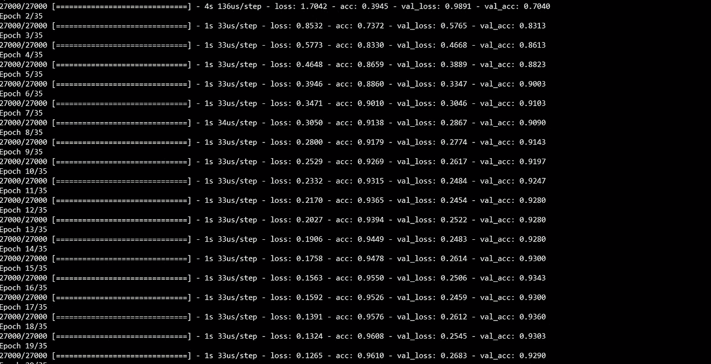*

*在此之后，您只需访问经过训练的模型，并将其移动到您的本地计算机上。您已经完成了第 4 步的所有工作😀！*

# *在 GPU 实例上保存和访问训练模型*

*最后一步是将训练好的模型传输到您的本地计算机。确保您在训练后保存了您的模型，无论是. yaml 文件、. hdf5 文件等。*

*然后，按照下面的例子:*

*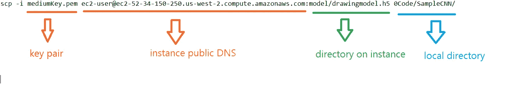*

*在这之后，你就完成了第五步😀！您可以在本地计算机上运行训练好的模型，或者在应用程序中使用它。*

# *结论*

*至此，你已经在 AWS 上成功训练了一个机器学习模型。这不仅节省了成本和时间，而且培训不再给本地机器带来负担。但是，这并不意味着你的 AWS + ML 之旅结束了。你还有更多事情要做:*

## *使用 AWS 进行机器学习的技巧*

*   *仅当您移动文件或使用实例时，保持实例打开。你可能会感到惊讶，但每小时 3 美元的成本会很快增加。*
*   *始终参考 AWS 实例仪表板来获取实例的公共 DNS。不要把名字保存在某个地方，因为它经常改变。*
*   *记得你把你的钥匙放在哪里。*
*   *在运行之前，确保您的代码没有错误。*
*   *确保在 AWS 实例上设置了正确的环境和库。*

## *下一步是什么？*

*到目前为止，你所做的只是在 AWS 上训练了一个机器学习模型。但是你可以通过使用 Amazon SageMaker 开发、培训和部署你的机器学习模型来走得更远，这是一个来自 AWS 的完全管理的机器学习解决方案。请参考以下资源获取入门提示:*

*   *[https://towards data science . com/introducing-Amazon-sage maker-8061 d0 fc 476d](https://towardsdatascience.com/introducing-amazon-sagemaker-8061d0fc476d)*
*   *[https://hacker noon . com/should-I-use-Amazon-sage maker-for-deep-learning-DC 4 AE 6b 98 fab](https://hackernoon.com/should-i-use-amazon-sagemaker-for-deep-learning-dc4ae6b98fab)*

*感谢你把这篇文章看完！我真的很高兴找到像我一样对计算机科学充满热情的人。*

*确保**喜欢** / **分享**这篇文章😁，并评论你的阅读体验！*