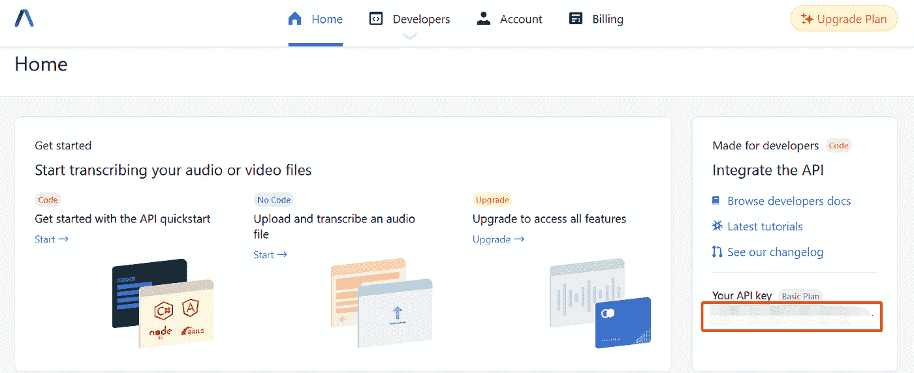

# 如何将音频文件转录为文本

> 原文：<https://levelup.gitconnected.com/how-to-transcribe-audio-files-to-text-1ed7cf6d8c08>

用于语音识别的替代 API


由[凯利·西克玛](https://unsplash.com/@kellysikkema?utm_source=unsplash&utm_medium=referral&utm_content=creditCopyText)在 [Unsplash](https://unsplash.com/s/photos/music-wave?utm_source=unsplash&utm_medium=referral&utm_content=creditCopyText) 上拍摄的照片

今天的主题是关于以编程的方式将录音转录成文本。随着机器学习的进步，现在可以处理人类的语音并将其转换为文本。因此，自动语音识别(ASR)领域已经成为近年来最热门的话题之一，并且日益呈指数级增长。

[ASR](https://www.assemblyai.com/blog/what-is-asr/) 通常被公司用于以下下游任务:

*   **虚拟会议** —转录演讲者的讲话，以更好地传达信息
*   **电话** —转录来自电信服务的音频记录，以自动响应或更好地了解潜在的对话
*   **视频平台** —为视频生成字幕

在本教程中，您将学习使用 AssemblyAI 提供的[语音转文本 API 转录本地音频文件。我特意选择了这个 API，原因如下:](https://www.assemblyai.com/)

*   已经有很多关于谷歌语音转文本和 AWS 转录的文章。
*   它提供了许多非常有用的特性。例如，说话人二进制化、自定义词汇和话题检测。
*   官方文档包含 Node.js、Python、PHP、Ruby 和 C#的示例代码。本教程重点介绍 Python 编程语言。

让我们继续下一部分，开始安装必要的模块。

# 设置

强烈建议您在继续之前创建一个新的虚拟环境。默认情况下，您应该已经安装了`requests`包。如果不是这样，请运行以下命令进行安装:

```
pip install requests
```

在此注册一个[新的免费试用账户，并获得相应的 API 密钥。试用帐户每月有 3 小时的转录。](https://app.assemblyai.com/signup)



作者图片

复制 API 键，因为稍后调用 API 时会用到它。

# 履行

通常，整个转录过程分为 3 个部分:

*   将本地音频文件上传到服务器，以便可以通过 URL 访问。
*   调用转录 API (POST call)开始处理文件。
*   调用脚本 API (GET call)来获取状态。一旦完成，它将包含转录文本。

## 上传本地文件(可选)

如果您的音频文件位于可以通过 URL 访问的任何存储位置(S3 桶、服务器上的静态文件等)，您可以跳过这一步。此步骤的目的是将您的本地录音上传到 AssemblyAI 提供的存储空间。请放心，所有上传的文件转录后会立即删除。

创建一个名为`upload_file.py`的新 Python 文件，并添加以下代码:

相应地更换`filename`和`api_key`变量。另外，请注意，我已经创建了一个生成器函数来分块读取数据。这主要是因为您需要通过分块传输编码将数据传输到 API。

在终端上通过以下命令运行该文件:

```
python upload_file.py
```

然后，简单地用 requests.post 函数正常调用 API。您应该获得如下 JSON 响应:

```
{“upload_url”: “https://cdn.assemblyai.com/upload/ccbbbfaf-f319-4455-9556-272d48faaf7f"}
```

`upload_url`的值代表你的音频文件的 URL。

## 转录(后期)

完成后，让我们创建另一个名为`transcribe.py`的 Python 文件。在实际用例中，您可以将所有代码组合在一个文件中。

在其中追加以下代码:

其结构与上一节类似，但是这次我们将 json 数据发送到脚本 API。它接受几个参数，但最重要的是`audio_url`。欲了解更多信息，请查看[官方 API 文档](https://docs.assemblyai.com/api-ref/v2-transcript)。

在终端上运行以下命令:

```
python transcribe_file.py
```

您应该得到以下输出:

```
{“id”: “ccbbbfaf-f319–4455–9556–272d48faaf7f”, “language_model”: “assemblyai_default”, “acoustic_model”: “assemblyai_default”, “language_code”: “en_us”, “status”: “queued”, “audio_url”: “https://cdn.assemblyai.com/upload/968fe71b-0bba-45bd-aa7a-7084f5c1fadd", “text”: null, “words”: null, “utterances”: null, “confidence”: null, “audio_duration”: null, “punctuate”: true, “format_text”: true, “dual_channel”: null, “webhook_url”: null, “webhook_status_code”: null, “speed_boost”: false, “auto_highlights_result”: null, “auto_highlights”: false, “audio_start_from”: null, “audio_end_at”: null, “word_boost”: [], “boost_param”: null, “filter_profanity”: false, “redact_pii”: false, “redact_pii_audio”: false, “redact_pii_audio_quality”: null, “redact_pii_policies”: null, “redact_pii_sub”: null, “speaker_labels”: false, “content_safety”: false, “iab_categories”: false, “content_safety_labels”: {}, “iab_categories_result”: {}, “disfluencies”: false, “sentiment_analysis”: false, “sentiment_analysis_results”: null, “auto_chapters”: false, “chapters”: null, “entity_detection”: false, “entities”: null}
```

不要被返回的 JSON 中的键的数量吓到。这些仅仅是与 API 相关的信息，因为它支持相当多的特性。你应该得到

```
status: “queued”
```

如果遇到错误，I 表示转录由于以下原因之一而失败:

*   不支持的音频文件格式
*   音频文件不包含音频数据
*   音频文件太短(< 200 毫秒)
*   无法访问音频文件的 URL
*   API 端的错误

## 转录(获取)

现在，您需要再次调用 GET API 来检查该过程是否已经完成。创建另一个名为`result.py`的文件，并添加以下代码:

在终端上运行以下命令:

```
python result.py
```

一旦转录完成，它将返回比 POST API 更多的输出。通常，最重要的结果是状态键，它是下列值之一:

*   `queued`:音频文件正在后台排队，即将处理。
*   `processing`:系统正在转录音频文件
*   `completed`:转录已完成
*   `error`:转录音频文件时出错

根据音频的长度，转录可能需要几秒到 10 分钟的时间。一旦转录完成，您应该得到以下附加输出:

到目前为止，您应该已经掌握了根据您的用例在应用程序中使用语音到文本输出的基本概念。

# 结论

让我们回顾一下你今天所学的内容。

本文首先简要介绍了自动语音识别及其使用案例。

然后，介绍了在本地录音中使用 AssemblyAI 提供的语音到文本 API 所需的步骤。首先，您需要上传文件以获得可访问的 URL。随后，调用脚本 API (POST)并等待一段时间。最后，调用脚本 API (GET)来获得结果。

感谢你阅读这篇文章。祝你有美好的一天！

# 参考

1.  [什么是 ASR？](https://www.assemblyai.com/blog/what-is-asr/)
2.  [如何选择语音转文本 API](https://www.assemblyai.com/blog/how-to-choose-the-best-speech-to-text-api-for-your-product/)
3.  [AssemblyAI —上传文件进行转录](https://docs.assemblyai.com/overview/uploading-audio-files-for-transcription)