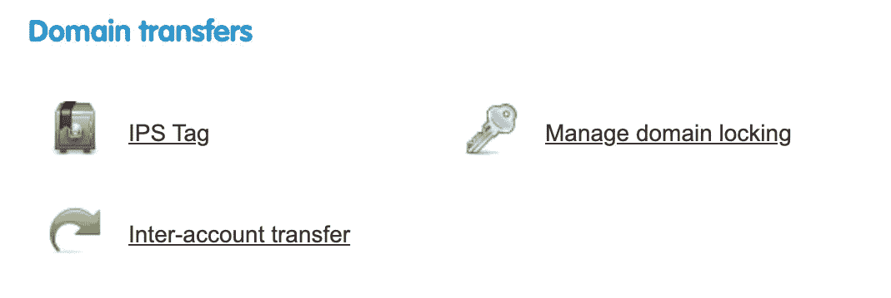
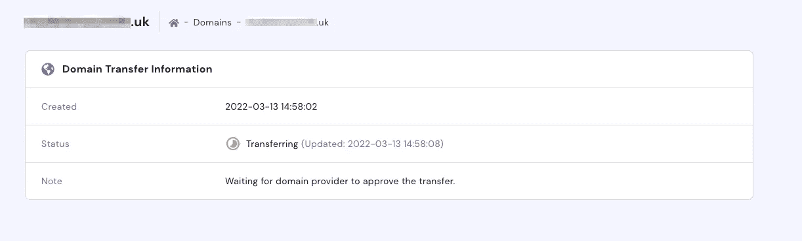
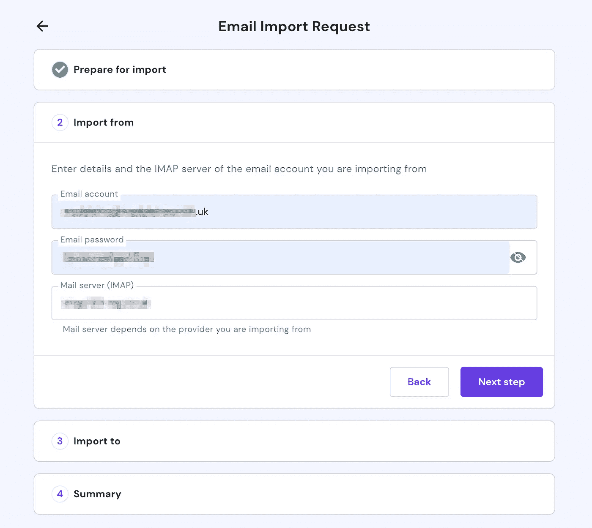

# 如何将英国域名转让给不同的注册商

> 原文：<https://levelup.gitconnected.com/how-to-transfer-a-uk-domain-name-to-a-different-registrar-a4fe5651b497>

为你祈祷吧，🫰

在过去的几个月里，我决定将我的英国域名和电子邮件托管从 **123 Reg** 转移到 **Hostinger** 。本质上，我已经厌倦了看着一个看起来多年没有更新过的用户界面……想要找到更好的东西。这篇文章是写给任何想把一个英国域名(例如. co.uk，. org.uk，. net.uk…)转让给另一个提供商的人的。

# 转移域流

为了转移我的域名，我经历了 Hostinger 的[转移域名流程](https://www.hostinger.co.uk/domain-transfer)。我想每个供应商都会有非常相似的东西。

在这个流程中，我相信他们问我是否想改变与我的域名相关的域名服务器。我说“是”，但经过反思，我认为我应该说“不是”——因为我在 Netlify 上托管我的网站，并希望继续这样做。

霍斯汀格收了我 2.5 美元，因为我很乐意把我的域名转让给他们。虽然对一些提供商来说，我相信这是免费的。

# 更改 IPS 标签

一旦我完成了它们的流程，我就进入我当前的注册商，将我的域的 IPS 标记(也称为注册商标记)更改为新注册商的标记。要将一个域切换到 Hostinger，这个标签的值必须是`REGISTRAR-EU`——尽管这对于每个提供者来说是不同的。

举个例子:每个英国域名都有一个 IPS 标签。此标签标识控制该域的注册商，并防止该域从所有者手中转移出去。这是因为只有当前的 tagholder 或 Nominet(管理英国域名的组织)可以改变这个值。

在 123 Reg 的管理工具中更改域的 IPS 标记的部分

一旦我改变了 IPS 标签的值，大约需要 48 小时来更新(你可以在这里查看一个域的状态)。在此之前，Hostinger 会显示消息“等待域提供商批准转让”:

# 重新添加 DNS 记录

一旦域名成功转让给新的提供商，如果您的网站已经托管在其他地方，则可能需要重新添加一些以前的 DNS 记录。我的网站托管在 Netlify 上，所以我不得不添加回一个 A 和 CNAME 记录——在我的“[如何为 Netlify 托管的网站分配自定义域名](https://www.madeleinesmith.uk/blog/assign-custom-domain-netlify-site/)”博文中有详细描述。

# 将电子邮件托管和导入电子邮件转移到不同的提供商

要将电子邮件托管转移到不同的提供商，必须先通过新提供商购买电子邮件托管。
完成此步骤后，在您的新提供商中创建了目标电子邮件帐户，您可以使用导入工具将所有电子邮件从源电子邮件帐户导入到目标帐户。在 Hostinger 中，该工具位于“管理电子邮件”部分:

Hostinger 中的“导入电子邮件”工具

此导入工具需要源电子邮件帐户的电子邮件地址和密码。它还需要来自源提供商的接收邮件服务器/IMAP 服务器。这通常从`imap.xxxxxxxxx`开始

一旦此流程完成，您的电子邮件提供商应该会显示您的导入请求的状态，并且您的目标电子邮件地址将很快被以前的电子邮件地址填充。

*你的项目需要后端工程师吗？* [*取得联系*](https://www.madeleinesmith.uk/contact/) *雇佣我做合同工💯*

*最初发布于*[*https://www . madeleinesmith . uk*](https://www.madeleinesmith.uk/blog/transferring-uk-domains/)*。*