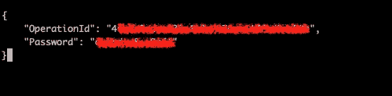
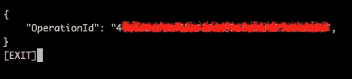

# 如何将域名从一个 AWS 帐户转移到另一个 AWS 帐户

> 原文：<https://levelup.gitconnected.com/how-to-transfer-domain-from-one-aws-account-to-another-aws-account-e055e5bd68d3>


您可以免费将域从一个 AWS 帐户转移到另一个 AWS 帐户。转让不影响域名注册的续展日期或联系信息。

# 这是一个 4 步的过程

1.  确认您使用的是最新版本的 AWS CLI。更多信息，请参见[安装 AWS CLI](https://docs.aws.amazon.com/cli/latest/userguide/cli-chap-install.html) 。
2.  确认您拥有以下[所需的 IAM 用户权限](https://docs.aws.amazon.com/Route53/latest/DeveloperGuide/r53-api-permissions-ref.html#required-permissions-domain-registrations)来执行传输:
    路由 53 域:transferdominatoanotherawsacount
    路由 53 域:rejectdomainsferromanotherawsaccount
    路由 53 域:canceldomaintransferotherawsaccount
    路由 53 域:acceptdomaintransferromanotherawsaccount
3.  使用[transfer-domain-to-another-AWS-Account](https://docs.aws.amazon.com/cli/latest/reference/route53domains/transfer-domain-to-another-aws-account.html)API 将域(例如，“example.com”)从帐户 A 转移到帐户 B。
4.  帐户 B 必须使用[accept-domain-transfer-from-another-AWS-account](https://docs.aws.amazon.com/cli/latest/reference/route53domains/accept-domain-transfer-from-another-aws-account.html)API 接受域的转移。账户 B 接受转账后，可以从账户 B 管理域
    注意:如果账户 B 三天内不接受转账，转账请求取消。

# 步骤 1:安装或更新至 awscli 的最新版本

对于 Linux

```
curl "[https://awscli.amazonaws.com/awscli-exe-linux-x86_64.zip](https://awscli.amazonaws.com/awscli-exe-linux-x86_64.zip)" -o "awscliv2.zip"
unzip awscliv2.zip
sudo ./aws/install
```

对于带有自制软件的 MacOs

```
brew install awscli
```

# 步骤 2:确保您拥有[所需的 IAM 用户权限](https://docs.aws.amazon.com/Route53/latest/DeveloperGuide/r53-api-permissions-ref.html#required-permissions-domain-registrations)

*   route 53 domain:transferdomaintoanotherawsacount
*   route 53 domain:rejectdomaintransferromanotherawsaccount
*   route 53 domain:canceldomaintransfertoanotherawsacount
*   route 53 domain:acceptdomaintransferromanotherawsaccount

# 步骤 3:发送转账请求

该命令将启动传输

```
aws route53domains transfer-domain-to-another-aws-account --domain-name <value> --account-id <value>
```

注:如果您希望在目标帐户接受转账之前取消请求，您可以使用

```
aws route53domains cancel-domain-transfer-to-another-aws-account
--domain-name <value>
```

你将得到这个输出，现在把密码保存在一个安全的地方。



# 第四步:接受转移

接受从另一个 AWS 帐户到当前 AWS 帐户的域转移。

```
aws route53domains accept-domain-transfer-from-another-aws-account
--domain-name <value>
--password <value>
```



> *托管区域不会被转移，因为您必须手动进行转移*