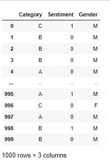
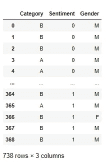
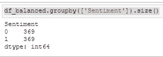
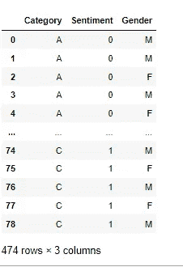
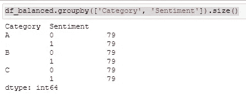
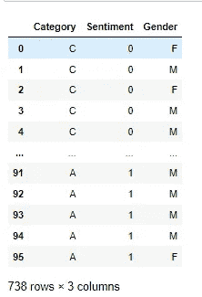
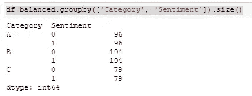

# 如何将不平衡的数据集转换为平衡的数据集

> 原文：<https://levelup.gitconnected.com/how-to-transform-an-unbalanced-dataset-to-a-balanced-cd361842eb11>

## 用 Python 创建平衡数据集的有效方法


Unsplash 上的图像

[](https://jorgepit-14189.medium.com/membership) [## 用我的推荐链接加入媒体-乔治皮皮斯

### 阅读乔治·皮皮斯(以及媒体上成千上万的其他作家)的每一个故事。您的会员费直接支持…

jorgepit-14189.medium.com](https://jorgepit-14189.medium.com/membership) 

我们提供了一些例子，说明如何在 Python 中按组对数据进行重采样，以及如何在 R 中按组进行 T2 欠采样。在本帖中，我们将为您提供一种高效的方法，通过考虑多个变量来创建平衡的数据集。让我们从创建具有以下特征的“不平衡”数据集开始:

*   1000 次观察
*   **类别**栏为“A”、“B”、“C”等 3 个级别，分别为 30%、50%和 20%。
*   **情绪**栏的 2 个级别如“0”和“1”分别占 35%和 65%。
*   **性别**栏中的 2 级如“M”和“F”分别占 70%和 30%。

```
df = pd.DataFrame({'Category': np.random.choice(['A','B','C'], size=1000, replace=True, p=[0.3, 0.5, 0.2]),
                   'Sentiment': np.random.choice([0,1], size=1000, replace=True, p=[0.35, 0.65]),
                   'Gender': np.random.choice(['M','F'], size=1000, replace=True, p=[0.70, 0.30])})df
```



# 基于情感创建一个平衡的数据集

假设我们想要一个积极情绪和消极情绪一样多的新数据集。让我们看看如何轻松实现这一点。

```
df_grouped_by = df.groupby(['Sentiment'])df_balanced = df_grouped_by.apply(lambda x: x.sample(df_grouped_by.size().min()).reset_index(drop=True))df_balanced = df_balanced.droplevel(['Sentiment'])
df_balanced
```



让我们验证数据集是平衡的。

```
df_balanced.groupby(['Sentiment']).size()
```



# 基于类别和情感创建一个平衡的数据集

假设我们想通过考虑类别和情感来创建一个平衡的数据集。

```
df_grouped_by = df.groupby(['Category', 'Sentiment'])df_balanced = df_grouped_by.apply(lambda x: x.sample(df_grouped_by.size().min()).reset_index(drop=True))df_balanced = df_balanced.droplevel(['Category', 'Sentiment'])
df_balanced
```



让我们验证数据集是平衡的。

```
df_balanced.groupby(['Category', 'Sentiment']).size()
```



# 基于每个类别中的情感创建一个平衡的数据集

让我们说，我们希望在每个类别中，情感类是平衡的。我们可以这样做:

```
df_balanced = pd.DataFrame()for i in df.Category.unique():
    df_grouped_by = df.loc[df.Category==i].groupby(['Sentiment'])
    tmp = df_grouped_by.apply(lambda x: x.sample(df_grouped_by.size().min()).reset_index(drop=True))
    df_balanced = pd.concat([df_balanced, tmp])

df_balanced = df_balanced.droplevel(['Sentiment'])df_balanced
```



让我们确认一下，我们在每个类别中都得到了一个平衡的情感数据集。

```
df_balanced.groupby(['Category', 'Sentiment']).size()
```



# 外卖

在许多数据科学管道中，需要应用欠采样技术，以处理不平衡类和特征的偏差。在本教程中，我们为您提供了一种高效的方法，让您可以用几行代码创建平衡的数据集。

最初发布于[预测黑客](https://predictivehacks.com/how-to-transform-an-unbalanced-dataset-to-a-balanced/)