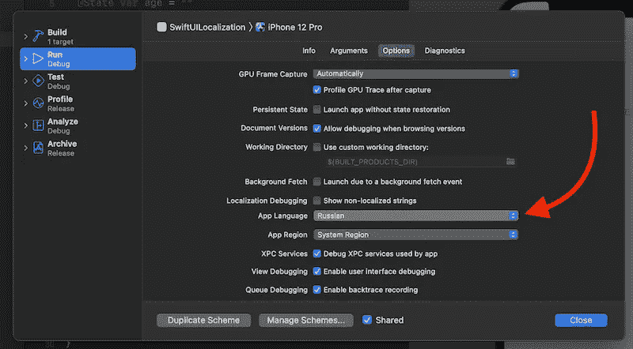

# 如何翻译 SwiftUI 应用程序

> 原文：<https://levelup.gitconnected.com/how-to-translate-swiftui-applications-c1726dbded3f>

本地化我们的应用程序比我们想象的更重要。我们通常坚持把英语作为主要语言。世界上 78 亿居民中只有 4.9%说英语。大多数人的母语不是英语。总的来说，只有 3.6 亿人把英语作为他们的第一语言。


Amy Humphries 在 [Unsplash](https://unsplash.com/?utm_source=medium&utm_medium=referral) 上拍摄的照片。

SwiftUI 为我们提供了出色且易于使用的选项，可以将我们的应用程序翻译成多种语言。我们可能都熟悉存放所有翻译的`Localizable.strings`文件。我不打算为您的项目创建这个。

此外，Xcode 可以选择更改构建设置和默认语言，而无需更改系统语言本身。



在本文中，我们将讨论如何通过检查内置功能来翻译我们的 SwiftUI 应用程序。我们还将看到如何翻译动态变化的文本。

# 文本方法

几乎所有的 SwiftUI 构建块，像`Text`、`Button`、`TextField`等等，都带有在幕后使用本地化的初始化器。

例如，假设我们创建了一个标题为`Name`的`Text`视图。我们可以把它添加到`Localizable.strings`文件中，这样我们什么都不用做就能翻译出来。如果没有提供翻译，它将回到指定的默认标题。我们可以说 SwiftUI 负责翻译我们的应用程序，而不需要我们做额外的工作。

让我们更深入一点，检查一下`Text`初始化器。

```
init(_ key: LocalizedStringKey, tableName: String? = nil, bundle: Bundle? = nil, comment: StaticString? = nil)
```

我们可以看到第一个参数是`LocalizedStringKey`。让我们来探索一下。

# 什么是 LocalizedStringKey？

`LocalizedStringKey`是为我们 SwiftUI 应用中的所有翻译提供动力的魔法。它所做的是在`Localizable.strings`文件中查找并检查是否有这个键的翻译。它符合`ExpressibleByStringLiteral`，这就是为什么我们可以在 SwiftUI 视图初始化器中使用它。

使用`LocalizedStringKey`的另一种方式是将翻译传递给视图。假设我们有一个 greetings 视图，它接受一个问候文本作为参数。在这种情况下，我们需要创建一个类型为`LocalizedStringKey`的参数。当构造这个时，我们传入的不是`String`值，而是通过使用`LocalizedStringKey(_ value: String)`初始化器初始化的`LocalizedStringKey`。在这种情况下，它不仅仅被视为文本，而是翻译字符串文件中的一个键。

# 字符串插值

现在我们知道了静态翻译是如何工作的，但是它是如何处理动态创建的文本的呢？例如，我们有一个文本视图，可以显示带有用户提供的名称的问候语。它将是`Hello, Mary!`，但是`Mary`将被替换为来自文本字段的条目。要翻译这类文本，我们应该使用字符串插值。

在上面的例子中，我们应该添加`Localizable.strings`文件条目`Hello, %@!`，并且`%@`将是我们在创建`LocalizedStringKey`时传递的一个`String`参数，如下所示:

```
Text("Hello, \(name)!")
```

在幕后，它使用字符串格式，可以格式化数字、日期、货币等，并考虑到用户的地区。在这篇博文中，我们不打算深入探讨这个话题。

# TL；速度三角形定位法(dead reckoning)

地球上只有 4.9%的人把英语作为第一语言。这意味着我们必须翻译我们的应用程序，以达到更广泛的受众，使他们更容易理解。

SwiftUI 有一套很好的内置功能来促进翻译。大多数视图元素可以通过向`Localizable.strings`文件添加翻译来翻译。

对于动态文本，我们应该使用字符串插值并相应地格式化它，要么在参数中传递的是文本、数字或日期。SwiftUI 将按照用户定义的语言环境对其进行格式化。

# 链接

*   [样本代码](https://github.com/fassko/SwiftUILocalization)
*   [苹果本地化指南](https://developer.apple.com/documentation/xcode/localization)
*   [swift ui 中的本地化](https://swiftwithmajid.com/2019/10/16/localization-in-swiftui/)
*   [swift ui 论坛线程中的本地化](https://developer.apple.com/forums/thread/650492)
*   [本地化使用 SwiftUI，如何预览您的本地化内容](https://benoitpasquier.com/localization-swiftui-how-top-preview-localized-content/)
*   [扎克布拉斯本地化](https://www.empowerapps.show/96)
*   [swift ui 本地化教程介绍](https://www.ibabbleon.com/swiftui_localization_tutorial.html)
*   [本地化您的 SwiftUI 应用程序 WWDC 对话](https://developer.apple.com/videos/play/wwdc2021-10220)
*   [准备本地化视图](https://developer.apple.com/documentation/swiftui/preparing-views-for-localization)