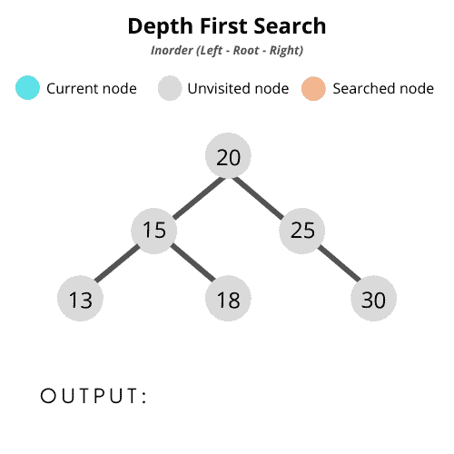
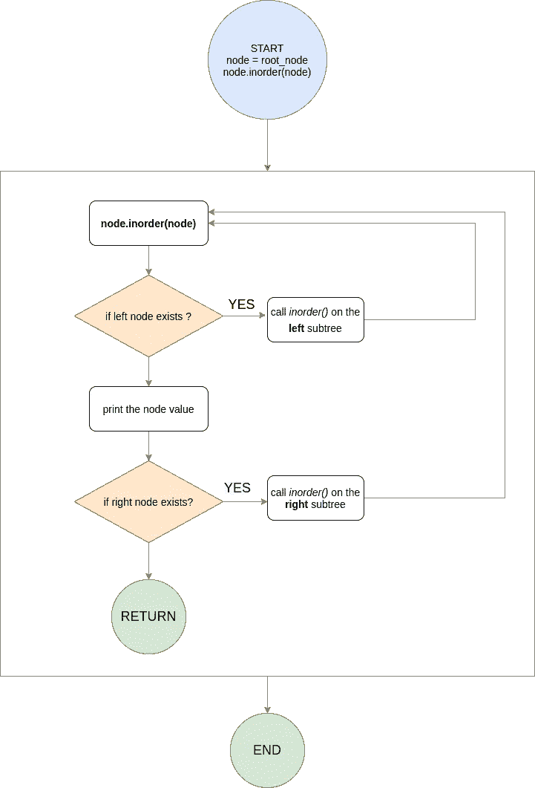
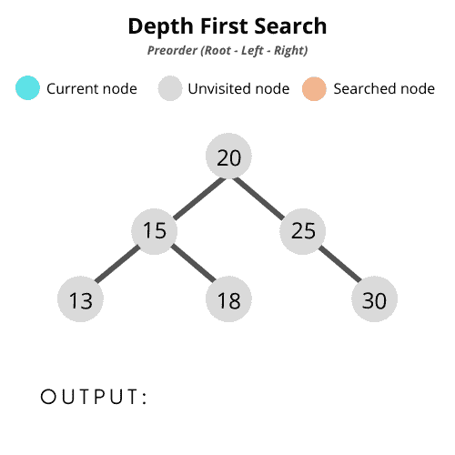
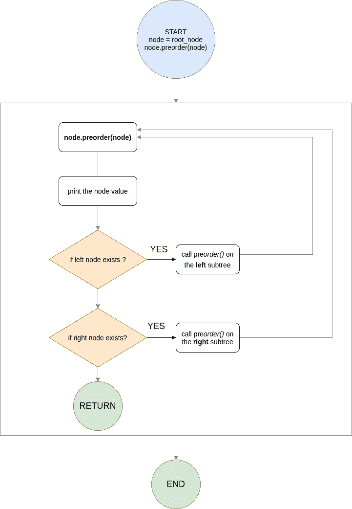
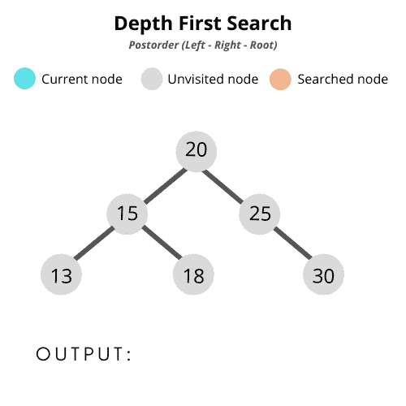
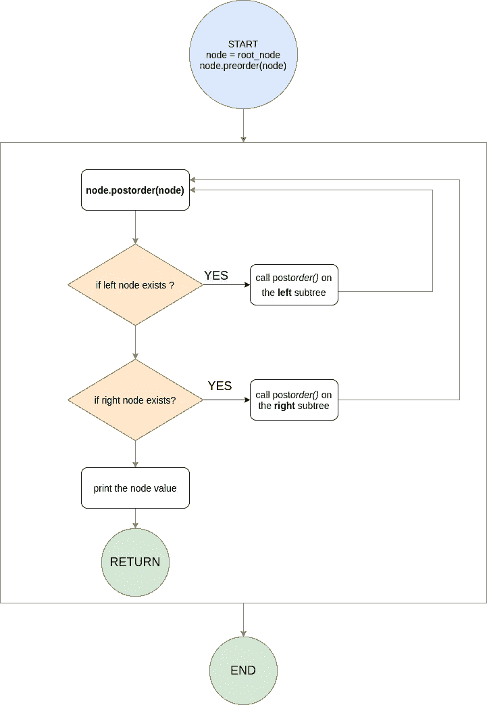

# 如何使用 JavaScript 遍历一棵树

> 原文：<https://levelup.gitconnected.com/how-to-traverse-a-tree-using-javascript-c9a79826e819>


弗雷德里克·佩雷斯摄

*最初发表于*[*【https://blog.purnimagupta.com】*](https://blog.purnimagupta.com/traverse-binaryTree/)*。*

欢迎来到我的二叉树编程教程系列的第二部分！在本文中，您将学习树遍历背后的概念。您将了解一些流行的树遍历技术以及它们是如何工作的，并且您还将学习使用 JavaScript 来实现它们。

*   对什么是二叉树的基本理解。如果你是这个概念的新手或者想要复习一下，请阅读本系列的第一部分[这里](https://medium.com/swlh/implement-binary-search-tree-in-javascript-897dcbcc5616)，稍后访问这篇文章！
*   对 JavaScript 有一些基本的了解

# 在接下来的 20 分钟里，你将学到以下内容:

## #1:常用的树遍历技术

广度优先搜索(BFS)和深度优先搜索(DFS)

## #2:深入研究深度优先搜索算法:

*   有序遍历
*   前序遍历
*   后序遍历

在下一个教程中，你将学习广度优先搜索。

准备好了吗？我们走吧！

**下面就是** [**维基**](https://en.wikipedia.org/wiki/Tree_traversal) **所说的**

> *在计算机科学中，树遍历(也称为树搜索和树行走)是图遍历的一种形式，指的是*访问(检查和/或更新)树数据结构中每个节点*、*、**、*恰好一次*、**、*的过程。这种遍历按照节点被访问的* ***顺序*** *进行分类。*

树遍历算法可以大致分为两种类型:

*   **广度优先搜索**

这种技术的工作原理是，在进入下一层之前，先访问一层中的所有节点一次。之所以称之为“广度优先”，是因为这个搜索**拓宽了**的搜索策略。

*   **深度优先搜索**

另一方面，深度优先搜索的工作方式是“深入”到图的一部分，并一直访问它的所有节点。一旦该子树没有更多的节点可访问，它**返回**到可以做出不同选择的最新点，然后从那里开始探索。

对于二叉树，这种方法通常是从左到右的顺序。也就是说，搜索评估树的最左边的分支/子树，然后进行到它右边的分支/子树，依此类推，直到访问了所有分支。

**T** rees 是一个**图**数据结构的特例。这就是为什么像深度优先搜索(DFS)和广度优先搜索(BFS)这样的算法也可以应用于它们。需要记住的重要一点是，虽然图遍历通常可以从任何节点/顶点开始，但是树遍历总是从根节点开始。

# 深度优先搜索树遍历的应用

在您开始深入研究实现细节之前，我觉得从问题*为什么开始总是有帮助的。*为什么我们甚至首先需要知道这些算法，它们的应用是什么？

我很想知道，因为我以前只听说过 DFS，并且知道它们是如何工作的，但从来没有真正理解它们在哪里或者为什么存在。事实证明，应用程序的数量惊人地庞大！

下面是 DFS 经常用作构造块的几个应用程序:

## 在基于策略的游戏中:

像国际象棋、数独、阿尔法围棋这样的棋盘游戏，棋盘配置通常以[游戏树](https://en.wikipedia.org/wiki/Game_tree)的形式表示。在这种情况下，DFS 的变化通常用于寻找最短或最佳的一组移动。

## **查找连接组件:**

你可以使用 DFS 在一个**无向图**中找到连接的组件。我找不到无向图在现实世界中应用的好例子，所以如果你有这方面的具体例子，我很想知道:)

## **寻找强连通分量:**

*   DFS 在社交图中也有应用。一个例子是，当你想向喜欢相似网页或相似视频的人推荐或宣传特定内容时。这可以表示为一个强连通图，它使用 DFS 来搜索彼此相似的实体。
*   另一个有趣的应用是[车辆路线问题](https://developers.google.com/optimization/routing/vrp)，它有助于为访问一组地点的多辆车找到最佳(最小化总成本)路线。

## **寻找路径:**

它可以用来查看从顶点`u`到顶点`v`是否存在路径。

## **拓扑排序算法:**

**有向无环图(DAG)** 可以用来维护任务的**线性排序**。例如，图的顶点可以表示要执行的任务，而边可以表示一个任务必须在另一个任务之前执行的约束。这里有几个例子:

*   在自动柜员机交易中，任务按一定的顺序发生。首先，我们需要插入 ATM，输入 PIN 并验证您自己，只有稍后才能提取金额。连插卡/扫卡都不能取钱。这种操作顺序可以用 DAG 来表示，其中可以使用拓扑排序。
*   使用博弈树的回合制游戏如国际象棋也是另一个例子，其中只有当玩家达到某个棋盘配置时，某些棋步才可用。
*   如果你使用的是基于 Debian 的 UNIX 系统，那么使用`apt-get`命令是不可避免的，它利用拓扑排序来确定安装或删除软件包的最佳方式。

> ***注意*** *:理解上述应用中使用的搜索算法严格来说并不完全是 DFS，这一点很重要。更准确地说，这些算法是 DFS 的变体，经过进一步优化，在一些任务中比其他任务表现得更好。*
> 
> *其中一些甚至还与传统的 BFS(广度优先搜索)算法结合使用，如* [*迭代深化深度优先搜索*](https://en.wikipedia.org/wiki/Iterative_deepening_depth-first_search) *。但稍后会详细介绍。*

现在我们已经看了一些应用程序，让我们看看 DFS 中使用的一些常见的遍历模式:

# 用于 DFS 的常见遍历模式:

如前所述，二叉树可以从左到右遍历，也可以从右到左遍历。但是我们将要讨论的最常用的遍历技术将以从左到右的方式进行。这些遍历可以使用递归技术，也可以迭代完成(为此，您需要使用堆栈，一种特殊的数据结构)。

对于本教程，您将学习使用**递归**来实现这些遍历。

# 有序遍历(左-根-右)

有序遍历的工作方式如下:

1.  我们将从根节点开始，递归遍历整个左侧子树。
2.  访问根节点的数据值，并对它做任何需要做的事情。出于本教程的目的，我们将只打印值。
3.  然后递归遍历整个右子树。

# 这里有一个 gif 和一个流程图来帮助你形象化它:



树的有序遍历

> ***注意:*** *这个遍历总是按照* ***排序*** *的顺序打印节点值。这是因为左子树中的值* ***比根节点中的*** *小，而右子树中的值* ***比根节点中的*** *大。*



顺序遍历流程图

您将从上一篇教程[继续，在上一篇教程](https://medium.com/swlh/implement-binary-search-tree-in-javascript-897dcbcc5616)中，您用 JavaScript 编写了一个 BST，并扩展该程序以实现 DFS。如果你需要复习，请再读一遍。

# 下面是一个 inorder 遍历的 JS 实现的样子:

```
function inOrder(root) { 
   root.left && inOrder(root.left) 
   console.log(root.val) 
   root.right && inOrder(root.right) 
} <!-- Call the inorder function. Remember, we're referring above gif's BST for reference--> node.inOrder(node) // 13, 15, 18, 20, 25, 30
```

要想理解清楚，你必须知道*递归*是如何工作的。我会尽力详细说明。

1.  我们将从根节点开始。在我们的 gif 中，我们的根节点包含值`20`。
2.  接下来，检查这个节点是否有左子节点。如果是，那么我们将从左边的子树开始搜索。这将在包含值`15`的节点上再次调用`inorder()`方法。
3.  同样，它检查它是否有一个左孩子。是的，的确我们在左边有一个值为`13`的节点。
4.  它在节点`13`上调用`inorder()`。但是它的左边没有子节点。所以控制转到下一行，它在这一点打印`13`。最后，我们检查节点`13`的右子树，它也不存在！所以没有更多的事情要做，程序返回到调用它的父`inorder`函数，在值为`15`的节点上。
5.  这样，当我们调用`inOrder(root.left)`时，已经遍历了节点`15`的整个左子树。接下来，`15`被打印出来，然后程序继续计算节点的右子树。
6.  重复同样的过程，直到整棵树都被覆盖！

希望你能全部跟上！如果你没有，去看这个关于递归的视频。

继续下一个遍历模式:

# 前序(根-左-右)

它是这样工作的，从根节点开始，就像 inorder 一样:

1.  首先，获取当前节点值，比如说，打印出来。
2.  然后，我们对左子树进行前序遍历。
3.  最后，对右边的子树做同样的操作。

基本上，我们首先打印父节点，然后是左节点，最后是右节点。冲洗并重复，直到我们覆盖了整棵树。

# 这是一个视频，后面是一个流程图:



树的前序遍历



前序遍历流程图

# 所以 JavaScript 实现看起来会像这样:

```
preOrder(node) { 
  console.log(node.val) 
  node.left && this.preOrder(node.left) 
  node.right && this.preOrder(node.right) 
} <!-- Call the preorder function. We're referring above gif for reference --> node.preOrder(node) // 20, 15, 13, 18, 25, 30
```

# 后序(左—右—根)

这种遍历是这样进行的:

1.  首先，递归遍历左边的子树。
2.  然后递归遍历右边的子树。
3.  最后，访问当前节点值并打印出来。

# 它看起来是这样的:



树的后序遍历



后序遍历流程图

# 程序是这样的:

```
postOrder(node) { 
  node.left && this.postOrder(node.left) 
  node.right && this.postOrder(node.right) 
  console.log(node.val); 
} <!-- Call the postorder function. We're referring above gif for reference --> node.postOrder(node) // 13, 18, 15, 30, 25, 20
```

> ***注意:*** *您可能已经注意到了，这些遍历模式在实际代码中并没有太大的不同。然而，在某些情况下，使用一种遍历可能比其他遍历更好。*

# DFS 树遍历模式的一些用途:

## 序列化和反序列化

这是维基百科[的定义。](https://en.wikipedia.org/wiki/Serialization):

> *在计算中，串行化是将数据结构或对象状态翻译成可以* ***存储*** *(例如，在文件或内存缓冲区中)或* ***传输*** *(例如，通过网络连接链路)和* ***重构*** *(可能在不同的计算机环境中)的格式的过程。*
> 
> *当根据串行化格式重新读取所得到的一系列位时，它可用于创建原始对象的语义上* ***相同的克隆*** *。*

在二叉树的上下文中，您可以将序列化视为将树结构转换成一个**字符串**或一个**数组**格式。例如，一个后序遍历给了我们这个输出:`13, 18, 15, 30, 25, 20`。这可以存储为一个字符串或一个数组(序列化)，以后可以用它来构造一个新的相同的 BST(反序列化)。

您可以使用以下组合来创建 BST:

*   前序和后序遍历都可以用来创建(反序列化)原始 BST。
*   还可以结合使用 postorder 和 inorder 来创建 BST。
*   您可以同时使用 preorder 和 inorder 来创建 BST。
*   您可以只使用 postorder 来创建 BST。

## 以下是一些更进一步的应用:

# 前序遍历:

它可以用来从表达式树中创建前缀表达式(**波兰语符号**)。如果你不知道，我建议你在维基百科上阅读这篇文章。

**例如:-**

这个中缀表达式`**A - (B + C) + (D + E)**`可以转换成前缀表达式为`**"+ * A - B C + D E"**`。与 inorder 表达式相比，这种转换使得编译器计算带有前缀/后缀表达式的算术/代数方程变得极其容易。

人类真的很擅长扫描事物，记住传统的结合律和优先规则，然后我们评估方程。我们只需要观察它。但是对于一个编译器来说，它会更复杂，因为在计算方程时，它必须考虑结合律和优先规则。这可能是不必要的开销。

因此，建议在编译器解析表达式之前，将 inorder 表达式转换为 postfix 或 prefix，因为这样就不需要知道这两个表达式的运算符的优先级。

前缀表达式从**右到左**求值，它们使用堆栈数据结构。

# 后序遍历:

就像如何使用前序遍历从树中生成前缀表达式一样，我们使用后序遍历来生成后缀表达式 [**反向波兰符号**](https://en.wikipedia.org/wikiReverse_Polish_notation) 。例如，这个中缀表达式`**A - (B + C) + (D + E)**`可以使用堆栈数据结构转换成后缀表达式`**"A B C - * D E + +"**`。

当您想要首先探索**叶节点**时，也可以使用后序遍历。例如，当您需要**删除**一个节点时，在删除节点本身之前，必须先访问并删除它的子节点以释放内存！

后缀表达式从**左到右**读取，求值时也使用栈数据结构。

# 有序遍历:

这是二分搜索法树最常用的遍历技术之一，因为它返回的值与最初用来创建树的顺序相同。因此，如果您需要按排序顺序访问值，您将使用 inorder 遍历。

基于图的数据结构和算法数不胜数，我们在这里仅仅触及了皮毛！在下一个教程中，我们将讨论广度优先搜索。

如果你有任何反馈，请在评论中告诉我，或者在[推特](https://twitter.com/pooyax14)上联系我。

如果你喜欢这个教程，一定要给它一个大拇指🙂。回头见！

**如果你想做进一步的阅读，去看看这些教程。**

**#1。深度优先搜索**

*   [辉煌](https://brilliant.org/wiki/depth-first-search-dfs/)
*   [黑客地球](https://www.hackerearth.com/practice/algorithms/graphs/depth-first-search/tutorial/)
*   [维基百科](https://en.wikipedia.org/wiki/Depth-first_search)

**#2。树遍历**

*   [Wikibooks](https://en.wikibooks.org/wiki/A-level_Computing/AQA/Paper_1/Fundamentals_of_algorithms/Tree_traversal)
*   [ODSA 关于二叉树遍历的书](https://opendsa-server.cs.vt.edu/ODSA/Books/CS3/html/BinaryTreeTraversal.html)

**#3。算法书籍**

*   [奥雷利](https://www.oreilly.com/library/view/algorithms-in-a/9780596516246/ch07s02.html)
*   [Coursera](https://www.coursera.org/learn/algorithms-part2#syllabus)

**#4。DFS 的应用**

*   [深度优先搜索在 geeksforgeeks 上的应用](https://www.geeksforgeeks.org/applications-of-depth-first-search/?ref=lbp)

# 感谢您的阅读！