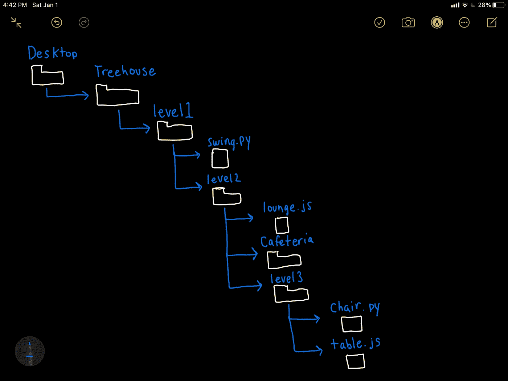

# 如何遍历您的 Windows/MAC 终端

> 原文：<https://levelup.gitconnected.com/how-to-traverse-your-terminal-for-windows-mac-23d7a4c75b55>

这是我的第一篇文章，我决定每篇文章我都会给你提供一个 TL；这样你可以得到你所需要的，如果你想的话，你可以留下来学习更多。

成为更好的软件工程师/开发人员需要在终端中使用的五个命令是:

*   **cd** **目录名**(改变目录)允许你在目录(文件夹)之间移动
*   **ls** (list)在你的终端中输入这个将会提供你当前目录中当前项目/文件夹的列表
*   **mkdir directory-name** (Mac)或**MD****directory-name**(Windows)运行此命令将在当前文件夹中为您创建一个新文件夹
*   **触摸文件名.文件类型** (Mac)或 **ni 文件名.文件类型** (Windows)该命令将在当前工作目录下创建一个新文件
*   **rm file-name** (Mac)或**Remove-Item-Path C:\ Users**(Windows)在您的终端中键入此命令将从您当前的工作目录中删除一个文件

# 在我们开始之前:

在我们开始之前，如果你在 Windows 上首先通过点击 Windows 开始按钮搜索 PowerShell，否则在这里下载 PowerShell [。如果你在 Mac 上，不知道在哪里找到你的终端，请点击](https://docs.microsoft.com/en-us/powershell/scripting/install/installing-powershell-on-windows?view=powershell-7.1)[这里](https://support.apple.com/en-in/guide/terminal/apd5265185d-f365-44cb-8b09-71a064a42125/2.12/mac/11.0)。

## 此外，如果你喜欢我的 PowerShell 的外观，这里是我用来定制它的视频的[链接](https://www.youtube.com/watch?v=Tq-kmohWYnU)。

现在您已经有了五个最基本的命令，可以让您遍历、显示、创建和删除目录或项目，那么您应该如何在日常代码中使用这些命令呢？

想象一下你能想到的最大的树屋，你爬得越高，你就必须爬得越多，这类似于文件路径。

我已经在我的桌面上创建了一个树屋文件夹，我们将一起遍历树屋，并找出我们可以在这个树屋中做什么。

树屋文件夹结构草图

首先，我们将想要进入树屋，这可以通过键入 **cd** 后跟文件夹名称来完成，在这种情况下看起来像 **cd 树屋**，然后单击 enter/return。

正如你可以看到的新路径名，我们现在在我们的树屋目录。如果我们键入 **ls** 来查看我们的树屋目录中有什么，我们看到我们有 **level1** 。在那里，我们可以通过键入 **cd level1** 将 **cd** 放入该目录。

***输入文件夹名称的快捷方式是输入 cd 和文件夹名称的一部分，如“lev”，然后单击 tab 自动填充其余部分。当文件夹名称变得很长并且很可能在输入全名时出错时，这非常方便。***

通过再次键入 **ls** ，我们可以看到哪些文件和/或文件夹在当前文件夹中。在这里，我们可以看到 Treehouse 的 level2 和一个 swing.py 文件是可见的。

让我们用一个命令在 Visual Studio 代码(可以说是最流行的代码编辑器)中打开 swing.py，看看它能做什么！为此，我们首先确保安装了 Visual Studio 代码，如果没有安装，这可以在这里[完成](https://code.visualstudio.com/download)。接下来，一旦安装了 Visual Studio 代码，打开它，在左下角点击设置图标( **⚙** )并寻找命令面板。在 Mac 上，快捷键是(⌘ + ⇧ + P)。对于 Windows，它是(Ctrl + Shift+ P)。

一旦命令面板打开，在 Mac `Shell Command: Install 'code' command in PATH command`和 Windows `(Preview) PowerShell Command Explorer: Focus on PowerShell Commands View`上输入`shell command`来完成命令**代码的设置。这将从你当前的工作目录中打开 Visual Studio 代码。**

让我们继续到第二层，看看那里有什么！知道我们所知道的，我如何移动到第二级文件夹？提示:使用 **cd 文件夹名。**

如果现在我们想在这一层上做一些改造，并在第二层上添加一个新的层(文件夹)呢？为此，我们将使用命令 **mkdir** 用于 Mac 或 **md** 用于 Windows，后跟文件夹名称。因此，为了创建第三个级别，让我们称之为 **level3** 我们将输入 **md level3** ，因为我使用的是 Windows，但是如果你使用的是 Mac，你可以将我的 **md** 替换为 **mkdir** 。

进入级别 2，然后创建一个名为级别 3 的文件夹

现在我们已经在我们的树屋中创建了一个新的层次，让我们添加一些家具(在这种情况下，我的意思是文件)到它！这可以通过使用命令**触摸文件名.文件类型** (Mac)或 **ni 文件名.文件类型** (Windows)来创建一个带有您选择的编程语言扩展名的新文件。让我们创造一把**椅子。 *py* 和**表。 *js。* 该命令可在同一文件夹中创建两个不同的文件名和文件类型。然而，首先我们必须 **cd** 到我们刚刚创建的新文件夹中，以确保我们创建的新文件仅在级别 3 中。

在下面的图片中，我用`cd level3` 移动到文件夹 level3，然后用`ni chair.py`和`ni table.js`创建这些文件，然后输入`ls`来查看它们，以确认它们是被制作的。

现在，如果我们实际上不需要这一级别的表，我们如何从我们的文件夹 level3 中删除这个文件呢？

在 Mac 上，这可以通过在你的终端上输入 **rm table.js.** 来完成，但是在 Windows 上，这有点复杂。首先，您将想要键入命令 **pwd** (打印工作目录)，它将打印出如下内容:C:\ Users \ your name \ Desktop \ tree house \ level 1 \ level 2 \ level 3。

您将需要精确复制该路径，然后运行命令

**Remove-Item -Path** 后跟**C:\ Users \ your name \ Desktop \ tree house \ level 1 \ level 2 \ level 3**
最后加上 **\table.js**

把这些放在一起我们得到:
**Remove-Item-Path C:\ Users \ your name \ Desktop \ tree house \ level 1 \ level 2 \ level 3 \ table . js**

正如你所看到的，我们已经成功地从 3 级文件夹中删除了 **table.js** 。

既然我们已经一路爬到了树屋的顶部，我们该如何回到地面呢？这可以用你的 **cd** 命令来完成。就像我们如何使用 **cd** 通过 **cd** **文件名**将树屋向上移动一样，我们也可以使用 **cd 将树屋向下移动..**命令。让我们从文件夹级别 3 开始，看看这是如何工作的。

现在我们回到了我们开始的树屋文件夹，多酷啊！

**如何用一行代码快速移动到文件夹级别 3？**

你可以输入“cd lev ”,然后按 tab 键自动填充“level1 ”,然后输入“lev ”,再按 tab 键，最后输入“lev ”,按 tab 键自动填充“level3 ”,然后按 enter 键，就可以进入 level3。在键入 ls 列出这个文件夹中的文件后，我们可以看到我们安全地到达了第 3 级，并且在一行中！

我们也可以在一条线上完成。

这里我们一起分支了 **cd..**多点双点命令。我们在一行中从第三级一直到树屋文件夹，哇！你可以通过减少双点的数量来停止前进。

这里，我们从第 3 级开始，在第 1 级停止。向上移动文件夹也是如此。

# 结论

哇，我们涵盖了很多！我希望在这之后你能够更容易地使用命令行，并且在遍历和进行更改时更加自信。如果您有任何问题，请参考我的[网站](https://www.armaankara.com)，并在那里给我发电子邮件。如果你喜欢这篇文章，别忘了关注并点击鼓掌按钮！