# 如何解决部署在 VMware Tanzu(PCF)中的 Java 应用程序的内存泄漏问题

> 原文：<https://levelup.gitconnected.com/how-to-troubleshoot-memory-leak-in-java-application-deployed-in-vmware-tanzu-pcf-b159717bc7b0>

## 内存泄漏很难检测，并且会很快耗尽您的云资源。


迈克尔·泽兹奇在 [Unsplash](https://unsplash.com?utm_source=medium&utm_medium=referral) 上的照片

我们部署在 VMware Tanzu(以前称为 Pivotal Cloud Foundry 或 PCF)上的一个 java 应用程序每隔几个小时就开始崩溃。该应用程序每天处理近 3000 万个呼叫，响应时间不到一秒。

我们最近没有进行新的部署。因此，应用程序的频繁崩溃对于团队来说是相当令人惊讶的。

Tanzu metrics 屏幕确实有助于理解在应用程序开始变慢之前，内存一直达到其分配的 90%左右。在几分钟的缓慢性能中，应用程序通常会崩溃。

因此，它确认了应用程序的内存管理存在问题。下一步是找出内存问题是由于糟糕的应用程序代码还是由于使用了第三方 API。

组织中大约有 20 个应用程序使用有问题的应用程序公开的服务。因此，团队需要快速找到问题的根本原因并解决它，以避免一些关键销售和 CRM 应用程序的停机。

一旦团队确认问题与内存有关，下一步就是插入 PCF 节点并确定导致内存泄漏的原因。花了几个小时才发现问题的根本原因是由于呼叫量的指数增长导致资源利用率增加。团队很快解决了这个问题，以便更好地处理卷并部署更新的代码。该应用程序开始像一个魅力，即使有更高的音量。

我将详细介绍用于确定内存泄漏根本原因的工具和步骤。如果您在部署在 VMware Tanzu (PCF)中的应用程序中面临类似的内存使用问题，这将有助于快速 RCA 和解决问题。

# PCF 指标

VMware Tanzu 提供了一个设计良好的工具来跟踪您的应用的指标。设备跟踪以下项目的指标:

*   平均请求延迟
*   每分钟请求数
*   每分钟请求错误数
*   CPU 使用率
*   唱片
*   记忆

这里我们感兴趣的是“内存”指标。它给出了正在使用的内存量的明确指示。我们可以选择查看平均、最大、最小或总使用量与应用程序总分配内存的比较。

下面是 PCF 指标仪表板的屏幕截图，显示了资源的平均使用视图。

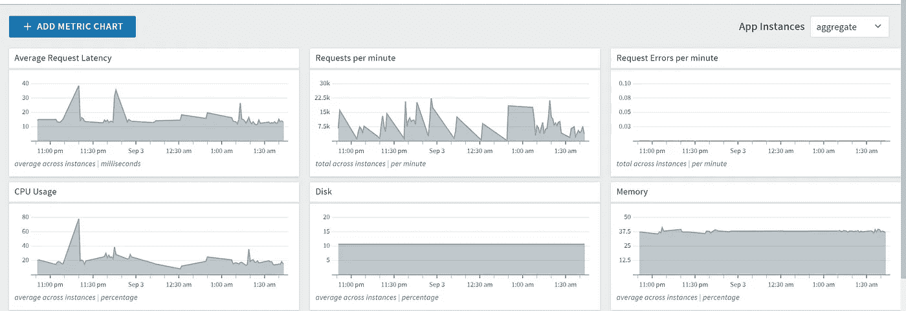

聚合指标仪表板。作者截图。

在下图中，您可以看到为应用程序运行的每个实例的相同指标。这些图表清楚地显示了是所有节点都以相同的方式运行，还是只有少数异常值导致了问题。

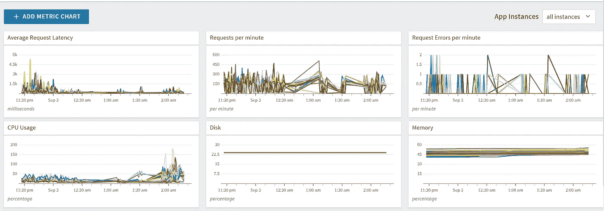

所有实例度量仪表板。作者截图。

在我们的例子中，所有节点的行为或多或少都具有相同的模式，也就是说，它们在上次重启后的几个小时内都达到了 90%的内存使用水平。

查看上面的度量仪表板，团队确信内存利用率有问题。

# 启用 JMX

通常，与内存泄漏相关的问题是由于代码中对象的不正确处理而引起的。当应用程序代码创建用于保存数据的对象，但没有适当地释放它们时，java 垃圾收集器不会考虑将它们用于垃圾收集。这些对象在应用程序完成使用后，会在内存中停留很长时间。随着时间的推移或在大容量的情况下，问题将在大小上外推，开始导致内存问题。

有几种方法可以找出导致内存问题的原因，以及哪些对象占用了内存。一种方法是获取实例的堆转储，以找出在进行转储的特定时间内哪些对象是活动的。

另一种方法是启用 JMX 并直接连接到 JVM。我更喜欢这种方法，因为它提供了对象如何在应用程序中形成的实时视图。它还提供了一种方法来捕获快照，并比较不同时间点之间的对象计数和使用的内存。

下面是为 Tanzu 平台上的节点启用 JMX 的步骤。

*   通过管理控制台，在应用程序的“设置”菜单下的“用户提供的环境变量”中设置以下变量。

```
key = JBP_CONFIG_JMX  |  value = {enabled: true}
```

*   您可以通过 cf CLI 使用下面的命令完成同样的操作。

```
cf set-env rspusage JBP_CONFIG_JMX "{enabled: true}"
```

*   保存设置后，您需要使用以下命令“重新启动”应用程序。重启应用程序对激活设置不起作用。

```
cf restage <add your application name here>
```

*   现在，应用程序将允许您创建一个 SSH 隧道。在 cf CLI 中，从您的本地计算机运行以下命令。它将转到命令提示符的下一行，不做任何事情。检查几秒钟—如果提示没有抛出任何错误，则您已成功连接。

```
cf ssh -N -T -L 5000:localhost:5000 <add your application name here>
```

通过以上步骤，部署在 Tanzu 平台上的应用程序现在可以在 JMX 使用了。下一步是使用支持 JMX 的工具连接到本地端口。

# 连接到 SSH 端口以读取 JVM 统计信息

许多图形监控工具可以帮助您从本地系统监控 JVM 和 java 应用程序，例如 JConsole、VisualVM 等。

在解决内存问题时，我们使用 VisualVM 来监控 Tanzu 节点中的 JVM。使用 VisualVM 连接到实例非常容易，它提供了一个简单的 UI 来查看各种指标。您可以从本文参考资料部分给出的链接下载最新的 VisualVM 软件。

*   下载完软件后，解压下载文件并双击 bin 目录中的应用程序文件。它将在您的本地打开 VisualVM 应用程序。

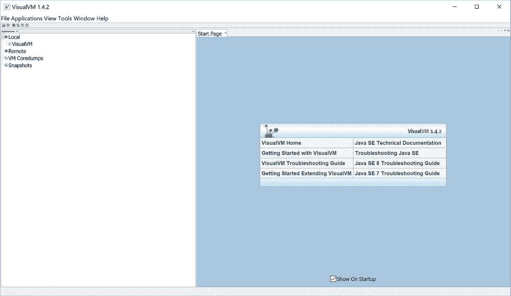

VisualVM 启动屏幕。作者截图。

*   在 VisualVM 应用程序中，单击文件>添加 JMX 连接子菜单。它会给出一个对话框来输入 SSH 连接的详细信息。

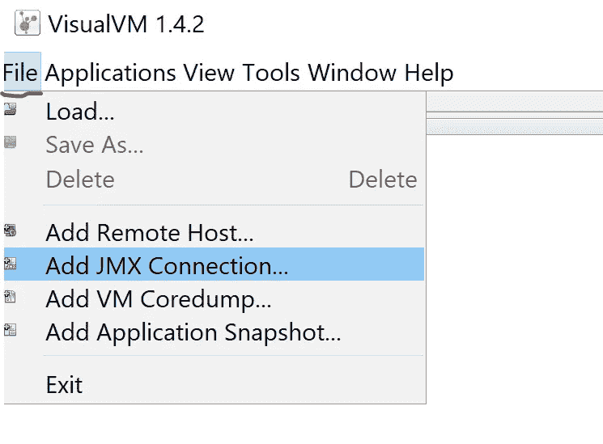

作者截图。

*   在“添加 JMX 连接”页面中，输入“连接”字段值“本地主机:5000”。请记住，您已经在前面的步骤中使用了端口 5000 来打开到 PCF 实例的 SSH 连接。
*   您还可以将“显示名称”字段值更改为能够快速告诉您在 VisualVM 应用程序中连接到哪些应用程序实例的值。这将有助于您以后拍摄多个快照。

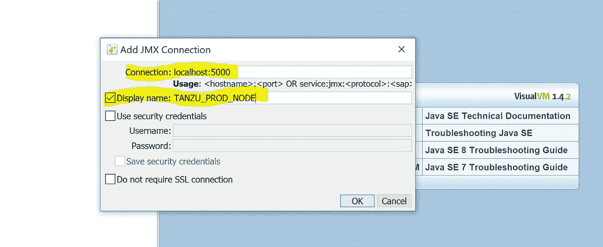

作者截图。

*   您不需要输入任何其他详细信息。点击“确定”按钮。VisualVM 应用程序将尝试通过连接到端口 5000 来添加 JMX 连接。添加连接通常需要几秒钟。一旦成功连接，它将在“应用程序”选项卡的“本地”菜单下显示新的连接。

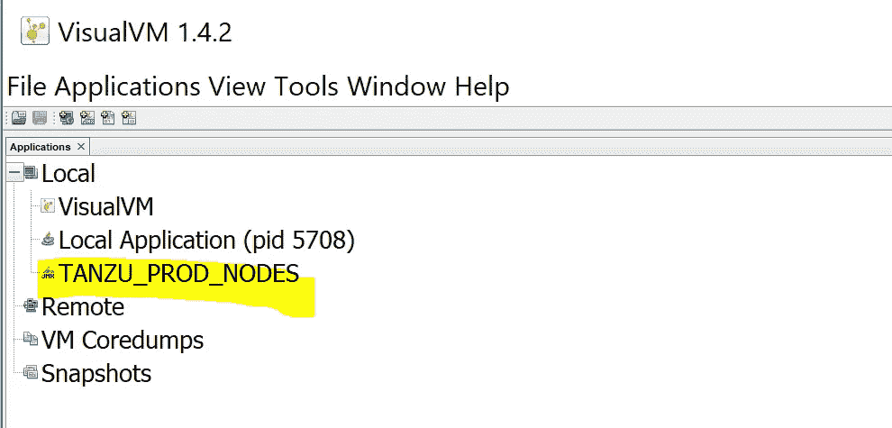

作者截图。

*   万一应用程序无法连接，它将抛出如下错误。

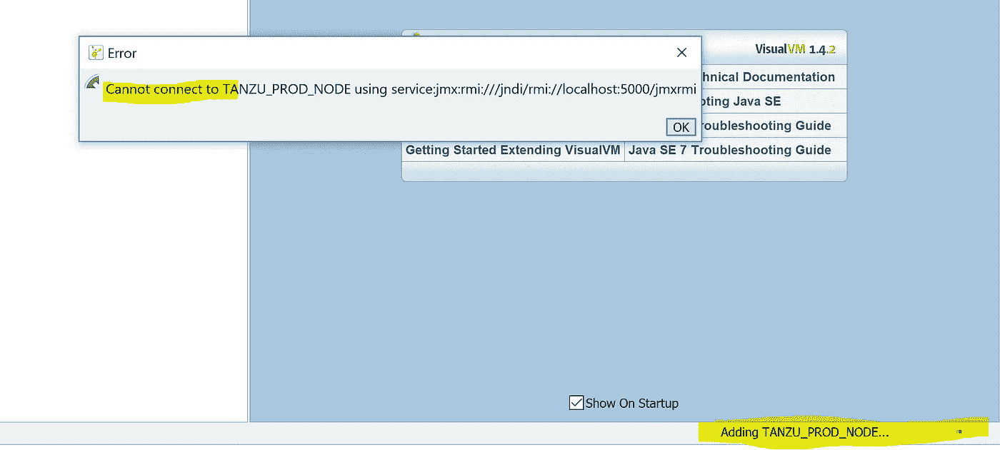

作者截图。

*   返回到您打开 SSH 连接的命令提示符处，验证连接是否已终止。如果是这样，那么使用您第一次使用的相同的“cf ssh …”命令重新启动 SSH 连接。

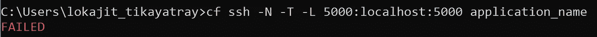

作者截图。

*   既然您已经完成了 VisualVM 的设置，现在您可以打开刚刚添加的连接并开始监控了。右键单击连接名称并选择“打开”选项。

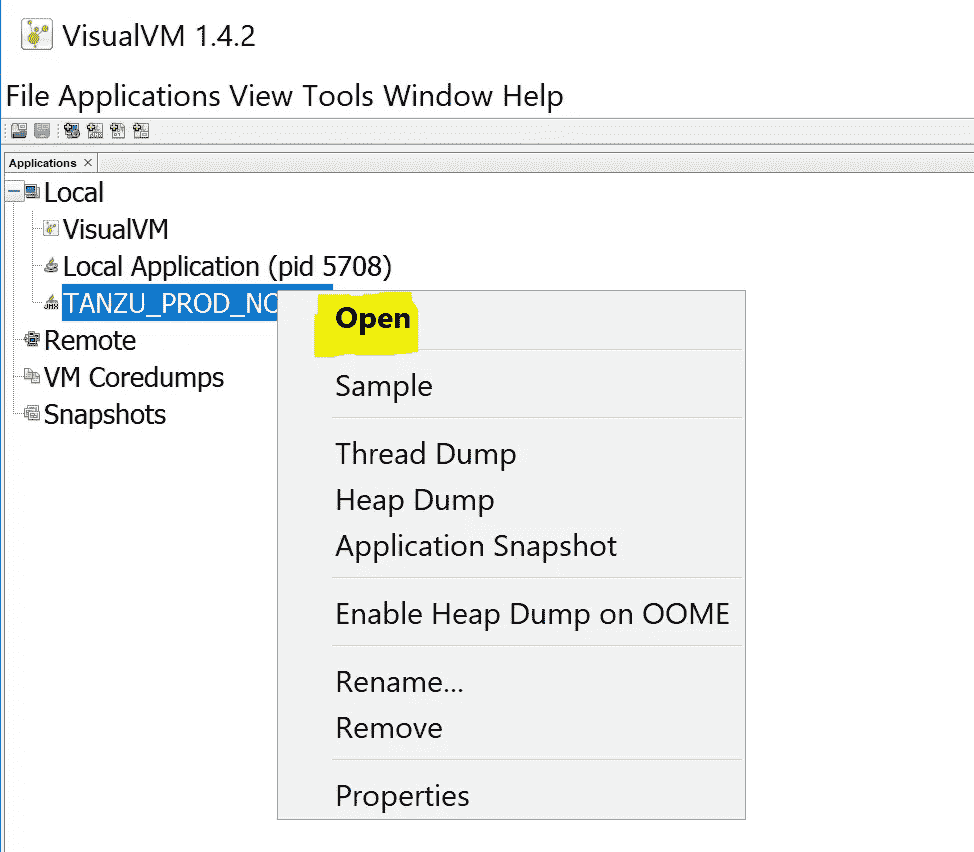

作者截图。

*   VisualVM 将花费几秒钟来打开连接，然后将显示以下屏幕。

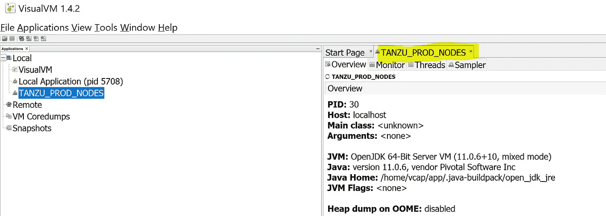

作者截图。

*   “采样器”选项卡帮助您执行 CPU 和内存采样。单击选项卡后，需要几秒钟的时间进行分析，然后会显示一条消息，提示您所需资源的采样是否可用。

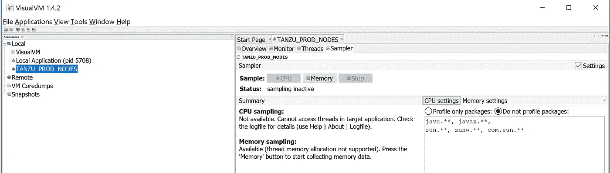

作者截图。

*   接下来，单击“内存”按钮开始收集内存数据。现在，您将能够看到对象的实际使用情况。它将显示活动字节和活动对象的计数。

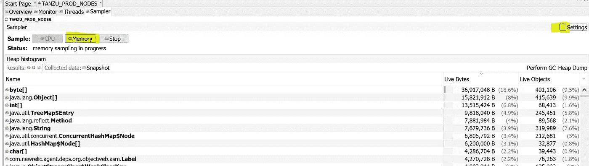

作者截图。

*   监视哪些对象在内存中累积而不被垃圾收集的最简单的方法是使用“Delta”选项。Delta 视图显示了启动连接后 JVM 内存中对象的字节和计数的增加。

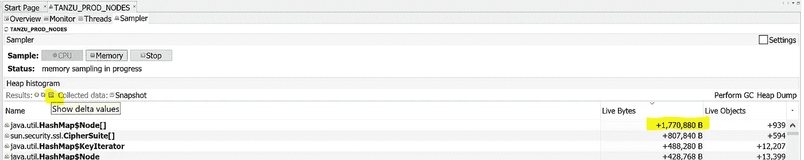

作者截图。

*   如果您继续看到特定对象的字节数和计数在增加，但没有随着时间的推移而重置，那么这是一个值得关注的问题。特别是如果顶部的对象是您的自定义对象，那么您需要检查使用这些对象的代码，以确定它们在使用后是否被成功释放。
*   “Monitor”选项卡也是检查资源利用率的一个方便的地方。如果您的堆大小(橙色图形)随着时间不断增加，甚至在多次垃圾收集周期后也没有下降(如下图所示)，这就是查找内存泄漏的问题所在。

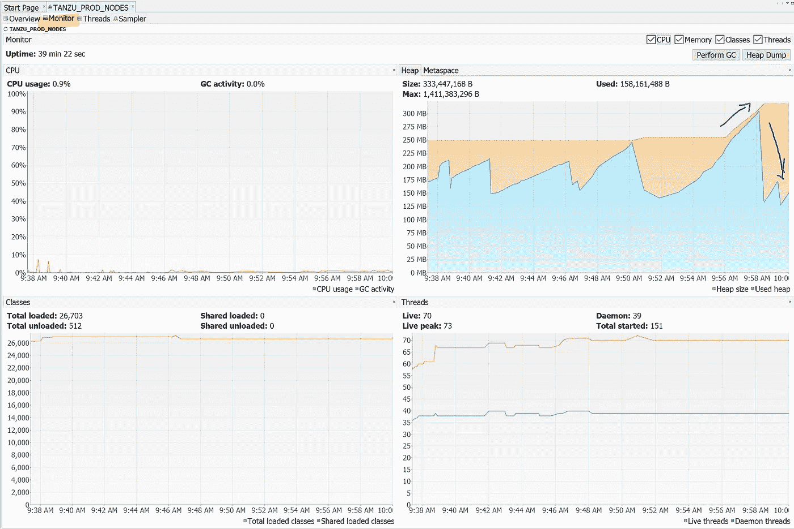

作者截图。

一旦使用上述步骤分析了内存利用率，您就能够查明是什么对象导致了内存泄漏问题。回到你的相关代码并重构它。确保您正在适当地释放所有未使用的对象。垃圾回收将无法要求内存，而您的代码仍然会引用该内存。因此，显式释放代码中在处理过程中不再需要的对象总是一个好的做法。

当您采用按使用付费模式时，云资源的低效利用可能会浪费您的资金，而不会为您的公司增加任何商业价值。即使在固定付费模式下，优化您的云资源利用率以最大化您的投资收益始终是一个好的做法。

继续使用 SSH 连接和 VisualVM 工具，以便更好地理解您的应用程序 JVM 性能和资源利用过程。它将帮助您快速解决任何内存泄漏或其他与资源利用相关的问题。

感谢您阅读文章。希望你觉得有用。

## 参考资料:

1.  下载 VisualVM 的链接—[https://visualvm.github.io/download.html](https://visualvm.github.io/download.html)
2.  链接到 Tanzu 网站—[https://Tanzu . VMware . com/application-modernization-recipes/observability/enabling-JMX-for-pivotal-platform-Java-apps](https://tanzu.vmware.com/application-modernization-recipes/observability/enabling-jmx-for-pivotal-platform-java-apps)

## 您可能也喜欢阅读:

[](https://medium.com/illumination/google-career-certificates-6-months-professional-courses-is-set-to-replace-college-degrees-3b21c7e57b23) [## 谷歌职业证书:为期 6 个月的专业课程将取代大学学位

### 谷歌将在招聘过程中考虑这些证书相当于相关工作岗位的四年制学位。

medium.com](https://medium.com/illumination/google-career-certificates-6-months-professional-courses-is-set-to-replace-college-degrees-3b21c7e57b23)