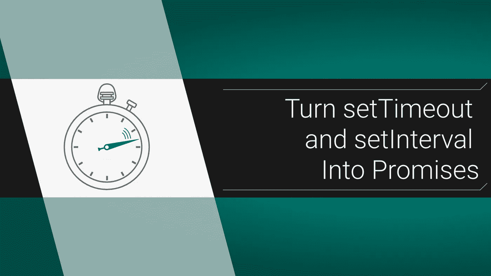

# 如何把 SetTimeout 和 SetInterval 变成承诺

> 原文：<https://levelup.gitconnected.com/how-to-turn-settimeout-and-setinterval-into-promises-6a4977f0ace3>

## 了解如何承诺 JavaScript 计时器



如果你曾经想要`then`或`await` JavaScript 的`setTimeout`或`setInterval`功能，你并不孤单。我不得不在工作中多次使用这些方法来处理一些… *有趣的…* 第三方行为，所以我终于熟悉了承诺函数。`[setTimeout](https://www.w3schools.com/jsref/met_win_settimeout.asp)`可能很简单，而`[setInterval](https://www.w3schools.com/jsref/met_win_setinterval.asp)`有点复杂，所以确保你理解[承诺](https://medium.com/@mostlyfocusedmike/promises-promises-understanding-the-basics-of-js-promise-objects-dd5c656f2db4)。

# TL:DR；代码

```
*const* **sleep** = *async* (**ms**) => {
    return *new* **Promise**(**resolve** => **setTimeout**(**resolve**, **ms**));
}*const* **asyncInterval** = *async* (**callback**, **ms**, **triesLeft** = 5) => {
  return *new* **Promise**((**resolve**, **reject**) => {
    *const* **interval** = **setInterval**(*async* () => {
      if (*await* **callback**()) {
        **resolve**();
        **clearInterval**(interval);
      } else if (**triesLeft** <= 1) {
        **reject**();
        **clearInterval**(**interval**);
      }
      **triesLeft**--;
    }, **ms**);
  });
}
```

这就是了，如果你想知道为什么，请看下面！但如果这就是你所需要的，很高兴我能帮上忙！

# 如何承诺设置超时

以这段代码为例:

```
*const* **foo** = () => {
    **setTimeout**(() => {
        **console**.log('*Callback based stuff'*);
        **console**.log('*yet another thing*');
        // lots more stuff
    }, 2000);
}
```

关于`setTimeout`恼人的事情是所有东西都必须放在回调函数中。如果有很多事情要做，会变得很麻烦。但是当我们使用`await`时，不需要额外的回调:

```
const **asyncFoo** = *async* () => {
    *await* *new* **Promise**((**resolve**) => **setTimeout**(**resolve**, 2000));
    **console**.log('*nice*');
    **console**.log('*way* *better*');
}
```

这里发生了什么事？嗯，如你所知，[承诺实际上只是在事情发生后调用一个解决](https://medium.com/@mostlyfocusedmike/promises-promises-understanding-the-basics-of-js-promise-objects-dd5c656f2db4)函数或拒绝函数。我们正在做的是创建一个新的`Promise`，而不是传入一个对`setTimeout`的回调，而是传入`resolve`。这样，经过几毫秒后，调用的是`resolve`,我们的承诺被触发并解决。然后我们可以做任何我们想做的事情。很简单……但也可以更简单。

# 创建睡眠功能

人们倾向于像使用暂停按钮一样使用`setTimeout`功能。其他语言有一个`sleep`功能，可以在设定的时间内暂停它们的程序。我们做一个吧！

```
*const* **sleep** = (**ms**) => {
  return *new* **Promise**(**resolve** => **setTimeout**(**resolve**, **ms**));
}*const* **asyncFoo** = *async* () => {
    *await* **sleep**(2000);
    **console**.log('*look at this*');
    *await* **sleep**(1000);
    **console**.log('*getting fancy now*');
}
```

这是一个简单的实用函数，非常有用，尤其是在不止一次使用它的情况下，因为嵌套`setTimeout`看起来真的很可怕。

# 承诺设置间隔

如果你想让`setInterval`永远运行，你会陷入困境，但如果你只是想用它来处理几次重试，然后继续前进，它可以工作。为此，我们将使用与之前相同的`resolve`技巧，但我们也将增加最大尝试次数。如果到那时我们还没有得到什么，我们将继续使用`reject`。我们必须将我们尝试任务(一个假的服务器检查)包装到一个函数中，它必须返回 true 或 false:

```
*// task must return true or false*
*const* **fakeServerCheck** = async () => {
  **console**.log('*check...*');
  return **Math**.random() > 0.8;
}*const* **asyncInterval** = *async* (**callback**, **ms**, **triesLeft** = 5) => {
  return *new* **Promise**((**resolve**, **reject**) => {
    *const* **interval** = **setInterval**(*async* () => {
      if (*await* **callback**()) {
        **resolve**();
        **clearInterval**(interval);
      } else if (**triesLeft** <= 1) {
        **reject**();
        **clearInterval**(**interval**);
      }
      **triesLeft**--;
    }, **ms**);
  });
}*const* **wrapper** = *async* () => {
  try {
    *await* **asyncInterval**(**fakeServerCheck**, 500);
  } catch (e) {
    **console**.log('*error handling*');
  }
  **console**.log("Done!");
}**wrapper**();
```

这里的秘诀是我们的任务函数返回一个布尔值。这样，我们就能知道是否要继续前进。你还会注意到我在`callback`前添加了一个`await`，尽管`fakeServerCheck`是同步的。这是因为在现实生活中，这个函数可能会做一些事情`async`，我正试图使`asyncInterval`函数尽可能的可剪切和可复制。

# 现在一切都匹配了

这就对了。有了这两个功能，`sleep`和`asyncInterval`，你就不会有定时回调和常规承诺的尴尬组合。我知道使用这种计时器并不常见，但是如果你真的发现自己在使用它们，这应该会很有帮助。

大家编码快乐，

麦克风