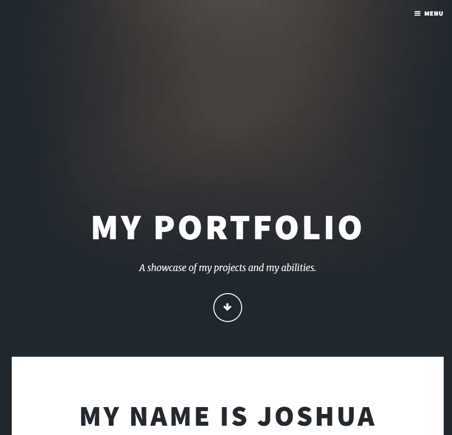
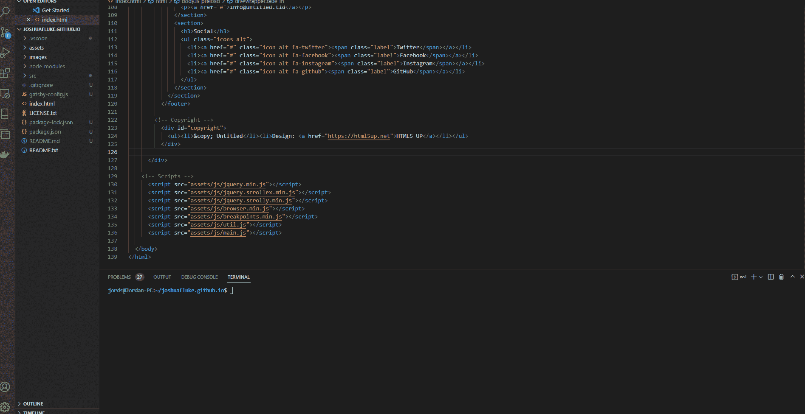

# 如何把你的作品集变成一个有盖茨比的博客网站

> 原文：<https://levelup.gitconnected.com/how-to-turn-your-portfolio-into-a-blogging-website-with-gatsby-1ae8042ef462>

## 盖茨比是建立在 React 之上的。最流行的前端框架。


*照片由*[*Adeolu Eletu*](https://unsplash.com/@adeolueletu?utm_source=unsplash&utm_medium=referral&utm_content=creditCopyText)*上*[*Unsplash*](https://unsplash.com/)*。*

**目录**

> [简介](#8b20)
> [盖茨比是学习 React](#844d)
> [安装依赖项](#3075)
> [观看约书亚·福禄克的视频或下载他的作品集开始使用](#314e)
> [运行站点](#d178)
> [不要移动周围的盖茨比文件](#e8e0)
> [将原始 HTML 转换为 JSX](#f565)
> [将资产和图像合并到我们的盖茨比中](#0f8f)

# 介绍

几年前，我看了约书亚·福禄克(Joshua fluke)的一个视频，教我如何在不支付任何费用的情况下，将 git 回购作为 GitHub Pages 投资组合网站。

多酷啊！想想几年前，我付费在 Winhost 上托管我的投资组合，我没有收入，但付费托管了一个投资组合网站！但我想更进一步。我想分享那些竭尽全力帮助我的人的知识。我想就此写个博客。

但是当你有一个工作域时，你不想在一个托管服务上托管博客，因为:

1.  你可能想把它货币化。
2.  即使你什么都不做，你也可以在就业市场上获得声誉。
3.  当你有足够的内容时，谷歌将允许你使用谷歌广告，这样当有人访问你的网站时，你可以赚一些钱。

我在 GitHub Pages repo 上使用了我的域名，但因为我没有博客引擎，我不得不手动将每一个段落都用 HTML 标签括起来。

为了避免这一点，我使用了 Jekyll，它工作得很好，但是如果你想学习 react 或者在理解概念上有困难，你可以使用 Gatsby 不仅可以写很棒的博客，还可以学习 React 组件和语法。

# 《盖茨比》是学习反应的绝佳方式

如果你想进入 React，但不知道该学习什么项目，Gatsby 会帮助你，因为它是建立在 React 之上的。所以今天我们将使用约书亚·福禄克的原始教程中的一个作品集网站，并把它变成一个博客平台。

谁知道呢，也许他会自己制作一个视频。现在，我们将在已经完成的基础上进一步发展。所以我会给你一个他的知识库的链接。

您需要安装 Gatsby、Node.js 和 Git。在您的终端中运行以下命令，确保您已经安装了它们。

# 安装依赖项

```
node -v git 
--version 
gatsby --version
```

如果其中一个命令没有返回版本号，那么你需要到 Gatsby 的官方网站，这样你就可以看到如何根据你的操作系统安装依赖项。

```
npm install -g gatsby-cli
```

在您喜欢的任何文本编辑器或 IDE 中使用这些工具。

# 观看约书亚福禄克的视频或下载他的作品集开始

如果你不想看如何创建 GitHub Pages 作品集的视频，没关系，你可以下载约书亚·福禄克制作的作品集。

确保您可以首先运行静态 HTML 文件。如果你使用 Visual Studio 代码，我建议你安装 Live 服务器扩展。

然后只需打开根文件夹中的 index.html，并转到下面的蓝色栏上的按钮，上面写着去生活。你应该看看这个。



但是首先，我们需要生成我们将用来构建 Gatsby 站点的模板。我们在命令行中这样做。

键入以下命令。

```
gatsby new
```

如果您想要更新 Gatsby CLI，这是可选的。

```
npm install -g gatsby-cligatsby new
```

您将被引导通过您安装的 Gatsby 模板中的一系列提示。

```
What would you like to call your site? ✔ · Portfolio Blogging site
```

您可以只选择默认区域来保存站点。只要它不存在于你的投资组合项目之外。

```
What would you like to name the folder where your site will be created? ✔ Desktop/ gatsby-companion-site
```

之后，您只需选择 JavaScript 提示符，就已经生成了站点。

```
Will you be using JavaScript or TypeScript? ❯ JavaScript TypeScript
```

选择“否(或者我稍后添加)”。是的，一个内容管理系统比一个静态的站点生成器更强大，但是如果你没有使用像 WordPress 这样的东西作为后端，那么就没有什么意义了，特别是如果你只是想写一些博客的话。

```
✔ Will you be using a CMS? · No (or I'll add it later)
```

当它问你是否想添加一个样式系统时，你的回答可能是否定的，除非你正在从 Gatsby 创建一个样式模板，因为你没有使用我们已经有的样式。

```
✔ Would you like to install a styling system? · No (or I'll add it later)
```

在这种情况下，我们使用一个 Html5 UP 主题和一些 Unsplash 照片，所以我们想重用我们得到的主题。不必创建一个新的和摆弄的造型。选择否

现在只需选择完成。我们可以稍后安装插件。

```
✔ Would you like to install additional features with other plugins? · Done
```

接下来的提示我就不解释了，看到就按“Y”。它应该告诉你，如果你的网站成立。从终端的根目录转到 Gatsby-companion-site 文件夹。

# 运行网站

现在我们要安装节点模块。

说说你对 Node.js 的看法吧，我所知道的是，如果没有后端 JavaScript 语言，我们无法轻松地使用 npm 包管理器在任何计算机上安装模块，这使得我们在克隆存储库时更快，比如在图书馆的笔记本电脑上躲避热量。

我在夏天一直做它。

所以现在只要运行`npm install`就行了，一旦完成，我们就运行下面的命令。你会经常用到它！

完成后，我们运行下面的命令。你会经常用到它！

```
gatsby develop
```

确实是的。它允许大部分的实时重载，除非你操作依赖于服务器的文件，比如`gatsby-config.js`，但是如果你这样做，你会得到警告，你需要重启服务器。

如果这不起作用，那么您可能需要从包管理器中运行它。

希望这些命令有用。当`http://localhost:8000/`出现在终端时，点击它，它会给你默认的 Gatsby 页面。您可以让 Gatsby 服务器在后台运行。如果你需要停止它，只需按住 CTRL + C 来终止它。看看`src/pages/index.js` **中生成的样板代码。之后，让我们删除 Index.js 中的所有代码，但要保留这个文件！**

# 不要移动盖茨比的文件

我知道你生成的所有子文件夹可能看起来不漂亮，但是不要把所有的文件都剪切粘贴到根目录下。让它们留在原处，否则你会得到一个 404 错误，Gatsby 会告诉你在默认的 React 生成路径中必须有 index . js`src/pages/index.js.`

# 将原始 HTML 转换为 JSX

艰巨的任务？有一种方法可以缓解这种转变。你看到的大部分只会被扔进<> >部分。我们将不得不重写一些关键字，例如，class 是一个保留的 HTML 单词，所以在 JSX 它将成为 className。

我们可以使用查找和替换这些单词，我们稍后会这样做，但是有一个更好的方法，它可以减少一些工作量，特别是当你是反应式博客框架的新手时。[使用变换](https://transform.tools/html-to-jsx)。

这里我们将采用自下而上的方法。将整个 index.html 文件复制到转换后页面的 HTML 窗口中，您应该会在 JSX 部分看到转换后的代码。

这是 HTML 的副本。是的，我知道，压痕是关闭的，但这就是为什么它是免费运送的。

你会看到 JSX 出现在 JSX 窗口。注意变化。像 class 这样的词已经被改为 className，这是因为 class 是实现 JavaScript 类的保留词，而 transform 是为了避免这些冲突。

此外，您会注意到引导类图像适合。

现在转到设置按钮，勾选`create function component`部分，然后按确认。我将做一个快照，以确保您知道下一个片段下面的位置。



现在复制整个 JSX 文件的内容，并在你的“pages”文件夹下创建一个名为 Index.js 的新文件。正如你可能已经猜到的，这个文件将包含 JSX 代码。

我们需要的一件事是没有一个恒定的功能组件。我们希望 Gatsby 持有我们的 home“默认”组件，该组件将把其中的所有内容返回给 UI。

所以我们需要做一些快速的改变。

把这条线从这里改过来。

看起来像这样:

如果 transform GitHub web 应用程序的 URL 不再有效，完整的代码应该如下所示。很像！

如果 Transform GitHub web 应用程序的 URL 不再有效，那么完整的代码应该如下所示。很像！

# 将资产和图像合并到我们的 Gatsby 站点子文件夹中

所以我们现在已经完成了申报工作。我们已经声明了组件的结构。现在我们必须将图像和样式导入到组件中。我们总是需要导入 Gatsby 插件，我们稍后会做。

如果您丢失了，请不要担心。ico 图标文件。无论如何，你不想要一个样板的盖茨比图标。

现在让我们在下面的目录中创建一个布局组件。

`Gatsby-companion-site` 中的文件夹结构应该如下所示:

```
node_modules/ 
src/ 
gatsby-config.js 
package-lock.json 
package.json
```

我建议把所有东西慢慢合并到`src`子文件夹里。你不必像 git 子模块或清除你的根文件夹中的一切！只是为了让事情更容易维护，不那么混乱。因此，在我们的子文件夹之外，我们有以下文件夹:

```
images/
assets/
```

只需将其剪切并粘贴到`src`子文件夹中。

很好，现在从 pic04.jpg 到 pic09.jpg 的参考图片可以在`images/`删除了。我们不使用这些。它们从未在原始模板中使用过！

将资产和图像导入`index.js`

重要的事情先来。让我们确保主页使用 React.js。让我们在`index.js`的顶部导入它。

# 将资产和图像导入 Index.js

重要的事情先来。让我们确保主页使用 React.js。让我们在 Index.js 的顶部导入它。

```
import React from “react”
```

你知道如何在 HTML 的`<head>`标签中声明样式和脚本元素吗？

在《盖茨比》中，我们没有包含任何 HTML 文档中常见的`<HTML>`、`<head>`或`<body>`标签。Gatsby 在运行时生成一个默认的 HTML 结构。大多数 web 框架都是这样。

我们将在 React 文件`index.js`中做一些类似的事情。我们必须允许我们的组件与我们的资产进行通信。这些是我们正在导入的文件。

我们还必须更改实际组件中图像的任何静态路径，以匹配图像标记名。

因此，对于包括引号在内的每个路径，执行查找和替换(Ctrl + F + H ),并将图像标签的名称放在花括号{}内和替换框中。应该以这些替换的 HTML 标签结束。

您即将在 react 中呈现该主页。如果你能走到这一步，那就太棒了！当你开始用自己的图像替换这些图像时，看看如何让视力受损的人更容易理解。

答案比你想象的要简单。只需在 alt 字段中输入一些文本，当鼠标悬停在上面时，屏幕阅读器就会告诉用户图片的内容。

# vs <link to="">

Gatsby 拥有允许内部站点导航的`<Link>`组件。

您需要知道的是，它的行为类似于锚`<a>`元素，除了有性能奖励，并且在用户一进入他们的视窗(这是他们的屏幕区域)就点击链接之前，链接的内容已经被检索。

请记住，`<Link to>` 标签仅用于我们网站博客等页面的内部链接。所以`<a href>`仍然可以用于外部链接，这些链接可能是我们的社交媒体页面，或者是我们在 Github 上发布的项目的储存库。

不要忘记导入链接组件。为了导入它，我们必须像这样使用 Gatsby 的`{Link}` 组件。

```
import {Link} from "gatsby"
```

现在启动 Gatsby 开发服务器并导航到 [http://localhost:8000/](http://localhost:8000/) 您应该会看到页面呈现。

恭喜你已经把你的网站变成了盖茨比！希望有帮助。现在再见。

# 资源

[*约书亚·福禄克的 Github 页面教程视频*](https://www.youtube.com/watch?v=u-RLu_8kwA0)

[*本教程使用的 Joshua Fluke 的 Github Pages 组合的回购*](https://www.gatsbyjs.com/docs/tutorial/part-0/)

[*盖茨比的官方安装网站*](https://www.gatsbyjs.com/docs/tutorial/part-0/)

[*变换。该网站帮助将一个 HTML 网页转换成 JSX*](https://transform.tools/html-to-jsx)