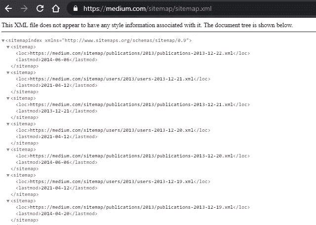

# 如何理解 Robots.txt 文件

> 原文：<https://levelup.gitconnected.com/how-to-understand-a-robots-txt-file-667246d7fa18>

## 一个网页抓取者的问题在看似吓人但简单的文本文件上得到回答


照片由[瓦尔德马·布兰德](https://unsplash.com/@waldemarbrandt67w?utm_source=medium&utm_medium=referral)在 [Unsplash](https://unsplash.com?utm_source=medium&utm_medium=referral) 拍摄

从电子商务产品信息到体育联盟统计数据，网络上不仅充满了精彩的内容，还有有价值的数据。但是，随着网站和在线资源的数量(以及数据)呈指数级增长，筛选所有这些资源并不总是容易的，无论你是试图聚集数据进行研究或分析，构建一个有用的工具，还是创建一个数据管道。

幸运的是，网络抓取或网络采集通过使用机器人或程序使收集或使用数据的过程自动化，从而使收集或使用数据变得更加容易。然而，在你着手一个 web 抓取项目之前，你可能会遇到并且想要熟悉的一个东西是一个 **robots.txt** 文件。

乍一看，这似乎有点吓人，但是相信我，一旦你学会了简单的基础知识，就不会了。

# **什么是 robots.txt 文件？**

robots.txt 文件是一个文本文件，由搜索引擎读取，让它们知道哪些页面可以使用机器人或“蜘蛛”抓取，哪些页面不可以。爬行是一个过程，当他们从一个站点“爬行”到另一个站点时，他们通过跟随链接来发现和索引 web。在本文的其余部分，把你想象成一个构建 web scraper 程序的用户，一个机器人。

Robots.txt 存在于一个网站域名的页面上，可以通过在域名后添加`/robots.txt` 找到，比如`domain.com/robots.txt`。不遵守文件中的规则是不被允许的，并且会导致法律上的麻烦。

对于 robots.txt 文件，有两个共同的利益相关者:希望控制抓取或优化 SEO 的网站所有者和希望抓取数据的网络用户。这篇文章将集中在网络用户和他们如何解释这个文件，为什么它是重要的，以及所有其他关于它的使用的常见问题。

# **如何解释一个 robots.txt 文件？**

一个 robots.txt 文件由一个或多个规则块组成，每个规则块都以一个`user-agent`行开始，每个规则都在前面一行。用户代理指的是它所处理的特定机器人或蜘蛛。

用户代理可以:

*   对特定的搜索引擎有自己的一套屏蔽指令
*   使用通配符`*`指示符为所有搜索引擎提供一套屏蔽指令

让我们来看看媒体的档案:[https://medium.com/robots.txt](https://medium.com/robots.txt')

```
User-Agent: *
Disallow: /m/
Disallow: /me/
Disallow: /@me$
Disallow: /@me/
Disallow: /*/edit$
Disallow: /*/*/edit$
Disallow: /media/
Disallow: /p/*/share
Disallow: /r/
Disallow: /t/
Disallow: /trending
Disallow: /search?q$
Disallow: /search?q=
Allow: /_/
Allow: /_/api/users/*/meta
Allow: /_/api/users/*/profile/stream
Allow: /_/api/posts/*/responses
Allow: /_/api/posts/*/responsesStream
Allow: /_/api/posts/*/related
Sitemap: https://medium.com/sitemap/sitemap.xml
```

像`Disallow`和`Allow`这样的规则听起来确实如此。这些行指定了蜘蛛可以或不可以访问网站的哪些相对路径或部分。

## **不允许**

有三种方式可以实现此规则:允许完全访问、阻止所有访问或允许部分访问。

**完全访问:**`Disallow`后面的空值表示没有被禁止。换句话说，没有什么是不允许被抓取的。例如，这个模块允许所有搜索引擎抓取网站的所有部分。

```
User-agent: *
Disallow:
```

**阻止所有访问:**下面的例子将限制所有用户代理抓取站点的任何部分。

```
User-agent: *
Disallow: /
```

**部分访问**:最常见的是，下面的例子将限制所有用户代理抓取站点上的`/trending`目录和其中的所有内容(子目录)。

```
User-agent: *
Disallow: /trending
```

换句话说，Medium 不允许你浏览其网站上任何出版物的趋势页面。

## 允许

虽然不允许规则更常见，但是当一些域想要指示允许爬行的特定网页或路径时，它们喜欢包含允许规则。通常，该命令仅适用于用户代理:`Google-bot`。

例如，Medium 的所有 allow 规则都引用了其发布 API，以便开发人员轻松插入 Medium 网络。

```
Allow: /_/
Allow: /_/api/users/*/meta
Allow: /_/api/users/*/profile/stream
Allow: /_/api/posts/*/responses
Allow: /_/api/posts/*/responsesStream
Allow: /_/api/posts/*/related
```

**爬行延迟**

爬行延迟规则限制了允许机器人请求网站页面爬行的频率，要求它们等待指定的时间段。以下示例将在爬网操作之间设置 10 秒的延迟。

```
Crawl-delay: 10
```

## 网站地图

站点地图规则为爬虫提供 XML 站点地图的位置，该位置提供附加信息并允许机器人更有效地爬行站点。



媒体网站地图示例(Google Chrome 中 XML 文件的截图)

# **robots . txt 文件有哪些限制？**

尽管 Robots.txt 受到并且应该受到大多数搜索引擎、程序员和 web 用户的尊重，但不幸的是，它有其局限性:

1.  并非所有搜索引擎都支持这些规则，这意味着它们不能强制爬虫行为，而只是提供指导。然而，大多数主要引擎遵守规则。
2.  不同的爬虫对语法的解释不同，所以最好了解特定爬虫的某些细节。

# **robots . txt 文件不存在怎么办？**

万岁——你的第一个倾向可能是，没有 robots.txt 意味着你可以刮任何东西。这并不完全正确。并非所有网站都会定义 robots.txt 文件。在这种情况下，你应该检查任何*条款条件*或网站上的其他法律页面，因为它们通常可能包括关于什么是允许的爬虫和提取数据的细节。最佳实践是检查术语和 robots.txt。

# **如果我对收集网站数据没有把握，我还能做什么？**

如果查看 robots.txt 或 terms 都不能让你完全明白，最好是*直接问*网站。找到一个合适的电子邮件联系人，处理有关服务条款的法律事务或问题，并列出您的具体问题，解释您是谁以及您从该网站收集潜在数据的目的。

# 结论

不理解 robots.txt 或网站的数据提取指南，因为它令人困惑或令人生畏，也不是不服从的有效借口。正如我们所看到的，解释文件及其规则以及获得进一步的澄清是一件相当简单的事情！接下来，你需要做的就是记住阅读并尊重你的数据采集项目的网站规则。刮的开心！

希望你喜欢这个简短的介绍性指南。如果您有任何问题或疑虑，请在下方留言或通过 LinkedIn[联系我。如果你喜欢这篇文章，你可能想看看这些关于实际网络抓取项目的帖子:](https://www.linkedin.com/in/bicaj/)

[](https://pub.towardsai.net/tweet-topic-modeling-using-twint-to-scrape-tweets-part-1-a9274e5199d2) [## 推文主题建模:使用 Twint 抓取推文

### 多部分系列展示了如何刮擦，清理，并应用和可视化短文本主题建模的任何集合…

pub.towardsai.net](https://pub.towardsai.net/tweet-topic-modeling-using-twint-to-scrape-tweets-part-1-a9274e5199d2) [](https://towardsdatascience.com/home-field-advantage-does-it-exist-without-fans-a0778c5a6a29) [## 主场优势:没有粉丝还存在吗？

### 疫情时代之前和期间的数据和统计

towardsdatascience.com](https://towardsdatascience.com/home-field-advantage-does-it-exist-without-fans-a0778c5a6a29) [](https://pub.towardsai.net/how-to-easily-scrape-podcast-data-using-rss-feeds-e864710cb62) [## 如何使用 RSS 源轻松抓取播客数据

### 通过访问 RSS feeds 使用 R 获取播客数据很容易，只需 5 个简单的步骤

pub.towardsai.net](https://pub.towardsai.net/how-to-easily-scrape-podcast-data-using-rss-feeds-e864710cb62) 

## 资源

1.  [https://developers . Google . com/search/docs/advanced/robots/intro](https://developers.google.com/search/docs/advanced/robots/intro)
2.  [https://www . cloud flare . com/learning/bots/what-is-robots . txt/](https://www.cloudflare.com/learning/bots/what-is-robots.txt/)