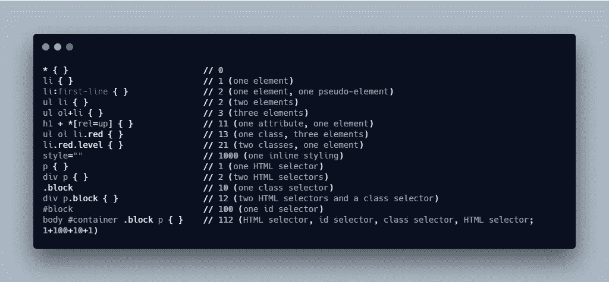
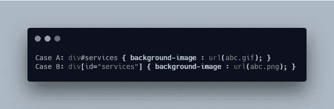
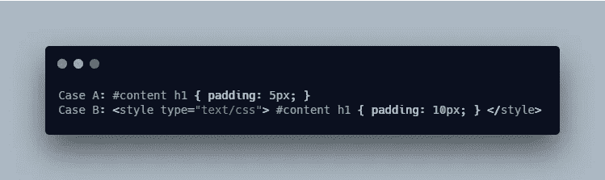
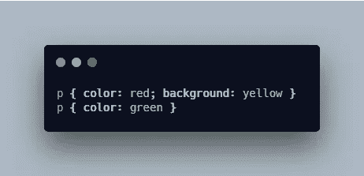

# CSS 特异性解释

> 原文：<https://levelup.gitconnected.com/how-to-understand-css-specificity-2caabc5f67a9>

## HTML CSS

## 前端开发人员 CSS 特异性指南。了解 CSS 特异性如何用于应用样式以及如何计算它。


由 [Emre Gencer](https://unsplash.com/@reo?utm_source=unsplash&utm_medium=referral&utm_content=creditCopyText) 在 [Unsplash](https://unsplash.com/s/photos/coffee?utm_source=unsplash&utm_medium=referral&utm_content=creditCopyText) 上拍摄的照片

在这篇文章中，我将谈论:

1.  什么是 CSS 特异性
2.  特异性层次结构
3.  特异性规则

*更多类似内容，请查看*[*https://betterfullstack.com*](https://betterfullstack.com)

# 什么是 CSS 特异性

CSS 特异性对前端人员来说是一个重要的概念，因为我们经常使用它，不管我们是否知道。特异性决定了在浏览器中的任何时刻，哪个 CSS 规则被应用于特定的 HTML 元素。

> “特异性是一种权重类型，它与级联样式表(CSS)规则的显示方式有关。”

每一个选择器都有自己的特异性，如果两个选择器应用于同一个元素，特异性较高的那个胜出。

# 特异性层次结构

每个选择器在特异性层次中都有自己的位置。有四个不同的类别定义了给定选择器的特异性级别:

1.  内联样式(节点上有`style`)。内联样式存在于 HTML 文档中。它直接附加到要设计样式的元素上。例如`<h1 style="color: #fff;">`
2.  id(`#`选择器)。ID 是页面元素的标识符，比如#div。
3.  班级。属性和伪类。这一组包括。类、[属性]和伪类，如:hover、:focus 等。
4.  元素和伪元素。这是你的`div`和`span`标签，还有:before 和:after。

这里有一些例子。

选择器是链接到特定样式的元素。

```
p { padding: 10px; }
```

类选择器是使用已定义类的选择器(每页多个)。

```
p.section { padding: 10px; }
```

ID 选择器是使用单独分配的标识符(每页一个)的选择器

```
#section { padding: 10px; }
```

上下文选择器是为规则定义精确级联顺序的选择器。`p span`定义了 p 元素中的所有 span 元素都应该以斜体显示。

```
p span { font-style: italic; }
```

属性选择器匹配具有特定属性或属性值的元素。`p[title]`匹配所有具有标题属性的 p 元素。

```
p[title] { font-weight: bold; }
```

伪类是用于定义 HTML 元素行为的特殊类。它们用于为某些选择器添加特殊效果，这些效果在某些状态下会自动应用。

```
a:visited { text-decoration: underline; }
```

伪元素为设计者提供了一种为源文档中不存在的内容分配样式的方法。伪元素是元素的一个特定的、唯一的部分，可用于“动态”生成内容、自动编号和列表。

```
p:first-line { font-variant: small-caps; }
a:link:after { content: "("attr(href)")"; }
```

# 特异性规则

## 如何衡量特异性？

您可以通过以下计算进行测量:

1.  从零开始
2.  每个内嵌样式增加 1000
3.  每个 ID 加 100
4.  每个属性、类和伪类加 10
5.  每个标签或伪元素加 1。

让我们看看这个例子:

```
body #content .block img:hover
```

特异性值将是 122。

1.  1 为`body`元素
2.  100 为`#content` ID。
3.  10 为`.block`级。
4.  1 为`img`元件
5.  10 为`:hover`伪类

使用这个解决方案更容易计算特异性。让我们看看下面的另一个例子:



样本计算

注意:当最近声明的规则具有相同的特性或者是重复声明时，它们才是重要的。**“如果您已经两次将相同的规则写入您的外部样式表，那么您的样式表中较低的规则更接近于要被样式化的元素，它被认为是更具体的，因此将被应用。”**当选择器具有相等的特异性值时，例如:

```
#content h1 { padding: 5px; } 
#content h1 { padding: 10px; }
```

两个规则都具有特殊性 101。总是应用最新的(较低的)版本。

## 特异性规则

具有更具体选择器的规则具有更大的特异性。选择器中的引用越具体，规则的特异性就越强。

ID 选择器比属性选择器具有更高的特异性。例如，在 HTML 中，选择器`#services`在级联方面比`[id=services]`更具体。



第一条规则(A)比第二条规则(B)更具体。

上下文选择器比单个元素选择器更具体。它也适用于涉及多个 HTML 元素选择器的其他选择器。

嵌入的样式表更接近要样式化的元素。所以在下面的 CSS 情况中，将应用后一个规则。



第二条规则(B)比第二条规则(A)更具体。

最后定义的规则会覆盖任何以前的冲突规则。例如，给定这两条规则，段落将以绿色文本显示。然而，它们的背景也是黄色的，因为第一条规则没有被第二条规则的冲突样式完全否定。



将应用第二个 p 标签

一个类选择器胜过任何数量的元素选择器。`.introduction`击败`html body div div div`。

# 摘要

在本文中，我们学习如何计算 CSS 特异性。我的建议是永远不要使用内嵌样式、嵌入样式，永远不要使用`!important`。

另外，尽量避免使用 id 进行造型。每当你的风格没有被应用到用户界面时，试着计算特异性，并改变你的 SCSS，使其比全局 CSS 或 Bootstrap 等框架中的 CSS 具有更高的特异性。

我希望这篇文章对你有用！你可以通过我的[网站](https://www.hoangtran.co/)找到我。欢迎在下面的评论中留下任何问题。我很乐意帮忙！

# 资源/参考资料

[1]: CSS 特异性[https://www.w3schools.com/css/css_specificity.asp](https://www.w3schools.com/css/css_specificity.asp)

【2】:特异性是如何计算的？[https://developer . Mozilla . org/en-US/docs/Web/CSS/specification](https://developer.mozilla.org/en-US/docs/Web/CSS/Specificity)

[3]:关于 CSS 特异性的细节[https://css-tricks.com/specifics-on-css-specificity/](https://css-tricks.com/specifics-on-css-specificity/)

[](https://betterfullstack.com/stories/) [## 故事-更好的全栈

### 关于 JavaScript、Python 和 Wordpress 的有用文章，有助于开发人员减少开发时间并提高…

betterfullstack.com](https://betterfullstack.com/stories/)