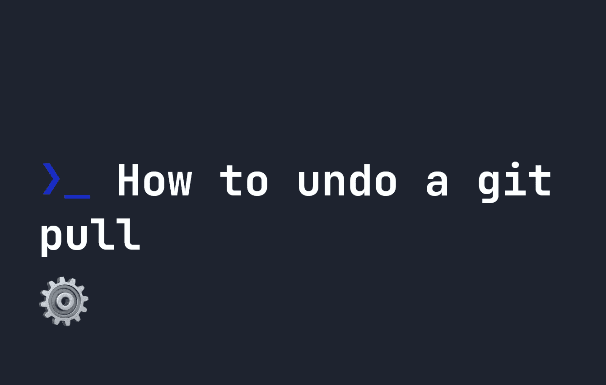

# 如何撤消 git 拉取

> 原文：<https://levelup.gitconnected.com/how-to-undo-a-git-pull-26e454dfb393>



你是否曾经在一个项目上工作，跑了一段`git pull`才意识到你已经搞砸了？现在你所有的代码都已经被你的远程存储库中的内容覆盖了——有时这个**并不是你想要的**。在这种时候，很容易出现恐慌，但幸运的是，有一些方法可以将您的代码恢复到原来的状态，并撤销`git pull`。

首先，做一份你的项目的拷贝，以防事情变得更糟。还要注意，这些命令会导致您丢失所有未提交的更改——因此在继续之前，备份可以帮助您保存这些内容。至少到那时，您将拥有您当前拥有的版本。完成这个备份后，您将需要获得所有提交历史的列表。您可以通过运行`git reflog`来实现这一点:

```
git reflog
```

这将生成如下所示的列表:

```
648e314 (HEAD -> master, origin/master) HEAD@{0}: commit: Design refresh
b0168ee HEAD@{1}: commit: Minor CSS tweaks
514a02f HEAD@{2}: commit: Fixed extra curly brace
b432ba7 HEAD@{3}: commit: fixed border-radius
a707d13 HEAD@{4}: commit: fixed image border-radius
abf89a3 HEAD@{5}: commit: updated look and feel
```

选择您想要恢复的版本。例如，如果我想恢复到“轻微的 CSS 调整”，我会选择 ID `b0168ee`。接下来，运行以下命令将您的存储库恢复到该版本:

```
git reset --hard b0168ee
```

这非常容易，并且可以让您更好地控制要恢复的版本。然而，另一个更简单的方法是给出一个时间。如果您不想运行`git reflog`，您可以运行下面的命令来恢复到 30 分钟前的版本，假设您的分支是`master`。**注意**，如果你已经在一个特定的分支工作了很长时间，这可能会让你倒退很久。在这种情况下，使用前一种方法可能会更好——但是如果有备份就没问题了。😄

```
git reset --hard master@{"30 minutes ago"}
```

# 分级编码

感谢您成为我们社区的一员！在你离开之前:

*   👏为故事鼓掌，跟着作者走👉
*   📰查看[升级编码出版物](https://levelup.gitconnected.com/?utm_source=pub&utm_medium=post)中的更多内容
*   🔔关注我们:[Twitter](https://twitter.com/gitconnected)|[LinkedIn](https://www.linkedin.com/company/gitconnected)|[时事通讯](https://newsletter.levelup.dev)

🚀👉 [**加入人才集体，找到一份令人惊喜的工作**](https://jobs.levelup.dev/talent/welcome?referral=true)