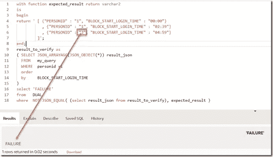

# 如何对 SQL 查询进行单元测试？

> 原文：<https://levelup.gitconnected.com/how-to-unit-test-a-sql-query-836a87b311ad>

这里有一个关于一个简单而难以置信的常见挑战的小故事:我正在处理一个 SQL 查询。这不是一个简单的查询。我正在尝试各种方法。我相信我可能找到了一个可行的解决方案。产生正确的解决方案。我怎么能确定？在保持查询完整性的同时，我如何进一步细化和优化(也称为重构)查询？我仍处于开发阶段，在这个阶段我会做出快速的改变，并希望得到快速的反馈。SQL 尚未嵌入到应用程序中，这可能会在以后发生。目前，我只是在努力研究查询的 SQL 代码。

给定我在数据库表中设置的测试数据集，我知道查询应该产生什么——甚至在开始处理 SQL 之前，我就知道测试用例。因此，我可以通过比较预期结果和 SQL 语句的实际结果来测试查询。一种无需工具的快速方法是:

*   从我的 SQL 查询中创建一个视图，例如名为 *my_query*
*   (对于每个测试用例)创建一个测试查询，将这个视图的结果与内联定义的查询结果进行比较
*   创建一个贯穿测试查询的测试套件脚本——或者创建一个测试套件数据库视图，它是所有测试查询的联合

第二个查询可能如下所示:

```
with result_to_verify as
( select *
   from   my_query
)
, expected_result as
( select 'X', 'Y', 42 from dual
   union all
   select 'A', 'B', 3.141592 from dual
)( select *  
   from result_to_verify  
   minus  
   select *  
   from expected_result  
) —-  superfluous results - there should be none
union all  
(
   select *  
   from expected_result  
   minus  
   select *  
   from result_to_verify  
 ) —- missing results - there should be none
```

该查询应该返回零行。

应用于本文中的 SQL 挑战[使用带有 Windowing 子句和 Anti Join 的分析对充分分隔的记录进行纯 SQL 计数](https://technology.amis.nl/languages/sql-database/sql-only-counting-records-sufficiently-spaced-apart-using-analytics-with-windowing-clause-and-anti-join/) —我创建了一个解决方案，但由于缺乏测试，结果证明是不正确的！—计算结果如下:

为我认为是正确解决方案的查询创建视图:


测试执行查询的结果与预期的结果。如果这个查询的结果是没有找到数据，那么这个测试就通过了。


第二个测试案例


所有测试用例都可以存储在一个简单的 SQL Developer 工作表、一个脚本文件甚至是一个返回 OK 或 n OK 的存储函数中。

在[实时 SQL](https://livesql.oracle.com/apex/livesql/s/lgn4yxxx2z8o7enfvup2rgkcc) 中尝试这些语句。

注意:如果我在开始创建我的查询之前创建了这样一个简单的测试工具，我就不会把我的不正确的解决方案发送给我的同事和全世界。当然，测试集的质量——测试数据和测试用例——对我的测试质量至关重要。

# 使用 JSON 描述更复杂的结果集

当我联系 Tim Scott 和 Connor McDonald 等受人尊敬的同行，了解他们对简单的 SQL 查询测试工具的想法时，很明显，测试开发中的 SQL 查询的简单直接的方法并不存在，我们还得出结论，利用数据库本身来比较查询结果和预期结果是显而易见的方法。有几种方法可以定义预期的结果—例如，作为特殊表中的记录，硬编码在存储过程代码中，或者硬编码在 SQL 语句中。平衡轻量级与测试结果的可重用性，您可以得到稍微不同的方法。将结果与预期结果进行比较可以如上所示以一种纯关系的方式完成——使用负集操作符——或者可以基于结果的 JSON 表示来完成。

使用 JSON_TABLE，我们可以将 JSON 文档的内容转换成关系结果集，以便在 SQL 查询的上下文中使用。下图显示了我们如何将预期结果定义为一个 JSON 文档，并在与实际结果的比较中使用该文档的内容。


将预期结果定义为一个 JSON 文档——然后使用 JSON_TABLE 将 JSON 文档转换为可进行关系处理的行

```
with expected_result as (SELECT *FROM JSON_TABLE('[ {"PERSONID" : "1", "BLOCK_START_LOGIN_TIME" : "00:00"}, {"PERSONID" : "1", "BLOCK_START_LOGIN_TIME" : "02:39"}, {"PERSONID" : "1", "BLOCK_START_LOGIN_TIME" : "04:59"}]' , '$[*]'COLUMNS (PERSONID VARCHAR2(10) PATH '$.PERSONID',BLOCK_START_LOGIN_TIME VARCHAR2 PATH '$.BLOCK_START_LOGIN_TIME'))), result_to_verify as (select PERSONID,      BLOCK_START_LOGIN_TIMEfrom   my_querywhere  personid = 1)( select *from result_to_verifyminusselect *from expected_result) -- superfluous resultsunion all(select *from expected_resultminusselect *from result_to_verify) -- missing results
```

现在，expected_result 可以表示为一个 JSON 文档——这比表示为 select value、value、value from dual UNION ALL select …等更方便。请注意' $[*]'路径表达式，它表示我们希望遍历源 JSON 文档中的所有数组元素——将每个数组元素变成结果集中的一行。我们从每个数组元素中获取 PERSONID 和 BLOCK_START_LOGIN_TIME 属性，用$表示。PERSONID 和$。块 _ 开始 _ 登录 _ 时间。

我们甚至可以用一种更简洁的方式来表达 JSON 文档:


以更紧凑的方式定义预期结果；路径表达式是 JSON 定义和由此产生的关系结果集之间的链接

或者简洁而有点神秘的:


从一个非常简单的 JSON 数组中产生关系数据

我们可以反过来做，而不是将来自 JSON 的预期结果转换成关系数据并使用 MINUS 来比较预期和实际结果集:将实际结果转换成 JSON 并对 JSON 文档进行比较。

JSON_ARRAYAGG 操作符可用于将 SQL 结果集转换成相应的 JSON 文档，如下所示:


演示 JSON_ARRYAGG 操作符，该操作符将关系结果集转换成 JSON 文档

使用这个操作符，我们可以将 result_to_verify 表示为一个 JSON 文档。现在，expected_result 再次被表示为一个 JSON 文档，针对测试审查下的视图的查询结果也被转换为 JSON，如图所示。这个结果( *result_to_verify* )是针对要测试的视图的查询；使用 JSON_ARRAYAGG 操作符将该查询的结果转换成一个 JSON 文档。注意 ORDER BY 的使用 JSON 文档中记录的顺序在最终的比较中是有意义的。在这种情况下，预期结果是在内联函数内的文本块中定义的。文本块很容易操作。但是它不容易被重用。

使用 JSON_EQUAL 操作符(在 Oracle 数据库 18c 中引入)来比较实际结果和预期结果。这种比较不考虑属性的顺序或无意义的空白。然而数组*中元素的顺序*是有意义的。对于既有效又有相同内容的 JSON 文档，JSON_EQUAL 返回 true。根据 JSON_EQUAL，当预期结果和实际结果不相等时，这里显示的查询将只返回一个结果

绿色的是这个测试用例特有的元素。没有突出显示的元素是通用的——它们对于所有的测试用例都是一样的。如此多的内容是通用的——在模板中捕获——这一事实很有吸引力，因为运行这个测试用例不需要创建额外的数据库对象。


绿色表示测试用例的特定方面——其他元素构成了测试工具——所有 SQL 查询单元测试的模板

用于最后一个示例的代码:

```
with function expected_result return varchar2isbeginreturn ' [ {"PERSONID" : "1", "BLOCK_START_LOGIN_TIME" : "00:00"}, {"PERSONID" : "1", "BLOCK_START_LOGIN_TIME" : "02:39"}, {"PERSONID" : "1", "BLOCK_START_LOGIN_TIME" : "04:59"}]';end;result_to_verify as( SELECT JSON_ARRAYAGG(JSON_OBJECT(*)) result_json FROM   my_query WHERE  personid =1 order by     BLOCK_START_LOGIN_TIME)select 'FAILURE'from   DUALwhere  NOT JSON_EQUAL( (select result_json from result_to_verify)
                     , expected_result 
                     )
```

这是预期结果和实际结果不同时的结果。请注意，这并不表示实际结果与期望结果的偏差。为此，我们必须进一步分析这两个 JSON 文档。



在处理了预期的结果之后， *my_query 的测试失败了——这是理所应当的*

感谢 Tim Scott 和 Connor McDonald 愿意就此进行头脑风暴，以及他们的见解和代码贡献。

# 资源

Oracle Base (Tim Scott)关于 JSON_EQUAL 的文章—[https://Oracle-Base . com/articles/18c/JSON _ EQUAL-condition-18c](https://oracle-base.com/articles/18c/json_equal-condition-18c)

JSON_EQUAL 上的数据库文档[https://docs . Oracle . com/en/database/Oracle/Oracle-database/21/sqlrf/SQL-JSON-conditions . html # GUID-35c 7012d-FCDB-4106-88 C1-caba 78326896](https://docs.oracle.com/en/database/oracle/oracle-database/21/sqlrf/SQL-JSON-Conditions.html#GUID-35C7012D-FCDB-4106-88C1-CABA78326896)

问汤姆—内联函数—[https://asktom.oracle.com/pls/apex/f?p = 100:11:0::::P11 _ QUESTION _ ID:9534452300346807610](https://asktom.oracle.com/pls/apex/f?p=100:11:0::::P11_QUESTION_ID:9534452300346807610)

Database 21c Docs — JSON 开发人员指南—[https://Docs . Oracle . com/en/database/Oracle/Oracle-database/21/index . html](https://docs.oracle.com/en/database/oracle/oracle-database/21/index.html)

JSON_ARRAYAGG 上的数据库文档—[https://Docs . Oracle . com/en/database/Oracle/Oracle-database/19/sqlrf/JSON _ ARRAYAGG . html # GUID-6d 56077d-78DE-4cc 0-9498-225 DDC 42 e 054](https://docs.oracle.com/en/database/oracle/oracle-database/19/sqlrf/JSON_ARRAYAGG.html#GUID-6D56077D-78DE-4CC0-9498-225DDC42E054)和 JSON _ TABLE[https://Docs . Oracle . com/en/database/Oracle/Oracle-database/19/sqlrf/JSON _ TABLE。](https://docs.oracle.com/en/database/oracle/oracle-database/19/sqlrf/JSON_TABLE.html#GUID-3C8E63B5-0B94-4E86-A2D3-3D4831B67C62)

*原载于 2021 年 3 月 5 日*[*https://technology . amis . nl*](https://technology.amis.nl/database/how-unit-test-a-sql-query/)*。*