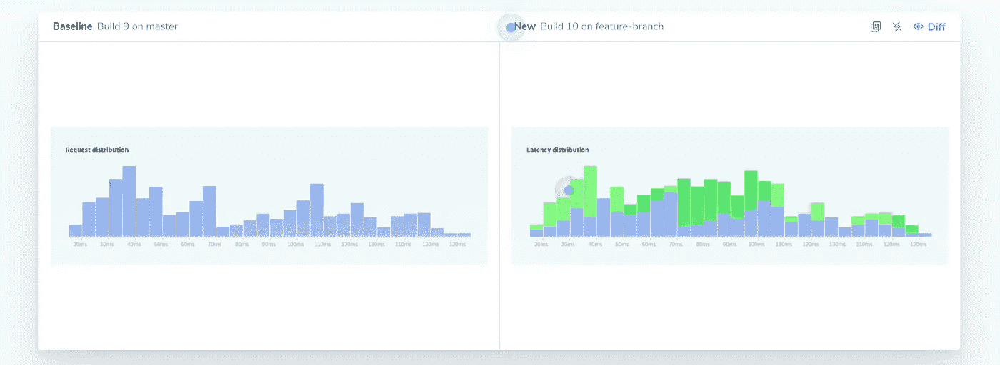
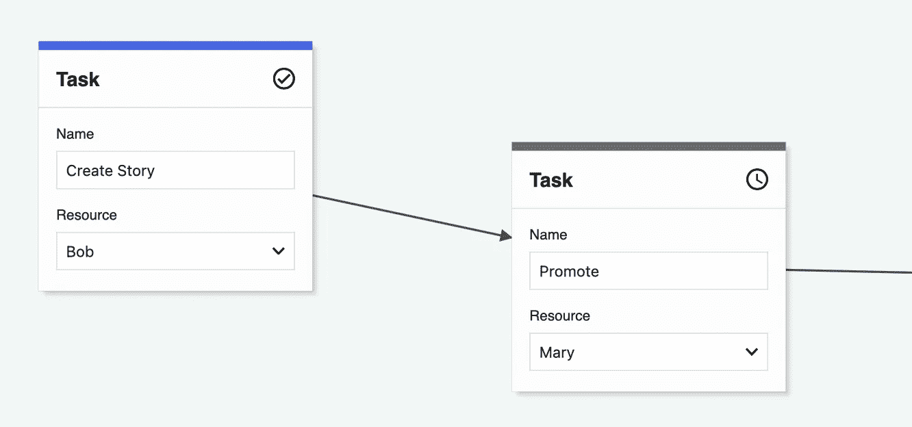
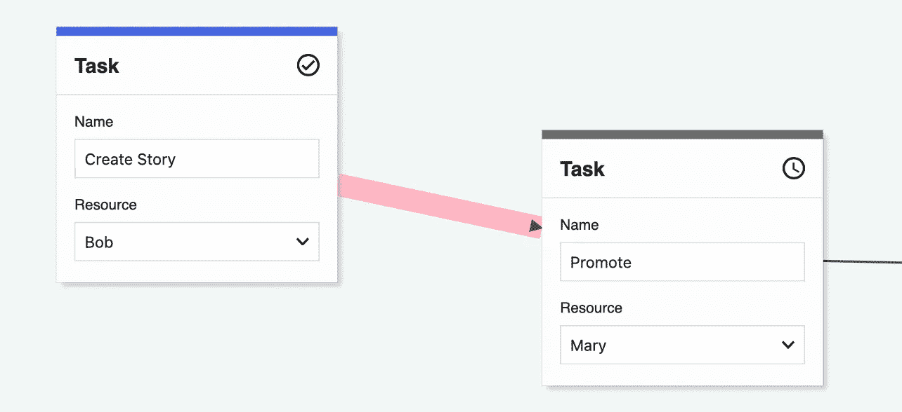

# 如何对 CSS 进行单元测试

> 原文：<https://levelup.gitconnected.com/how-to-unit-test-css-a4595706b26d>

图片由 [Ishan @seefromthesky](https://unsplash.com/@seefromthesky?utm_source=medium&utm_medium=referral) 在 [Unsplash](https://unsplash.com?utm_source=medium&utm_medium=referral) 上拍摄

您的测试驱动开发之旅并不总是容易的。但是你想做好每一件事。一些简单的函数或类很容易测试。但是 CSS 呢？这可能吗？

# 可预测性和结果

在进行 TDD 时，开发人员需要考虑一些逻辑的公共接口应该是什么样子。例如，如果您需要一个将一些数字相乘的函数，您可能知道它的参数看起来像这样`function multiply(numbers: Array<number>)`。然后，您可以在您的逻辑的公共接口上编写带有假设的测试用例。大多数情况下，这是一种很好的方法，因为您将根据提供给您的参数编写逻辑。

如果您开始编写逻辑，然后才进行单元测试，那么您的公共接口就不太容易预测，因为您可能会纠结于实现细节，并且不太能够着眼于全局。

对于 CSS，事情有点棘手。大多数开发者能够告诉你一个`Button`应该是什么样子。该按钮的唯一公共接口是呈现的像素。我们该如何进行单元测试呢？

# 测试耦合

我们只通过公共接口进行测试的原因(例如，不要测试`private`方法)，是因为我们不想把测试和实现细节联系起来。你可以用你正在使用的编程语言的`*`运算符将数字相乘，或者你可以完全疯狂地用`+`递归地将每个数字相加。

无论你如何做，从测试的角度来看，你不应该关心。因为如果实现改变，公共接口不会改变。在这种情况下，测试是一个*好的*测试，因为与实际实现的耦合很小，但是输入和输出测试得很好。

测试和实现之间的弱耦合也允许良好的重构，因为如果您更改乘法函数的实现，您不需要接触测试。

对于 CSS，情况有点不同。假设你有一个要求，按钮应该是红色的。那么，你测试过按钮渲染的 html 有 RGB 值`255,0,0`吗？如果需要一些轻微的阴影，而特定像素的 RGB 值是一些暗红色，该怎么办？

# 那我怎么测试 CSS 呢？

由于 CSS 不应该影响网站的逻辑，所以没有测试单元。甚至`display: none`也不应该是你要进行单元测试的东西，因为大多数前端框架都有条件允许它们呈现或者不呈现 html 标签。您应该通过该条件进行单元测试。

测试单元测试的一些好的解决方案是可视化回归测试。类似于快照测试([玩笑中的例子](https://jestjs.io/docs/en/snapshot-testing))对逻辑的工作方式，您可以对组件的渲染样式进行快照。

如果您在组件上工作，但不知何故它的样式改变了，那么您的回归测试可以提示您按钮现在看起来不同了。像[彩色](https://www.chromatic.com)这样的一些解决方案甚至提供了组件之前的*和*之后的*的差异。*

编写一个组件 TDD 的工作流程可能是这样的(假设你使用像 [Storybook](https://storybook.js.org) 和 Chromatic 这样的工具):

1.  针对该组件的需求编写一些单元测试。
2.  编写尽可能少的代码来使这些测试变得绿色。
3.  为该组件编写一个故事书故事。
4.  样式你的组件，它取悦你的眼睛/看起来像给定的设计。
5.  彩色自动创建渲染组件的快照

如果您中断了组件实现，要么您的单元测试会变绿，要么您的构建管道会提示您组件样式在呈现后看起来不一样了。

# TDD 修复错误

测试驱动开发的另一部分是回归测试。如果你的组件有一个 bug，你不仅要修复这个 bug，还要编写一个测试来保证这个 bug 不会再次发生。

如果一些东西的颜色是错误的，你可以纠正 CSS，按下修复键&告诉 chromatic 新的样式是好的。

但是我曾经遇到过一个问题，这个 bug 是不可见的。假设你有这些组件

并且用户应该能够点击中间的箭头。很难确定确切的路线。因此，我如何解决它是增加一些更多的空白箭头。这使得鼠标点击的点击框更大，用户可以再次点击。

但是我如何保证这个功能在 4 个月内不会崩溃呢？如果有人重构了组件并删除了明显不需要的空白，因为它没有改变组件的功能，那该怎么办？

所以我在一个新创建的故事书故事“Arrow Hitbox”中覆盖了箭头的背景颜色，如下所示:

这增加了以下好处:

*   故事书组件不是面向用户的。用户将总是看到整洁的箭头，但是开发者将会看到关于那个箭头的点击框的故事
*   Chromatic 现在可以看到 hitbox 的红色，并将其注册为新的快照
*   如果用户更改实现，一旦箭头的点击框发生更改，新的点击框样式更改需要得到开发人员的批准

# 结论

不破坏 CSS 很难。但是通过理解 TDD 的核心概念，您将提高作为开发人员的技能。您将能够确保您的组件看起来相同，并允许您在未来进行重构。

最重要的是，为你的 CSS 添加一个可视化测试将会给你以后的自信，并提高你作为开发者的速度。