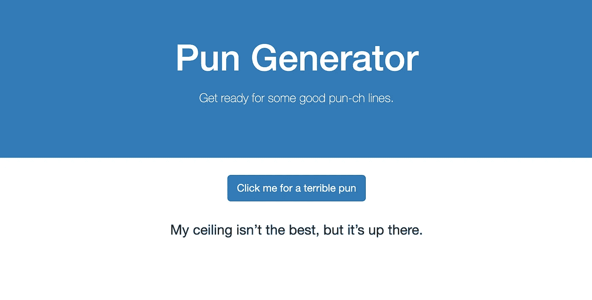

# 如何在没有 UI 框架的情况下对 HTML 和普通 JavaScript 进行单元测试

> 原文：<https://levelup.gitconnected.com/how-to-unit-test-html-and-vanilla-javascript-without-a-ui-framework-c4c89c9f5e56>

## 概念证明


比尔·牛津在 Unsplash[拍摄的照片](https://unsplash.com?utm_source=medium&utm_medium=referral)

最近我对一些事情很好奇:**有没有可能为不使用任何 UI 框架或开发工具的前端代码编写单元测试？**

换句话说，没有反应，角，或 Vue。没有 webpack 或汇总。没有任何类型的构建工具。只是一个普通的旧文件和一些普通的 JavaScript。

像这样的设置可以测试吗？

这篇文章及其附带的 GitHub repo 就是这个问题的结果。

# 先前的经验

在我的职业生涯中，我做过很多测试。我主要是一名前端软件工程师，所以我的专业领域包括使用 [Jest](https://jestjs.io/) 作为我的测试框架编写单元测试，并且在使用 React 时使用 [Enzyme](https://enzymejs.github.io/enzyme/) 或 [React 测试库](https://testing-library.com/docs/react-testing-library/intro)作为我的测试库。我还使用 [Cypress](https://www.cypress.io/) 或 [Selenium](https://www.selenium.dev/) 进行了端到端测试。

通常我选择用 React 构建用户界面。当测试这些接口时，我几年前开始使用 Enzyme，但后来我开始喜欢 React 测试库和哲学，即你应该以用户使用你的应用程序的相同方式测试你的应用程序，而不是测试实现细节。

Kent C. Dodds 的 React 测试库建立在他的 [DOM 测试库](https://testing-library.com/docs/dom-testing-library/intro)之上，顾名思义，这是一个帮助您测试 DOM 的库。我想这可能是个好的开始。

# 初步研究


照片由[迈克尔·朗米尔](https://unsplash.com/@f7photo?utm_source=medium&utm_medium=referral)在 [Unsplash](https://unsplash.com?utm_source=medium&utm_medium=referral) 上拍摄

在软件工程的世界里，你是第一个尝试某事的人是非常罕见的。几乎所有的事情都以这样或那样的形式被做过。因此，Google、Stack Overflow 和开发者论坛都是你的朋友。

我想肯定有人尝试过这种方法，并写了相关的文章。在做了一些研究后，似乎有一些人在过去尝试过，但都走进了死胡同。一个开发者[在 2019 年 8 月](https://spectrum.chat/testing-library/help-dom/test-plain-html-vanilla-js~9f56a169-ea3f-481b-b1cc-dd9fc70dbeaf)请求帮助，但没有收到回复。另一个开发人员写了一篇有用的文章,讲述了他们的想法，但不幸的是，他们最终测试了实现细节，这是我想避免的。

因此，根据我从他们的尝试中获得的信息，我开始制作自己的演示项目。

# 演示应用程序

如上所述，你可以在这里找到我的演示应用程序的代码。您还可以在这里查看[应用程序运行情况](http://tylerhawkins.info/dom-testing-demo/src/index.html)。它很小也很简单，因为这毕竟只是一个概念验证。

演示应用程序不需要很无聊，所以我为你的娱乐创造了一个双关语生成器。它看起来是这样的:



演示应用程序

查看源代码时，需要注意两个重要的文件:

*   这是整个应用程序。没有其他文件，只有一个 HTML 文件，其中有一个脚本标签。
*   `src/index.test.js`:这是测试文件。我正在使用 Jest 和 DOM 测试库。

这两个文件都很小，所以我将它们包含在下面:

## 源文件:`index.html`

## 测试文件:`index.test.js`

# 源文件概述

正如你在`index.html`文件中看到的，这没有什么特别的。如果您是第一次学习如何创建一个简单的网页，那么您的结果很可能看起来与一些基本的 HTML、CSS 和 JavaScript 非常相似。为了简单起见，我将 CSS 和 JavaScript 内联到文件中，而不是链接到其他源文件。

JavaScript 创建一个双关语数组，向按钮添加一个 click 事件侦听器，然后在每次单击按钮时在屏幕上插入一个新的双关语。很简单，对吧？

# 深入测试文件

因为这是一篇关于测试的文章，所以测试文件是这里的关键。让我们一起来看看一些更有趣的片段。

## 检索 HTML 文件

我的第一个问题是如何将 HTML 文件导入到测试文件中。如果您正在测试一个 JavaScript 文件，通常您会从想要测试的文件中导入导出的方法，如下所示:

```
import { methodA, methodB } from './my-source-file'
```

然而，在我的例子中，这种方法不适用于 HTML 文件。相反，我使用内置的`fs`节点模块来读取 HTML 文件并将其存储在一个变量中:

```
const html = fs.readFileSync(path.resolve(__dirname, './index.html'), 'utf8');
```

## 创建 DOM

现在我有了一个包含文件 HTML 内容的字符串，我需要以某种方式呈现它。默认情况下，Jest 在运行测试时使用 [jsdom](https://github.com/jsdom/jsdom) 来模拟浏览器。如果您需要配置 jsdom，您也可以在您的测试文件中显式地导入它，这就是我所做的:

```
import { JSDOM } from 'jsdom'
```

然后，在我的`beforeEach`方法中，我使用 jsdom 来呈现我的 HTML，以便我可以对它进行测试:

```
let dom
let containerbeforeEach(() => {
  dom = new JSDOM(html, { runScripts: 'dangerously' })
  container = dom.window.document.body
})
```

## 在 jsdom 环境中运行脚本

让它正常工作的最关键部分包含在传递给 jsdom 的配置选项中:

```
{ runScripts: 'dangerously' }
```

因为我已经告诉 jsdom 危险地运行脚本，它实际上会解释并执行包含在我的`index.html`文件的`script`标签中的代码。如果没有启用这个选项，JavaScript 将永远不会执行，所以测试按钮点击事件将不起作用。


**免责声明:**需要注意的是[永远不要在这里运行不受信任的脚本](https://github.com/jsdom/jsdom/#executing-scripts)。由于我控制 HTML 文件和其中的 JavaScript，我可以认为这是安全的，但是如果这个脚本来自第三方或者包含用户输入，那么采用这种方法来配置 jsdom 是不明智的。

# 斗牛中的最后一剑

现在，在完成上述设置后，当我运行`yarn test`时，它…工作了！概念验证获得了巨大的成功，人们欢欣鼓舞。


所有测试都通过了

# 结论

所以，回到最初的问题:有没有可能为前端代码编写不使用任何 UI 框架或开发人员工具的单元测试？

答案:**是的！**

虽然我的演示应用程序肯定没有反映出生产就绪应用程序的样子，但如果需要的话，以这种方式测试用户界面看起来确实是一个可行的选择。

感谢阅读！