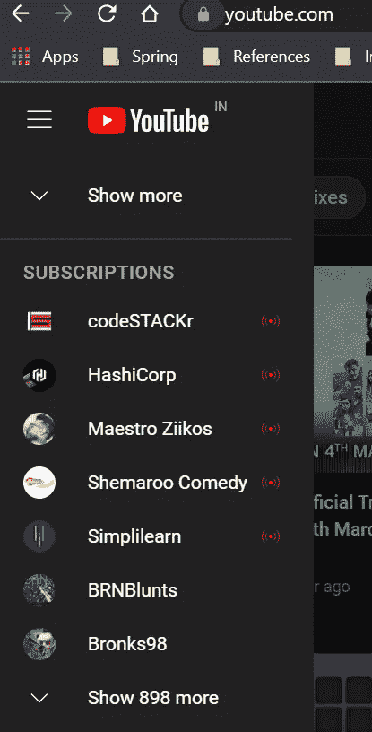
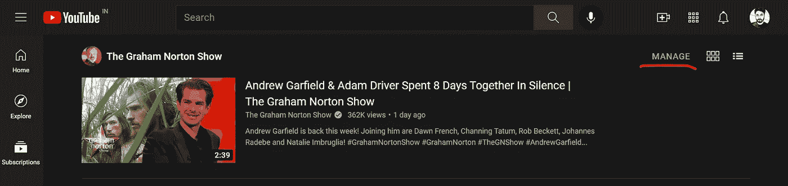
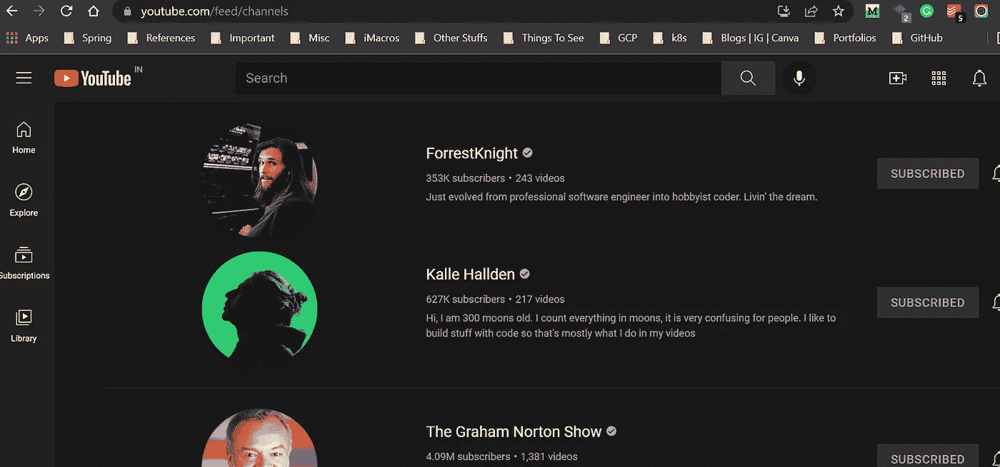
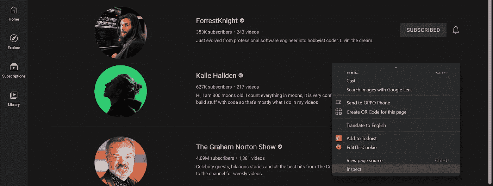
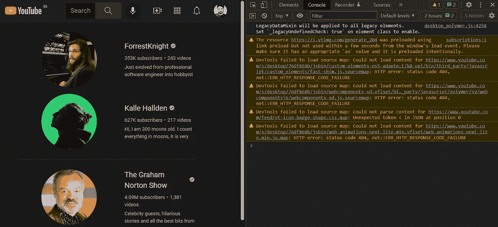
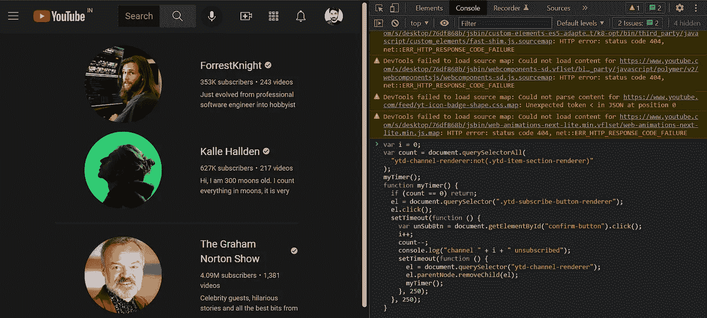
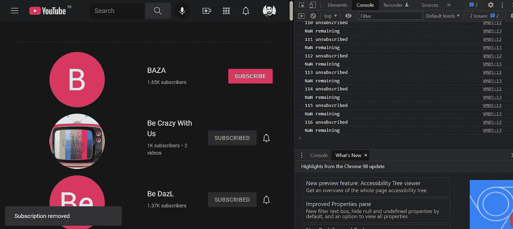

# 如何一次取消订阅所有 YouTube 频道

> 原文：<https://levelup.gitconnected.com/how-to-unsubscribe-from-all-youtube-channels-at-once-d516b3669325>

## 逐步摆脱你订阅的所有 YouTube 频道的指南。

奥马尔·阿尔·戈森在 [Unsplash](https://unsplash.com/s/photos/youtube?utm_source=unsplash&utm_medium=referral&utm_content=creditCopyText) 上拍摄的照片

如果你像我一样，那么你可能会使用一个谷歌账户在所有设备上登录你的 YouTube 频道。原因很简单。你不想错过你最喜欢的 YouTuber 上的任何视频。

但当你在订阅的多个 YouTube 频道上工作时，手机上弹出太多通知，问题就来了。我面临的另一个主要问题是，有时我会自动订阅不想要的 YouTube 频道，这很烦人。

不想要的频道订阅

不幸的是，没有一次退订所有 YouTube 频道的选项。他们以前有，但现在已经被删除了，因为谷歌不想让你取消订阅。简单的数学:更多的订阅意味着更多展示广告的机会。

显然，如果你不喜欢 YouTube 频道，你可以简单地取消订阅。当你想一次性退订 1000 个频道时，问题就来了。这样做是荒谬的。

但是，有一种简单的方法，可以使用 JavaScript 编写的脚本一次取消订阅所有频道。

*   首先，你必须登录你的 YouTube 账户(*显然是*)。
*   点击*标签，查看所有订阅列表。*

**

*单击左侧窗格中的“订阅”选项卡*

*   *点击右上角的 ***【管理】*** 按钮，管理您的订阅列表。*

**

*点击右上角的*管理*按钮*

*   *您将到达运行脚本的频道页面。您可以在浏览器中点击此[链接](https://www.youtube.com/feed/channels)直接进入该页面。*

**

*将执行脚本的订阅列表*

*   *你需要检查网页，右击页面的空白区域，选择 ***【检查】*** 选项。*

**

*右键单击页面后，单击检查选项*

*   *转到控制台选项卡，向下滚动到底部，直到看到***>***符号。您将在这里执行脚本。*

**

*   *复制以下脚本，该脚本将自动批量取消订阅 YouTube 频道。*

*   *将自动化脚本粘贴到控制台上，然后按 enter 键。*

**

*粘贴脚本并按 enter 键*

*   *该脚本将执行，所有频道将逐一取消订阅。我已经增强了代码，你会在右边看到更好的日志。*

**

*频道将一个接一个地被取消订阅*

*如果脚本失败，只需刷新页面并重复该过程。退订过程将最终完成。我订阅了 1000 多个频道，因此，这花了我一段时间。*

*我希望你会发现这篇文章很有用，并且你能够成功地取消订阅所有不想要的频道。*

*如果你喜欢读这篇文章，你可能也会发现下面的文章值得你花时间去读。*

* [## 作为 Python 开发者应该关注的 8 个 YouTube 频道

### 如果你想了解 Python 的一切，包括它的框架，强烈推荐这些渠道…

levelup.gitconnected.com](/8-youtube-channels-that-you-should-follow-as-a-python-developer-6c4f725f72ca)  [## 震撼全球科技和网络安全公司的漏洞

### Log4J 漏洞被吹捧为“过去十年中最严重的漏洞”。

blog.devgenius.io](https://blog.devgenius.io/the-vulnerability-that-has-rocked-the-worlds-tech-and-cybersecurity-firms-a257472cf3e) 

*如果你喜欢阅读有助于你更好地学习、生活和工作的故事，可以考虑* [*成为订阅者*](https://viveknaskar.medium.com/subscribe) *。成为会员后，你可以无限制地阅读 10000 篇故事、文章和作家。每月只要 5 美元。* [*如果你使用我的链接*](https://viveknaskar.medium.com/membership) *注册，我将获得一点佣金，帮助我写更多的文章。**