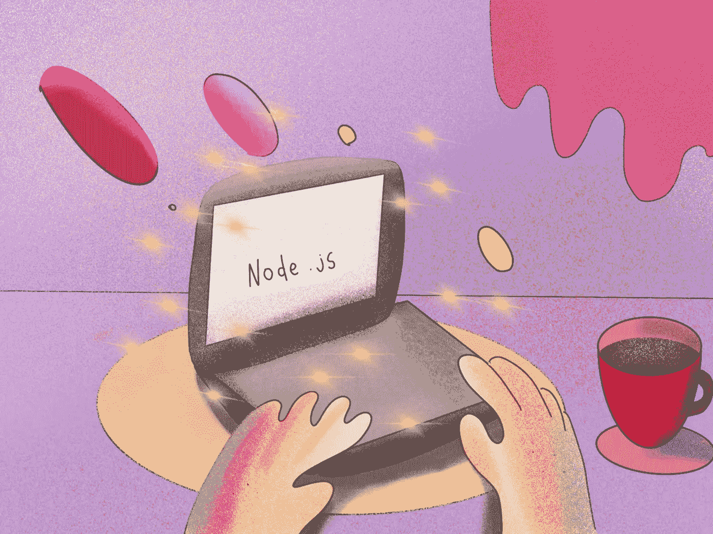
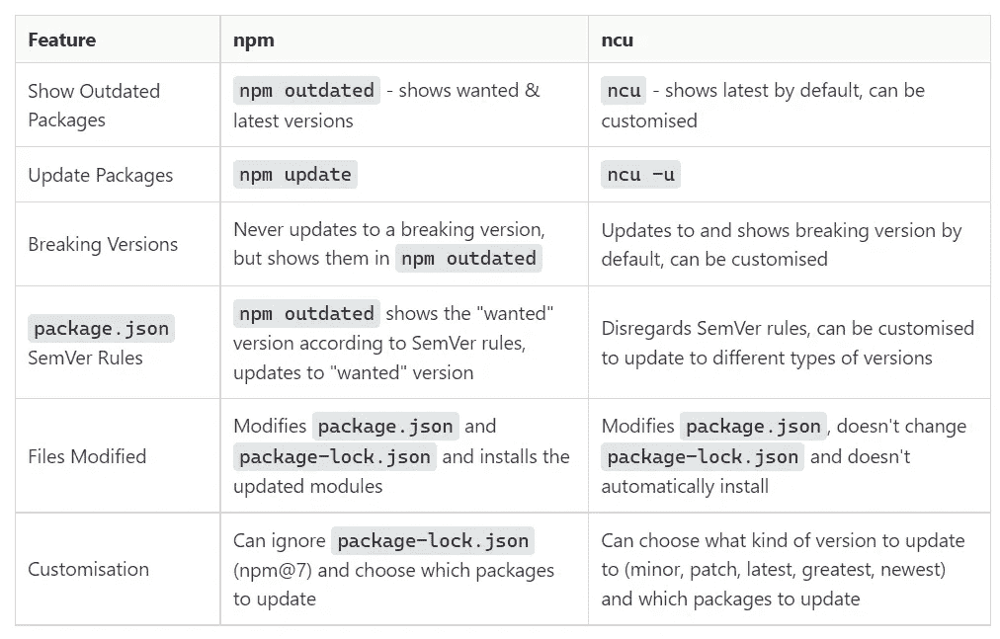

# 如何更新 Node.js 包？

> 原文：<https://levelup.gitconnected.com/how-to-update-node-js-packages-db68200dfe16>

## 始终保持您的代码最新



由[金彩云](https://www.linkedin.com/in/ChaeyunKim)绘制的插图

在 Node.js 项目中，依赖包很快就会过时，正确地更新它们可能是一项乏味的任务。本文解释了更新它们的多种方法。你可以选择适合你的项目。

## 方法 1:用 NPM 更新所有节点程序包

使用 npm 将通过 package.json 中定义的[语义版本](https://docs.npmjs.com/about-semantic-versioning)来更新所有依赖项、package.json 和 package-lock.json

```
$ **npm outdate** ==> shows all packages that can be updated (Optional)$ **npm update** ==> Do the update
```

**警告**:它不会用主要版本更新包！如果您想要主要版本，请选择选项 2。

## 方法 2:用 NCU 更新所有节点程序包

使用 ncu 会将 package.json 中定义的所有版本更新到主版本。然后，您需要运行 npm update 或 npm install 来安装 package.json 中定义的软件包版本。

```
$ **npm install -g npm-check-updates** ==> Install ncu (1st time)
$ **ncu** ==> Show packages to be updated (Optional)$ **ncu -u       ** ==> Update package.json
$ **npm install  ** ==> Update all packages
```

**警告**:根据您的框架，在某些情况下，将所有节点包更新到主版本可能会导致包不兼容。

## NPM 对 NCU



npm vs ncu 由[https://stackoverflow.com/users/4879856/eldar-b](https://stackoverflow.com/users/4879856/eldar-b)

## 方法 3:手动更新每个节点包

如果只想将某些软件包更新到主版本，可以使用以下命令手动更新:

```
$ **npm i %MODULE_NAME%@latest** ==> the latest STABLE version
$ **npm i %MODULE_NAME%@*** ==> the latest version
```

尽管你需要一个接一个地做，但这是最安全的方法。

## 选项 4:修改您的 package . JSON——总是最新的！

您可以将 package.json 中依赖项的版本定义为`latest`或`*`

```
..., **"dependencies": {
        "****MODULE_NAME****": "latest"** // using latest STABLE version **,   "****MODULE_NAME****": "*"** // using latest version **},
...,**
```

这样，你可以随时更新`npm i`。但是，建议首先检查您的框架是否在最新版本中有问题(例如，参见 GitHub 问题)

就是这样！我希望你喜欢这篇文章，并发现它们对你的日常工作或项目有用。如果你有任何问题，请随时联系我。

平安健康！
感谢您的阅读。👋😄