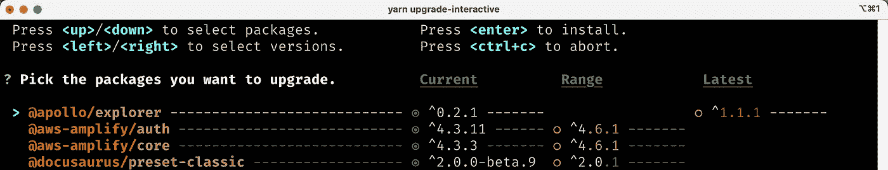

# 如何使用 Yarn 或 NPM 将软件包升级到最新版本

> 原文：<https://levelup.gitconnected.com/how-to-upgrade-a-package-to-the-latest-version-using-yarn-or-npm-bce879e67d96>

## 所以，你一直在推迟升级软件包，现在你需要快速更新到最新版本，以确保你的安全和你的老板高兴？我给你准备了文章。


sylvie charron 在 [Unsplash](https://unsplash.com?utm_source=medium&utm_medium=referral) 上拍摄的照片

这一周，我一直忙于一个工作项目，将 Docusaurus(来自脸书的基于 React 的文档静态站点生成器)从某个奇怪的 alpha 版本升级到刚刚发布的新的 2.0 版本。

```
yarn remove @docusaurus/coreyarn add @docusaurus/core
```

为什么不`yarn add`包并指定版本号`@latest`？那是因为`package.json`版本将会以`latest`结束，而不是一个真实的版本。那个*看起来*有用，但是如果你想知道你在哪个版本上呢？你每次都必须在 npm 注册表上查找它。

`npm`也是如此，这很好，因为它内置在 Node.js 中，所以你已经安装了`npm`。不需要额外的工作！

```
npm uninstall @docusaurus/corenpm install @docusaurus/core
```

我已经切换回全职使用`yarn`为[没有特别的原因](https://www.urbandictionary.com/define.php?term=for%20no%20reason)，除了我喜欢它如何着色终端。(我猜我是个[易卖](https://www.merriam-webster.com/words-at-play/usage-of-sale-sell)。)

但是，如果这篇文章是你决定跟随潮流安装`yarn`的原因，你可以从文档中用下面的命令[安装 Yarn 3:](https://yarnpkg.com/getting-started/install)

```
corepack enable
yarn init -2
```

# 那`yarn upgrade-interactive`呢？

那`yarn upgrade-interactive`命令呢？Yarn 1 中的这个便利工具实际上并没有默认包含在 Yarn 3 中。你像这样安装它:

```
yarn plugin import interactive-tools
```

一旦安装了 Yarn 3 插件，您就可以在命令行上运行`yarn upgrade-interactive`来查看所有过时的包。

```
yarn upgrade-interactive
```



MacOS 上 iTerm2 中“`yarn upgrade-interactive`”的作者截图

运行`yarn upgrade-interactive`会给出一个漂亮的小界面，让你选择在相同的主要版本或最新版本上升级。

根据[语义版本](https://semver.org/)，不应该有任何突破性的变化，除非你正在转移到一个不同的主要版本(更高的第一个数字)，所以这给了你一个伟大的工具，打破你的整个回购！

好吧，这就是我如何使用它，至少在我的个人项目上。当你在专业地工作时，我发现一次按 5 个包为一组来升级包是有帮助的，我尽量不破坏东西。😅

# 你的`yarn`是不是一直坏？

我最近学到的另一个随机但有用的`yarn`命令是`yarn clear`。显然，当使用 Yarn 3(最新版本)时，你不应该在出现问题时随意删除你的`node_modules`文件夹。(谁知道呢？)

因此，相反，Docusaurus 给你一个`yarn clear`命令，它试图从项目中删除缓存的文件以使工作正常进行。(更普遍的是，你可以在任何项目中尝试`yarn cache clear`来获得类似的效果。)

运行`yarn clear`修复了我最近在 Docusaurus 中工作时遇到的几个“`yarn`不会运行”的问题。两个例子:

```
🐬 yarn clear
[SUCCESS] Removed the Webpack persistent cache folder at "/Users/derek/dev/docs/node_modules/.cache".
/1.8s🐬 yarn clear
Removing /Users/derek/dev/docs/build
Removing /Users/derek/dev/docs/node_modules/.cache
Removing /Users/derek/dev/docs/.docusaurus                                          /1.7s
```

是的，我在用海豚表情符号🐬在 iTerm2 中我的`zsh`设置中。很可爱，对吧？无论如何，希望你已经了解了一些关于`yarn`的知识。

**快乐编码！**🐬


照片由 [Ranae Smith](https://unsplash.com/@bryteeyes3?utm_source=medium&utm_medium=referral) 在 [Unsplash](https://unsplash.com?utm_source=medium&utm_medium=referral) 上拍摄

德里克·奥斯汀博士是《T21 职业规划:如何在 6 个月内成为 6 位数的成功程序员》一书的作者，该书现已在亚马逊上出售。