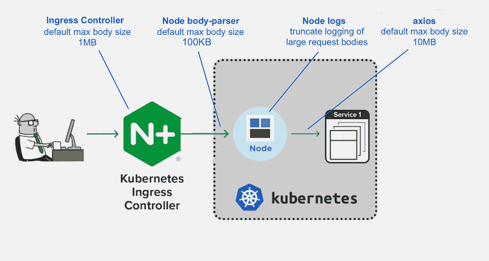

# 如何使用 JSON POST 而不是表单数据从 Angular 应用程序上传文件

> 原文：<https://levelup.gitconnected.com/how-to-upload-a-file-from-an-angular-app-using-a-json-post-rather-than-form-data-d713a5966b96>

## 记录我两个星期的奋斗，克服比我预期的更多的障碍


图片由[alohaflamingo](https://www.shutterstock.com/g/Alohaflaminggo)在 [shutterstock](https://www.shutterstock.com/image-photo/hurdle-race-on-red-running-stadium-578968027) 上拍摄

我写这个故事一部分是为了我未来的自己——所以如果我需要再做一次，我会把这个食谱放在我的指尖上——一部分是为了其他人，希望让一些可怜的灵魂免受我刚刚经历的痛苦。

# 序言

我继承了一个任务，在我们的 Angular 8 应用程序中实现文件上传功能。

这项任务与典型的文件上传有所不同，因为我们不是直接上传到文件存储服务器，而是上传到我们的中间节点服务器(由前端团队和我的团队所有)，然后上传到最终的目标文件存储微服务(由后端团队所有)。

这对我和团队的其他成员来说都是新的，所以需要进行研究。

如果我想把表单数据从浏览器直接发布到文件存储服务器上，我会很轻松，因为我发现了大量相关和有用的资源。


照片由[丹尼斯·贝利茨基](https://www.shutterstock.com/g/Denis+Belitsky)在 [shutterstock](https://www.shutterstock.com/) 上拍摄

唉，我走的是一条人迹罕至的路。


[家庭之路工作室](https://www.shutterstock.com/g/LAVRIKE)在 [shutterstock](https://www.shutterstock.com/image-photo/dense-forest-mountains-autumn-woods-665760265) 上拍摄的照片

这让一切都不同了。

我需要的信息分散在许多不同的来源中，将它们收集到一起成为实际可行的东西需要花费大量的时间、研究和失败的尝试。

# 最终目标:将 JSON 从节点发布到后端微服务

最终我们需要实现的是从节点服务器到后端端点的 JSON POST，结构如下:

```
{
  "filename": "important-info.csv",
  "data":  "QXMgSSBzYXQgaW4gdGhlIGJhdGggdHViLCBzb2FwaW5nIGE...",
  "md5Hash: "a0450857392c612ea0f5369864b60194"
}
```

其中,`data`是 base64 编码的文件数据，而`md5Hash`是数据的 MD5 哈希值，当数据到达后端时用作校验和来验证其完整性。

# 任务#1:从浏览器(角度)发布到节点

Angular 的帖子只是一个典型的 JSON 帖子，而不是表单数据帖子。

所以我们需要:

1.  提取文件的原始数据(对 JavaScript 人员来说是一个[array buffer](https://developer.mozilla.org/en-US/docs/Web/JavaScript/Reference/Global_Objects/ArrayBuffer)，对其他人来说是字节数组)
2.  生成 base64 编码的数据字符串
3.  生成数据 MD5 哈希

我们碰巧使用了 [PrimeNG 的 FileUpload 组件](https://www.primefaces.org/primeng/showcase/#/fileupload)，但是您的 JavaScript 代码有很多方法可以获得正在上传的文件。

我们从 FileUpload 组件得到的是一个由[文件](https://developer.mozilla.org/en-US/docs/Web/API/File)对象组成的数组。

## 任务 1.1:提取文件的原始数据

为了获得文件的 ArrayBuffer 数据，我使用了 [fileReader](https://developer.mozilla.org/en-US/docs/Web/API/FileReader) API，它提供了一个从 File 对象异步读取数据的接口。

## 任务 1.2:获取 Base64 编码的文件数据字符串

一旦我得到了 ArrayBuffer，我就使用方便的[base64-arraybuffer](https://www.npmjs.com/package/base64-arraybuffer)library 将它编码为 base64 字符串，该库可以在 array buffer 之间编码和解码 base64。完美！

下面是完成任务 1.1 和 1.2 的代码，将我们从 File 对象带到 base64 编码的文件数据字符串(包装在 Observable 中，因为作为所有好心的 Angular 开发人员，我们将异步事件作为流来处理):

## 任务 1.3:获取文件数据的 MD5 哈希

接下来我们需要的是文件数据的 MD5 散列。

为此，我结合使用了 [SparkMD5](https://www.npmjs.com/package/spark-md5) 库和[Michael Monerau](https://dev.to/qortex/compute-md5-checksum-for-a-file-in-typescript-59a4)编写的库的巧妙用法，该库分块读取文件以避免一次性将整个文件加载到内存中。(你会注意到，我把他的基于承诺的解决方案包装成了可观察的，因为…好心的 Angular developer。)

注意第 44 行和第 48 行，他为最终散列提供了两种格式选项。我需要 hexdigest 表单，所以我使用了第 48 行的表单。

## 任务 1.4:收集发布到节点的信息

有了生成我们需要的数据的实用方法，我们只需将它们收集到我们的 FileUploadService 中。

下面是我们的组件调用的服务方法，传递从 FileUpload 组件获得的 File 对象数组:

该方法调用另外两个方法:一个为每个文件构建 POST 主体，另一个批量执行文件的实际上传。

**建造柱身**

第一种方法是`getPostBodyForFileUpload`，将每个文件的片段放在一起。这个方法看起来是这样的:

获取编码的文件数据和生成 MD5 散列都是异步任务，我们将其包装为可观察的，所以我们只使用`[forkJoin](https://rxjs-dev.firebaseapp.com/api/index/function/forkJoin)`来执行这两个任务，并将结果映射到一个对象，该对象具有我们的 POST 主体所需的结构。

**执行岗位**

由`saveFiles`、`uploadFiles`调用的第二个方法获取 POST 主体的数组，并执行对我们的 HttpService 的实际调用。方法如下:

每个帖子可以包含一个文件数组，但是由于每个请求的大小限制(参见下面的基础设施/架构障碍)，我创建了一个名为`getGroupedFileUploadBodies`的方法，该方法遍历所有文件并将它们分组到大小限制内的集合中。所以我用一个数组(`uploadGroups)`)结束，然后映射到一个 POST 请求数组(`requests`)。

# 基础设施/架构障碍

随着上传最终从浏览器上传，我们进入了旅程的下一阶段:基础设施障碍。

## 障碍#1:快速中间件请求主体大小

第一个显然是我已经计划好的。

我们在节点服务器上使用了 [Express body-parser](https://github.com/expressjs/body-parser#bodyparserjsonoptions) 中间件，默认的最大请求正文大小是 100KB，因此我必须增加它，以考虑产品所有者请求的 2GB 文件大小限制:

很简单！


不幸的是，所有后来的障碍都不那么明显。

## 障碍#2:带 NGINX 入口控制器的 Kubernetes

我们发现大于 1MB 的上传会触发错误响应，特别是来自类似 nginx 服务器的`413 Request Entity Too Large`错误响应页面:

我们还发现请求没有到达我们的节点服务器，因为节点服务器日志中没有它们的记录。

**了解你的架构！**

我们使用 [Kubernetes](https://kubernetes.io/) 来管理我们的服务，你们中熟悉它和经常与它一起使用的 [NGINX 入口控制器](https://www.nginx.com/products/nginx/kubernetes-ingress-controller/)的人可能马上就知道 413 响应来自哪里。

不幸的是，我当时对它一无所知，在他们发现入口控制器正在拦截这些从浏览器到我们在 Kubernetes 集群中的节点服务器的请求，并且控制器的默认最大请求体大小为 1MB 之前，我与后端人员和 SRE 人员进行了几次会谈，向他们解释了我们在前端所做的事情。

因此，我们的节点服务器日志中没有 413 响应和请求记录。

克服这个障碍需要在我们的应用程序的 YAML 文件中添加注释`nginx.ingress.kubernetes.io/proxy-body-size: "0"`,以防止入口控制器对我们的节点服务器的请求施加主体大小限制:

## 障碍#3:我们嘈杂的节点日志

一旦超过 1MB 的限制，我们的下一个障碍是 10MB。

大于 1MB 的请求最终到达我们的节点服务器，但是大于 10MB 的请求在从节点到后端服务的 POST 中出错。

该请求是一个内部的集群内请求，因此没有通过入口控制器，所以我们需要查看其他地方。

我很快发现，用我们当时的节点日志排除这些错误是不可能的。

我们在节点服务器上进行日志记录，记录节点发出的每个请求的 POST 主体，以及发生错误时收到的错误对象。错误对象又包含请求对象。所以每个 POST 主体至少被写入日志两次。

因为我们以前从来没有上传过文件，所以这从来都不是问题。但是现在我们的 POST 主体可以包含 25MB 的 base64 字符串，记录完整的 POST 主体——如果出现错误，还要多次记录——会使我们的日志变成噪音。


因此，在我开始有效地排除故障之前，我必须找到代码中请求体或错误对象被写入日志的地方，并将日志消息截断到合理的大小。

## 第四个障碍(最后一个障碍！):Axios

在让我们嘈杂的日志得到控制并再次有用之后，我发现 10MB 的限制来自于我们的 Node HTTP 客户端 [axios](https://www.npmjs.com/package/axios) 。

从节点到后端服务的大于 10MB 的 POST 触发了来自 axios 的以下错误消息:

```
Request body larger than maxBodyLength limit
```

研究表明，axios 的默认最大机身大小为 10MB，可以通过向 [axios 请求配置](https://github.com/axios/axios#request-config)对象添加以下选项来覆盖:

```
maxContentLength: Infinity,
maxBodyLength: Infinity
```

根据文档，我认为我需要设置`maxBodyLength`，但这并没有解决问题——设置`maxContentLength`就解决了问题。所以，为了安全起见，我把两个都设置了。(我很乐意将它们都设置为`Infinity`，因为我们在其他地方控制请求的大小。)

# 努力做到完美！

随着 axios 配置的改变，我们终于克服了最后的障碍，应用程序运行得非常完美。


# 摘要

下面是一个让我们了解工作文件上传特性的总结。

## 构建岗位主体

1.  我们使用 [PrimeNG 的 FileUpload 组件](https://www.primefaces.org/primeng/showcase/#/fileupload)为每个上传的文件获取了一个 [File](https://developer.mozilla.org/en-US/docs/Web/API/File) 对象。
2.  我们使用 [FileReader](https://developer.mozilla.org/en-US/docs/Web/API/FileReader) API 提取文件的 ArrayBuffer 数据。
3.  我们使用库 [base64-arraybuffer](https://www.npmjs.com/package/base64-arraybuffer) 对 ArrayBuffer 数据进行 base64 编码。
4.  我们使用 [SparkMD5](https://www.npmjs.com/package/spark-md5) 库和该库的基于承诺的实现[生成了 ArrayBuffer 数据的 MD5 散列。](https://dev.to/qortex/compute-md5-checksum-for-a-file-in-typescript-59a4)

## 让邮件通过管道

事实证明，构造格式正确的请求只是成功的一半。让这些请求通过管道被证明至少同样具有挑战性。

下图显示了我们需要安抚的各种把关者，以保持上传向最终目的地前进:



文件上传的基础设施障碍(斯科特·亚当斯的《呆伯特》中的卡通人物)

# 结论

这是我长期以来最具挑战性的任务之一，因为对我来说有太多的未知。

我在想，如果我在两周前就知道我现在所知道的所有这些难题，从如何构造 POST 主体到如何让这些 POST 请求通过管道中的各个网关守护设备，事情会进展得多顺利。

有时候，我觉得自己就像印第安纳·琼斯(Indiana Jones)试图越过通往圣杯之路上的保护性陷阱:我刚解决了一个挑战，另一个挑战就在后面等着我。


# 离别之思

因此，我希望这篇文章有助于将完成这项任务所需的各个部分集中在一个地方，也许至少可以节省一个人一点时间和压力。