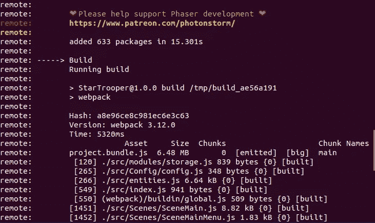

# 如何用 Webpack 上传 phaser 游戏到 Heroku(无 Express)

> 原文：<https://levelup.gitconnected.com/how-to-upload-a-phaser-game-with-webpack-to-heroku-no-express-e083ab741dc3>


这可能是一个非常小众的话题，但就在最近，我有一个项目需要我使用 Webpack，令我惊讶的是，在如何将 phaser(和 Webpack)制作的游戏上传到 Heroku 方面，没有多少清晰明确的指南。

您可以托管自己的服务器，并做所有需要的事情来运行一个游戏，只使用 Webpack，所以没有理由争论和打破你的头撞向键盘，试图让你的 phaser 游戏运行与快速。

所以这一次我将试着写一个特别的教程，它容易理解，任何对 Javascript(和 JSON)有一点经验的人都可以理解。

***足下*** 🦶

让我们从下载我们将用于本指南的材料开始。

[我们需要一个可以在这里下载的 Webpack 模板。](https://phasertutorials.com/creating-a-phaser-3-template-part-3/)不需要做这个教程，但我强烈推荐它，以防你有什么问题。

接下来，[我们必须创建一个 Heroku 账户](https://signup.heroku.com/)并下载 Heroku CLI。

如果您使用 Linux，您可以简单地用下面这行代码安装它:

```
sudo snap install --classic heroku
```

在 macOS 上:

```
brew tap heroku/brew && brew install heroku
```

对于 windows，你需要[来访问网站并下载。](https://devcenter.heroku.com/articles/heroku-cli)

接下来，安装完 Heroku CLI 后，您需要使用终端登录 Heroku 帐户。

```
heroku login
```

登录游戏应用程序目录后，我们将创建一个新的 Heroku 应用程序:

```
heroku create phaserGameName
```

只需为您的游戏应用程序添加任何您想要使用的名称，这样您就可以记住它。

***设置*** ⚙️

在您最近下载的 phaser 模板中，应该有一个名为“package.json”的文件。

用您的代码编辑器打开这个文件，让我们在最后添加一行:

```
"heroku-run-build-script": true
```

根据 Heroku 文档，它将请求 Heroku 运行您在 package.json 文件的脚本部分提到的任何命令。

现在，我们必须对脚本部分中的“start”行进行一些更改。我们将让 Heroku 绑定 Heroku-dyno 创建的任何端口，并默认使用公共 IP 地址，而不是请求端口 8000。

```
“start”: “npm run build && webpack-dev-server --host=0.0.0.0 --port=$PORT”
```

您的 package.json 应该如下所示:

```
{
  "name": "StarTrooper",
  "version": "1.0.0",
  "description": "A Phaser 3 Space Shooter Game",
  "main": "src/index.js",
  "scripts": {
    "build": "webpack",
    "start": "npm run build && webpack-dev-server --host=0.0.0.0 --port=$PORT"
  },
  "repository": {
    "type": "git",
    "url": "git+[https://github.com/idgm5/shootergame.git](https://github.com/idgm5/shootergame.git)"
  },
  "license": "MIT",
  "licenseUrl": "[http://www.opensource.org/licenses/mit-license.php](http://www.opensource.org/licenses/mit-license.php)",
  "bugs": {
    "url": "[https://github.com/idgm5/shootergame.git/issues](https://github.com/idgm5/shootergame.git/issues)"
  },
  "homepage": "[https://github.com/idgm5/shootergame](https://github.com/idgm5/shootergame)",
  "devDependencies": {
    "canvas": "^2.1.0",
    "phaser": "^3.3.0",
    "raw-loader": "^0.5.1",
    "webpack": "^3.12.0",
    "webpack-dev-server": "^2.11.0"
  },
  "heroku-run-build-script": true
}
```

在将应用程序上传到 Heroku 之前，因为我们使用的是 devDependencies 而不是 Dependencies，所以我们必须请求 Heroku 安装 Package.json 文件中指定的任何依赖项。

我们可以通过在终端中运行以下命令来做到这一点:

```
heroku config:set NPM_CONFIG_PRODUCTION=false
```

*注意:不建议用于生产发布。*

***上传时间*** ☁️

上传应用程序后，您会看到 Heroku 正在使用 Webpack 构建应用程序:



现在，在网络浏览器中打开你的应用程序，哇！✨


坏了！😭

根据 [smart bear](https://help.crossbrowsertesting.com/faqs/testing/invalid-host-header-error/) 的说法，这种错误最常见的原因是应用服务器的错误配置导致其拒绝非本地连接。

一个快速的解决方法就是在“start”的末尾增加这一行:

```
--disable-host-check
```

它应该是这样的:

```
"start": "npm run build && webpack-dev-server --host=0.0.0.0 --port=$PORT --disable-host-check"
```


这是一个游戏，我前几天做的。请尝试一下:【http://startrooper.herokuapp.com/ 

**现在，如果你更新你的代码并将修改提交给 Heroku，它应该可以工作了——祝贺你！**🎉

你想看更多的教程吗？ [**用 tweet**](https://twitter.com/idgm5) **或** [**告诉我如果你有任何问题请在 Github**](http://github.com/idgm5) **上给我发消息！📣**