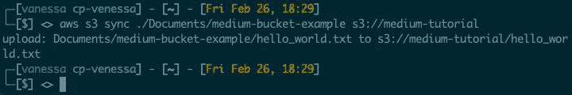
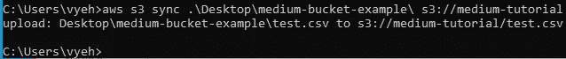
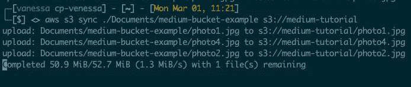
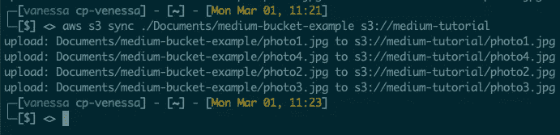

# 如何将文件上传和同步到 AWS S3 存储桶

> 原文：<https://levelup.gitconnected.com/how-to-upload-and-sync-files-to-an-aws-s3-bucket-52ddfcec5bc1>


[丹尼尔·埃勒杜特](https://unsplash.com/@pixtolero2?utm_source=medium&utm_medium=referral)在 [Unsplash](https://unsplash.com?utm_source=medium&utm_medium=referral) 上的照片

## AWS CLI 和 AWS PowerShell 数据迁移工具的比较

AWS CLI 和 AWS PowerShell 工具是功能强大的开源工具，允许您通过命令行 Shell 与 AWS 服务进行交互。

下面我将提供每个工具的官方文档的链接，以及入门所需的最基本的命令。我还将包括一些使用这些工具上传文件时可能遇到的障碍和解决方案或变通办法。

如果你想知道他们如何比较，请滚动到文章的最后一节。

我们的目标是为希望安装和使用这些工具的人提供快速参考，并帮助他们做出决策，选择更适合数据迁移的工具。

# 先决条件

*   AWS S3 时段和时段名称

 [## 创建存储桶

### 要将您的数据上传到亚马逊 S3，您必须首先在其中一个 AWS 区域创建一个亚马逊 S3 存储桶。当您创建…

docs.aws.amazon.com](https://docs.aws.amazon.com/AmazonS3/latest/userguide/create-bucket-overview.html) 

*   AWS 帐户的访问密钥和密钥对

 [## AWS 帐户和访问密钥

### 要访问 AWS，您需要注册一个 AWS 帐户。访问密钥包括访问密钥 ID 和秘密访问…

docs.aws.amazon.com](https://docs.aws.amazon.com/powershell/latest/userguide/pstools-appendix-sign-up.html) 

# AWS CLI

## 装置

 [## 安装、更新和卸载 AWS CLI 版本 2

### 在您的系统上安装 AWS 命令行界面版本 2 (AWS CLI 版本 2)。

docs.aws.amazon.com](https://docs.aws.amazon.com/cli/latest/userguide/install-cliv2.html) 

打开您的终端(Mac)或命令提示符(Windows)。

## 苹果个人计算机

运行以下命令。当它提示您输入密码时，请输入您电脑的密码。注意:使用`sudo`将为所有用户*安装 CLI，但避免了路径问题。*

```
$ **curl “**[**https://awscli.amazonaws.com/AWSCLIV2.pkg**](https://awscli.amazonaws.com/AWSCLIV2.pkg)**" -o “AWSCLIV2.pkg”**
 % Total % Received % Xferd Average Speed Time Time Time Current
 Dload Upload Total Spent Left Speed
100 23.8M 100 23.8M 0 0 10.2M 0 0:00:02 0:00:02 — : — : — 10.2M$ **sudo installer -pkg AWSCLIV2.pkg -target /**
Password:
installer: Package name is AWS Command Line Interface
installer: Installing at base path /
installer: The install was successful.
```

## Windows 操作系统

点击下面的链接，下载**。在**步骤 1** 中列出的 msi** 文件。应该会很快。下载完成后，点击安装包，会弹出一个屏幕引导你完成安装。您可以保留所有默认选项。

 [## 在 Windows 上安装、更新和卸载 AWS CLI 版本 2

### 对于 AWS CLI 版本 1，Python 2.7、3.4 和 3.5 已被弃用。有关更多信息，请参见 AWS CLI 版本 1…

docs.aws.amazon.com](https://docs.aws.amazon.com/cli/latest/userguide/install-cliv2-windows.html) 

安装完成后，对于任一操作系统，运行该命令并查看它是否抛出错误。

```
$ **aws --version** aws-cli/2.1.28 Python/3.8.8 Darwin/20.3.0 exe/x86_64 prompt/off
```

如果有错误:

*   Windows:关闭并重新打开命令提示符以刷新路径
*   Mac:运行`which aws`找到它的安装位置，并将其添加到您的路径中
*   如果还是不行，就把错误复制粘贴到你的谷歌搜索栏里，按回车，点击前面几个链接。其中一个有希望包含答案。🙏🏼

如果它告诉你你有哪个版本，恭喜你！

现在是时候用您的访问密钥和秘密访问密钥配置您的 AWS bucket 了。运行`aws configure`它会提示你它需要的一切。(您现在还不需要存储桶名称。这只是为了让 CLI 知道它正在使用哪个 AWS 帐户。)

```
$ **aws configure** 
AWS Access Key ID [None]: *AKFIE8F0DL2LK0EXAMPLE* 
AWS Secret Access Key [None]:*wJalrXUtnFEMI/K7MDENG/bPxRfiCYEXAMPLEKEY* Default region name [None]: *us-west-2* 
Default output format [None]: *json (can leave blank, just hit enter)*
```

## 上传和同步文件

若要上传和同步您的文件，请运行以下命令。您将需要您的**桶名**和本地目录的**文件路径**。

> 提示:确保命令行位于正确的文件夹中，或者使用绝对路径。如果您感到困惑，使用绝对路径是最简单的，因为它包含根目录。
> 
> 绝对路径示例:
> Mac:' ~/Desktop/folderto upload '
> Windows:' C:\ Users \ Venessa \ Desktop \ folderto upload '

## 苹果个人计算机

```
$ **aws s3 sync ./FOLDER_PATH s3://BUCKET_NAME/SUB_DIRECTORY**
```



## Windows 操作系统

```
$ **aws s3 sync .\FOLDER_PATH s3://BUCKET_NAME/SUB_DIRECTORY**
```



此外，如果您注意到了，您不需要在本地目录(Windows 或 Mac)的路径末尾加斜杠，但这也没有坏处。

> 提示:当您重新获得对命令行会话的控制，并且不再看到“Completed…”时，您就会知道什么时候完成了。当它上传一个大文件并且长时间处于“已完成”状态时，这让我很困惑。我以为它可能已经完成了，但它仍然在同步。



仍在同步…



完整！

这就是用 AWS CLI 上传和同步文件的全部内容！超级简单，对吧？

如果它由于某种原因中断或您的计算机意外重启，您可以通过运行上面的完整`aws s3 sync`命令**轻松重启同步**而无需复制文件。它会从停止的地方继续前进！

以下是所有可能参数的文档:

[](https://docs.aws.amazon.com/cli/latest/reference/s3/sync.html) [## sync - AWS CLI 1.19.16 命令参考

### (布尔值)显示使用指定命令执行的操作，而不实际运行它们…

docs.aws.amazon.com](https://docs.aws.amazon.com/cli/latest/reference/s3/sync.html) 

# AWS PowerShell 工具

## 装置

 [## 为 PowerShell 安装 AWS 工具

### 安装用于 PowerShell 的 AWS 工具-用于 PowerShell 的 AWS 工具，以成功安装和使用 AWS 工具…

docs.aws.amazon.com](https://docs.aws.amazon.com/powershell/latest/userguide/pstools-getting-set-up.html) 

## 苹果个人计算机

要安装 PowerShell:

```
$ **brew install --cask powershell**
```

打开 Powershell:

```
$ **pwsh**
```

## Windows 操作系统

点击开始→输入“PowerShell”→点击 Windows PowerShell。以管理员身份打开**而不是**。亚马逊解释道:

> 我们建议您*不要*以具有提升权限的管理员身份运行 PowerShell，除非手头的任务需要。这是因为潜在的安全风险，并且不符合最小特权原则。

打开 PowerShell 后，运行以下命令:

```
$ **Install-Module -Name AWS.Tools.Installer**
```

然后，通过运行下面的命令来设置凭据。注意:与`aws configure`不同，如果你只是运行`Set-AWSCredential`，这里没有提示，你需要在一个命令中输入所有内容。

```
$ **Set-AWSCredential `
                 -AccessKey AKIA0123456787EXAMPLE `
                 -SecretKey e51zRpSvNYzYe/Qmb6SHvC+FdNm6EXAMPLEKEY `
                 -StoreAs default**
```

## 上传和同步

要将文件上传到 S3 bucket 的根文件夹中，您将需要 bucket 名称和`-File`参数，这将是您本地机器上文件的**名称:**

```
$ **Write-S3Object -BucketName bucket -File file.txt**
```

要上传到 S3 桶中的一个*特定位置*，您可以使用`-Key` 参数并将**路径指定为一个字符串**(这是**而不是**访问密钥或秘密访问密钥)。

```
$ **Write-S3Object -BucketName bucket -Key "SUBFOLDER/FILE.txt" -File file.txt**
```

要同步*整个文件夹*，使用`-Folder`参数，它将是您本地机器上的路径。同样，请确保您位于正确的文件夹中或使用绝对路径。

## 可选择的

使用
`-KeyPrefix`参数(这是**而不是**访问密钥或秘密访问密钥)将文件夹上传到 S3 桶内的*子目录*。

Write-S3Object 只上传文件夹中的文件。如果您在文件夹中有*文件夹，并且也想获取其中的文件，您可以使用`-Recurse`参数并将其设置为 **True。***

以下是包含所有选项的完整命令的外观:

```
$ **Write-S3Object -BucketName bucket -Folder .\Scripts -KeyPrefix Scripts\ -Recurse True**
```

以下是所有可能参数的文档:

 [## 用于 PowerShell 参考的 AWS 工具

### 编辑描述

docs.aws.amazon.com](https://docs.aws.amazon.com/powershell/latest/reference/items/Write-S3Object.html) 

# 那么，您应该使用哪一个来进行数据迁移呢？

我会说是 AWS CLI。原因如下:

两者都很容易安装和开始。您可以使用其中任何一个上传单个和批处理文件。

然而，在同步大量文件时，PowerShell 工具可能比不上 AWS CLI。

从某种意义上说，它们都是同步的，在一天结束时，您的 S3 存储桶将看起来像您的本地目录。主要区别在于 PowerShell 工具将重新上传它们，而不管它们是否已经被更新或导入；而 CLI 工具只会在文件尚未导入或已更新的情况下导入文件，这在您随着时间推移迁移数据并添加新文件时尤其有利。

> 随着时间的推移，CLI 工具对于大型数据迁移来说更加高效，因为它可以从中断的地方重新开始，而 PowerShell 工具则不能。

PowerShell 工具最有用的特性之一是，您可以编写 Shell 脚本来管理 AWS 资源。因此，您可以编写一个 shell 脚本来克服这个问题，但是这会变得冗长而低效，尤其是如果您可以使用 AWS CLI 的内置特性:`aws sync`用一行代码就可以做到这一点。

我希望我能够帮助你开始使用这些工具来同步你的数据。如果你有任何问题，请不要犹豫地问！