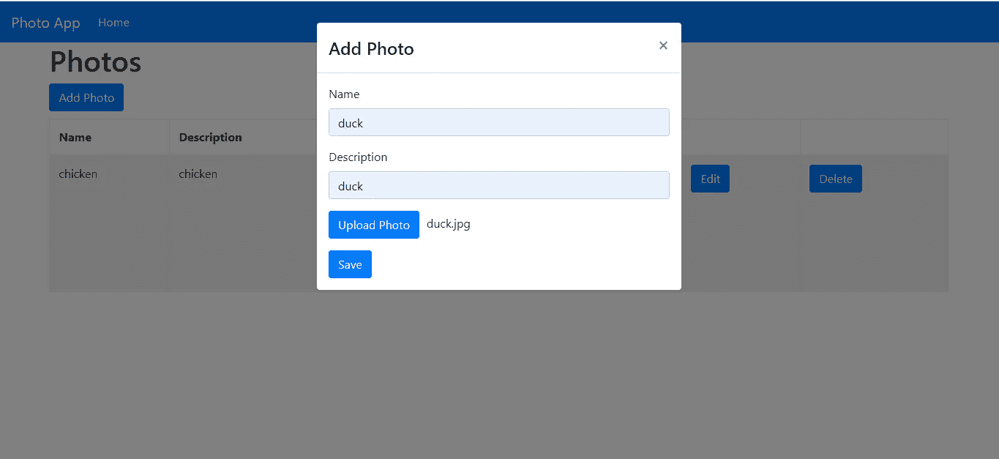
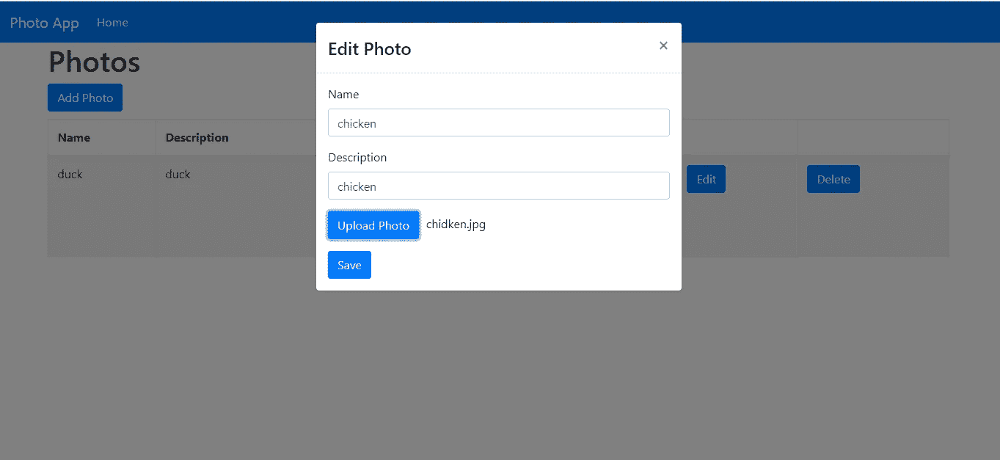
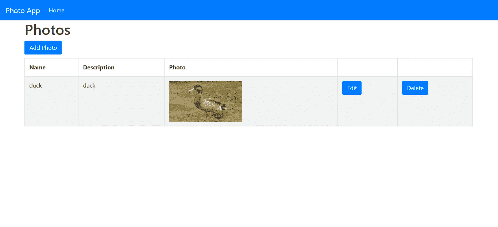

# 如何用 React 和 Node.js 上传文件

> 原文：<https://levelup.gitconnected.com/how-to-upload-files-with-react-and-node-js-a622b4594bb9>



文件上传是 web 应用程序的常见操作。在 Node.js 中，使用 Express web 框架和 Multer 库，将文件上传功能添加到您的应用程序非常容易。

要将文件上传功能添加到您的应用程序中，首先您需要一个类型为`file`的输入字段。默认情况下，这种类型的输入呈现为一个很难设计样式的按钮。用户点击对话框，如果您给它附加了一个`onChange`处理程序，那么您就可以使用 JavaScript 访问 file 对象。`onChange`处理程序接受一个参数，这个参数就是`event`对象。对象在`target.files`属性下有文件。一旦你有了它，你就可以用`append`函数把它添加到`FormData`对象中，并把它附加到表单提交中。

在本文中，我们将制作一个照片管理器应用程序，让用户输入姓名、描述，并上传带有文本的照片。

我们将用 React 表示前端，用 Multer 表示后端。

# 后端:用于文件上传的 Node.js

我们从构建后端开始。我们创建项目文件夹和项目文件夹中的一个`backend`文件夹。然后进入`backend`文件夹，运行`npx express-generator`为我们的后端应用程序生成代码文件。

接下来，我们运行`npm i`来安装生成器为我们的后端提供的包。我们还需要 Babel 能够使用`import`语法、用于跨域通信的 CORS 包、用于 Express 文件上传的 Multer、作为 ORM 的 Sequelize 和作为数据库的 SQLite3。为了简单起见，我们将使用 SQLite。

要安装所有的包，运行`npm i @babel/cli @babel/core @babel/node @babel/preset-env cors multer sequelize sqlite3`，然后在`backend`文件夹的根目录下创建一个名为`.babelrc`的文件，并添加:

```
{
    "presets": [
        "[@babel/preset-env](http://twitter.com/babel/preset-env)"
    ]
}
```

然后在`package.json`的`scripts`部分，我们添加:

```
"start": "nodemon --exec npm run babel-node --  ./bin/www",
"babel-node": "babel-node"
```

这让我们可以用 Babel 而不是常规的节点运行时来运行我们的应用程序。我们还应该安装`nodemon`来观察文件的变化，并重启应用程序。通过运行`npm i -g nodemon`进行全局安装。

接下来，我们运行`backend`文件夹中的`npx sequelize-cli init`来创建有序的 ORM 代码，让我们可以进行迁移。

完成之后，我们应该创建一个`config.js`。在那里，将现有代码替换为:

```
{
  "development": {
    "dialect": "sqlite",
    "storage": "development.db"
  },
  "test": {
    "dialect": "sqlite",
    "storage": "test.db"
  },
  "production": {
    "dialect": "sqlite",
    "storage": "production.db"
  }
}
```

这指定 SQLite 作为我们的数据库。

接下来，我们使用模型创建一个迁移:

```
npx sequelize-cli model:create --name Photo --attributes name:string,description:string,photoPath:string
```

注意，我们在`attributes`标志后的逗号之间没有空格。

运行`npx sequelize-cli db:migrate`来创建数据库。

之后，我们创建处理照片的路径。在`routes`文件夹中，创建`photos.js`并添加:

```
var express = require("express");
var multer = require("multer");
var router = express.Router();
const models = require("../models");
const storage = multer.diskStorage({
  destination: (req, file, cb) => {
    cb(null, "./uploads");
  },
  filename: (req, file, cb) => {
    cb(null, `${file.fieldname}_${+new Date()}.jpg`);
  }
});const upload = multer({
  storage
});/* GET users listing. */
router.get("/", async (req, res, next) => {
  const photos = await models.Photo.findAll();
  res.json(photos);
});router.post("/add", upload.single("photo"), async (req, res, next) => {
  try {
    const path = req.file.path;
    const { name, description } = req.body;
    const entry = await models.Photo.create({
      name,
      description,
      photoPath: path
    });
    res.json(entry);
  } catch (ex) {
    res.status(400).send({ error: ex });
  }
});router.put("/edit", upload.single("photo"), async (req, res, next) => {
  try {
    const path = req.file && req.file.path;
    const { id, name, description } = req.body;
    let params = {};
    if (path) {
      params = {
        name,
        description,
        photoPath: path
      };
    } else {
      params = {
        name,
        description
      };
    }
    const photo = await models.Photo.update(params, {
      where: {
        id
      }
    });
    res.json(photo);
  } catch (ex) {
    res.status(400).send({ error: ex });
  }
});router.delete("/delete/:id", async (req, res, next) => {
  const { id } = req.params;
  await models.Photo.destroy({
    where: {
      id
    }
  });
  res.json({ deleted: id });
});module.exports = router;
```

这些都是操纵照片的路线。`models`文件是由 Sequelize CLI 创建的，它包含模型对象，我们操纵这些对象将数据保存到 Photos 表中。我们有一个用`findAll`获取照片的 GET 路径，一个用`create`保存`Photo`的 POST 路径，一个用`update`更新模型的 PUT 路径，一个用`destroy`删除照片的 DELETE 路径。

为了添加文件上传，我们使用之前安装的`multer`包。添加起来很简单。我们只需指定要上传文件的文件名和文件夹，如下面的代码块所示:

```
const storage = multer.diskStorage({
  destination: (req, file, cb) => {
    cb(null, "./uploads");
  },
  filename: (req, file, cb) => {
    cb(null, `${file.fieldname}_${+new Date()}.jpg`);
  }
});const upload = multer({
  storage
});
```

我们在`multer`中间件中加入了我们想要访问文件的路径，如下所示:

```
upload.single("photo")
```

这指定我们让前端上传一个带有`photo`字段的文件到`FormData`中。

然后，我们可以通过使用`req.file.path`将路径保存到我们的数据库中来访问路径中保存文件的文件路径。

我们需要在`backend`文件夹中创建一个`uploads`文件夹来保存文件。

接下来在`app.js`中，我们将现有代码替换为:

```
var createError = require("http-errors");
var express = require("express");
var path = require("path");
var cookieParser = require("cookie-parser");
var logger = require("morgan");
var cors = require("cors");var indexRouter = require("./routes/index");
var photosRouter = require("./routes/photos");var app = express();// view engine setup
app.set("views", path.join(__dirname, "views"));
app.set("view engine", "jade");
app.use(cors());app.use(logger("dev"));
app.use(express.json());
app.use(express.urlencoded({ extended: false }));
app.use(cookieParser());
app.use(express.static(path.join(__dirname, "public")));
app.use(express.static(path.join(__dirname, "uploads")));app.use("/", indexRouter);
app.use("/photos", photosRouter);// catch 404 and forward to error handler
app.use(function(req, res, next) {
  next(createError(404));
});// error handler
app.use(function(err, req, res, next) {
  // set locals, only providing error in development
  res.locals.message = err.message;
  res.locals.error = req.app.get("env") === "development" ? err : {};// render the error page
  res.status(err.status || 500);
  res.render("error");
});module.exports = app;
```

在这个文件中，我们添加了`app.use(cors());`来支持前端跨域请求到后端。我们用下面的代码将`photos`路由暴露给前端:

```
var photosRouter = require(“./routes/photos”);
app.use("/photos", photosRouter);
```

我们添加了一个静态路径路由来访问文件:

```
app.use(express.static(path.join(__dirname, "uploads")));
```

既然后端已经完成，我们可以继续进行前端。

# 前端:用 React 上传文件

我们将使用 React 构建带有 MobX 的前端，用于简单的状态管理。为了创建框架代码，我们运行`npx create-react-app frontend`。

接下来，我们必须安装一些软件包。我们将安装 MobX，用于样式化的 Bootstrap，用于路由的 React Router，分别用于表单值处理和表单验证的 Formik 和 Yup，以及用于发出 HTTP 请求的 Axios。

为此，运行`npm i axios bootstrap formik mobx mobx-react react-bootstrap react-router-dom yup`来安装所有的包。

安装好所有的包后，我们就可以开始写代码了。首先，我们用以下代码替换`App.js`中的现有代码:

```
import React from "react";
import { Router, Route, Link } from "react-router-dom";
import HomePage from "./HomePage";
import TopBar from "./TopBar";
import { createBrowserHistory as createHistory } from "history";
import { photosStore } from "./store";
const history = createHistory();function App() {
  return (
    <div className="App">
      <Router history={history}>
        <TopBar />
        <Route
          path="/"
          exact
          component={props => (
            <HomePage {...props} photosStore={photosStore} />
          )}
        />
      </Router>
    </div>
  );
}export default App;
```

这将添加一个顶栏，我们接下来将创建它，我们定义路由，以便当我们转到已定义的 URL 时，可以看到主页和地址生成器页面。

接下来为我们的主页在`src`中创建`HomePage.js`。在其中，我们将显示条目表，其中包含名称、描述、照片以及用于打开添加/编辑照片表单和删除条目的按钮。

在文件中，我们添加了:

```
import React, { useState, useEffect } from "react";
import * as yup from "yup";
import "./HomePage.css";
import Modal from "react-bootstrap/Modal";
import PhotoForm from "./PhotoForm";
import Button from "react-bootstrap/Button";
import Table from "react-bootstrap/Table";
import { observer } from "mobx-react";
import { getPhotos, deletePhoto, APIURL } from "./requests";function HomePage({ photosStore }) {
  const [show, setShow] = useState(false);
  const [showEdit, setShowEdit] = useState(false);
  const [initialized, setInitialized] = useState(false);
  const [selectedPhoto, setSelectedPhoto] = useState({});
  const handleClose = () => setShow(false);
  const handleShow = () => setShow(true); const handleEditClose = () => setShowEdit(false);
  const handleEditShow = photo => {
    setSelectedPhoto(photo);
    setShowEdit(true);
  }; const getAllPhotos = async () => {
    const response = await getPhotos();
    photosStore.setPhotos(response.data);
  }; const deletePhotoById = async id => {
    await deletePhoto(id);
    await getAllPhotos();
  }; const onSave = () => {
    setShow(false);
    setShowEdit(false);
  }; useEffect(() => {
    if (!initialized) {
      getAllPhotos();
      setInitialized(true);
    }
  }); return (
    <div className="home-page">
      <h1>Photos</h1>
      <Button variant="primary" onClick={handleShow}>
        Add Photo
      </Button> <Table striped bordered hover style={{ marginTop: 10 }}>
        <thead>
          <tr>
            <th>Name</th>
            <th>Description</th>
            <th>Photo</th>
            <th></th>
            <th></th>
          </tr>
        </thead>
        <tbody>
          {photosStore.photos.map((p, i) => {
            const splitPath = p.photoPath.split("\\");
            const path = splitPath[splitPath.length - 1];
            return (
              <tr key={i}>
                <td>{p.name}</td>
                <td>{p.description}</td>
                <td>
                  
                </td>
                <td>
                  <Button onClick={handleEditShow.bind(this, p)}>Edit</Button>
                </td>
                <td>
                  <Button onClick={deletePhotoById.bind(this, p.id)}>
                    Delete
                  </Button>
                </td>
              </tr>
            );
          })}
        </tbody>
      </Table> <Modal show={show} onHide={handleClose}>
        <Modal.Header closeButton>
          <Modal.Title>Add Photo</Modal.Title>
        </Modal.Header> <Modal.Body>
          <PhotoForm
            edit={false}
            photosStore={photosStore}
            onSave={onSave.bind(this)}
          />
        </Modal.Body>
      </Modal> <Modal show={showEdit} onHide={handleEditClose}>
        <Modal.Header closeButton>
          <Modal.Title>Edit Photo</Modal.Title>
        </Modal.Header> <Modal.Body>
          <PhotoForm
            edit={true}
            photosStore={photosStore}
            selectedPhoto={selectedPhoto}
            onSave={onSave.bind(this)}
          />
        </Modal.Body>
      </Modal>
    </div>
  );
}export default observer(HomePage);
```

`Table`由 React Bootstrap 提供。我们只是在自己的行中显示每个条目。条目由我们将要创建的 MobX 商店提供。模态包含`PhotoForm`，它有所有用于操作照片的输入。我们将使用它进行添加和编辑，所以我们需要传入`edit`属性来区分添加和编辑。我们还传入了一个`onSave`函数，这样我们就可以关闭模态。如果选择了一个条目进行编辑，我们还会传入`selectedPhoto` prop，它包含用户正在编辑的条目。

接下来，我们构建照片表单。在`src`文件夹中创建一个名为`PhotoForm.js`的文件，并添加:

```
import React from "react";
import { useEffect, useState } from "react";
import { Formik } from "formik";
import Form from "react-bootstrap/Form";
import Col from "react-bootstrap/Col";
import Button from "react-bootstrap/Button";
import * as yup from "yup";
import "./PhotoForm.css";
import { getPhotos, addPhoto, editPhoto } from "./requests";
import { observer } from "mobx-react";const schema = yup.object({
  name: yup.string().required("Name is required"),
  description: yup.string().required("Description is required")
});function PhotoForm({ photosStore, edit, selectedPhoto, onSave }) {
  const fileUpload = React.createRef();
  const [photo, setPhoto] = useState(null);
  const [fileName, setFileName] = useState("");
  const getAllPhotos = async () => {
    const response = await getPhotos();
    photosStore.setPhotos(response.data);
  }; const handleSubmit = async evt => {
    const isValid = await schema.validate(evt);
    if (!isValid) {
      return;
    }
    try {
      let bodyFormData = new FormData();
      if (!edit) {
        bodyFormData.set("name", evt.name);
        bodyFormData.set("description", evt.description);
        bodyFormData.append("photo", photo);
        await addPhoto(bodyFormData);
      } else {
        bodyFormData.set("id", selectedPhoto.id);
        bodyFormData.set("name", evt.name);
        bodyFormData.set("description", evt.description);
        if (photo) {
          bodyFormData.append("photo", photo);
        }
        await editPhoto(bodyFormData);
      }
    } catch (error) {
      alert("Upload must be an image");
    } await getAllPhotos();
    onSave();
  }; const setFile = evt => {
    setPhoto(evt.target.files[0]);
    setFileName(evt.target.files[0].name);
  }; const openUploadDialog = () => {
    fileUpload.current.click();
  }; return (
    <div>
      <Formik
        validationSchema={schema}
        onSubmit={handleSubmit}
        initialValues={edit ? selectedPhoto : {}}
      >
        {({
          handleSubmit,
          handleChange,
          handleBlur,
          values,
          touched,
          isInvalid,
          errors
        }) => (
          <Form noValidate onSubmit={handleSubmit}>
            <Form.Row>
              <Form.Group as={Col} md="12" controlId="name">
                <Form.Label>Name</Form.Label>
                <Form.Control
                  type="text"
                  name="name"
                  placeholder="Name"
                  value={values.name || ""}
                  onChange={handleChange}
                  isInvalid={touched.name && errors.name}
                />
                <Form.Control.Feedback type="invalid">
                  {errors.name}
                </Form.Control.Feedback>
              </Form.Group>
              <Form.Group as={Col} md="12" controlId="description">
                <Form.Label>Description</Form.Label>
                <Form.Control
                  type="text"
                  name="description"
                  placeholder="Description"
                  value={values.description || ""}
                  onChange={handleChange}
                  isInvalid={touched.description && errors.description}
                /><Form.Control.Feedback type="invalid">
                  {errors.description}
                </Form.Control.Feedback>
              </Form.Group>
            </Form.Row>
            <Form.Row>
              <Form.Group as={Col} md="12" controlId="photo">
                <input
                  type="file"
                  ref={fileUpload}
                  name="photo"
                  style={{ display: "none" }}
                  onChange={setFile}
                />
                <div className="file-box">
                  <Button type="button" onClick={openUploadDialog}>
                    Upload Photo
                  </Button>
                  <span style={{ paddingLeft: "10px", marginTop: "5px" }}>
                    {fileName}
                  </span>
                </div>
              </Form.Group>
            </Form.Row>
            <Button type="submit" style={{ marginRight: "10px" }}>
              Save
            </Button>
          </Form>
        )}
      </Formik>
    </div>
  );
}export default observer(PhotoForm);
```

在这个文件中，我们有用于获取照片文件的文件输入和用于名称和描述的表单字段。为了获取文件，我们将`setFile`函数传递到文件输入的`onChange`属性中，在这里我们通过使用`ev.target.files[0]`来获取文件对象。`[0]`表示我们只想要第一个文件。

我们将 React Boostrap 表单包装在`Formik`组件中，以自动处理表单值，这将在`handleSubmit`函数的参数中可用。在该函数中，我们用`schema.validation`函数验证文本输入。然后我们将文本数据和文件添加到`FormData`对象中。添加完所有内容后，我们通过 HTTP 将`FormData`对象提交给我们的后端。

之后，我们调用`getAllPhotos`来获取最新的数据，并在我们的 MobX 存储中设置新的数据。然后我们调用从`HomePage`传入的`onSave`函数，这样我们就可以在一切完成后关闭对话框。

接下来创建`PhotoForm.css`并添加:

```
.file-box {
  display: flex;
}
```

然后在`src`文件夹中创建`requests.js`，并添加:

```
const axios = require("axios");
export const APIURL = "[http://localhost:3000](http://localhost:3000)";export const getPhotos = () => axios.get(`${APIURL}/photos`);export const addPhoto = data =>
  axios({
    method: "post",
    url: `${APIURL}/photos/add`,
    data,
    config: { headers: { "Content-Type": "multipart/form-data" } }
  });export const editPhoto = data =>
  axios({
    method: "put",
    url: `${APIURL}/photos/edit`,
    data,
    config: { headers: { "Content-Type": "multipart/form-data" } }
  });export const deletePhoto = id => axios.delete(`${APIURL}/photos/delete/${id}`);
```

我们需要这些函数将请求发送到后端。注意，我们在 post 中使用了`config: { headers: { “Content-Type”: “multipart/form-data” } }`,因此我们将表单数据而不是默认的 JSON 发送到后端。表单数据可以包含文件，但 JSON 不能。

接下来，我们创建 MobX 商店。创建一个名为`store.js`的文件，并添加:

```
import { observable, action, decorate } from "mobx";class PhotosStore {
  photos = []; setPhotos(photos) {
    this.photos = photos;
  }
}PhotosStore = decorate(PhotosStore, {
  photos: observable,
  setPhotos: action
});const photosStore = new PhotosStore();export { photosStore };
```

我们有函数`setPhotos`将照片数据放入存储中，我们在`HomePage`和`PhotoForm`中使用了这个函数，我们在导出之前对它进行了实例化，这样我们只需在一个地方完成它。

接下来，我们通过在`src`文件夹中创建一个`TopBar.js`文件来创建顶栏，并添加:

```
import React from "react";
import Navbar from "react-bootstrap/Navbar";
import Nav from "react-bootstrap/Nav";
import { withRouter } from "react-router-dom";function TopBar({ location }) {
  const { pathname } = location; return (
    <Navbar bg="primary" expand="lg" variant="dark">
      <Navbar.Brand href="#home">Photo App</Navbar.Brand>
      <Navbar.Toggle aria-controls="basic-navbar-nav" />
      <Navbar.Collapse id="basic-navbar-nav">
        <Nav className="mr-auto">
          <Nav.Link href="/" active={pathname == "/"}>
            Home
          </Nav.Link>
        </Nav>
      </Navbar.Collapse>
    </Navbar>
  );
}export default withRouter(TopBar);
```

这包含了 React 引导程序`Navbar`来显示一个带有主页链接和应用程序名称的顶栏。

最后，在`index.html`中，我们将现有代码替换为:

```
<!DOCTYPE html>
<html lang="en">
  <head>
    <meta charset="utf-8" />
    <link rel="shortcut icon" href="%PUBLIC_URL%/favicon.ico" />
    <meta name="viewport" content="width=device-width, initial-scale=1" />
    <meta name="theme-color" content="#000000" />
    <meta
      name="description"
      content="Web site created using create-react-app"
    />
    <link rel="apple-touch-icon" href="logo192.png" />
    <!--
      manifest.json provides metadata used when your web app is installed on a
      user's mobile device or desktop. See [https://developers.google.com/web/fundamentals/web-app-manifest/](https://developers.google.com/web/fundamentals/web-app-manifest/)
    -->
    <link rel="manifest" href="%PUBLIC_URL%/manifest.json" />
    <!--
      Notice the use of %PUBLIC_URL% in the tags above.
      It will be replaced with the URL of the `public` folder during the build.
      Only files inside the `public` folder can be referenced from the HTML.Unlike "/favicon.ico" or "favicon.ico", "%PUBLIC_URL%/favicon.ico" will
      work correctly both with client-side routing and a non-root public URL.
      Learn how to configure a non-root public URL by running `npm run build`.
    -->
    <title>Photo App</title>
    <link
      rel="stylesheet"
      href="[https://maxcdn.bootstrapcdn.com/bootstrap/4.3.1/css/bootstrap.min.css](https://maxcdn.bootstrapcdn.com/bootstrap/4.3.1/css/bootstrap.min.css)"
      integrity="sha384-ggOyR0iXCbMQv3Xipma34MD+dH/1fQ784/j6cY/iJTQUOhcWr7x9JvoRxT2MZw1T"
      crossorigin="anonymous"
    />
  </head>
  <body>
    <noscript>You need to enable JavaScript to run this app.</noscript>
    <div id="root"></div>
    <!--
      This HTML file is a template.
      If you open it directly in the browser, you will see an empty page.You can add webfonts, meta tags, or analytics to this file.
      The build step will place the bundled scripts into the <body> tag.To begin the development, run `npm start` or `yarn start`.
      To create a production bundle, use `npm run build` or `yarn build`.
    -->
  </body>
</html>
```

这将在`link`标签中添加引导 CSS 文件，并更改应用程序的标题。

写完所有代码后，我们就可以运行我们的应用程序了。首先通过运行`backend`文件夹中的`npm start`和`frontend`文件夹中的`npm start`来启动后端，然后如果要求您从不同的端口运行它，请选择`‘yes’`。

然后你会得到:

