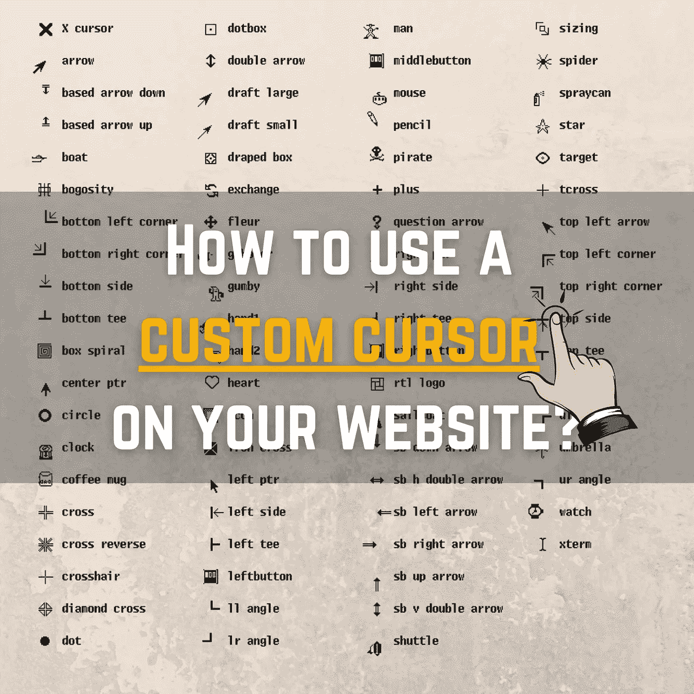
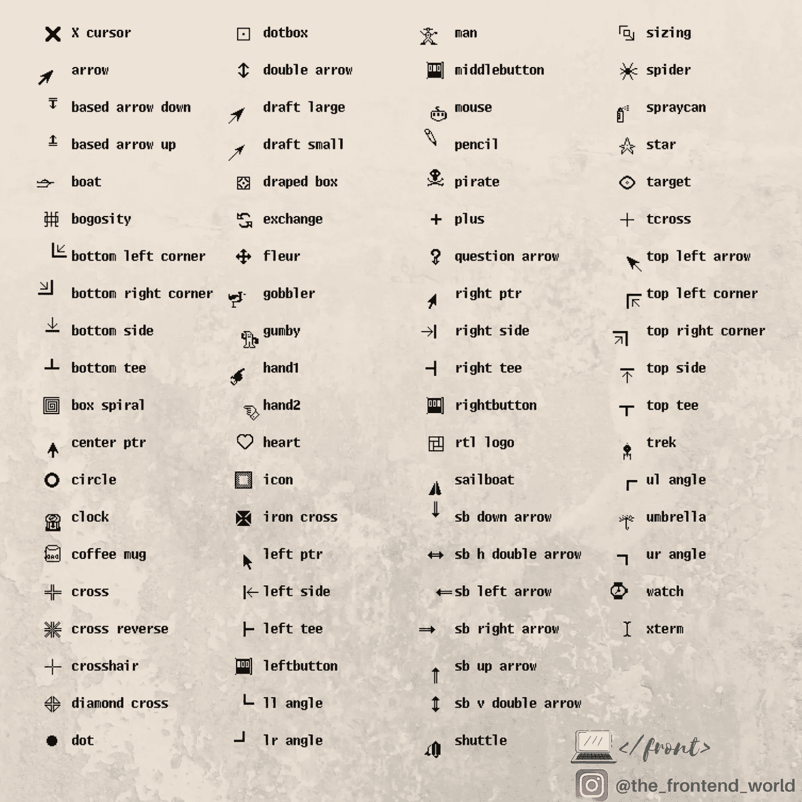
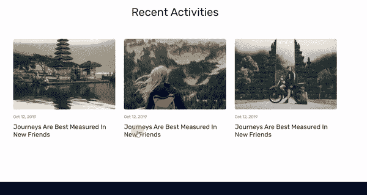

# 如何在你的网站上使用自定义光标

> 原文：<https://levelup.gitconnected.com/how-to-use-a-custom-cursor-on-your-website-7b46b7570995>

## 你的网站应该是不同的。它应该代表你！



这篇文章是一个关于如何通过添加你自己的光标来定制你的网站的快速教程。你自己的风格对于使你的网站不同于现存的大量网站是很重要的，最重要的是，使它代表你和你通过你的网站分享的信息。

## 你兴奋吗？让我们潜入ᕕ(ᐛ)ᕗ吧

# 1-如何定义自己的光标？

自定义光标是使用 CSS 的属性光标定义的。此属性定义当鼠标指向给定元素时将显示的鼠标光标。

幸运的是，这个游标属性接受一系列游标，如下所示:



那很好。但是如果你想拥有一个世界上独一无二的光标呢？嗯，亲爱的开发者，这是可能的！而且实现起来很简单。我们只需要使用一个有效的`url()`就可以了，它有你想要的自定义图像，用于你网站上的光标。

# 2-要遵守的规则

基于浏览器要遵守的规则:

*   对 Mozilla、Chrome 和 Safari 使用`.gif`或`.png`格式。
*   Use `.cur` format instead for Internet Explorer. (Although I don’t know who still uses this Browser ლ(ಠ益ಠლ) … )
*   推荐尺寸为 **32x32** (px)
*   最大尺寸为 ***128x128*** (px)
*   触摸屏用户不会看到自定义光标。

# 3-看你的光标在行动~ ᕕ(ᐛ)ᕗ

行动，行动谁不喜欢看到行动中的事物:

*   这是我为这个演示选择的图像:


我的自定义光标

*   选择的尺寸是:42x42(像素)
*   将我的网站光标设置到此图像:

```
html {
   ** cursor:** url('../img/**mycustomcursor**.png'), **pointer**;
}
```

我把这段代码放到我的 ***style.css*** 文件中。你可以把它放在你的风格文件里。不一定要叫我的。

## 这段 CSS 代码是做什么的？

嗯，两件事:

*   首先，将光标设置为我的图像(您需要确保您的 URL 是有效的，以便图像出现)
*   第二，当浏览器不能显示这个图像时，我们告诉他默认选择指针样式。

## 以下是最终结果:



太棒了，不是吗？

亲爱的读者，我希望这是明确和有用的。

我希望你和你的家人无论在哪里都平安无事！坚持住。明天会更好！

**联系一下** [**中**](https://medium.com/@famzil/)**[**Linkedin**](https://www.linkedin.com/in/fatima-amzil-9031ba95/)**[**脸书**](https://www.facebook.com/The-Front-End-World)**[**insta gram**](https://www.instagram.com/the_frontend_world/)**，或者**[**Twitter**](https://twitter.com/FatimaAMZIL9)**。********

****[www.fam-front.com](http://www.fam-front.com)****

******FAM******