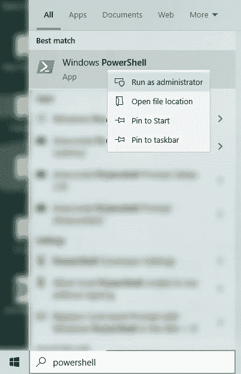

# 如何在 Windows 上的 WSL2 (Linux)中使用 Yubikey

> 原文：<https://levelup.gitconnected.com/how-to-use-a-yubikey-in-wsl2-linux-on-windows-96f176518583>

## 开发设置

## Windows 中提供的 Linux 的优势


图片由[作者](https://www.thetestspecimen.com/)

Windows 现在本身包含了一个子系统，它提供了对一个真实的 Linux 实例(默认为 Ubuntu)的访问。

访问 bash 命令行和 Linux 工具可以使某些情况变得容易得多。我们不要忘记，大多数服务器及其数据库和软件都运行在 Linux 操作系统上。例如，您可能希望在不离开 WSL2 环境的情况下安全地通过 SSH 访问远程服务器，或者签署 GitHub 提交。

然而，如果你(或你的公司)使用 YubiKey 或其他基于硬件的安全认证，那么如何在 Windows 上的 Linux 子系统中利用这些就不明显了。

本文旨在帮助您在 WSL2 中设置基于 YubiKey 的 GPG/SSH 访问。

# 什么是 WSL2？

WSL2 代表**W**windows**S**子系统代表 **L** inux **2** 。它基本上是在 Windows 中运行的 Linux(默认为 Ubuntu)的安装。

> Linux 的 Windows 子系统允许开发人员直接在 Windows 上运行 GNU/Linux 环境，包括大多数命令行工具、实用程序和应用程序，无需修改，没有传统虚拟机或双引导设置的开销。
> 
> ——[microsoft.com](https://docs.microsoft.com/en-us/windows/wsl/about)

我不打算深入解释你为什么想在 Windows 中使用 Linux，因为我怀疑如果你正在阅读这篇文章，你已经有了你的理由。

就我而言，我使用 Linux (Manjaro)作为我的主要操作系统，并且已经使用了很多年。然而，Windows 无处不在，我偶尔不得不使用它。将 WSL2 作为一个选项无疑是一个优势。

# 在开始之前

我们假设你已经有了一辆 YubiKey，并且你已经设置好了 GPG/PGP 密钥，准备好使用 YubiKey。

如果不是这种情况，有太多的[教程](https://github.com/drduh/YubiKey-Guide)可以指导你。请把它安装好，一旦你准备好了就回来。

# YubiKey 必须支持 Windows 中的 GPG 和 SSH

在我们深入到 WSL2 环境之前，检查 yubikey 是否如您所料在 Windows 环境中工作可能是明智的。

最终，您将为 yubikey 创建一个从 Windows 访问认证工具的路径…因此，如果您的 Yubikey 在 Windows 中不能正常工作，它在 WSL2 中也不能。

如果您对 Windows 一切正常感到满意，那么您可以跳过这一部分，否则请务必完成下面的步骤。

## 在 Windows 中安装 GnuPG 和 PuTTY

首先你需要安装 [GnuPG](https://files.gpg4win.org/gpg4win-3.1.16.exe) 和[油灰](https://www.chiark.greenend.org.uk/~sgtatham/putty/latest.html)。

**请注意，我已经直接链接到 GnuPG 的 3.1.16 版本，因为这是 3 版本的最后一个版本。撰写本文时的绝对最新版本是 4.0.3。然而，我在 Windows 和使用版本 4 的 WSL2 中都遇到了问题。如果你需要 YubiKey 的功能，我建议你现在不要升级。**

这将为您提供在 Windows for SSH 中成功使用 yubikey 所需的所有工具。

作为 GnuPG 安装的一部分，你应该有一个名为 [Kleopatra](https://www.openpgp.org/software/kleopatra/) 的程序。如果你打开这个程序并插入你的 YubiKey，你应该可以点击界面中的“智能卡”，然后按键盘上的 F5，它将显示关于 yubikey 的信息，包括你的钥匙。

注意:我发现 Kleopatra 必须在 windows 中运行，YubiKey 才能在 WSL2 中运行。


[作者截图](https://www.thetestspecimen.com/)

## GPG 配置文件

要使 SSH 正常工作，您需要创建一个配置文件。

如果我们假设用户名是“Dave ”,那么该文件的路径将是:

`C:\Users\Dave\AppData\Roaming\gnupg\gpg-agent.conf`

(显然，在上面的路径中，在 Windows 中将“Dave”更改为您自己的用户名。还要记住,“AppData”文件夹在 Windows 中是一个隐藏的文件夹，所以您需要在文件资源管理器的“查看”菜单中启用“隐藏项目”来查看该文件夹。)

上面提到的文件可能不存在。如果没有，就创建一个名为“gpg-agent.conf”的空白文本文件，否则就使用已经存在的文件。

然后，您需要向文件中添加:

```
enable-putty-support
enable-ssh-support
use-standard-socket
default-cache-ttl 600
max-cache-ttl 7200
```

## 对您的公钥的最终信任

虽然这可能不是这个过程的关键，但是包含这个步骤可能是一个好主意。

本质上我们将给予我们的公钥最终信任(我的意思是你信任你自己，对吗？).我将假设您可以找到自己的公钥，因为此时您已经设置了您的 yubikey。

举个例子，我这里的[是](https://www.thetestspecimen.com/pgp/)。

一旦你找到了它，你需要把它导入到 Kleopatra(文件-导入…)，或者在命令行上，如果你知道怎么做的话。

现在，我们将分配最终信任密钥。

打开 powershell ( ***)按住 shift*** ，右键点击桌面任意位置。它将出现在弹出菜单中)。


[作者截图](https://www.thetestspecimen.com/)

输入`gpg --card-status`，你应该会看到关于你的 yubikey 的各种信息。


[作者截图](https://www.thetestspecimen.com/)

如果没有，说明有什么地方工作不正常，试着重启，再试一次。如果您仍有问题，请再次尝试上述步骤。

下一个命令是`gpg --list-keys`。这会给你 gpg 公钥。输出的最上面两行看起来会像这样:

```
pub   rsa4096 2022-09-03 [SC]
  1CA87B39873495770098080098336BC4E5C445AB
```

这个长字符串是您的**公共**键指纹，您将在下一步中需要它。

键入`gpg --edit-key 1CA87B39873495770098080098336BC4E5C445AB`这将弹出一个`gpg>`提示，您应该键入“信任”。然后它会提示您输入一个数字。输入“5”，这是终极信任。然后按照指示进行确认。

如果你现在登录 Kleopatra 或者在命令行中输入`gpg --list-keys`,你会看到你的密匙已经被赋予了终极信任。

## 最终检查

您现在应该处于 SSH 在 windows 中工作的位置。

在我们继续之前，检查一下你的 yubikey 是否可以在 windows 中使用 SSH 是有意义的。要么使用 PuTTY SSH 到服务器，要么尝试签署 git commit，您应该看到它功能齐全。

顺便提一下，如果你以前从未尝试过用 YubiKey 签署 git 提交，请注意你需要在 git 中添加一些配置信息。如果您不熟悉，请参见 [my github](https://github.com/thetestspecimen/linux-notes/blob/master/git.md) 获取一些指导。

如果你的测试用例不工作，那么一定是出了什么问题，没有必要进行下一个阶段，因为它不会工作。

您可以尝试在 powershell 中运行以下内容:

```
gpg-connect-agent killagent /bye
gpg-connect-agent /bye
```

这应该会重启 gpg-connect-agent，这样您就可以再试一次了。

# WSL2 设置

假设您成功完成了 Windows 中的设置，让我们继续进行 WSL2 中的设置。

## 安装 WSL2 (Ubuntu)

首先，安装 WSL2，这就像使用管理员权限在 powershell 提示符下运行以下命令一样简单(从 Windows search 中更容易做到):



[作者截图](https://www.thetestspecimen.com/)

```
wsl --install
```

它将带你通过各种安装步骤，重新启动等。这是非常直接的。您可以安装 Ubuntu 以外的其他发行版，但默认情况下会安装 Ubuntu。

安装完成后，你可以在 Windows 搜索中搜索 Ubuntu，点击它，它会为你打开一个 linux 终端。

如果您需要正确关闭 WSL 实例，请在 linux 终端中键入以下命令:

```
wsl.exe --shutdown
```

仅仅关闭窗口不会这样做。

## 初始步骤

确保您是最新的:

```
sudo apt update
sudo apt upgrade
```

运行下面的命令，关于这是什么的更多细节请参见来源[这里](https://github.com/BlackReloaded/wsl2-ssh-pageant):

```
sudo apt install socat iproute2
mkdir ~/.ssh
wget https://github.com/BlackReloaded/wsl2-ssh-pageant/releases/latest/download/wsl2-ssh-pageant.exe -O ~/.ssh/wsl2-ssh-pageant.exe
chmod +x ~/.ssh/wsl2-ssh-pageant.exe
```

## 编辑 bash-rc

将以下内容添加到您的`~/.bashrc`文件中(使用 nano、vim 等。例如`nano ~/.bashrc`):

```
# SSH Socket
# Removing Linux SSH socket and replacing it by link to wsl2-ssh pageant socketexport SSH_AUTH_SOCK="$HOME/.ssh/agent.sock"
if ! ss -a | grep -q "$SSH_AUTH_SOCK"; then
  rm -f "$SSH_AUTH_SOCK"
  wsl2_ssh_pageant_bin="$HOME/.ssh/wsl2-ssh-pageant.exe"
  if test -x "$wsl2_ssh_pageant_bin"; then
    (setsid nohup socat UNIX-LISTEN:"$SSH_AUTH_SOCK,fork" EXEC:"$wsl2_ssh_pageant_bin" >/dev/null 2>&1 &)
  else
    echo >&2 "WARNING: $wsl2_ssh_pageant_bin is not executable."
  fi
  unset wsl2_ssh_pageant_bin
fi# GPG Socket
# Removing Linux GPG Agent socket and replacing it by link to wsl2-ssh-pageant GPG socketexport GPG_AGENT_SOCK="$HOME/.gnupg/S.gpg-agent"
if ! ss -a | grep -q "$GPG_AGENT_SOCK"; then
  rm -rf "$GPG_AGENT_SOCK"
  wsl2_ssh_pageant_bin="$HOME/.ssh/wsl2-ssh-pageant.exe"
  if test -x "$wsl2_ssh_pageant_bin"; then
    (setsid nohup socat UNIX-LISTEN:"$GPG_AGENT_SOCK,fork" EXEC:"$wsl2_ssh_pageant_bin --gpg S.gpg-agent" >/dev/null 2>&1 &)
  else
    echo >&2 "WARNING: $wsl2_ssh_pageant_bin is not executable."
  fi
  unset wsl2_ssh_pageant_bin
fi
```

现在重新启动 WSL2:

```
wsl.exe --shutdown
```

您现在应该可以在 WSL2 中访问您的 YubiKey 了:

试试 WSL2 中的`gpg --card-status`,你应该会得到关于你的 yubikey 的信息。如果不是出了问题。试着再走一遍这些步骤。


[作者截图](https://www.thetestspecimen.com/)

# 将密钥可信度更改为最终

这与我们之前在 windows 中所做的是一样的，只是我们将在 WSL2 命令行上执行(显然使用您自己的密钥):

```
$ gpg --edit-key 1CA87B39873495770098080098336BC4E5C445AB
gpg> trust
Please decide how far you trust this user to correctly verify other users' keys
(by looking at passports, checking fingerprints from different sources, etc.) 1 = I don't know or won't say
  2 = I do NOT trust
  3 = I trust marginally
  4 = I trust fully
  5 = I trust ultimately
  m = back to the main menuYour decision? 5
Do you really want to set this key to ultimate trust? (y/N) y
gpg> quit
```

如果您现在运行`gpg --list-keys`，密钥应该具有最终信任。

## 搞定了。

应该就是这样了。您应该能够 SSH 到服务器或使用 git 提交等。


图片由[作者](https://www.thetestspecimen.com/)

注:如果在 WSL2 中找不到卡(例如，重新启动后)，这通常是 Windows 中的问题。首先要检查的是你是否能在 Windows 中看到 Kleopatra 中的卡。如果没有，那么在返回到 WSL2 之前，先解决这个问题。

# Visual Studio 代码

您可能想做的事情之一是使用文本编辑器/IDE，而不是在命令行上使用 VIM 或 Nano。如果您是一名软件开发人员，并且需要编辑大量文本文件，这当然是更好的选择。

幸运的是，您可以很容易地使用 VS 代码这样的程序来实现这一点。

# 如何在 WSL2 中使用 VS 代码

你**不需要**在 WSL2 Ubuntu 安装中安装 VS 代码。你只需要像平常一样在 windows 中安装 VS 代码。

在 WSL2 的命令行上，只需键入以下内容:

```
code .
```

圆点非常重要，所以不要忘记！

然后，它将打开一个 VS 代码实例，其中包含您在终端中的位置的路径，所以在运行它之前，可能会先“cd”到您的项目根路径。

它集成得非常好，所以如果你正在运行一个 python 虚拟环境，它会选择并允许你选择 Ubuntu 中的虚拟环境。这对于一般的工作流程和调试非常有帮助。

如果你觉得这篇文章有趣或有用，记得关注我，或者[注册我的时事通讯](https://medium.com/@maclayton/subscribe)获取更多类似的内容。

如果你还没有，你也可以考虑订阅媒体。你的会员费不仅直接支持我，也支持你所阅读的其他作家。你还可以完全不受限制地访问媒体上的每个故事。

使用我的推荐链接注册会给我一点回扣，对你的会员资格没有影响，所以如果你选择这样做，谢谢你。

[](https://medium.com/@maclayton/membership) [## 加入我的介绍链接媒体-迈克克莱顿

### 阅读迈克·克莱顿(以及媒体上成千上万的其他作家)的每一个故事。您的会员费直接支持…

medium.com](https://medium.com/@maclayton/membership) 

# 参考

本文中的信息主要来自这里:

[雅罗斯拉夫·日夫涅](https://jardazivny.medium.com/the-ultimate-guide-to-yubikey-on-wsl2-part-1-dce2ff8d7e45)

也可以参考 github 上的 wsl2-ssh-pageant 工具作者提供的信息:

[wsl 2-宋承宪-选美](https://github.com/BlackReloaded/wsl2-ssh-pageant)