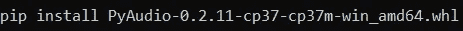
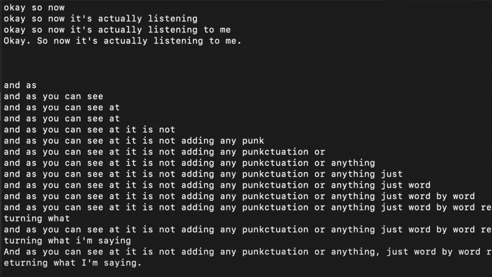
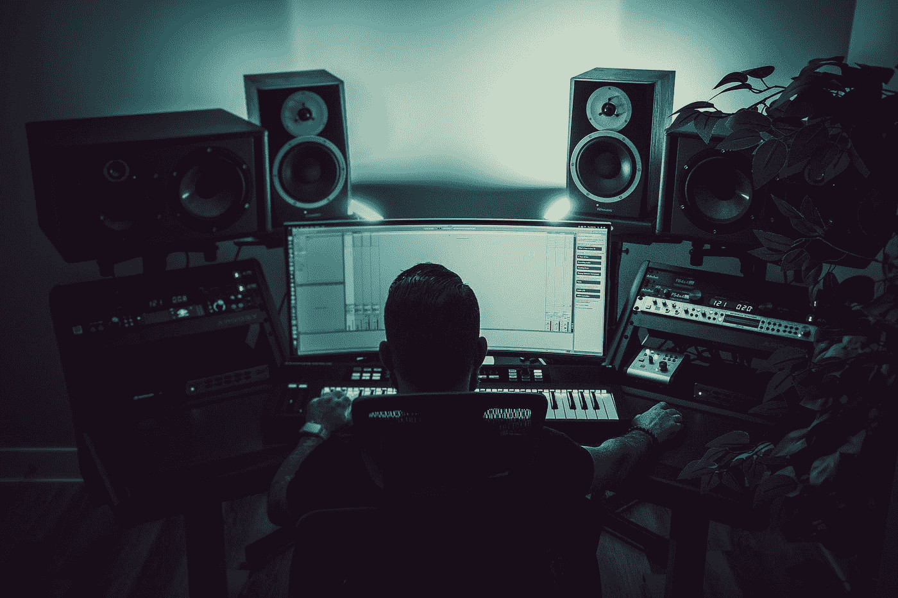

# 如何通过 Python 使用人工智能进行实时语音识别

> 原文：<https://levelup.gitconnected.com/how-to-use-ai-for-real-time-speech-recognition-with-python-73fe24c4f1ee>

## 利用人工智能通过 Python 编程实时转录音频


照片由[丹尼斯·莱昂](https://unsplash.com/@denisseleon?utm_source=medium&utm_medium=referral)在 [Unsplash](https://unsplash.com?utm_source=medium&utm_medium=referral) 上拍摄

作为人类，我们发现很容易适应与他人的任何类型的对话，跟上不同类型的音调、口音和讲话的怪癖。然而，对于机器来说，理解和解码语言以及理解语音的变化是非常困难的。

对机器来说，推断一个人正在说话的准确描述的任务被认为是一项相当复杂的任务。这个问题一直存在，直到现代 AI 接管语音识别和自然语言处理的兴起。在本文中，我们将借助 Python 编程和 AssemblyAI 平台开发一个实时语音识别项目，以获得整体的高性能。

您通过麦克风说出的信息会被考虑在内，以便为用户提供实时的文本转录显示。除了信息的转录，人工智能还试图理解口语句子的大写、语言学和标点符号。

在我们之前的一篇文章中，我们已经讨论了如何使用 Python 编程部署您自己的优化的语音转文本 web 应用程序。我强烈建议查看之前的博客，了解转录音频数据对于现代应用的重要性。您可以通过下面提供的链接来完成。

[](https://towardsdatascience.com/how-to-deploy-your-own-optimized-speech-to-text-web-app-with-python-c956c7838ec8) [## 如何使用 Python 部署您自己优化的语音转文本 Web 应用程序

### 一个详细的指南，告诉你如何构建自己的语音到文本的网络应用程序，以最佳的方式将音频转换成…

towardsdatascience.com](https://towardsdatascience.com/how-to-deploy-your-own-optimized-speech-to-text-web-app-with-python-c956c7838ec8) 

# 构建实时语音识别项目；

在这个项目中，我们将致力于实时转录音频，实现最佳效果。我们将每秒接收由您的麦克风捕捉并由 AssemblyAI 平台预测的单词到单词的结果。最后，当你说完话时，AI 将通过添加标点符号以及所需的大写字母来优化实时语音识别，从而试图理解整个句子。在这个项目的下一部分，让我们从安装所有必需的依赖项开始。

## 安装必要的依赖项:

为了开始实时语音识别项目，我们主要依赖 pyaudio 通过麦克风读取信息。和 web sockets 库安装，用于使用 Python 构建健壮的高性能 web socket 服务器和客户机。下面是提到的两个安装的列表。

```
pip install pyaudio
pip install websockets
```

请注意，MAC 上的安装相对更简单，因为您可以在安装过程中继续使用命令“ *brew install portaudio* ”，并且您应该已经相应地设置了所有必需的依赖项。在 Windows 平台，我建议访问非官方的 Python 库[网站](https://www.lfd.uci.edu/~gohlke/pythonlibs/)，下载你需要的 Pyaudio 版本。轮式下载已经有了一些基本的细节，可以直接安装 pyaudio。将它下载到所需的文件夹位置，并在该目录下运行安装程序，如下所示。



最后，让我们导入所有必要的需求，如下面的代码块所示。asyncio 是 Python 的标准异步 I/O 框架，它提供了一个优雅的基于协程的 API。我们还将使用 base64 库来解码一些需求，使用 JSON 库来准备 JSON 文件，并使用一个配置导入来存储我们的 API 密钥。

```
import websockets
import asyncio
import base64
import json
from configure import auth_key
import pyaudio
```

一旦我们导入了所有需要的库，我们就可以在下一步中设置我们的配置文件，以建立与 AssemblyAI 平台的连接。

## 设置所需的配置:

既然我们已经成功地导入了所有必需的依赖项，我们可以继续创建一个配置文件。配置文件需要命名为 configure.py，并且应该包含您的 API 密钥。你可以从 AssemblyAI [网站](https://www.assemblyai.com/)获得你的 API 密匙。请注意，对于实时转录，您将需要他们提供的 pro-plan，这相对便宜。输入在屏幕右侧找到的授权密钥，方法是将其复制并粘贴到下面显示的代码片段中。

```
auth_key = 'Enter your API key here'
```

一旦我们有了设置了认证密钥的配置文件，我们将继续处理主 Python 文件，在这里我们将完成通过麦克风解码输入语音的脚本的剩余部分。

## 设置所需的参数:

首先，让我们导入所有必要的参数，使我们能够从话筒接收最佳输入信号。可以相应地设置 Pyaudio 的帧、格式、通道和速率，如下面的代码片段所示。一旦我们根据需求设置了参数，我们还可以设置一个链接到 assemblyAI 网站的端点 URL。

```
FRAMES_PER_BUFFER = 3200
FORMAT = pyaudio.paInt16
CHANNELS = 1
RATE = 16000
p = pyaudio.PyAudio()

# starts recording
stream = p.open(
 format=FORMAT,
 channels=CHANNELS,
 rate=RATE,
 input=True,
 frames_per_buffer=FRAMES_PER_BUFFER
)

# the AssemblyAI endpoint we're going to hit
URL = "wss://api.assemblyai.com/v2/realtime/ws?sample_rate=16000"
```

我们可以注意到，我们在 AssemblyAI 端点中指定的采样率也是 16000，这与我们在 Pyaudio 库中指定的采样率同步。有了这些基本参数的定义，我们应该能够构建一个函数来帮助我们发送输入音频数据和接收相同的转录文本数据。

## 创建发送和接收函数:

在本节中，我们将开发从输入麦克风信息向 AssemblyAI 端点发送和接收基本信息的完整代码，以便实时将音频数据转录为文本形式。因为我们的目标是实时转录音频数据，所以我们需要使用一些异步函数来执行这项任务。

在下一个代码片段中，让我们快速浏览一下 main 函数，它将帮助我们创建从本地系统到 AssemblyAI 端点的异步连接。使用我们之前导入的 WebSockets 库，我们可以建立到 AssemblyAI 网站的连接，在那里我们的麦克风信息被中继，同时转录的信息每秒被发送回来。

一旦我们描述了主要功能，我们就可以继续构造下一对异步功能，即发送和接收。首先，send()函数将使我们能够从麦克风接收音频流。然后，我们将通过一些解码将其转换为 base64 格式，并将其发送到已建立的端点连接。我们还将打印一些用户可能经常遇到的异常。

最后，我们将定义 receive()函数，它将帮助我们接收发送的音频数据的转录测试结果。您可以选择返回部分结果，其中包含及时的逐秒审查，或者返回最终的完整结果，其中包含完整的精炼和语法正确的句子。参考 AssemblyAI 上的[文档](https://docs.assemblyai.com/walkthroughs#realtime-streaming-transcription),了解实时转录可用的各种参数的更多信息。

完成这些步骤后，我们可以转到最后一部分，在这里我们将看到一些结果和执行实时语音识别的完整代码。

## 最终代码:



作者运行测试的屏幕截图

你说的每一个字每秒都被 AssemblyAI 端点转录，你会收到相应的响应。然而，一旦你说完这句话，AI 就会自动大写、标点，并通过添加必要的更改来使所说的句子在语法上更加正确，如上图的最后一句所示。下面提供了运行该程序的完整最终代码，可以从命令终端使用“python speech_recognition.py”命令运行。

如果你正在寻找这篇文章的视频指南，我建议你查看下面的[链接](https://www.youtube.com/watch?v=5LJFK7eOC20)以获得详细的解释。它还以 web 界面的形式介绍了该项目的设计。你也可以从下面的 GitHub [链接](https://github.com/misraturp/Real-time-transcription-from-microphone)中查看大部分编码需求。

# 结论:



照片由 [Troy T](https://unsplash.com/@ttcollect?utm_source=medium&utm_medium=referral) 在 [Unsplash](https://unsplash.com?utm_source=medium&utm_medium=referral) 上拍摄

对于最好的对话来说，理解参与对话的人用他们不同的语调、谈话风格、填充词、音调和整体语言技能在说什么是至关重要的。虽然人类大多可以感知这些品质和特征，但计算机很难做到这一点，直到现在，人工智能已经接管了这一领域。

在本文中，我们了解了如何使用 Python 编程构建实时语音识别项目。我们学习了安装必要的依赖项、设置配置文件、加载所需的参数以及创建代码块功能，以便通过 AssmeblyAI 实时语音识别网站发送和接收适当的信息。

如果你想在我的文章发表后第一时间得到通知，请点击下面的[链接](https://bharath-k1297.medium.com/membership)订阅邮件推荐。如果你希望支持其他作者和我，请订阅下面的链接。

[](https://bharath-k1297.medium.com/membership) [## 通过我的推荐链接加入媒体

### 作为一个媒体会员，你的会员费的一部分会给你阅读的作家，你可以完全接触到每一个故事…

bharath-k1297.medium.com](https://bharath-k1297.medium.com/membership) 

看看我的一些与本文主题相关的文章，你可能也会喜欢阅读！

[](https://towardsdatascience.com/develop-your-own-calendar-to-track-important-dates-with-python-c1af9e98ffc3) [## 使用 Python 开发您自己的日历来跟踪重要日期

### 开发一个日历 GUI 界面来管理您 2022 年及以后的计划

towardsdatascience.com](https://towardsdatascience.com/develop-your-own-calendar-to-track-important-dates-with-python-c1af9e98ffc3) [](https://towardsdatascience.com/develop-your-weather-application-with-python-in-less-than-10-lines-6d092c6dcbc9) [## 用 Python 开发不到 10 行的天气应用程序

### 使用 Python 构建我们的天气电视广播应用程序，以接收所需位置的更新

towardsdatascience.com](https://towardsdatascience.com/develop-your-weather-application-with-python-in-less-than-10-lines-6d092c6dcbc9) [](https://towardsdatascience.com/complete-python-starter-guide-for-data-science-for-2022-c1f880fa249d) [## 2022 年数据科学完整 Python 入门指南

### 涵盖了用代码启动数据科学所需的所有 Python 基础和基本概念…

towardsdatascience.com](https://towardsdatascience.com/complete-python-starter-guide-for-data-science-for-2022-c1f880fa249d) 

谢谢你们坚持到最后。我希望你们都喜欢这篇文章。祝大家有美好的一天！