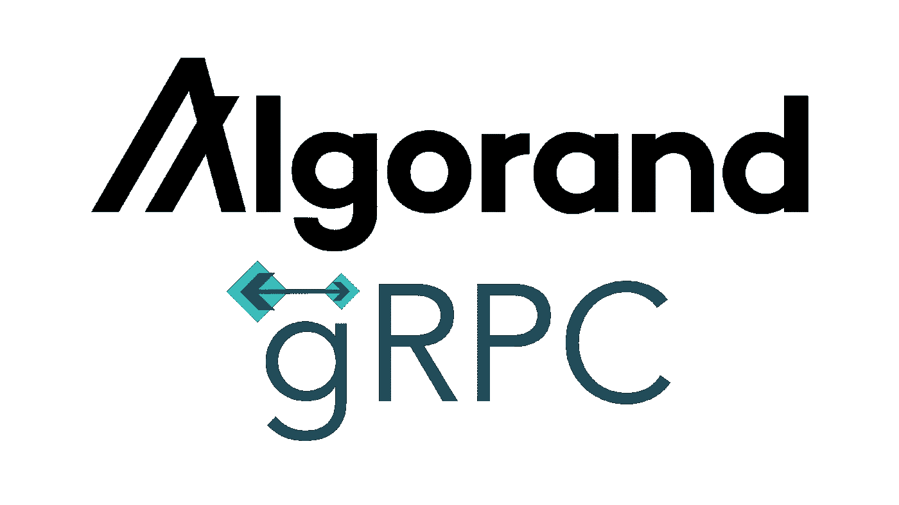
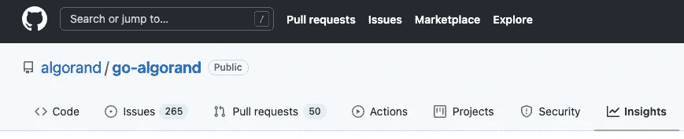

# 如何将 Algorand 的 Go-SDK 与 gRPC 配合使用

> 原文：<https://levelup.gitconnected.com/how-to-use-algorands-go-sdk-with-grpc-3da514e4ab11>



在本文中，我们构建了一个 gRPC 服务器，它可以与 Algorand 的 Go-SDK 进行交互。完整的代码可以在这里找到[。该存储库包含一个 gRPC 服务器，该服务器提供以下功能:](https://github.com/LorenzHW/algo-grpc)

*   创建一个钱包和一个属于该钱包的帐户
*   获取特定账户的信息(例如:该账户有多少算法等。)
*   在两个账户之间进行交易
*   获取特定帐户的所有交易
*   获取链上的一个块以及与该块相关联的信息

在本文中，我们关注第二个要点:获取特定帐户的信息。

如果你不熟悉 Algorand 的基础设施，建议你看一下[这篇](https://developer.algorand.org/docs/build-apps/setup/)简介。

# 运行阿尔格兰德沙盒

开始使用 algrand 开发环境的一个简单方法是使用[algrand 沙箱](https://github.com/algorand/sandbox)。克隆它。在沙盒存储库的根目录中，运行命令:

```
$ ./sandbox up
```

# 为代码生成创建一个原型文件

在单独的文件夹中创建项目的根目录:

```
$ mkdir algo-grpc
$ cd algo-grpc
```

在根文件夹中，创建一个新文件夹和一个新文件:

```
$ mkdir protos
$ touch protos/algo_service.proto
```

gRPC 使用谷歌的协议缓冲区作为接口定义语言(IDL)。让我们创建我们的服务定义:

`GetAccountRequest`和`GetAccountResponse`看起来像这样:

现在，我们准备好生成 gRPC 服务器了。为了实现这一点，我们需要几个其他的依赖项。打开项目根目录下的终端。执行以下命令:

```
$ go get google.golang.org/grpc
$ go install google.golang.org/protobuf/cmd/protoc-gen-go@v1.26
$ go install google.golang.org/grpc/cmd/protoc-gen-go-grpc@v1.1
```

安装完依赖项后，我们准备生成一些代码。为此，我们使用谷歌的[协议编译器](https://google.github.io/proto-lens/installing-protoc.html):

```
$ protoc --go_out=. --go_opt=paths=source_relative --go-grpc_out=. --go-grpc_opt=paths=source_relative protos/algo_service.proto
```

这将生成文件`algo_service.pb.go`和`algo_service_grpc.pb.go`。这些文件将是我们服务器实现的基础。

# 实现服务器

在应用程序运行的根目录中:

```
$ mkdir server
$ touch server/main.go
```

我们还创建了一个与 Algorand 的 SDK 交互的文件:

```
$ touch server/algo_interactor.go
```

在`main.go`内部，我们创建了 gRPC 服务器:

`algo_interactor.go`使用的是 Algorand 的 SDK。让我们开始吧:

```
$ go get -u github.com/algorand/go-algorand-sdk/...
```

然后，在`algo_interactor.go`内部我们定义了`kmdClient`、`algodClient`和`indexerClient`(如果你不熟悉 Algorand 的架构，可以阅读[这个](https://developer.algorand.org/docs/build-apps/setup/)):

现在，我们启动服务器:

```
$ go run ./server/.
Made a kmd client
Made an algodClient
Made an indexerClient
2021/09/01 13:05:33 server listening at [::]:50051
```

# 实现 GetAccount

在`server/main.go`内部，我们实现了函数`GetAccount`:

在`server/algo_interactor.go`内部，我们使用 SDK 发出请求:

最后，我们需要一个映射器来将数据结构从 Algo SDK 映射到响应对象:

```
$ touch server/mapper.go
```

在内部，我们为帐户定义映射:

现在，我们可以再次重启服务器:

```
$ go run ./server/.
```

# 创建一个客户端来触发 GetAccount 端点

```
$ mkdir client
$ touch client/main.go
```

客户端看起来像这样:

在第 31 行，我们指定了一个`AccountAddress`。要获得您可以使用的地址列表，您可以在沙盒存储库中运行以下命令:

```
$ ./sandbox goal account list
```

现在我们可以提出请求:

```
$ go run ./client/.
2021/09/12 08:45:10 {"account":{"amount":150000,"address":"KU2PUHUOFNTUIEZKIIVHRVRXAH6EISEBA2IZRLQQQOD3626PBVVMW3TCCU"}}
```

# 作为一名软件工程师，我如何研究加密货币

沃伦·巴菲特有句名言是这样的:

> 永远不要投资你不了解的行业

加密货币本质上很复杂，不太容易理解。有不同的方法[做自己的研究](https://www.reddit.com/r/CryptoCurrency/comments/lz1taw/a_beginners_guide_to_dyor_do_your_own_research/)。对一些人来说，这可能包括阅读硬币的白皮书。

对我来说，作为一名软件工程师(他太懒了(也有点太笨了)不看白皮书)，我根据自己能判断的标准来评估一枚硬币。这包括:

*   **代码质量:**代码是否干净？函数是否小而易懂？变量的命名是否恰当？
*   **文档质量:**是否有足够的文档来开始？代码是否有足够的文档记录？系统的架构有记录吗？
*   **硬币背后的社区:**它是一个“当蓝宝”类型的社区，还是一个提供有趣帖子和讨论的社区？
*   GitHub 上的 **Insights 选项卡:**多久添加一次新代码？谁在做贡献？



GitHub 上的见解选项卡

*   项目工作人员的教育和 LinkedIn 资料

我对 Algorand 和它最近获得的认可感到非常兴奋。我已经在阿尔格兰德工作了几个月，我期待着即将到来的[治理](https://algorand.foundation/governance/)。我的目标是参加[阿尔格兰德的赏金计划](https://algorand.foundation/developers/trailblazer-bounty-program/)。这将是一个更好地了解区块链并从中获得报酬的好方法。