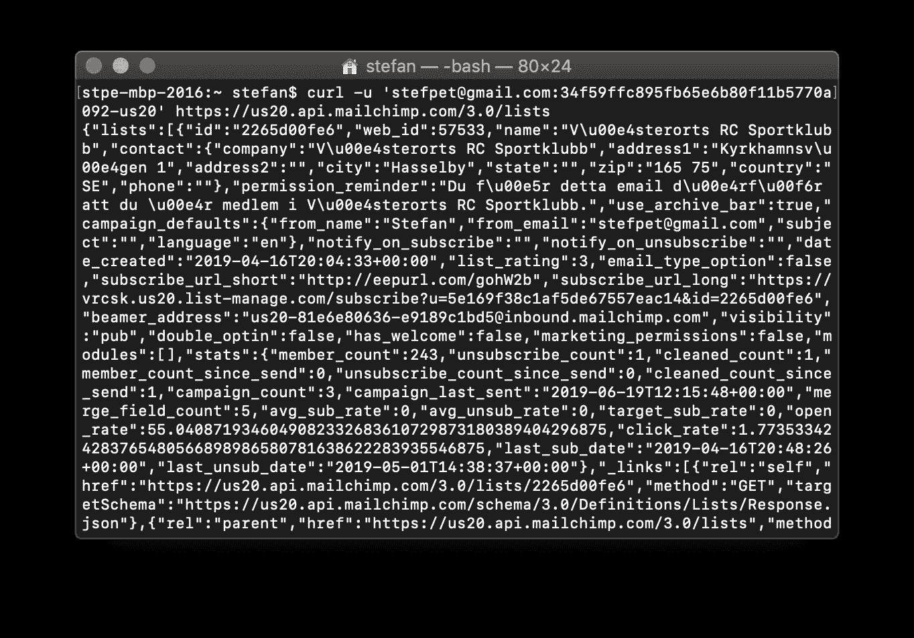

# 不编程如何使用 API

> 原文：<https://levelup.gitconnected.com/how-to-use-an-api-without-programming-821bf71c8d9f>


## 无论你是数字营销人员、数据分析师还是增长黑客，从 API 获取数据都是一种超能力。这就是你如何从一个 API 中获取数据，而不需要你是一个开发者或者不懂编程。

如果你认为自己是一个数字营销者、增长黑客、增长营销者或这些人的任何组合，你每天都在使用数据来获得洞察力和评估你所做的事情。有时这些数据只能使用 API 访问，如果不知道如何编码，光看 API 文档就可能会感到害怕。

在本文中，您将了解到:

1.  什么是 API 并获得使用它的必要信息
2.  如何使用 API 键访问 API
3.  如何从 API 中检索数据
4.  如何使用 JSON 数据
5.  如何将 JSON 转换成 CSV，以便导入到电子表格中

一些如何使用终端的基本知识可能是有益的(参见本文最后一节中了解更多信息的链接)。

为了演示一个真实的例子，我们在本文中使用 Mailchimp API。

## API 简介

API 是一个应用程序编程接口，它的目的是让外部访问数据和系统的内部工作。它可以允许检索数据，或者接收触发动作的数据或命令。

API 最常见的风格叫做 [REST](https://en.wikipedia.org/wiki/Representational_state_transfer) 。它的工作方式与您与网页交互的方式相同，但不是通过单击链接来请求页面，而是通过向 URL 发出请求来检索数据。通常数据以 JSON 的形式返回。

## 开始前你需要什么

在尝试使用服务的 API 之前，您应该找到它的 API 文档。如果 API 是可公开访问的，那么将会有可用的文档。通常它可能不是网页上最突出的东西——在页脚中寻找一个链接，或者一个名为*开发者*的页面。

寻找*入门*部分或类似部分，特别是提到*访问*或*认证*的地方。您需要找到如何访问 API，通常您需要某种类型的 *API 密钥*或*令牌*，文档会告诉您如何获取。

## 如何访问 API

根据 API 的预期用途，访问它的方式可能会有所不同，但是有一些标准的方法。

在本文中，作为服务的用户，您将访问自己的数据。在这种情况下，通常使用某种类型的 **API 键**来访问 API。

另一个场景是，作为开发人员，您希望创建一个代表用户访问和处理数据的应用程序。在这种场景中，通常使用一种叫做 *OAuth2* 的东西(这不是本文讨论的内容)。

在本文中，我们使用 Mailchimp 的 API，你可以在你的[账户附加页面](https://mailchimp.com/help/about-api-keys/)上生成一个 API 密钥。API 密钥可能是这样的:

34f 59 FCC 895 FB 65 e6b 80 F11 b 5770 a092-us20

注意结尾 usXX(我们稍后在 API 请求中需要这个数字)。

API 密钥必须包含在对 API 的每个请求中。它会验证您的请求，并允许您访问您的数据(可能还有任何公共数据)，但不允许访问其他人的数据。**在本文的所有示例中，用您自己的 API 键替换 API 键。**

包含 API 密钥的常见方式是作为 URL 参数、头字段，或者像 Mailchimp 的情况一样，使用基本认证。

在获得更多的技术知识之前，我们必须先看一看使用 API 的一个基本要素 URL。

## 去神秘化的 URL

URL 是访问 API 的最基本的部分，因为它确实指向我们想要请求数据的资源。URL 是这样构造的:


URL 的剖析

这是一个用于访问 Mailchimp API 中的列表的 URL 示例(除了参数，它只是为了演示而添加的)。这里是不同部分的概述。

*   **协议。**当访问一个 API 时，这几乎总是 *https* (https 要求通过安全连接发出请求)。
*   **主机。**主机是网站地址。由可选的子域(或几个子域)、域名和顶级域(例如。com 或国家代码)
*   **路径。**一个可选的路径，以斜杠`/`开始，通常决定访问 API 的哪个资源。这里它也用于指定要使用的 API 版本`/3.0/`。
*   **参数。**可选参数(也称为*查询字符串*)前面有一个问号。参数以属性-值对的形式发送给主机，由一个&符号`&`分隔。

## 从 API 中检索数据

使用 HTTP 请求从 API 请求和检索数据。当您访问网站时，HTTP 与您的 web 浏览器用来请求页面内容的协议相同。

有几种不同类型的 HTTP 请求；通常称为 HTTP 方法。最常见的两种是:

*   **获取** —请求和检索数据。
*   **POST** —通常用于在 API 中进行更改或创建某些东西。

还有[其他 HTTP 方法](https://en.wikipedia.org/wiki/Hypertext_Transfer_Protocol#Request_methods)，但是在本文中，我们将范围限制为 GET 和*GET*数据。

当我们使用 HTTP 向 API 发出请求时，我们使用一个 URL 来指向我们想要获取的资源，并且我们通过提供我们的 API 密钥来认证。

不需要遵循本文，但是如果您想查看所有可用的资源以及如何请求它们的详细信息，一切都在 [Mailchimp API 参考](https://developer.mailchimp.com/documentation/mailchimp/reference/overview/)中。

## 示例:获取关于所有 Mailchimp 列表的信息

通过查看 API 文档中的[，我们发现可以通过发出 GET /lists 请求来检索您的帐户中所有*列表*(也称为*受众*)的信息，包括列表成员数量等统计信息。](https://developer.mailchimp.com/documentation/mailchimp/reference/lists/#%20)

文档也提到了在请求中使用的域取决于你的 API 密匙的最后一部分，它对应于你的账户使用的数据中心。例如，如果最后一部分是`us20`，那么要使用的域是`https://**us20**.api.mailchimp.com/3.0/`。这是 Mailchimp API 特有的，而不是 API 中常见的。

现在是向 API 请求数据的时候了。这可以通过在你的终端窗口中使用 [curl](https://curl.haxx.se/) 来完成。在 macOS 中，curl 是默认安装的，所以不需要下载任何东西。

在终端中键入以下内容，使用 curl 执行 API 请求:

```
curl -u 'stefpet@gmail.com:34f59ffc895fb65e6b80f11b5770a092-us20' [https://us20.api.mailchimp.com/3.0/lists](https://us20.api.mailchimp.com/3.0/lists)
```

结果显示在您的终端上。



使用 curl 进行 API 调用时的示例输出。

祝贺您，您刚刚成功完成了第一个 API 请求。你看到的所有与文本串混合在一起的“代码”被称为 JSON。

## 使用 JSON 数据

JSON 是一种使用 JavaScript 很好的格式，但是不方便导入到电子表格中，更不用说手工操作了。

JSON 是 JavaScript Object Notation 的缩写——它是一种使用 JavaScript 描述数据“对象”的方法。对象通常由数字或字符串、子对象或数组形式的几个属性组成，这些属性又可能包含对象(数组实质上是一个由*或*组成的列表)。

查看不带换行符或格式的 JSON 很困难。通过使用[命令行工具 jq](https://stedolan.github.io/jq/) (需要安装)，我们可以应用格式化以使其更容易阅读——在终端中，将`| jq .`附加到前面的命令行。

```
curl -u 'stefpet@gmail.com:34f59ffc895fb65e6b80f11b5770a092-us20' [https://us20.api.mailchimp.com/3.0/lists](https://us20.api.mailchimp.com/3.0/lists) | jq .
```

这种将一个工具的输出作为另一个工具的输入的非常强大的技术被称为*管道*(注意管道字符|的使用)。

下面是`/lists`请求的格式化 JSON 结果:


用 jq 格式化后的 JSON 数据。

## 将 JSON 转换为 CSV

格式化使得手动读取 JSON 更加容易，但是对于将数据导入电子表格没有帮助。jq 工具再次提供了帮助。

输出是一个对象数组，其中每个对象代表一个 Mailchimp 列表。每个列表对象都有一个`stats`属性，该属性本身是一个具有`member_count`和`open_rate`等属性的对象。让我们使用 jq 工具将值转换成 CSV 格式，然后可以导入到电子表格中(CSV 代表*逗号分隔值*，是一种电子表格软件，如 Google Sheets 和 Excel 可以导入的文件格式)。

jq 工具可以将数组转换成 CSV 格式。因为我们只对少数几个值感兴趣，所以我们首先需要指出它们，并将它们重组为一个数组。以下命令行的确切原因超出了本文的范围，将在 jq 文档中介绍。

```
curl -u '[stefpet@gmail.com](mailto:stefpet@gmail.com):34f59ffc895fb65e6b80f11b5770a092-us20' [https://us20.api.mailchimp.com/3.0/lists](https://us20.api.mailchimp.com/3.0/lists) | jq '.lists[] | .stats | [ .member_count, .unsubscribe_count, .open_rate ] | [@csv](http://twitter.com/csv)'
```

这导致:

```
"243,1,55.04087193460491"
```

是由逗号分隔的*会员数*、*退订数、*和*打开率*。如果您的 Mailchimp 帐户有多个列表/受众，结果将包含多行。

## 将输出保存为文件

为了能够将数据导入到电子表格中，我们使用一个*流*将命令行输出重定向到一个名为`liststats.csv`的文件中:

```
curl -u '[stefpet@gmail.com](mailto:stefpet@gmail.com):34f59ffc895fb65e6b80f11b5770a092-us20' [https://us20.api.mailchimp.com/3.0/lists](https://us20.api.mailchimp.com/3.0/lists) | jq '.lists[] | .stats | [ .member_count, .unsubscribe_count, .open_rate ] | [@csv](http://twitter.com/csv)' > liststats.csv
```

这是通过在末尾追加`> liststats.csv`来完成的。该文件将创建在您的当前目录中。如果您想将输出附加到一个现有的文件，而不是创建一个新的文件，您可以使用`>> liststats.csv`(即两个`>`字符)。

现在，您可以将文件导入到您喜欢的电子表格应用程序中，并继续在那里操作数据。

## 去哪里了解更多信息

本文的目的是演示如何从 API 获取数据，不需要编程技巧，只需要有限的技术知识就可以将数据保存到文件中，以便在熟悉的工具中进一步操作。希望这证明了继续学习的力量和潜力。

以下工具和教程将基于您在本文中学到的知识，帮助您采取后续步骤:

*   Postman 是一个工具，它使得实验、测试和与 API 的交互变得更加容易。
*   [jq play](https://jqplay.org/)——是一个测试和学习 jq 的互动游乐场。
*   [学习命令行](https://www.codecademy.com/learn/learn-the-command-line)——基本的命令行知识是必不可少的，这个 Codecademy 教程是一个很好的起点。
*   Mailchimp API Playground —为了试验 Mailchimp API，有一个允许你在浏览器中发出 API 请求的 Playground。

在文章[为数字营销人员自动跟踪链接](https://medium.com/@stpe/automating-link-tracking-using-bitly-for-digital-marketing-221706cb59ce)中描述了另一个如何在不编程的情况下利用 API 来自动完成任务的例子。

*Stefan 是*[*related*](https://www.relatable.me/?utm_source=medium&utm_medium=cpc&utm_campaign=stpe&utm_content=how-to-use-an-api)*的 CTO 和联合创始人。Relatable 是一家专门从事影响者营销的营销技术公司。通过对技术和自动化的巧妙运用，我们与全球最具创造力和影响力的人一起创造了大规模的口碑营销。查看我们的* [*当前职位空缺*](https://careers.relatable.me?utm_source=medium&utm_medium=cpc&utm_campaign=stpe&utm_content=how-to-use-an-api) *加入我们，或者我们的* [*案例研究*](https://www.relatable.me/case-studies?utm_source=medium&utm_medium=cpc&utm_campaign=stpe&utm_content=how-to-use-an-api) *了解我们所做的事情。*